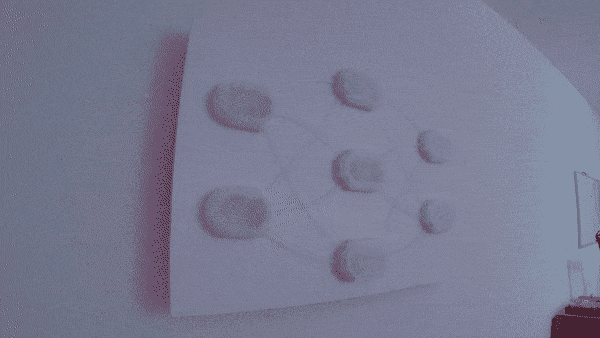
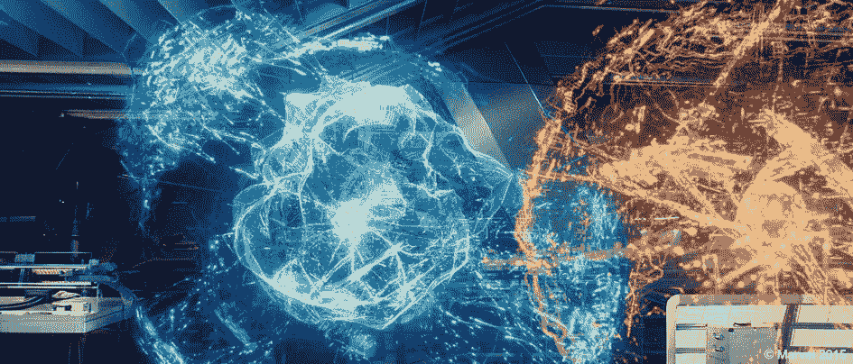
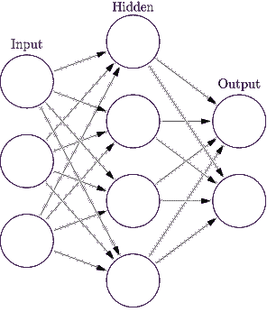
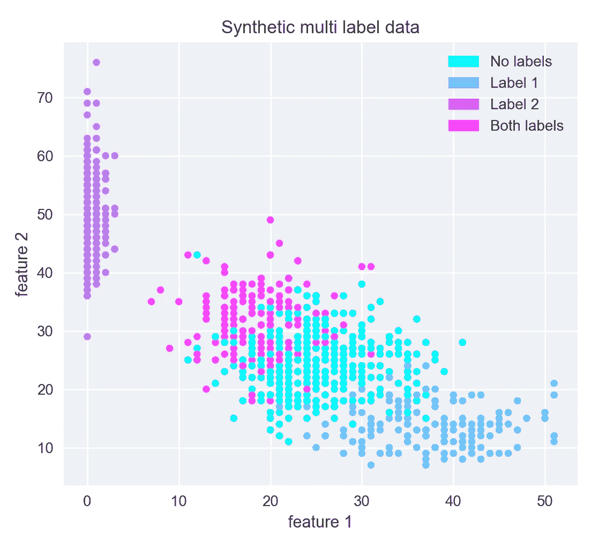
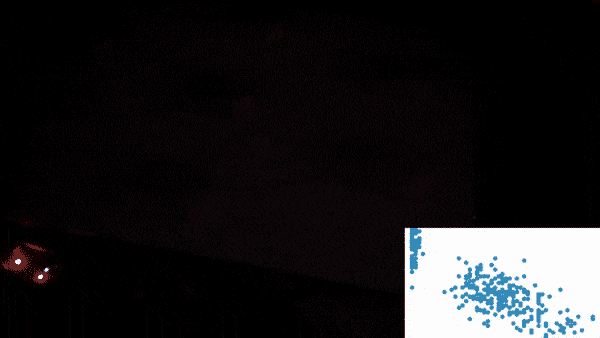

# 光纤神经网络

> 原文：<https://towardsdatascience.com/fibre-optic-ai-for-my-apartment-wall-99f2efd4c507?source=collection_archive---------4----------------------->

好莱坞在过去对人工智能(AI)做出了许多重大承诺:它将如何摧毁我们，它将如何拯救我们，以及它将如何给我们带来好处。承诺的一件不太令人难忘的事情是它看起来有多酷。

Jarvis AI interacting with Ultron AI ©Marvel

令人惊叹的人工智能可视化的一个伟大例子是在《复仇者联盟》中，当托尼·斯塔克的人工智能巴特勒·贾维斯与奥创互动时，我们看到了这个光变形和脉动的有机浮动网络。

我想做一些类似的东西来填补我公寓墙上的一些空白(应该比通常的宜家艺术要好)。很明显，我不可能再创造出像*漂浮的光球*贾维斯那样神奇的东西。然而，有一种机器学习算法，通过一些古怪的数据可视化看起来很有趣:神经网络！它采用了生物灵感元素，旨在复制人类大脑的工作方式(我们认为)。

如果你还不熟悉机器学习中的神经网络:它们受到大脑中生物神经元的启发。网络中的每个节点*与网络中的其他节点相连。当信号流经网络时，节点之间的连接会改变信号，直到信号到达网络的末端。在算法[训练阶段](https://en.wikipedia.org/wiki/Backpropagation)学习连接调整信号的具体方式。*

neural network algorithm structure ([https://en.wikipedia.org/wiki/Artificial_neural_network](https://en.wikipedia.org/wiki/Artificial_neural_network))

我着手用光重建一个神经网络。对于我在半透明塑料中 3D 打印出定制形状的节点，以及节点之间的连接，我使用了所谓的*侧发光*光纤，这是普通的光纤管道，沿着管道的长度发光(看起来非常科幻)。

The fruits of painstaking soldering and gluing. (more images of its making [here](https://github.com/ZackAkil/rgb-neural-net))

实际的光源是一个 RGB LED 条，它被费力地切割、焊接和粘合到每个节点上(每个节点需要大约 30 分钟来安装电子设备)。

告诉 LED 做什么的组件是一个 [Arduino 板](https://store.arduino.cc/usa/arduino-uno-rev3)，它由一个小 [Raspberry Pi Zero](https://www.raspberrypi.org/products/raspberry-pi-zero-w/) 告诉它做什么，这使整个事情与 WiFi 连接！

现在它是如何工作的！？光网络本身就是一个美化了的 WiFi 灯。真正的人工智能运行在我连接到同一个 WiFi 的笔记本电脑上。我写了一段方便的代码，插入到我的标准神经网络编程环境中，当我训练我的算法时，它将连接值**(绿色=高值，红色=低值，蓝色=接近零)**实时发送到光网络。然后我就可以亲眼看到我的神经网络学习了！！！

Voilà! A physical light visualisation of AI learning!

它现在将快乐地生活在我的墙上，作为人工智能的光辉象征！

(**graph 1**) Data that the neural network is learning from

那么它在学习什么呢？G **raph 1** 是神经网络试图复制的数据模式。仅基于 x 和 y 值(图中的特征 1 和特征 2)，神经网络将尝试输出正确的分类(图中的颜色)。下面是另一个动画，展示了光线网络沿着它的预测数据倾斜。正如你所看到的，数据点的颜色不断变化，直到它们与原始数据非常接近，这就是学习！

The light network learning along side its live predictions for the data

关于该项目的所有细节技术信息以及所有代码，你可以在我的 Github->【https://github.com/ZackAkil/rgb-neural-net上找到。