# 2018 年世界杯:数据驱动的理想球队阵容方法

> 原文：<https://towardsdatascience.com/fifa-world-cup-2018-a-data-driven-approach-to-ideal-team-line-ups-93505cfe36f8?source=collection_archive---------6----------------------->

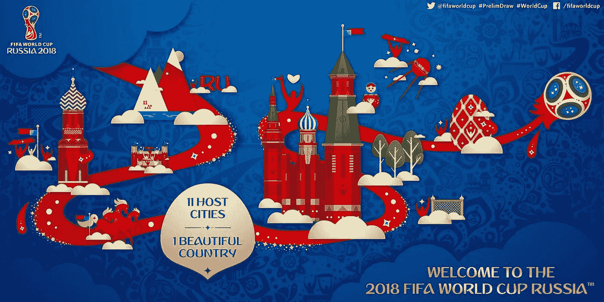

随着 2018 年俄罗斯世界杯的到来，世界各地的每个足球迷都渴望预测今年哪个队会赢。对于球迷来说，另一个迫在眉睫的问题是他们最喜欢的国家队应该如何排队:应该使用什么阵型？应该选哪些球员？哪些人应该留在替补席上或从锦标赛中淘汰？

作为一个狂热的足球迷，我开始思考:为什么我不能在世界杯上为我最喜欢的球队建立自己的梦之队？作为一个热爱数据科学并在玩 FIFA 长大的人，我意识到我可以使用 EA Sport 去年发布的非常受欢迎的视频游戏 [FIFA18](https://www.easports.com/fifa) 中的数据来做我的分析。

在这篇博文中，我将一步一步地向你介绍我在本届世界杯上为 8 支公认的最佳球队打造最强大阵容的方法:法国、德国、西班牙、英格兰、巴西、阿根廷、比利时和葡萄牙。

## **FIFA 18 数据集**

我在 [Kaggle](https://www.kaggle.com/thec03u5/fifa-18-demo-player-dataset) 上找到了 FIFA18 数据集。该数据集包含 17，000 多名 FIFA18 中的球员，每名球员都有 70 多种属性。它是从网站 [SoFiFa](https://sofifa.com/) 通过提取玩家的个人数据、ID、玩法&风格统计数据刮来的。有各种有趣的特点，如球员价值，工资，年龄，和性能评级，我真的很想挖掘。

加载数据后，我只选择了我想分析的最感兴趣的列:

```
interesting_columns = [
    'Name', 
    'Age',  
    'Nationality', 
    'Overall', 
    'Potential', 
    'Club', 
    'Value', 
    'Wage', 
    'Preferred Positions'
]
FIFA18 = pd.DataFrame(FIFA18, columns=interesting_columns)
```

以下是根据数据集中的总体评分快速查看的前 5 名玩家:

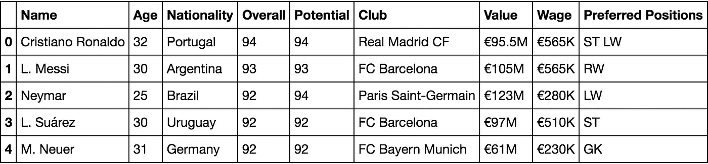

## **数据可视化**

为了让你更好地理解这个数据集，我对球员的年龄、总体情况、首选位置、国籍、价值和工资做了一些可视化处理。让我们逐一查看:

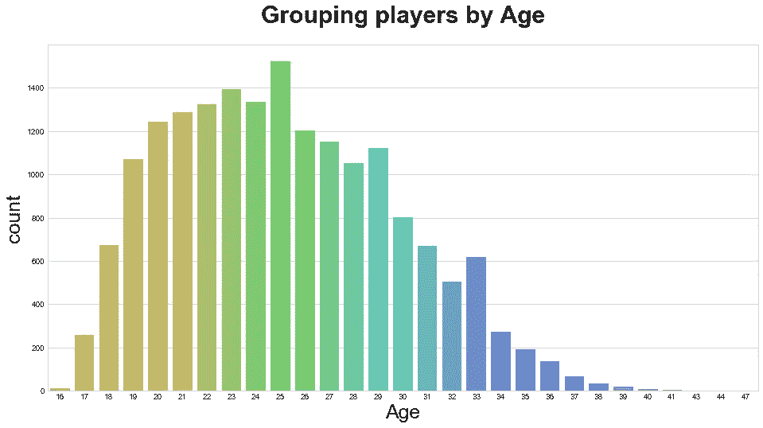

正如你所看到的，大多数玩家年龄在 20 到 26 岁之间，巅峰时期在 25 岁。

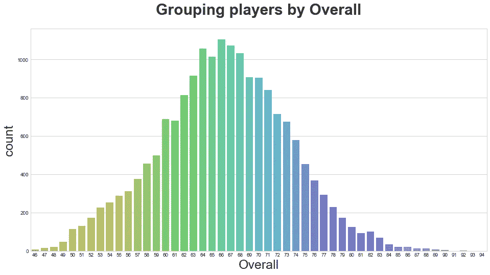

该图呈正态分布，平均综合评分为 66 分。

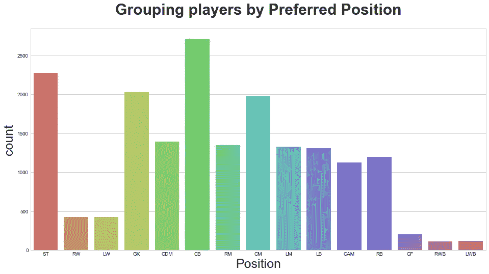

这里，球员最喜欢的 4 个位置依次是中后卫、前锋、守门员和中场。

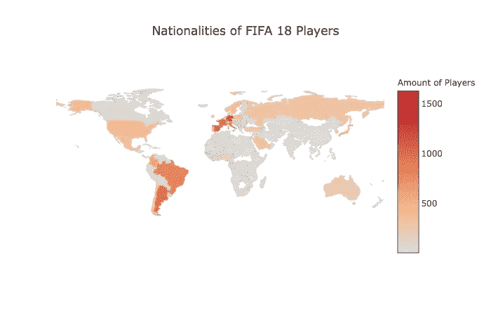

我使用包 **plot.ly** 来绘制玩家国籍的地理可视化。如你所见，玩家在欧洲非常集中。准确地说，是英国、德国、西班牙和法国。

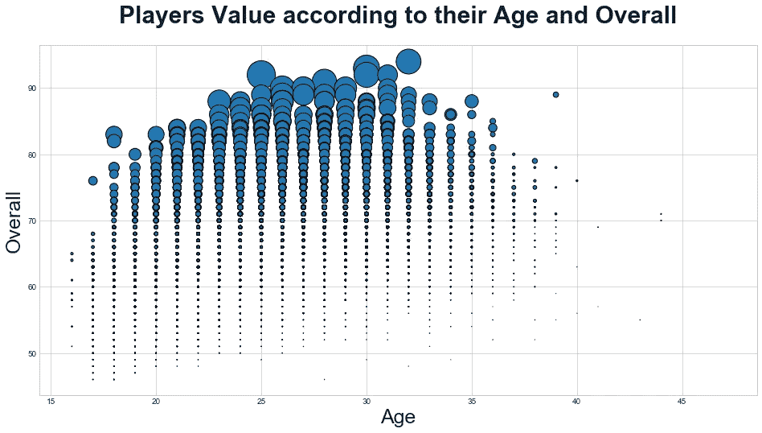

在价值方面，我做了一个散点图，展示了球员的年龄和总体评价。峰值似乎相应地落在 28-33 岁的年龄范围和 90+的总评分上。

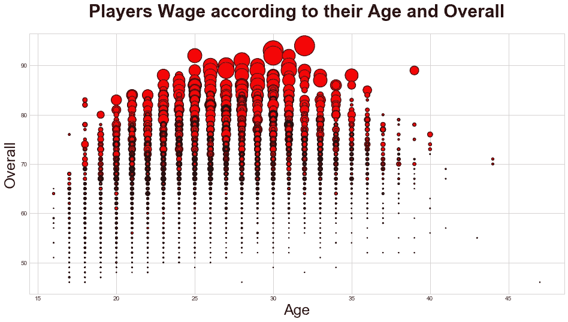

在工资方面，我还做了一个散点图，显示了球员的年龄和总体评分。随着年龄范围从 30 岁到 33 岁以及总体评分为 90 分以上，最高工资似乎会相应下降。

## **最佳阵容分析**

好吧，让我们为国家队建立一些最佳阵型。为了简化分析，我只引入我感兴趣的数据:

```
FIFA18 = FIFA18[['Name', 'Age', 'Nationality', 'Overall', 'Potential', 'Club', 'Position', 'Value', 'Wage']]
FIFA18.head(10)
```

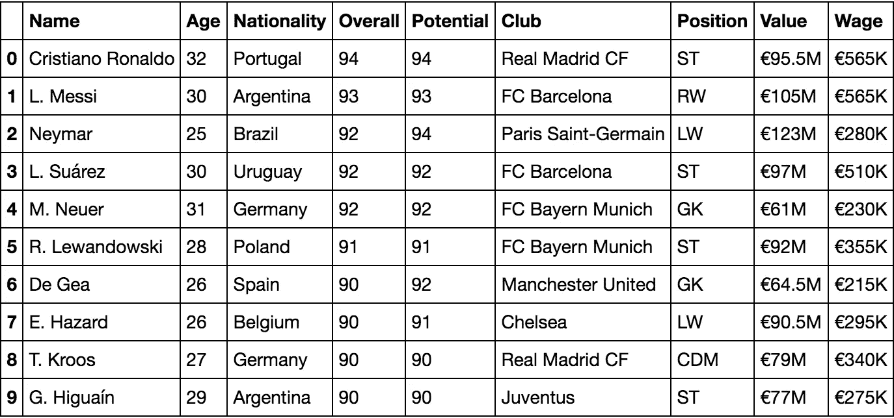

我写了两个非常重要的函数， **get_best_squad_n** (给定一个球队阵型和球员的国籍，完全根据总体评分返回在各自位置上拥有最佳球员的球队)和 **get_summary_n** (给定一个球队阵型选择和国家队的列表，根据各个阵型中球员的平均总体评分比较这些不同的阵型)。

我也使阵容选择更加严格:

```
squad_343_strict = ['GK', 'CB', 'CB', 'CB', 'RB|RWB', 'CM|CDM', 'CM|CDM', 'LB|LWB', 'RM|RW', 'ST|CF', 'LM|LW']squad_442_strict = ['GK', 'RB|RWB', 'CB', 'CB', 'LB|LWB', 'RM', 'CM|CDM', 'CM|CAM', 'LM', 'ST|CF', 'ST|CF']squad_4312_strict = ['GK', 'RB|RWB', 'CB', 'CB', 'LB|LWB', 'CM|CDM', 'CM|CAM|CDM', 'CM|CAM|CDM', 'CAM|CF', 'ST|CF', 'ST|CF']squad_433_strict = ['GK', 'RB|RWB', 'CB', 'CB', 'LB|LWB', 'CM|CDM', 'CM|CAM|CDM', 'CM|CAM|CDM', 'RM|RW', 'ST|CF', 'LM|LW']squad_4231_strict = ['GK', 'RB|RWB', 'CB', 'CB', 'LB|LWB', 'CM|CDM', 'CM|CDM', 'RM|RW', 'CAM', 'LM|LW', 'ST|CF']squad_list = [squad_343_strict, squad_442_strict, squad_4312_strict, squad_433_strict, squad_4231_strict]squad_name = ['3-4-3', '4-4-2', '4-3-1-2', '4-3-3', '4-2-3-1']
```

# **1 —法国**

让我们探索法国不同阵容的可能性，以及它如何影响收视率。

```
France = pd.DataFrame(np.array(get_summary_n(squad_list, squad_name, ['France'])).reshape(-1,4), columns = ['Nationality', 'Squad', 'Overall']) France.set_index('Nationality', inplace = **True**) France['Overall'] = France['Overall'].astype(float) print (France)
```

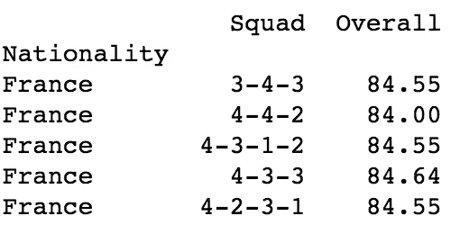

让我们来看看 4-3-3 阵容中最好的 11 名法国球员。

```
rating_433_FR_Overall, best_list_433_FR_Overall = get_best_squad_n(squad_433_strict, 'France', 'Overall')print('-Overall-')
print('Average rating: **{:.1f}**'.format(rating_433_FR_Overall))
print(best_list_433_FR_Overall)
```

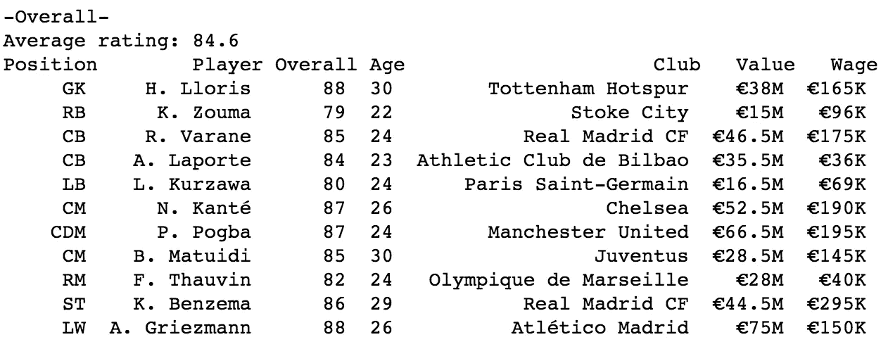

Antoine Griezmann

# **2 —德国**

卫冕冠军肯定是今年第一名的有力竞争者。

```
Germany = pd.DataFrame(np.array(get_summary_n(squad_list, squad_name, ['Germany'])).reshape(-1,4), columns = ['Nationality', 'Squad', 'Overall'])Germany.set_index('Nationality', inplace = **True**)Germany['Overall'] = Germany['Overall'].astype(float)print (Germany)
```

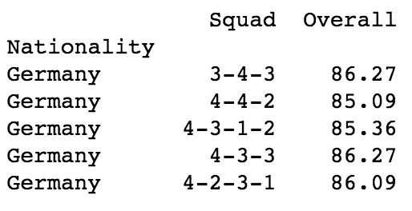

正如你所看到的，德国目前的收视率在 3-4-3 或 4-3-3 阵型中达到顶峰。我将采用 4–3–3 选项。

```
rating_433_GER_Overall, best_list_433_GER_Overall = get_best_squad_n(squad_433_strict, 'Germany', 'Overall')print('-Overall-')
print('Average rating: **{:.1f}**'.format(rating_433_GER_Overall))
print(best_list_433_GER_Overall)
```

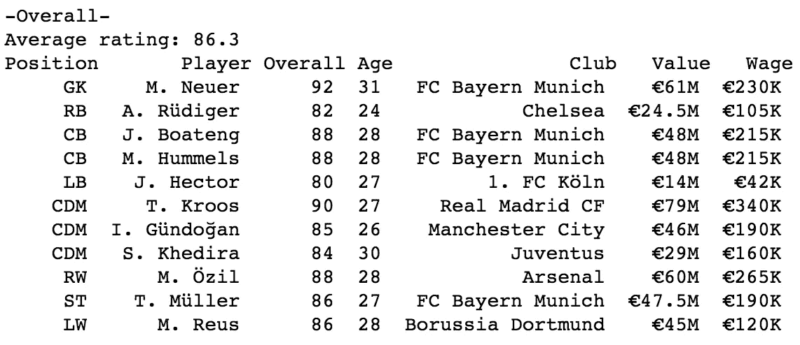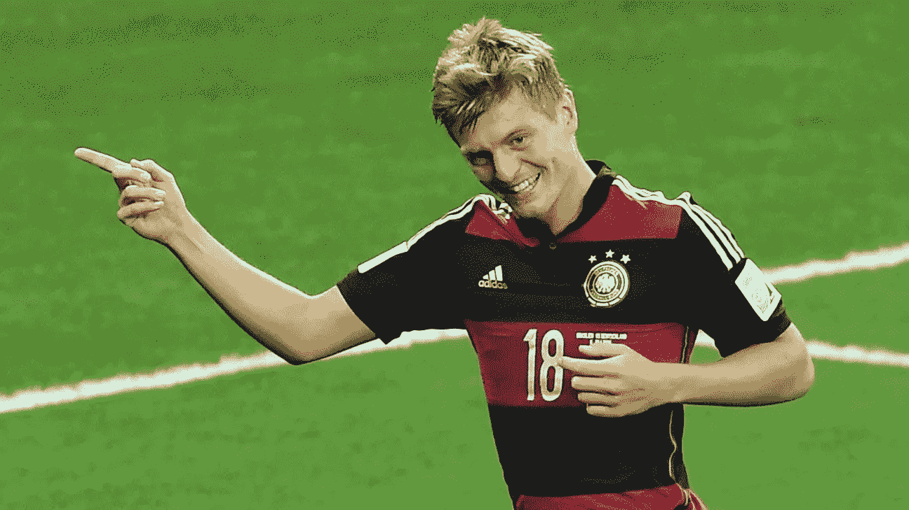

Toni Kroos

# **3 —西班牙**

2010 年的冠军怎么样？

```
Spain = pd.DataFrame(np.array(get_summary_n(squad_list, squad_name, ['Spain'])).reshape(-1,4), columns = ['Nationality', 'Squad', 'Overall'])Spain.set_index('Nationality', inplace = **True**)Spain['Overall'] = Spain['Overall'].astype(float)print (Spain)
```

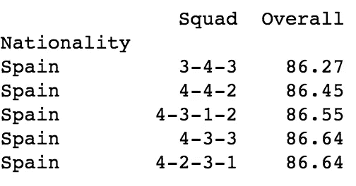

好吧，西班牙在 4-3-3 或者 4-2-3-1 上表现最好。出于多样性考虑，我会选择 4–2–3–1 阵型。

```
rating_4231_ESP_Overall, best_list_4231_ESP_Overall = get_best_squad_n(squad_4231_strict, 'Spain', 'Overall')print('-Overall-')
print('Average rating: **{:.1f}**'.format(rating_4231_ESP_Overall))
print(best_list_4231_ESP_Overall)
```

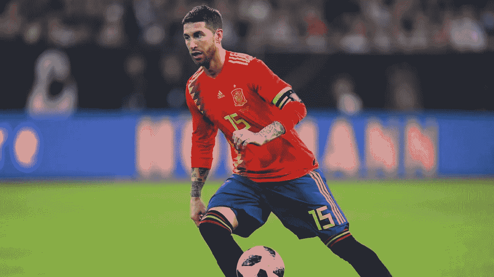

Sergio Ramos

# **4 —英格兰**

尽管拥有欧洲最好的足球联赛，英格兰似乎在国家层面做得并不好。让我们来看看他们对即将到来的世界杯有什么选择:

```
England = pd.DataFrame(np.array(get_summary_n(squad_list, squad_name, ['England'])).reshape(-1,4), columns = ['Nationality', 'Squad', 'Overall'])England.set_index('Nationality', inplace = **True**)England['Overall'] = England['Overall'].astype(float)print (England)
```

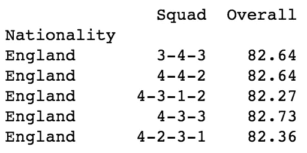

那么英格兰应该坚持 4-3-3。

```
rating_433_ENG_Overall, best_list_433_ENG_Overall = get_best_squad_n(squad_433_strict, 'England', 'Overall') print('-Overall-') 
print('Average rating: **{:.1f}**'.format(rating_433_ENG_Overall)) print(best_list_433_ENG_Overall)
```

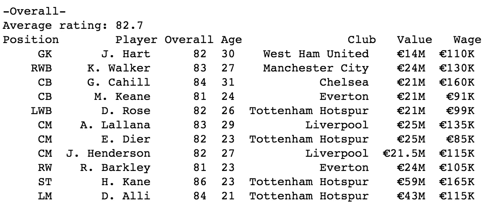

Harry Kane

# **5 —巴西**

桑巴队赢得了历史上最多的世界杯冠军，毫无疑问，它将是今年夏天俄罗斯世界杯的最大热门之一。

```
Brazil = pd.DataFrame(np.array(get_summary_n(squad_list, squad_name, ['Brazil'])).reshape(-1,4), columns = ['Nationality', 'Squad', 'Overall'])Brazil.set_index('Nationality', inplace = **True**)Brazil['Overall'] = Brazil['Overall'].astype(float)print (Brazil)
```

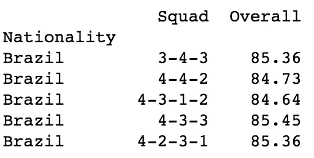

如你所见，巴西和英格兰有相似的选择。全程 4-3-3。

```
rating_433_BRA_Overall, best_list_433_BRA_Overall = get_best_squad_n(squad_433_strict, 'Brazil', 'Overall')print('-Overall-')
print('Average rating: **{:.1f}**'.format(rating_433_BRA_Overall))
print(best_list_433_BRA_Overall)
```

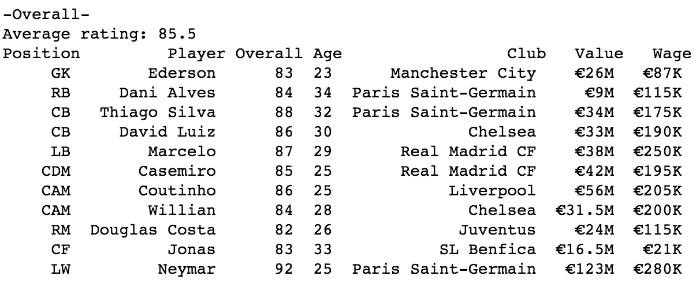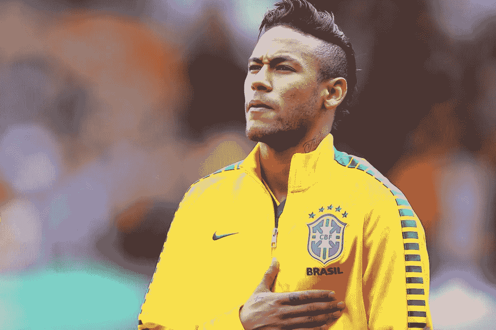

Neymar

# **6 —阿根廷**

莱昂内尔·梅西还在等待他职业生涯中唯一一个还没有拿到的奖杯。在 4 年前决赛失利后，他能带领阿根廷登顶吗？

```
Argentina = pd.DataFrame(np.array(get_summary_n(squad_list, squad_name, ['Argentina'])).reshape(-1,4), columns = ['Nationality', 'Squad', 'Overall'])Argentina.set_index('Nationality', inplace = **True**)Argentina['Overall'] = Argentina['Overall'].astype(float)print (Argentina)
```

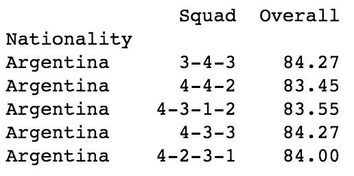

3-4-3 和 4-3-3 对阿根廷球员来说都很好。我会选择 3–4–3。

```
rating_343_ARG_Overall, best_list_343_ARG_Overall = get_best_squad_n(squad_343_strict, 'Argentina', 'Overall')print('-Overall-')
print('Average rating: **{:.1f}**'.format(rating_343_ARG_Overall))
print(best_list_343_ARG_Overall)
```

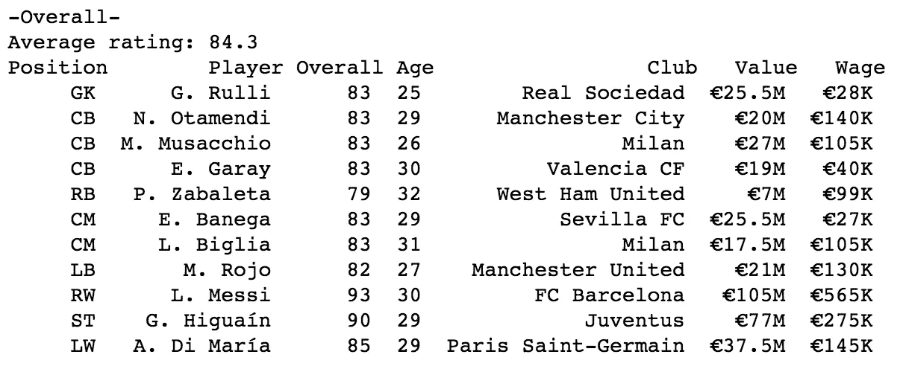

Lionel Messi

# **7 —比利时**

红魔拥有一些英超联赛中最好的球员，但似乎永远无法在国家队中取得成功。哈扎德和德·布鲁因这次能把他们逼远吗？

```
Belgium = pd.DataFrame(np.array(get_summary_n(squad_list, squad_name, ['Belgium'])).reshape(-1,4), columns = ['Nationality', 'Squad', 'Overall'])Belgium.set_index('Nationality', inplace = **True**)Belgium['Overall'] = Belgium['Overall'].astype(float)print (Belgium)
```

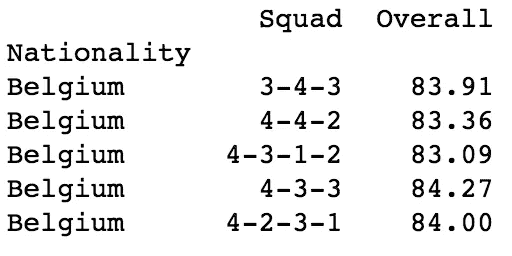

同样，4-3-3 是比利时的最佳阵型。

```
rating_433_BEL_Overall, best_list_433_BEL_Overall = get_best_squad_n(squad_433_strict, 'Belgium', 'Overall')print('-Overall-')
print('Average rating: **{:.1f}**'.format(rating_433_BEL_Overall))
print(best_list_433_BEL_Overall)
```

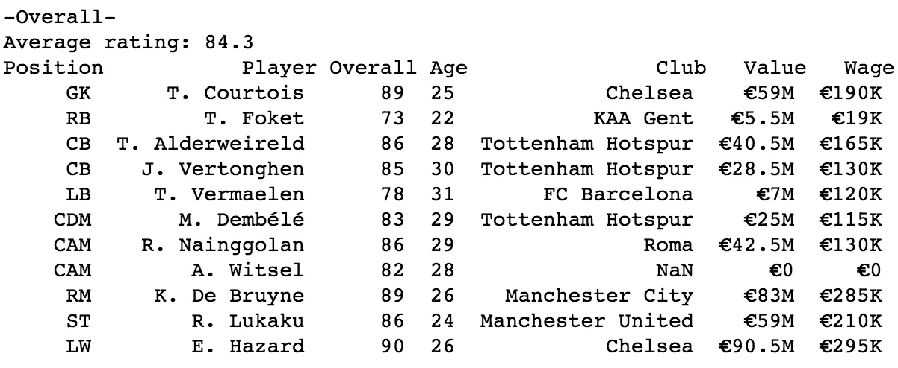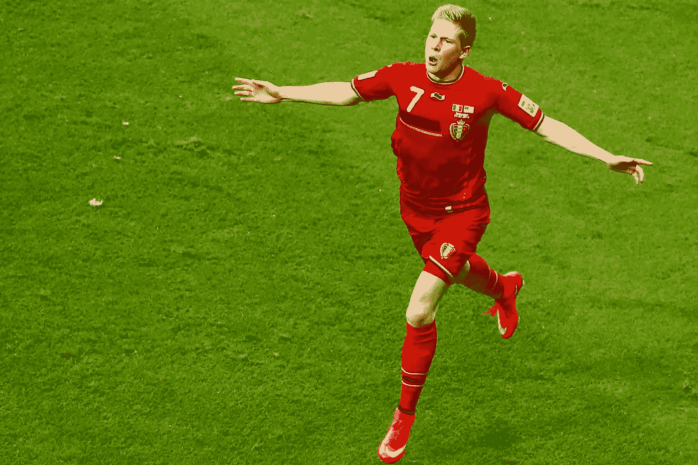

Kevin De Bruyne

# 8 —葡萄牙

2016 年欧洲杯的冠军和连续三次获得世界最佳球员的克里斯蒂亚诺·罗纳尔多也有机会参加这次比赛。

```
Portugal = pd.DataFrame(np.array(get_summary_n(squad_list, squad_name, ['Portugal'])).reshape(-1,4), columns = ['Nationality', 'Squad', 'Overall'])Portugal.set_index('Nationality', inplace = **True**)Portugal['Overall'] = Portugal['Overall'].astype(float)print (Portugal)
```

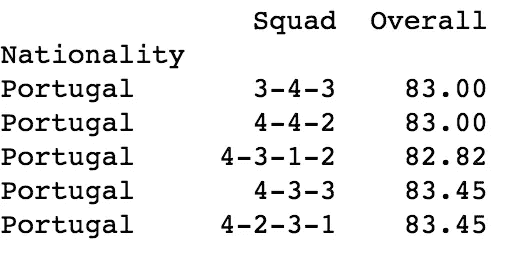

好吧，我选葡萄牙 4-2-3-1。

```
rating_4231_POR_Overall, best_list_4231_POR_Overall = get_best_squad_n(squad_4231_strict, 'Portugal', 'Overall')print('-Overall-')
print('Average rating: **{:.1f}**'.format(rating_4231_POR_Overall))
print(best_list_4231_POR_Overall)
```

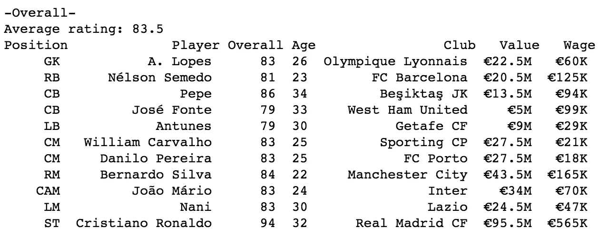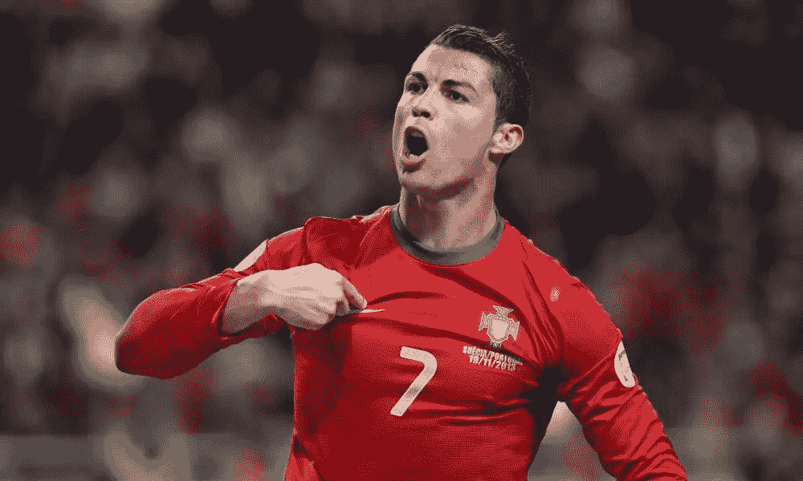

Cristiano Ronaldo

# 9 —乌拉圭

乌拉圭拥有欧洲最好的两名前锋:苏亚雷斯和卡瓦尼。他们这次能表演吗？

```
Uruguay = pd.DataFrame(np.array(get_summary_n(squad_list, squad_name, ['Uruguay'])).reshape(-1,4), columns = ['Nationality', 'Squad', 'Overall', 'Potential'])Uruguay.set_index('Nationality', inplace = **True**)Uruguay[['Overall', 'Potential']] = Uruguay[['Overall', 'Potential']].astype(float)

print (Uruguay)
```

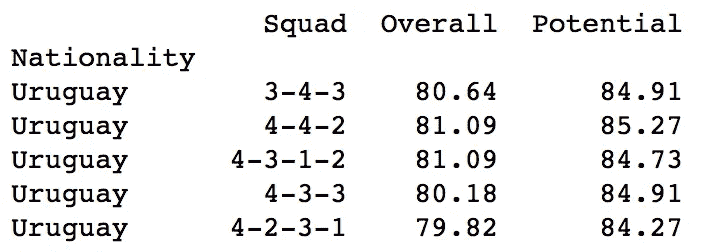

太棒了，乌拉圭以 4-3-1-2 的比分表现最好。

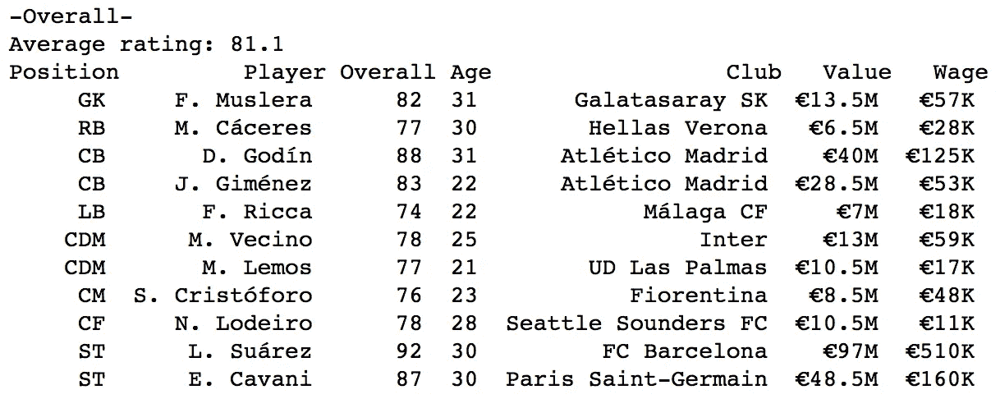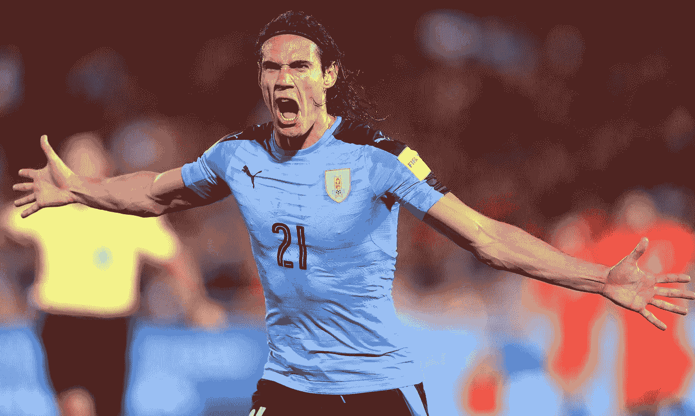

Edison Cavani

# 10 —克罗地亚

嗯，我是莫德里奇和拉基蒂奇的超级粉丝。他们的中奖习惯就不用说了吧？

```
Croatia = pd.DataFrame(np.array(get_summary_n(squad_list, squad_name, ['Croatia'])).reshape(-1,4), columns = ['Nationality', 'Squad', 'Overall', 'Potential'])Croatia.set_index('Nationality', inplace = **True**)Croatia[['Overall', 'Potential']] = Croatia[['Overall', 'Potential']].astype(float)

print (Croatia)
```

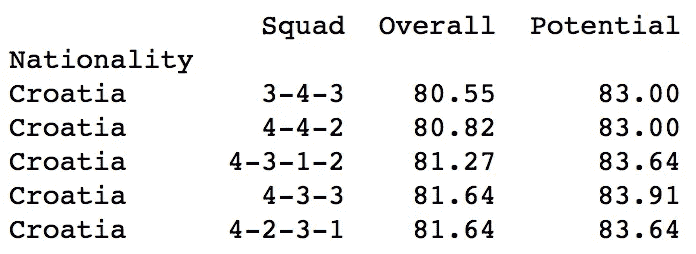

毒品，克罗地亚以 4-2-3-1 领先。

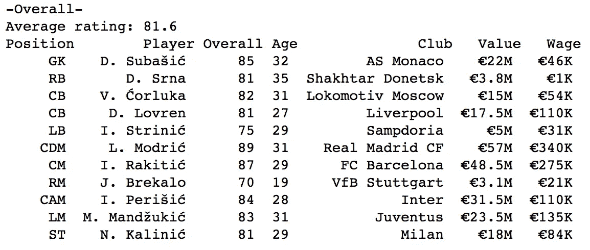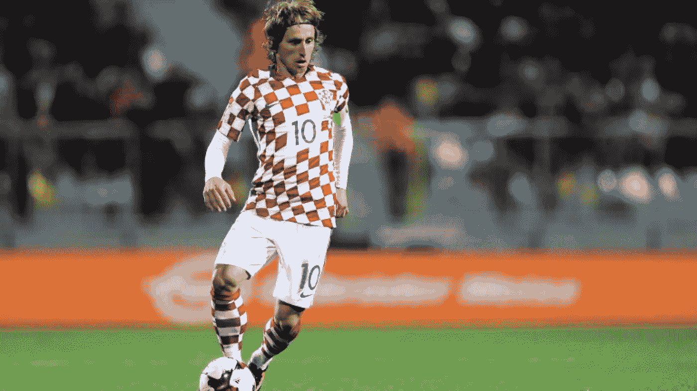

Luka Modric

## **最终比较**

好的，让我们将这 10 个阵容与这些 2018 年世界杯最强竞争者的球员的当前评级进行一些比较。

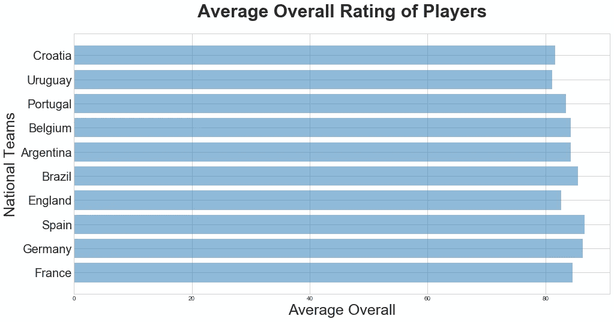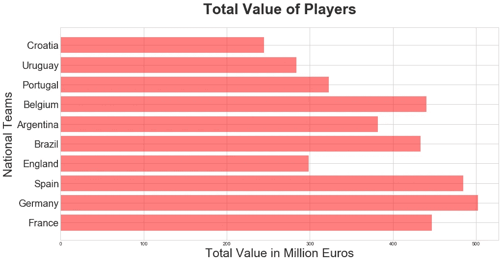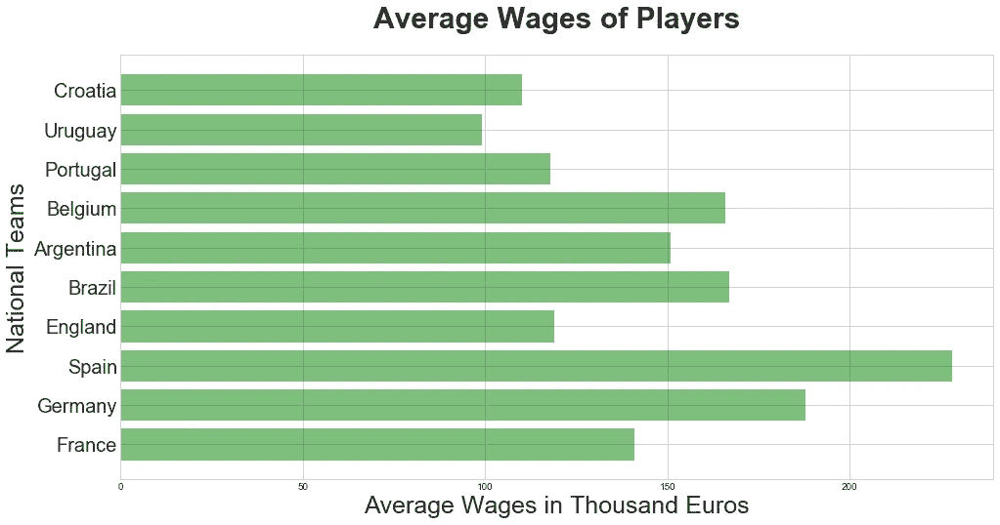

所以纯粹基于 FIFA 18 的数据:

*   西班牙的平均综合评分最高，其次是德国和巴西。
*   德国总值最高，其次是西班牙和法国。
*   西班牙的平均工资最高，其次是德国和巴西。

我的赌注是 T2 对法国，第三名是 T4 对巴西。而 **Les Bleus** 将会赢得一切！你有什么想法？

你可以通过这个链接查看我的 GitHub repo 中的所有源代码([https://github.com/khanhnamle1994/fifa18](https://github.com/khanhnamle1994/fifa18))。如果您有任何问题或改进建议，请告诉我！

— —

*如果你喜欢这首曲子，我希望你能按下拍手按钮*👏因此其他人可能会偶然发现它。你可以在[*GitHub*](https://github.com/khanhnamle1994)*上找到我自己的代码，更多我的写作和项目在*[【https://jameskle.com/】](https://jameskle.com)*上。也可以在* [*上关注我推特*](https://twitter.com/@james_aka_yale) *，* [*直接发邮件给我*](mailto:khanhle.1013@gmail.com) *或者* [*在 LinkedIn 上找我*](http://www.linkedin.com/in/khanhnamle94) *。* [*注册我的简讯*](http://eepurl.com/deWjzb) *就在你的收件箱里接收我关于数据科学、机器学习和人工智能的最新想法吧！*