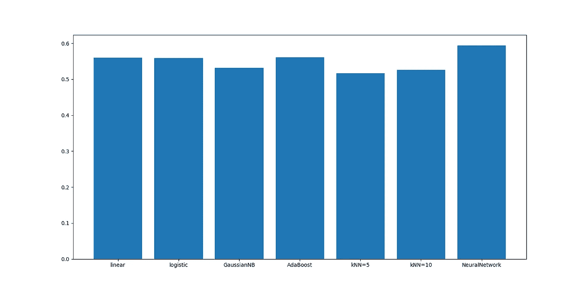
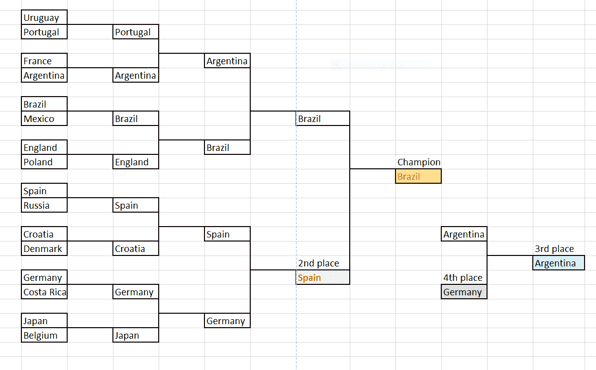
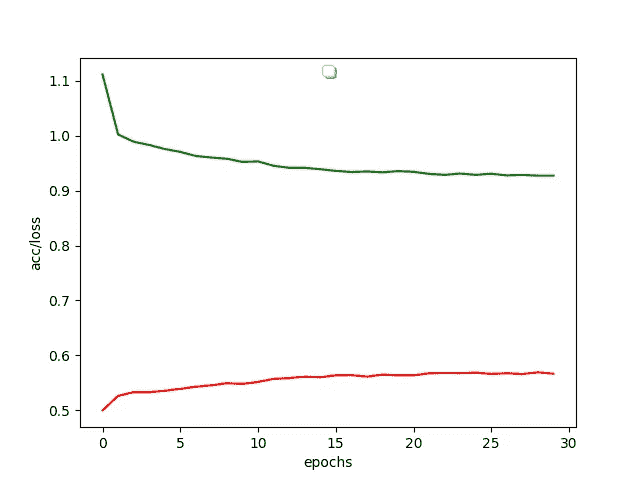
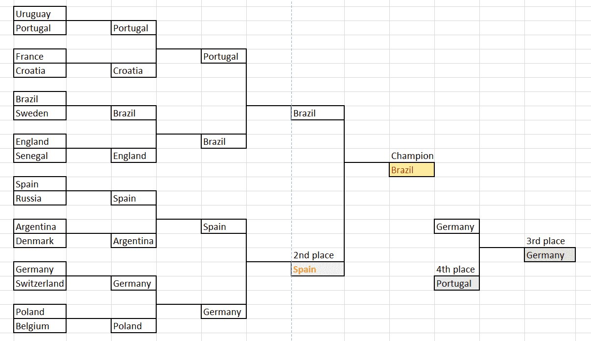

# 利用最大似然技术预测 2018 年世界杯

> 原文：<https://towardsdatascience.com/fifa-world-cup-2018-predictions-using-ml-techniques-48354e22cd8?source=collection_archive---------4----------------------->

## 嘿机器学习，谁会是下一届世界杯冠军？

我的预测？比利时将成为冠军。

但似乎我的很多朋友，包括我的线性回归模型和神经网络模型，都偏爱巴西。

暑假我正在自学机器学习模型，FIFA 世界杯现在就在我们脚下！所以我在想:为什么不做一个用 ML 模型预测世界杯结果的实践项目呢？

我为期三天的预测之旅开始了！

# 第一天:玩数据集

真正引发我开始这个项目的兴趣的数据集实际上是这个 [Kaggle 的数据集](https://www.kaggle.com/abecklas/fifa-world-cup)(嗯，如果你订阅了 Kaggle，它刚刚出现在我的电子邮件中)。该数据集包含自 1930 年以来 FIFA 世界杯的所有比赛、球员和冠军。我甚至受到启发，建立了一个模型，其中包含玩家在比赛中的属性，因为玩家对游戏的胜利做出了重大贡献，我们可以访问数据集中的这条信息。

但是最后，我个人觉得这个数据集太乱了，里面塞满了太多不必要的数据。然后我偶然发现了[这个数据集](https://www.kaggle.com/martj42/international-football-results-from-1872-to-2017/data)，里面有所有国际足球比赛的信息。在[这篇中型文章](https://blog.goodaudience.com/predicting-fifa-world-cup-2018-using-machine-learning-dc07ad8dd576)中提到了 ML 结果预测，尽管文章中的模型使用了逻辑回归。我个人更喜欢这个数据集，因为:

*   它只有 1 张 csv 表(哈哈！)
*   当我们做预测时，我们不仅应该关注世界杯比赛，还应该关注其他国际比赛
*   通过使用所有国际比赛的数据，我们应该有一个更大的训练数据量，这应该可以提高我们的预测性能

基本上，数据集包含一场比赛的*年份*和*日期*、两队的*名称*、*两队的得分*、*比赛类型*、*城市*、*国家*和*中立*(无论比赛是否在任何一队自己的地点举行)。所以我会说这个数据集相对来说更干净，简洁，而且直截了当。

# 设置属性和数据预处理

我从这一部分学到的一个重要教训是*数据总是又脏又乱*。我打了一个比方，将数据科学比作*烹饪*——首先，数据就像你的肉和蔬菜。**挑选那些新鲜、干净、最适合你的。**

就像一个厨师并不真的需要使用很酷的技术来烟熏或液氮来烧烤他的食物，因为他的主要目标是用简单的方法为他的食客提供美味的食物。对于一个数据科学家来说，这是类似的——我们并不真的需要建立一个非常花哨、复杂的 ML 模型(除非复杂的任务需要)，但主要目的是能够从你挑选的数据中辨别事物。

关键是 ***你如何分辨事物*** —在这种情况下，你选择的是哪个 ***属性*** 。

这些是我总结出来的属性，非常简单易懂:

在预测的时候，我们应该考虑球队在比赛举办年份的排名。如果没有数据，我的处理方式是放一个大数(我用的是 200，因为球队不到 200)作为排名。

*   **中奖数和抽奖数**

在她所有的国际比赛中,*意味着一个队的胜利和平局。不需要丢失计数，因为它只是两者的补充。*

*   **一队净胜球**

在她所有的国际比赛中,*净胜球意味着一个团队的*。如果 A 队和 B 队打了一场 5 比 0 的比赛，那么 A 队的净胜球是 5，B 队是-5。这不仅仅是衡量输赢，而是衡量团队能在多大程度上赢得比赛。

*   **对对手的赢数和平局数**

基本上是比赛中两队的比赛历史。注意，我们应该注意比赛的日期，只考虑过去的比赛历史数据*。*

看一支球队是否在自己的国家比赛。

这也是我在 [pandas](https://pandas.pydata.org/) 上练习的机会，这是一个非常方便的数据操作库。所以我写的第一个脚本是[FIFA-results-preprocess . py](https://github.com/gudgud96/FIFA-2018-Match-Predictor/blob/master/fifa-results-preprocess.py)，主要是从 *results.csv* 中的原始数据生成我想要的属性。

有一点要分享的是——这个脚本运行了大约 *18 分钟*！原因是对于每一行比赛数据，我们必须计算两个队的比赛历史。对于该计算，我们需要遍历特定行之前的*所有行，因为我们的数据是按时间顺序排列的。这显然需要 O(n)。*

预处理生成了 *results_processed.csv* ，我手动删除了一些列以得到*results _ processed _ dev . CSV*。

# 第二天:机器学习日

将大蒜和洋葱切碎，牛肉切片，你就可以开始做菜了。

所以基本上这个预测任务可以被框定为一个*分类任务*。给定这些属性，我们将对主队是输(0 类)、赢(1 类)还是平(2 类)进行分类。

我首先尝试使用我的脚本 [fifa-ml.py](https://github.com/gudgud96/FIFA-2018-Match-Predictor/blob/master/fifa-ml.py) 将我的数据输入几种类型的分类器。令人震惊的是，所有分类器返回的训练和测试准确率都在大约 **55%** 左右，并且没有一个分类器优于另一个。

所以，我宁愿在最后使用线性回归，因为它没有太大的区别。线性回归器可以被认为是一个一层神经网络，接受 *n* 个特征并最终返回每个逻辑的概率。在这种情况下，它返回比赛中主队的赢、输和平局概率。你也可以使用逻辑回归，只是在我看来，在这个特定的任务中，两者做同样的事情。

请注意，对于线性回归，所有 Y 示例都需要进行一次热编码。在 sklearn 中，我是通过使用一个 [LabelBinarizer](http://scikit-learn.org/stable/modules/generated/sklearn.preprocessing.LabelBinarizer.html) 来完成的；在 Keras 中，我通过[to _ categorial()](https://keras.io/utils/#to_categorical)来实现。

我做到了！我在这里附上了对淘汰赛的预测:

所以前 4 名球队是:巴西，西班牙，阿根廷，德国。

完整结果(包括小组赛结果和概率)，查看这里:[results _ predict _ output _ final . CSV](https://github.com/gudgud96/FIFA-2018-Match-Predictor/blob/master/results_predict_output_final.csv)。

# 第三天:神经网络日

然后我就在想:既然经典的分类器都做不好，那么神经网络的表现会更好吗？于是我用 Keras 想出了一个神经网络脚本: [fifa-ml-nn.py](https://github.com/gudgud96/FIFA-2018-Match-Predictor/blob/master/fifa-ml-nn.py) 。

答案是否定的。

即使对于具有许多隐藏单元的大型网络，其准确度似乎也只是缓慢地收敛到 55%左右(有时略高，NN 是我唯一达到 59%测试准确度的模型，这是目前最高的)。但我有 300、500 甚至 1024 个单元的密集层，但性能仅提升了不到 5%。不值得。

尽管如此，NN 的预测和 LR 的预测之间还是有细微的差别。让我在这里附上 NN 对淘汰赛阶段的预测:

所以这次的前 4 名球队是:巴西、西班牙、德国、葡萄牙。

完整结果(包括小组赛结果和概率)，查看这里:[results _ predict _ output _ nn _ final . CSV](https://github.com/gudgud96/FIFA-2018-Match-Predictor/blob/master/results_predict_output_nn_final.csv)。

# 结论和调查结果

我想说，这是一个非常好的数据科学入门迷你项目，它经历了数据争论、提出分类属性和实现分类模型的整个过程。

我的结论是 ***足球比赛保持不可预测*** ，当我读到这篇 LinkedIn 帖子时，我完全同意[的观点。帖子甚至附上了](https://www.linkedin.com/feed/update/urn:li:activity:6417784109510254592/)[这篇论文](https://arxiv.org/pdf/1806.03208.pdf)使用随机森林并融入大量属性进行预测，但仍然无法做出准确的预测。

使用 ML 并不能预测所有的事情。它有其局限性。

对于我的模型，我只能说，像巴西、西班牙和德国这样的球队*更倾向于我设置的属性*，这主要是考虑到一支球队的获胜统计数据。但我们都知道，赢得历史并不能说明什么——毕竟，当我写这篇博客的时候，德国已经被强大的韩国以 2 比 0 淘汰了。

总而言之，预测在这里并不是最重要的。最重要的是学习处理数据的技巧，从中讲述故事，最后但同样重要的是… **全力支持比利时！**

*原载于*[*gud gud 96 . github . io*](https://gudgud96.github.io/projects/fifa-18.html)*。*