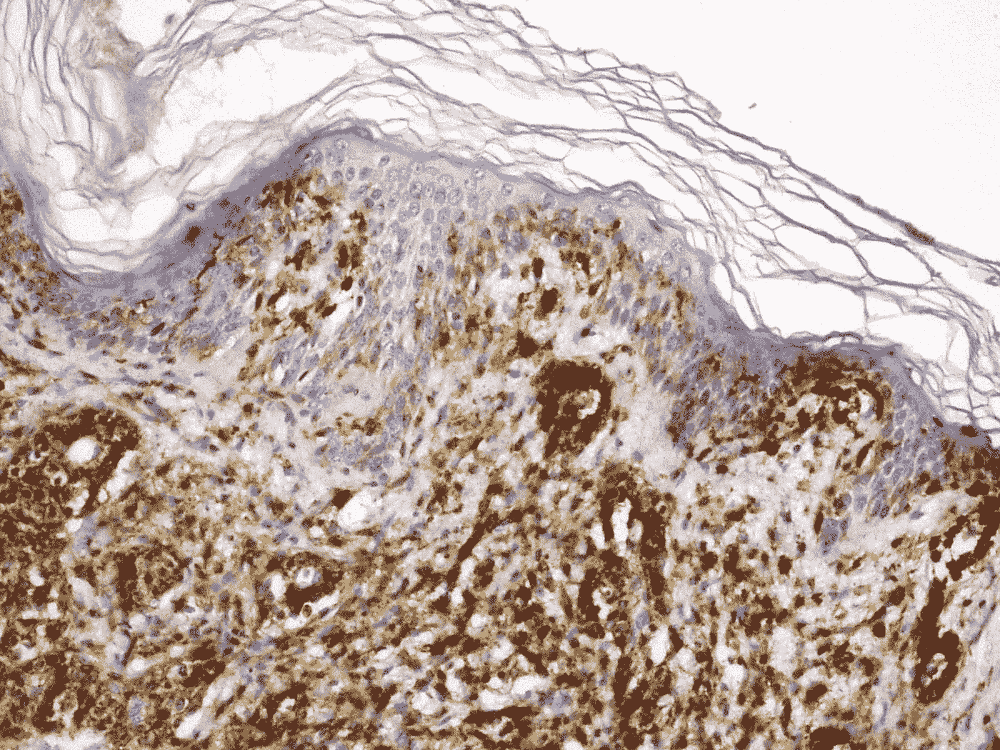
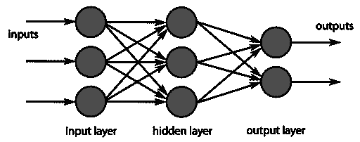
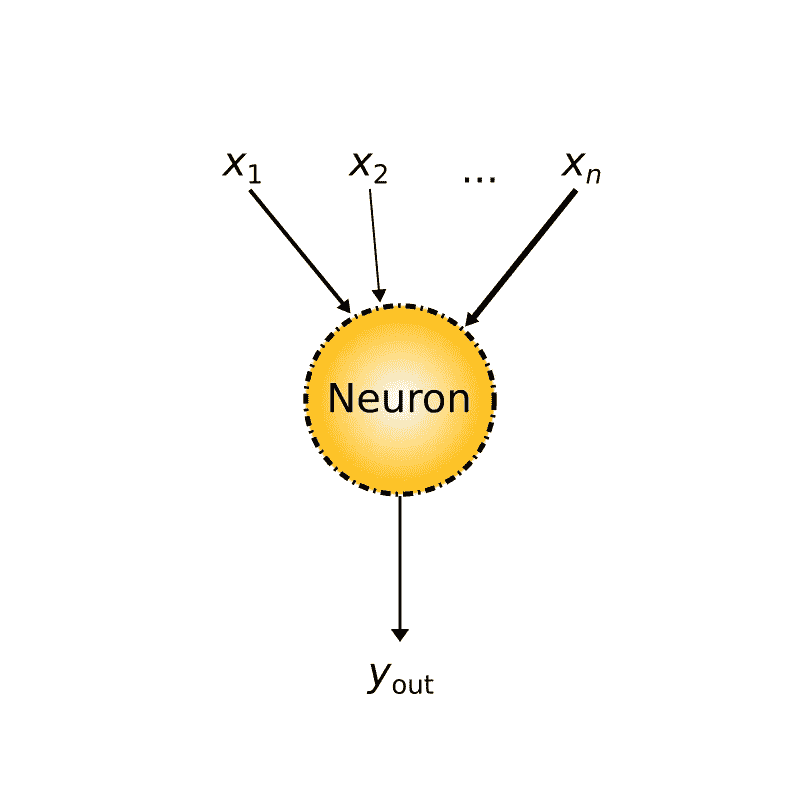
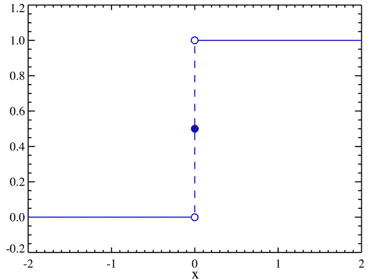
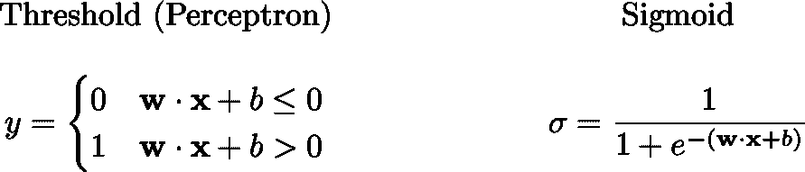
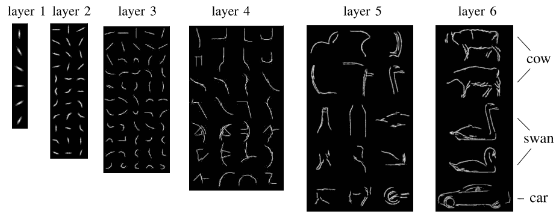
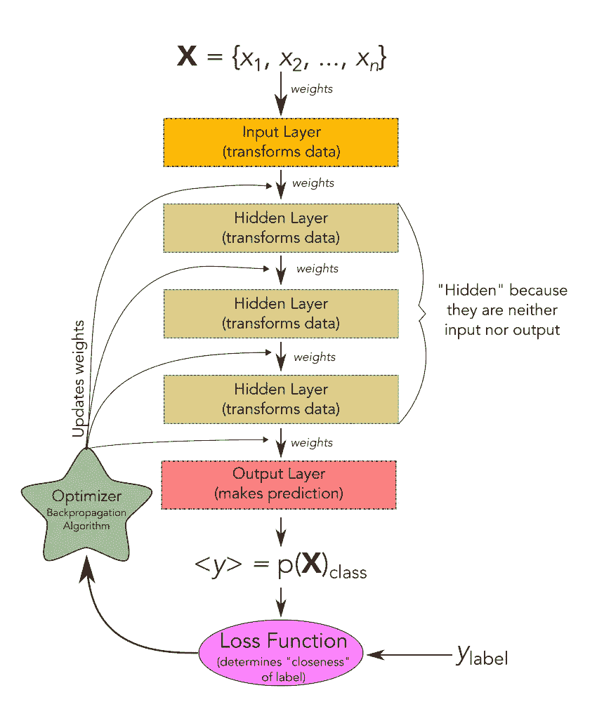
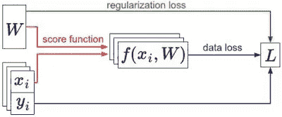
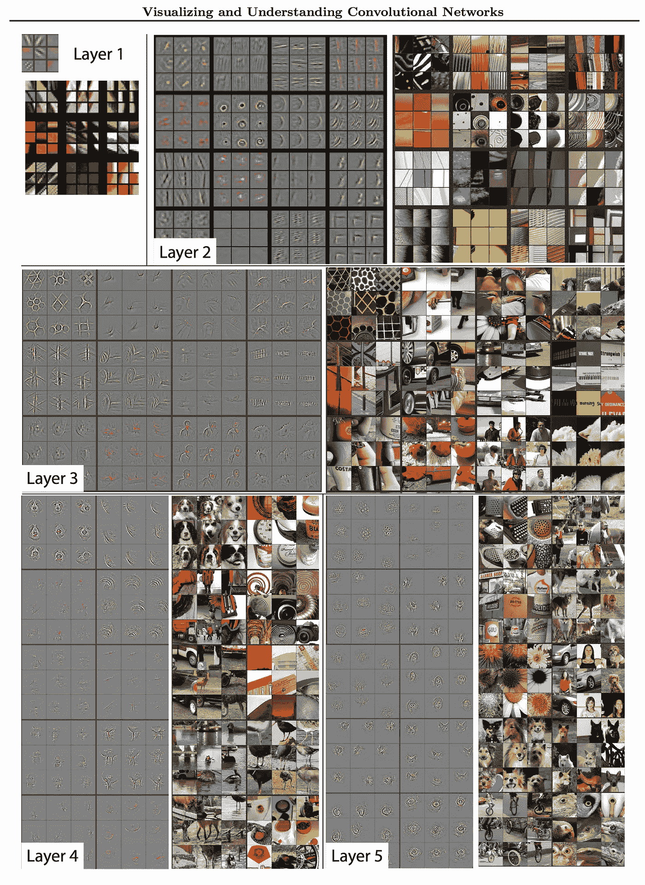

# 用人工智能对抗癌症:第 0 部分——深度学习

> 原文：<https://towardsdatascience.com/fighting-cancer-with-artificial-intelligencepart-0-deep-learning-a6f0b375c8c?source=collection_archive---------3----------------------->

Cutaneous anaplastic large cell lymphoma (ALCL) [By L. Wozniak & K. W. Zielinski — Own work, CC BY-SA 3.0](https://commons.wikimedia.org/w/index.php?curid=22119671)

今年 8 月，我听到了没有人想从他们的医生那里听到的话:“你得了癌症。”我被诊断患有一种罕见的非霍奇金淋巴瘤。经过几周混乱的测试和第二意见后，很明显我的预测是好的。几个月的治疗让我开始思考我的运气；尽管我不得不忍受癌症，但我很幸运有一个良好的预后。我发现自己在思考一个古老的问题，“这有什么原因吗？”

在这段时间里，我真正开始钻研数据科学。我开始思考机器学习(ML)和人工智能(AI)对癌症治疗的影响及其对预后的影响。鉴于我的情况，我想知道我是否应该开始专注于研究数据科学的这个领域。这篇文章是这样做的第一步。

2018 年 1 月 12 日星期五，我的医生很高兴地告诉我，我的 PET 扫描结果很清楚。这一系列文章对我来说是一种庆祝和宣泄。在第一篇文章中，我将介绍深度学习。

深度学习正在开发，以帮助[阅读放射学扫描](https://www.ncbi.nlm.nih.gov/pmc/articles/PMC5447633/pdf/kjr-18-570.pdf) (PET/CT，MRI，X 射线等)。)以提高癌症的早期检测，帮助[减少乳腺癌筛查中的假阳性和不必要的手术](http://news.mit.edu/2017/artificial-intelligence-early-breast-cancer-detection-1017)，以[实现结肠直肠癌筛查期间息肉](https://www.usatoday.com/story/tech/talkingtech/2017/10/30/artificial-intelligence-detect-colorectal-cancer-polyps/812859001/)的近实时分析，以及其他提高检测的方法。我将在随后的文章中看到这些。

# 什么是深度学习？

由于我将探索的大多数与癌症诊断相关的工作都严重依赖于深度学习，所以我决定该系列应该从深度学习的一些基础知识的简短介绍开始。
**免责声明:**我不是深度学习方面的专家，但我已经对这篇文章的准确性进行了审查。

深度学习是机器学习领域中人工智能的子集。它使用大型神经网络来学习数据中哪些特征是重要的，以及如何利用这些特征来预测新数据集[ [1](#6c28) 、 [2](#6c28) 、 [3](#6c28) ]。

我们所说的(有监督的)学习是什么意思？嗯，机器学习算法需要三样东西才能发挥作用:**输入数据**，预期输出的例子(**训练数据**，以及一个**反馈信号**来表明算法执行得有多好。本质上，机器学习算法以一种有用的方式转换数据，从而产生有意义的输出。例如，[我将查阅的一篇论文](https://www.nature.com/articles/nature21056.epdf?referrer_access_token=NmdMKd94tRltrBVuaNZJK9RgN0jAjWel9jnR3ZoTv0NXpMHRAJy8Qn10ys2O4tuPQzN7VitPjMSrm-_eh79EcExo1WAnnlf70oBfM5FzHYKLGatw3xdEW8Mu3-AsAbrzzyZabuLGpTaPjDP2pS2WhJPedPB5crRYPsoXLY4wMZb-bZpqrwviB3OTPBiv-tp8&tracking_referrer=www.medscape.com)拍摄了一张皮肤病变的手机照片，并输出了该病变是否为恶性的预测。因此，在这种情况下，学习就是自动寻找更好的表达方式。

**FIG 1**: Diagram of a multi-layer feedforward artificial neural network. By Chrislb (derivative work: — HELLKNOWZ, TALK, enWP TALK ), [CC BY-SA 3.0](https://creativecommons.org/licenses/by-sa/3.0) via [Wikimedia Commons](https://commons.wikimedia.org/wiki/File:MultiLayerNeuralNetworkBigger_english.png)

**我说深度学习用的是大型神经网络，但是*是什么*是神经网络？**神经网络是基于人类对大脑的理解。与大脑不同，在大脑中，神经元可以与任何其他神经元建立连接，神经网络被离散成具有信息流方向性的层[ [4](#6c28) ， [5](#6c28) ]。这在图 1 的[中进行了说明。数据被传递到第一层神经元并被处理。处理后的输出被向前传递到另一层，依此类推，直到它返回一个结果。](#5960)

## 神经网络的基础——神经元

神经网络由称为神经元的类似物组成。我们将看看神经元的两种常见实现:感知器和 sigmoid 神经元[ [1](#63b5) ]。历史上，神经网络起源于感知器。感知器最初是在 20 世纪 50 年代和 60 年代由弗兰克·罗森布拉特(Frank Rosenblatt)提出的。

一个感知机本质上表现得像一个[逻辑门](https://en.wikipedia.org/wiki/Logic_gate) [ [3](#63b5) ， [4](#63b5) ， [5](#63b5) ， [6](#63b5) 。如果你对逻辑门不熟悉，它们是实现布尔逻辑[ [3](#63b5) 、 [4](#63b5) 、 [6](#63b5) ]的模拟电路。它们将获取输入值并对其进行处理，以确定是否满足特定条件[ [图 2](#e4ec) ]。

**FIG 2**: A schematic representation of a neuron. The inputs, **X**, are weighted (indicated by the varying width of the arrows) and processed by the neuron’s activation function producing the output, y.

一个特别重要的门是[与非门](https://en.wikipedia.org/wiki/NAND_gate)(一个负与门)。与非门在计算中是通用的，这意味着任何其他布尔函数都可以表示为与非门[ [1](#63b5) 、 [7](#63b5) 、 [8](#63b5) ]的组合。这种想法的含义是，由于感知器可以实现与非门，感知器在计算中也是通用的[ [1](#63b5) ]。

**FIG 3**: Illustration of the threshold function. This variation has a third component: if the product of the inputs is equal to the bias, that is they sum to zero, the output is 0.5\. By PAR~commonswiki, [CC-BY-SA-3.0](http://creativecommons.org/licenses/by-sa/3.0/) via [Wikimedia Commons](https://commons.wikimedia.org/wiki/File:Dirac_distribution_CDF.png)

神经元的两种实现在它们的**激活/传递函数**(决定神经元是开还是关的方程)[ [1](#63b5) ， [5](#63b5) ]上有所不同。罗森布拉特感知机的美妙之处在于它的简单性。感知器将接受输入，并根据它们的权重组合它们，如果输入表明被分析的对象是该类的成员，则输出值 1，如果不是成员，则输出值 0[[图 2](#e4ec) ]。感知器使用阈值函数，该函数将输出值 0，除非加权输入的和大于感知器的**偏差**或**阈值**，在这种情况下，它将输出 1 [ [图 3](#283f) 、[图 4](#62f0) 。

阈值函数的问题是，感知器的权重或偏差的微小变化会在输出[ [1](#63b5) ]的行为中产生难以控制的结果。这是因为激活函数的*全有或全无*性质。当试图优化神经元网络时，这就成了一个问题。

**FIG 4**: Vector representations of the activation functions of the two main types of neurons.

我们可以通过使用一个 **sigmoid 函数** [ [图 5](#7f56) ]而不是阈值函数来避免这个问题。

**FIG 5**: Illustration the the sigmoid function. Public Domain via [Wikimedia Commons](https://en.wikipedia.org/wiki/File:Logistic-curve.svg)

sigmoid 函数(也称为逻辑函数，因为它是所用 sigmoid 函数的特殊形式)具有扁平 S 形的特性[ [图 5](#7f56) ]。这与阈值函数曲线的“开/关”形状相比较[ [图 3](#283f) ]。

sigmoid 函数为神经元的输出产生更平滑的过渡。当我们接近图形的边缘时，神经元的行为就像感知器输出大约 0 或 1。神经元将随着 **wx** + *b* 的值变大而开启，随着其变小而关闭。零附近的区域是我们行为变化最大的地方。这个平滑和连续的区域允许我们对感知器的权重和偏差进行小的改变，而不会产生阈值函数可能产生的输出的大的改变。事实上，乙状结肠神经元是这些权重和偏差变化的线性函数[ [1](#63b5) ]。这两个函数之间的另一个区别是，sigmoid 函数的允许输出是 0 和 1 之间的任何值，而 threshold 函数将输出 0 或 1 [ [1](#63b5) ]。这对于确定某些特征是有用的，但是当应用于分类时就不那么清楚了[ [1](#63b5) ]。解释这个单个神经元输出的一种方法是作为属于正在讨论的类别的概率。

## 将神经元结合成网络

单个神经元对于做出单个决定是有用的，但是我们如何扩展它们的有用性呢？在[图 1](#5960) 中，网络显示多个神经元可以组合起来组成一层神经元。只看图中的输入层，我们可以看到它由三个神经元组成，因此它能够做出三个非常简单的决策(尽管由于有两个输出神经元，网络本身只会进行两种分类)。我们可以通过增加层中神经元的数量来扩展简单决策的数量。该层的输出是数据[ [1](#cc0a) ， [2](#cc0a) ]的**表示**。理想情况下，该表示提供了对正在解决的问题的一些洞察[ [图 6](#0c6b) ]。

**FIG 6**: Example mean activation shapes in a learned hierarchy. These are the representations of the data that are learned by the network. [ViCoS Lab](http://www.bmva.org/bmvc/2009/Papers/Paper443/Paper443.html)

神经元层可以堆叠起来进一步处理数据。我们可以把每一个后续层看作是获取前一层的输出，并进一步提取数据中包含的信息。多层网络能够提取足够的数据来做出复杂的决策。

**FIG 7**: A schematic representation of a multi-layer neural network. The input layer takes data from **X** and processes it and passes it to the first hidden layer. Each hidden layer processes and passes the data to the next. The output layer makes a prediction **<y>** that is an array of probabilities of the input belonging to each of the possible classes. The result is checked by the loss function to determine the networks accuracy and this is passed to the optimizer which adjusts the weights of the information passing to each layer.

图 7 中显示了一个多层网络的例子。一些输入数据由神经网络的第一层转换(输入层**)。转换后的数据由第二层处理(称为**隐藏层**，因为它既不是输入也不是输出)[ [1](#cc0a) 。这个输出将或者到下一个隐藏层或者到输出层。**输出层**将返回一个概率分数数组(其总和为 1) [ [2](#cc0a) ]。**

**网络的输出通过**损失函数(或反馈信号)**进行分析，该函数测量预测的准确性 [2](#cc0a) 。网络的权重由一个**优化器** [ [2](#cc0a) ]改变。**

****

****FIG 8**: A schematic of the information flow during optimization. The data loss shows the difference between the scores and the labels. The regularization loss is only dependent on the weights. Gradient descent allows us to find the slope of the weights and update them. [Optimization: Stochastic Gradient Descent](http://cs231n.github.io/optimization-1/#summary).**

**优化器使用**梯度下降**来确定如何更新权重。本质上，该算法遵循损失函数表面的斜率，直到找到一个谷[ [3](#cc0a) 、 [4](#cc0a) 、[图 8](#5257) ]。该信息通过**反向传播的过程得到增强:**“反向传播可以[……]被认为是门相互通信(通过梯度信号)它们是否希望它们的输出增加或减少(以及多强烈)，以便使最终输出值更高” [5](#cc0a) 。反向传播提供了关于改变权重和偏差将如何影响整个网络的详细信息。[ [6](#cc0a)**

****

****FIG 9**: Detailed activation of neurons in five layers. The activations show the representations that are deemed important by the network. [Zeiler and Fergus, 2013](https://arxiv.org/pdf/1311.2901.pdf).**

## **包裹**

**总而言之:**

*   **深度学习在癌症检测、活检分析中发挥着重要作用，并为在难以找到医生的地区增加筛查提供了可能性**
*   **神经网络的基本构件是神经元**
*   **神经元可以用不同的激活函数起作用，每个激活函数都有其优点和缺点**
*   **神经元可以堆叠成层，并且这些层可以堆叠在一起，这增加了网络可以做出的决策的复杂性**
*   **这些决策提供了数据的新表示[ [图 6](#0c6b) 、[图 9](#8669) ],这些数据有望*提供洞察力***
*   **可以使用损失函数和反向传播来优化神经元的输出，以提高网络的复杂度**

**感谢[伊尔胡姆·沙夫卡特](https://towardsdatascience.com/@irhumshafkat)和[约翰·比约恩·尼尔森](https://medium.com/@generativist)阅读我的草稿，提出很好的建议并确保准确性。我还要感谢我的妻子校对并提出建议，以提高本文的流畅度和清晰度。我要特别感谢我的朋友们，他们对技术的不同熟悉程度让我确信这能被广大的观众所接受。**

**我希望您喜欢这篇关于深度学习的介绍，并会回来阅读本系列的下一篇文章。[关注我](http://akdm.ml)获取新帖子通知；留下评论让我知道你的想法；[发送带有反馈的推文](https://twitter.com/kaumaron)或开始对话；或者看看我的[项目组合](http://decotiismauro.ml)。**

# **参考**

**标题将链接到适当的资源，而[[^](#7b42)将带你回到你正在阅读的部分。**

## **什么是深度学习？**

****【1】**机器学习精通。[什么是深度学习？](https://machinelearningmastery.com/what-is-deep-learning/)[^](#6c90)
**【2】**英伟达博客。[AI 和 ML 有什么区别？](https://blogs.nvidia.com/blog/2016/07/29/whats-difference-artificial-intelligence-machine-learning-deep-learning-ai/)[【^】](#6c90)
**【3】**技术评审。深度学习:凭借海量的计算能力，机器现在可以实时识别物体和翻译语音。人工智能终于变聪明了。[^](#6c90)
**【4】**弗朗索瓦·乔莱。[用 Python 进行深度学习](https://www.manning.com/books/deep-learning-with-python)。第一章。[[【^】](#6c90)
[迈克尔尼尔森](http://michaelnielsen.org/)。[神经网络和深度学习](http://neuralnetworksanddeeplearning.com/chap1.html)。第一章。^**

## **神经网络的基础——神经元**

****[迈克尔·尼尔森](http://michaelnielsen.org/)。[神经网络和深度学习](http://neuralnetworksanddeeplearning.com/chap1.html)。第一章。【
**【2】**维基百科。弗兰克·罗森布拉特——感知器。【[^](#ff50)
**【3】**维基百科。[逻辑门。](https://en.wikipedia.org/wiki/Logic_gate)[^](#ff50)
**【4】**数据怀疑论者。[前馈神经网络](https://dataskeptic.com/blog/episodes/2017/feed-forward-neural-networks)。[[^](#ff50)]
**凯文·斯温勒。第二讲:单层感知器。^，弗朗西斯克·卡米洛。[逻辑门的神经表示。](/neural-representation-of-logic-gates-df044ec922bc)[【^】](#ff50)
**【7】**百科。[与非门](https://en.wikipedia.org/wiki/NAND_gate)。【[^](#ff50)
**维基百科。[与非门逻辑——利用与非门制作其他门](https://en.wikipedia.org/wiki/NAND_logic#Making_other_gates_by_using_NAND_gates)。^********

## ******将神经元结合成网络******

********[迈克尔·尼尔森](http://michaelnielsen.org/)。[神经网络和深度学习](http://neuralnetworksanddeeplearning.com/chap1.html)。第一章。[[^](#3a52)
**【2】**弗朗索瓦·乔莱。[用 Python 进行深度学习](https://www.manning.com/books/deep-learning-with-python)。第二章。[[^](#3a52)]
**【3】**塞巴斯蒂安·鲁德。[梯度下降优化算法概述](http://ruder.io/optimizing-gradient-descent/)。【[^](#3a52)
**【4】**[安德烈·卡帕西](http://cs.stanford.edu/people/karpathy/)。 [CS231n:视觉识别的卷积神经网络](http://cs231n.stanford.edu/)。[优化:随机梯度下降](http://cs231n.github.io/optimization-1/)。【[^](#3a52)
**[安德烈·卡帕西](http://cs.stanford.edu/people/karpathy/)。 [CS231n:视觉识别的卷积神经网络](http://cs231n.stanford.edu/)。[反向传播，直觉](http://cs231n.github.io/optimization-2/)。【[^](#3a52)
**[迈克尔尼尔森](http://michaelnielsen.org/)。[神经网络和深度学习](http://neuralnetworksanddeeplearning.com/chap2.html)。第二章。^************