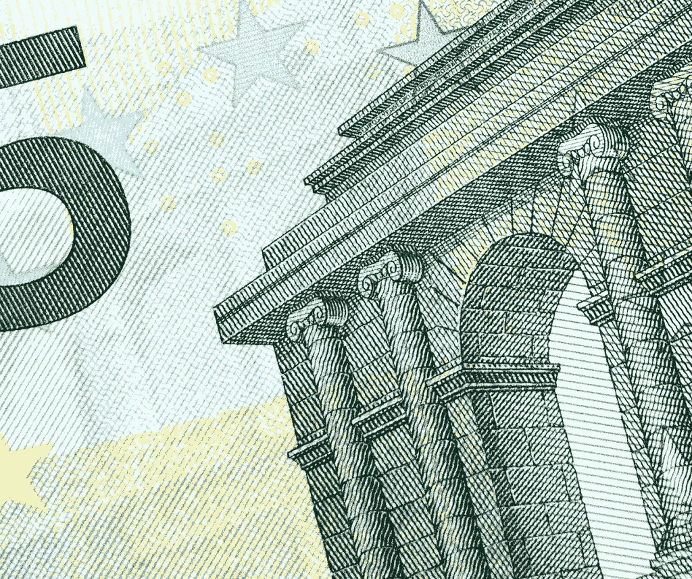
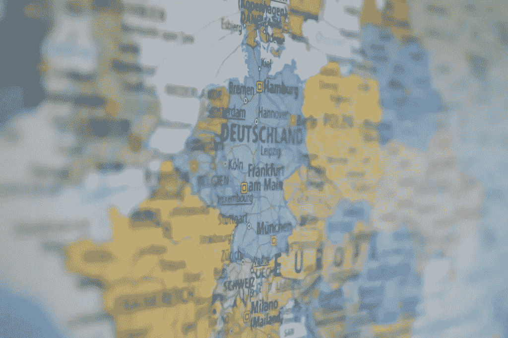

# 最后，欧盟让你控制你的银行数据

> 原文：<https://towardsdatascience.com/finally-the-eu-is-giving-you-control-of-your-banking-data-57f0ee424a3d?source=collection_archive---------4----------------------->

# 消费者和企业的朋友。银行和美国的敌人？

# 什么是 PSD2，它将如何帮助我？

不，这不是 R2D2 的表弟。PSD2 是欧盟银行指令的第二个版本，其主要目的是保护消费者。现在我们都知道银行立法通常不被认为是令人兴奋的，**但 PSD2 将在 2018 年到来，以撼动系统，让银行客户控制他们的财务数据，并让企业有机会在金融服务中竞争**。通过 PSD2，您将能够允许获得许可的第三方金融服务提供商访问您的银行信息(在明确同意的情况下)，他们可以使用这些信息来**分析您的支出并为您提供预算建议，或者引导您使用更便宜的抵押贷款或更高利息的储蓄账户**。第三方也将能够提供跨越国界延伸到整个欧盟和欧洲经济区的支付服务，这意味着消费者可以更快地验证和更少的费用。

所以如果你想象你想成为一个商人，在整个欧盟销售产品。或者想从一个欧洲国家搬到另一个欧洲国家。**你马上就能做到这两点**。您不需要一个新的外国银行账户，因为您可以允许您的财务数据跨境共享，并在整个欧盟范围内进行支付。而且你的身份和名声很容易被验证。

***在本文中，我们将了解为什么需要 PSD2，它是如何工作的，它对消费者、企业和银行意味着什么，以及它将如何影响欧盟和美国。***

# 第三方提供商有两种新的许可证类型

**账户信息服务提供商(AISP)**—这些服务提供商可以在一个地方为用户提供一个或多个支付账户的汇总信息，帮助消费者更好地管理他们的财务。这可以包括交易历史、往来账户余额、储蓄账户、直接借记和其他存款和支付。

**支付启动服务提供商(PISP)**—这些服务有助于使用网上银行进行支付。这可以是账户之间的在线资金转账、直接借记、信用转账以及通过借记卡或信用卡进行的交易等。当谈到避免信用卡费用和其他交易成本时，这是一个游戏规则的改变者。

# 我们为什么需要 PSD2？

第一个指令 PSD1 是在 2008 年金融危机前起草的。不出所料，自那以后，世界发生了很大变化。在政治上，由此产生的紧缩政策和高失业率加剧了欧盟的动荡。在经济上，欧盟增长落后。在数字方面，非洲大陆没有大公司来挑战美国的公司，这意味着当我们从美国购买数字和技术产品和服务时。**因此，** **欧盟的现金充斥着美国的账户，有价值的数据源源不断地流入美国的服务器，而美国的数据保护法对消费者的友好程度要低得多**。PSD2 的不可告人的动机是解除管制，让欧盟的数字企业获得竞争优势——并迅速提振欧盟经济。

据报道，2008 年金融危机之后，欧盟领导人也对银行拥有的权力感到不满。凭借对客户数据的独家访问权，他们是唯一能够通过向客户出售金融服务来赚钱的人，而这往往意味着高额费用。这种对客户数据的垄断在 2015 年为欧盟银行赚取了约 1280 亿€，占其零售银行收入的四分之一。这些高额费用的另一个原因是过时和昂贵的行政和安全系统。每年都有数百万人正式投诉他们的银行。**金融科技和区块链公司最近在欧盟的成功证明，向第三方开放金融服务将意味着更多的竞争、创新机会和更好的安全性——同时降低消费者的成本**。

# 金融科技并不新鲜

70%的欧盟客户使用应用程序进行网上银行业务，40%的客户使用软件进行移动支付。Sofort、iDEAL 等金融科技公司完成了荷兰和德国超过一半的在线支付业务。在英国，你可以通过朋友的电话号码向他们支付小额款项。然而，如果金融科技公司能够获得客户交易信息，它们还可以提供许多其他服务。目前，大多数银行都配合这些数据请求，但它们可能会响应缓慢，有时甚至会完全阻止这些请求。PSD2 将强制要求共享数据，并建立能够实现实时交易的系统。消费者和企业的巨大胜利。

金融科技只会越来越大。根据毕马威的数据，**2016 年**对金融科技的投资总额为 247 亿美元。随着私营部门发展 2 在该部门创造更多机会，这一数字今年可能会超过。

# 安全呢？

所有第三方提供商的安全措施都很严格。他们必须得到许可、保险、监管和监督。例如，帮助公司跟踪工作流程和发票的芬兰初创公司 Holvi 被芬兰金融监管局监管并许可为支付机构，在整个欧盟范围内运营。它和传统银行一样由同一权威机构监管，并为欺诈损失提供保险。所有的客户资金也与公司资产分开存放，所以在破产的情况下，你的钱是安全的，可以随时提取。保护消费者是这项指令的重点。

随着人工智能的改进，欺诈将更容易被发现。这将为零售商和商家节省数十亿欧元的损失，避免因不正确的欺诈检测而导致的网上虚假下降。虚假拒绝还会导致许多顾客的流失，因为据估计，大约三分之一付款被拒绝的用户不会再回到在线零售商那里。通常情况下，失去业务的成本超过了欺诈带来的潜在损失。

不仅仅是公司被检查。PSD1 指令的一个重要变化是需要 SCA、**强客户认证**。每次您想要使用这些第三方服务之一时，您都必须完成一个更强大的两步认证，该认证包括以下三个组件中的两个组件的组合:

1.  **你拥有的东西**——例如手机或物联网设备，如 PINsentry 读卡器
2.  一些你知道的东西，比如一个别针、个人信息或秘密信息
3.  **你是什么样的人**——指纹或面部识别等生物识别技术

公司还需要承担责任，通过加密、混淆、root 和越狱保护、设备绑定和密钥保护等方法保护消费者数据。欧盟本身也将需要开发区块链式的分布式账本基础设施，用于身份验证和交易认证。这些技术可能已经很难实现，但更难让用户友好，**这就是为什么银行应该寻求金融科技公司的帮助**。

# PSD2 对银行意味着什么？

周围有一些可怕的统计数据；高盛已经加入进来，并估计传统银行可能会损失多达 4.7 万亿美元的收入，这有利于金融科技公司。然而，大多数金融分析师和评论员似乎都同意，银行应该积极看待 PSD2，将其视为一个创新机会。金融科技可以提供单独的组件，但银行将占据先机，特别是在创建有关身份和数据(他们目前拥有)以及资本(他们目前拥有)的优质实用程序时。

一些银行已经选择接受 PSD2 将带来的变化。西班牙银行 BBVA 已经收购了 Holvi，并将与他们合作提供新的公共设施。其他银行雇佣了专业的研发部门、创新和孵化团队，开始拆分过时的 IT 系统，甚至赞助黑客马拉松。

从使用会计和薪资软件到通过众筹融资而不是获得贷款来筹集资金，中小企业现在在全球范围内运营，并且更加精通技术。对于银行来说，重要的是满足中小企业不断变化的需求，并保持金融创新的领先地位，以避免竞争对手在开始使用第三方提供商时获得优势或失去与客户的联系。Facebook Messenger 计划提供一项服务，允许用户通过其社交网络向朋友支付小额款项。如果脸书每月 20 亿活跃用户中的每一个人都注册这项服务，并输入他们的银行账户信息，那么与数百年来传统银行来之不易的客户基础相比，它可能会在非常短的时间内拥有世界上最大的金融消费者网络之一。

从法律上讲，银行将被要求允许第三方访问数据，但仍要对这些信息的安全性负责。他们还将负责为这些新的竞争对手提供便利的余额检查、报表检查和支付初始化。

# 它将如何工作？

将银行及其数据连接到第三方的最广泛认同的解决方案是使用 API，即应用程序编程接口。它本质上是一种将一个服务器、移动应用程序或网站插入另一个服务器、移动应用程序或网站，并允许它们相互通话，同时仍然独立工作的方式。在这种情况下，it 可以控制银行希望接收数据请求的方式，以及金融应用程序设计人员希望接收数据的方式，以便最好地与客户沟通。通常，大多数大型商业网站都希望对他们的代码保密，因为他们不希望开发者窃取他们花了很多钱开发的代码。**然而，许多人已经意识到，通过向开发者发布他们代码的某些部分，他们通常会得到更好的产品和服务的回报**。API 是他们公开的代码的一部分。因此，银行将能够从开发人员社区获得许多新功能，开发人员也有机会在一些昂贵的专业代码和一个巨大的平台上进行构建，以推广他们的工作。

API 还有助于解决如何连接银行、金融科技公司、零售商、社交网络和任何其他计划提供金融服务的人的新生态系统的问题。银行目前已经拥有专有的 IT 系统，这些系统可能会也可能不会连接到云基础设施。考虑到安全性和法规，将整个结构迁移到云中是不安全的。但是，当需要相互协作的操作数量只会不断增加时，集成新的和不同的组件也是如此。随着越来越复杂的系统一个接一个地被开发出来，其结果几乎肯定意味着昂贵且耗时的技术债务。

因此，答案似乎在于**混合集成**,它使用一个与当前银行内部已经建立的系统相连接的云系统。新的金融科技合作伙伴将能够通过互联网立即加入核心结构，而不需要耗时的入职。通过整合云系统，银行还将受益于即时增加的容量，这对于 PSD2 将带来的实时数据和交易的新需求和增加的需求将是无价的。

# 荷兰正在发生什么？

除了上述所有好处，该指令在荷兰尤其令人兴奋，因为荷兰是许多金融科技初创公司、孵化器和加速器的所在地。随着英国退出欧盟的迅速临近，许多公司正在寻找英国以外的地点。海牙和鹿特丹等荷兰城市是有吸引力的选择，阿姆斯特丹已经是几家金融科技初创公司、许多顶级以太坊开发商和 BitPay 欧盟总部的所在地。

**荷兰金融科技初创公司 Adyen 是整个欧盟获得资金最多的公司之一**。其当前价值为 23 亿美元。该公司在一个系统中提供了从信用卡到 Apple Pay 的 250 种不同的支付选择，提供了一种“无摩擦的支付体验”。客户包括网飞、LinkedIn、Spotify、优步、Etsy 和 Groupon。

**在阿姆斯特丹，已经有一个强大的技术生态系统，这使它成为 PSD2 改变金融科技和其他几个行业的完美场所**。从高速宽带和 LoRaWAN 物联网网络到政府主导的计划、创业孵化器和加速器，以及致力于创新的大学和研究人员。

几周后，EIT Digital 将在该市开设一个金融科技创新中心，由市政府、CWI(数学和信息学中心)、ING 银行、飞利浦和 TNO(荷兰应用科学研究组织)提供支持。该中心相信“投资数字业务对荷兰知识经济非常重要”，将专注于金融区块链技术、人工智能和网络安全领域的研究、教育和创新。

# PSD2 会影响美国银行业吗？

**简短的回答是没有**。它仅适用于在欧盟内部进行的部分支付交易。然而，私营部门司 2 将实施所谓的“一条腿伸出”政策。这意味着一旦资金被记入欧盟内的实体账户，该指令将对支付服务提供商产生影响。对于对外支付，支付服务提供商必须遵守 PSD2，直到欧盟的清算账户被借记。

**更长的答案是肯定的**，尽管是间接的。这与该指令的竞争性有关。欧洲在个人数据保护方面一直采取比美国更进步的立场，如果你考虑到 2006 年针对谷歌的“被遗忘权”裁决等案例，美国通常会将欧盟列为“反大企业技术”。

目前，Visa 和 Mastercard 等美国金融公司已经在全球和欧盟铺设了支付基础设施。如果一个公司或消费者想要使用这些框架，他们必须付费。如果欧盟可以使用 PSD2 来创建计划中的强大验证和直接帐户到帐户支付系统，**美国的系统将变得缓慢、昂贵，并且与欧洲电子商务无关**。欧盟将能够改变收费标准，向境外公司收取费用，让他们使用新的基础设施。