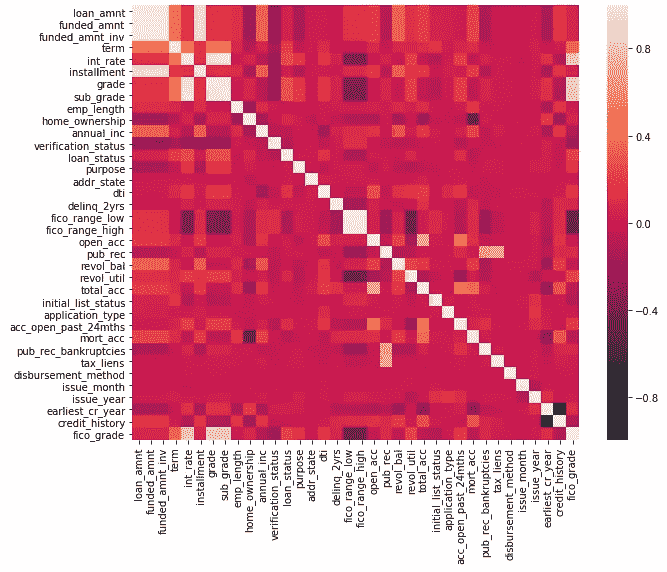
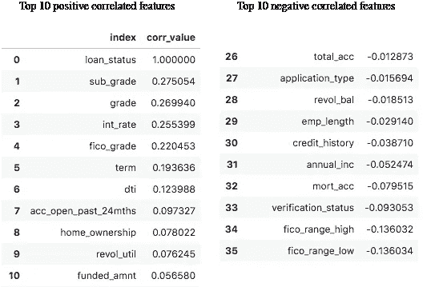

# 机器学习算法可以帮助我们评估金融决策的风险

> 原文：<https://towardsdatascience.com/financial-data-analysis-2f86b1341e6e?source=collection_archive---------15----------------------->

## 贷款资格预测:探索性数据分析

在本系列的第一部分的[中，我展示了一些必要的数据处理，包括:移除常量特征、移除重复特征、移除重复行、移除与 85%缺失值相关的特征>。这些是我们需要在几乎每个数据集上执行的初步步骤。完成上述处理后，我能够移除 60 个不相关的特征，剩下 153 个初始特征中的 93 个。在](https://medium.com/@sabber/financial-data-analysis-80ba39149126)[的第二部分](https://medium.com/@sabber/financial-data-analysis-bf4b5e78c45c)，我手动检查了每一个特征，处理文本并删除了一些不必要的特征。在数据处理和清理结束时，我们有 36 个相关特征。

在这一部分，我对所选择的 36 个特征进行了一些探索性的分析。这些分析包括可视化特征的相关系数，去除高度共线的特征。

让我们从导入库和读取具有所选功能的数据集开始:

```
import warnings
warnings.filterwarnings("ignore")import numpy as np
import pandas as pd
import matplotlib.pyplot as plt
import seaborn as snsfrom sklearn.utils import shuffle, class_weight
from sklearn import preprocessing
from sklearn.preprocessing import StandardScaler
from sklearn.model_selection import train_test_split
from sklearn.metrics import accuracy_score, classification_report, confusion_matrix
```

**读取数据**

```
df_selected = pd.read_csv('./data/df_selected.csv')
```

**特征关联**

可视化特征之间的关系是一组数据可能对应于另一组数据的方式之一。特别是在机器学习中，特征相关性的重要性是显著的。它帮助我们识别坏的和高度共线的特征。相关矩阵也可以用于特征工程。在下图中，显示了特征之间的关系:

```
corr = df_selected.corr()
plt.figure(figsize = (10, 8))
sns.heatmap(corr)
plt.show()
```



从上面的图中，我们看到解释特性关系有点棘手。所以，我们要具体一点。例如，如果我们想知道特征是如何与目标变量相关的，我们必须编写下面的代码来获得特征与目标变量的相关系数:

```
corr['loan_status'].sort_values(ascending = False)
                   .to_frame('corr_value')
                   .reset_index()
```



从上面打印的结果来看，sub_grade 与目标变量贷款状态的正相关性最高，其次是等级、利率等。Fico_range_high 和 Fico_range_low 的负相关性最高。由于 Fico_range_high 和 Fico_range_low 具有几乎相同的相关系数(-0.136)，所以我们可以将它们合并，取它们的平均值并删除它们。

```
df_selected['avg_fico_score'] = (df_selected['fico_range_high'] + df_selected['fico_range_low'])/2.0df_selected.drop(['fico_range_low','fico_range_high'], axis=1, inplace=True)
```

**寻找高度相关的特征**

现在，我们有了要素的相关系数矩阵，查找高度共线(高度相关)的要素变得更加容易。使用下面的代码，我找到了共线特性:

```
funded_amnt           loan_amnt           1.000000
funded_amnt_inv       loan_amnt           0.999996
                      funded_amnt         0.999996
int_rate              term                0.435879
installment           loan_amnt           0.952673
                      funded_amnt         0.952673
                      funded_amnt_inv     0.952653
grade                 term                0.446887
                      int_rate            0.962951
sub_grade             term                0.454138
                      int_rate            0.985559
                      grade               0.976940
total_acc             open_acc            0.689583
acc_open_past_24mths  open_acc            0.482634
                      total_acc           0.428877
mort_acc              home_ownership     -0.477745
pub_rec_bankruptcies  pub_rec             0.642983
tax_liens             pub_rec             0.695931
credit_history        earliest_cr_year   -0.994442
fico_grade            int_rate            0.792840
                      grade               0.821197
                      sub_grade           0.798134
```

从上面的结果中，我们看到' funded_amnt '和' loan_amnt '有 100%的相关性，这告诉我们，它们本质上是一样的。同样，' funded_amnt_inv '与' loan_amnt '和' funded_amnt '的关联度几乎是 100%。因此，我删除了' funded_amnt '，' funded_amnt_inv '功能。

```
df_selected.drop(['funded_amnt','funded_amnt_inv'], axis=1, inplace=True)
```

我还发现以下特性与建模目的无关。因此，我将它们从数据中删除:

```
df_selected.drop(‘earliest_cr_year’, axis = 1, inplace=True)
df_selected.drop('issue_year', axis = 1, inplace=True)
```

删除特性后，我们得到了 29 个最相关和最重要的特性以及一个目标特性‘loan _ status’。

**分类特征与连续特征**

好的，让我们看看这些特征是具有分类值还是连续值。它帮助我们找到合适的建模算法:

```
cat_features.remove('loan_status')['term',
 'grade',
 'emp_length',
 'home_ownership',
 'verification_status',
 'purpose',
 'initial_list_status',
 'application_type',
 'pub_rec_bankruptcies',
 'disbursement_method',
 'issue_month',
 'issue_year']
```

我们看到 12 个特征≤14 个唯一值。只有六个要素具有超过 1200 个唯一值。这意味着大多数特征都是绝对的。因此，基于树的算法将是尝试的第一选择。

还有许多其他可以执行的 EDA。但由于时间的限制，我不会做进一步的分析功能。相反，在下一部分中，我将着重于选择一个合适的算法，然后创建一个模型。

在[系列的下一部分](https://medium.com/@sabber/financial-data-analysis-51e7275d0ae)，我将开始创建模型。同时，如果你对这部分有任何问题，请在下面写下你的意见。你可以联系我:

```
Email: sabbers@gmail.com
LinkedIn: [https://www.linkedin.com/in/sabber-ahamed/](https://www.linkedin.com/in/sabber-ahamed/)
Github: [https://github.com/msahamed](https://github.com/msahamed)
Medium: [https://medium.com/@sabber/](https://medium.com/@sabber/)
```