# 机器学习算法可以帮助我们评估金融决策的风险

> 原文：<https://towardsdatascience.com/financial-data-analysis-bf4b5e78c45c?source=collection_archive---------9----------------------->

## 贷款资格预测:数据处理-2


在本系列的最后一部分的[中，我展示了基本的数据处理操作，包括:移除恒定特征、移除重复特征、移除重复行、移除与 85%缺失值相关的特征>。这些是我们需要在几乎每个数据集上执行的初步步骤。完成上述处理后，我们最终将特征从 153 个减少到 93 个。在这一部分，我将手动检查每个特性，处理它们并删除不必要的特性。](https://medium.com/@sabber/financial-data-analysis-80ba39149126)

在最后一部分中，我们将所有数据点存储到一个数据帧“df”中。让我们开始检查数据的形状。

```
df.shape
(457728, 93)
```

我们看到现在有 93 个特征。在我们检查每个特性之前，我们需要创建一个用于可视化的绘图函数。我从这个链接借用了下面的函数。

上述函数接受两个参数；第一个是特征名，第二个是布尔变量:特征是连续的还是分类的。如果特征是连续的，那么函数绘制两个子图:(1)特征的分布和(2)基于 loan_status 类的两个箱线图。另一方面，如果特征是分类的，那么第一个子图是计数图，第二个子图基于 group_by loan_status 类。

下面的代码大多是不言自明的。我有时会省略详细的解释。

## **功能 0–10:**

```
df.iloc[0:5, 0: 10]
```

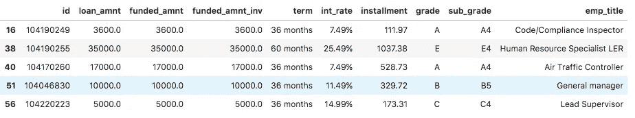

First 10 features

**功能:贷款金额**

```
### Feature: loan_amnt
-------------------------------len(df.loan_amnt.value_counts())
1415plot_feature('loan_amnt', True)
```

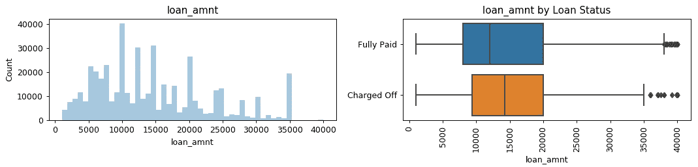

看起来所有的贷款都不是唯一的。一定量出现几次。可能是这个原因；公司有一定范围或一定额度可以放贷。

**功能:期限**

```
### Feature: term
-------------------------------df.term = df.term.str.replace('months', '').astype(np.int)
df.term.value_counts()36    341042
60    116686
Name: term, dtype: int64plot_feature('term', False)
```

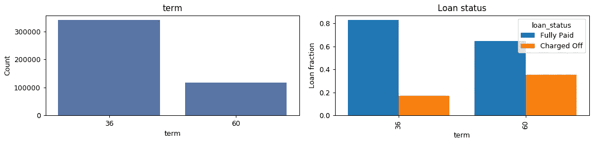

**功能:利率**

```
### Feature: int_rate
-------------------------------df.int_rate = df.int_rate.str.replace('%', '').astype(np.float32)
len(df.int_rate.value_counts())
200
plot_feature('int_rate', True)
```

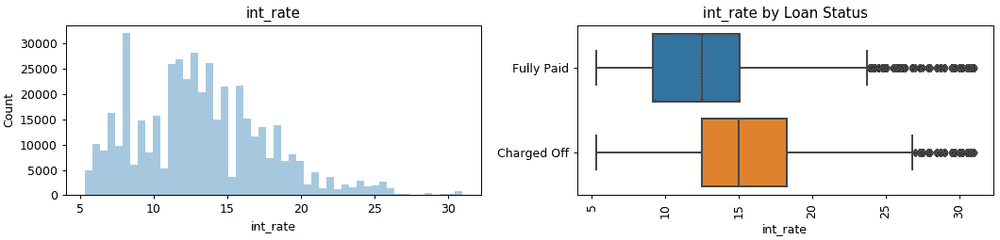

看起来，那些无力还贷并最终被取消贷款的申请人不得不支付更高的利率。

**特征:坡度和路基**

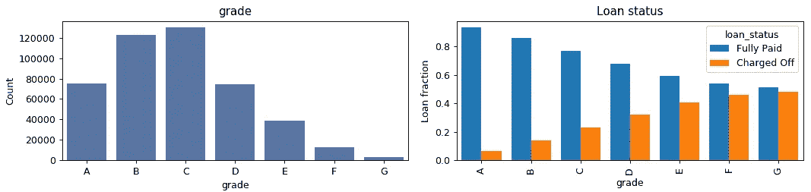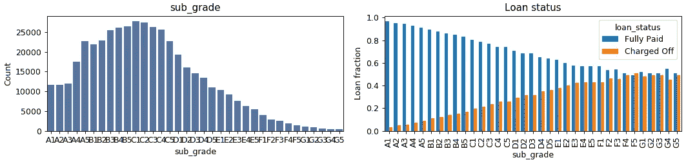

看起来等级和子等级与贷款状态具有相同的形状和关系。在这种情况下，我会保留 sub_grade，因为它比等级包含更多信息。

**特征:职务**

```
### Feature: emp_title
-------------------------------
len(df.emp_title.value_counts())
128310It looks like emp_title has lots of unique value, which may not strongly be associated with predicted loan_status. Therefore, I delete the feature.features_to_be_removed.extend(['emp_title', 'id'])
```

## 11–20 个特征

```
df.iloc[0:5, 6: 20] 
```

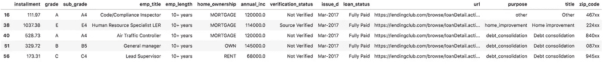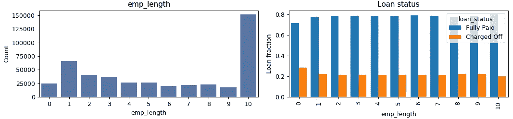

从右边的图来看，emp _ lenght 似乎不是一个强有力的预测器，并且与贷款状态关系不大。我现在保留这个功能，基于模型性能我们可能会删除它。

**功能:Home_ownership**

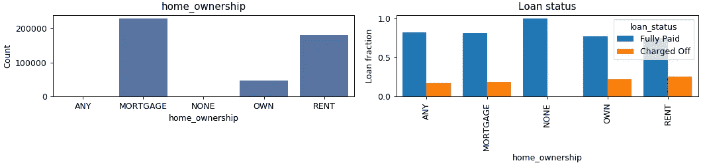

**功能:验证状态**

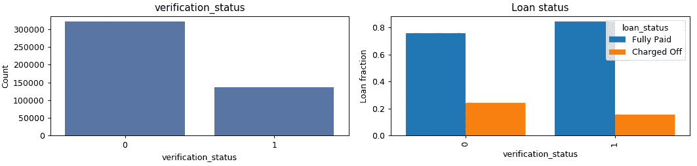

verification_status 功能在某种程度上是有区别的，因为来源经过核实的申请人更有可能被注销，这有点复杂。

**功能:Issue_d**

```
### Feature: issue_d
### ------------------df.issue_d.value_counts()
Oct-2014    33699
Jul-2014    25974
Jul-2015    23990
Jan-2015    22750
Oct-2015    22431
Nov-2014    21186
Apr-2015    20097
Dec-2015    19106
May-2015    17964
Aug-2015    17492
Apr-2014    17140
May-2014    17133
Aug-2014    16780
Nov-2015    16540
Jun-2015    15304
Jun-2014    15207
Mar-2015    14997
Mar-2014    14988
Feb-2015    14464
Jan-2014    14464
Feb-2014    13945
Sep-2015    13838
Sep-2014     9344
Dec-2014     8283
Jan-2017     5912
Mar-2017     5008
Feb-2017     4241
May-2017     3644
Apr-2017     3431
Jun-2017     2849
Jul-2017     2366
Aug-2017     1863
Sep-2017     1298
Name: issue_d, dtype: int64
```

“issude _ d”特征是字符串。由于我们正在处理三年的数据，并保持我们的模型独立于年份，所以我只提取月份，然后将它们转换成类别。

```
df['issue_month'] = pd.Series(df.issue_d).str.replace(r'-\d+', '')
plot_feature('issue_month', False)
```

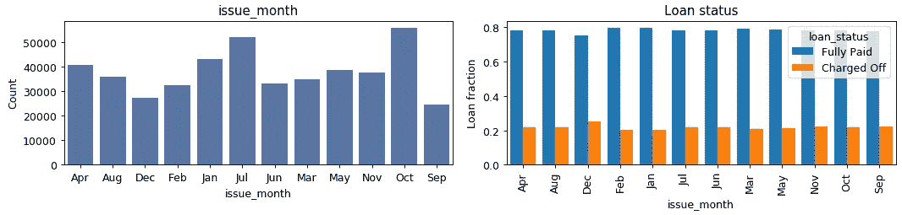

看起来，在 12 月份借款的人比在其他月份借款的人更有可能被冲销。确实有趣。

```
df.issue_month = df.issue_month.astype("category", categories=np.unique(df.issue_month)).cat.codesdf.issue_month.value_counts()
10    56130
5     52330
4     43126
0     40668
8     38741
9     37726
1     36135
7     34993
6     33360
3     32650
2     27389
11    24480
Name: issue_month, dtype: int64df['issue_year'] = pd.Series(df.issue_d).str.replace(r'\w+-', '').astype(np.int)df.issue_year.value_counts()
2015    218973
2014    208143
2017     30612
Name: issue_year, dtype: int64
```

由于 URL 与 loan_status 无关，我干脆把它去掉。

**功能:用途**

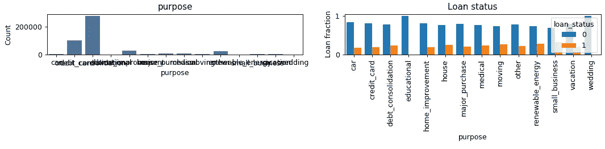

看样子，目的可以很好的区别对待。例如，为可再生能源贷款的人比为汽车或教育目的贷款的人更有可能被注销。

因为标题和邮政编码有许多唯一的值，所以我简单地将它们从特征空间中删除。

**特征:地址状态**

“地址状态”特征具有五十个唯一值，因为有五十个状态。如果我们看下面的图表，我们会发现某些州的申请者比其他人偿还的更多。因此，这个特征可能是歧视性的。

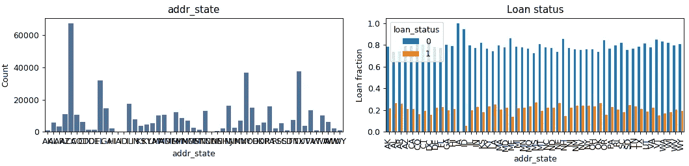

## ***21–30 功能***

## 31–40 个特征

```
df.iloc[0:5, 25: 40]
```

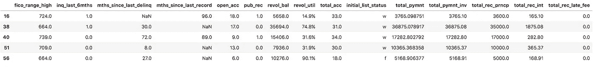

## 41–50 个特征

```
df.iloc[0:5, 35: 50]
```

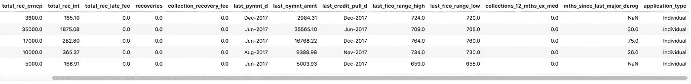

## **51–60 特征**

## **61–70 特征**

## **71–80 特征**

## **81–90 特征**

## **91 至其余特征**

```
df.iloc[0:5, 85:]
```

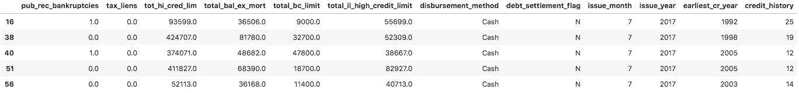

## **移除特征**

手动检查每个功能后，我最终有 61 个不相关的。让我们看看选择要删除的功能。

```
len(set(features_to_be_removed))
61print(features_to_be_removed)['emp_title', 'id', 'url', 'title', 'zip_code', 'issue_d', 'mths_since_last_delinq', 'mths_since_last_record', 'inq_last_6mths', 'mths_since_last_delinq', 'mths_since_last_record', 'total_pymnt', 'total_pymnt_inv', 'total_rec_prncp', 'total_rec_int', 'total_rec_late_fee', 'recoveries', 'collection_recovery_fee', 'last_pymnt_d', 'last_pymnt_amnt', 'last_credit_pull_d', 'last_fico_range_high', 'last_fico_range_low', 'collections_12_mths_ex_med', 'mths_since_last_major_derog', 'acc_now_delinq', 'tot_coll_amt', 'tot_cur_bal', 'total_rev_hi_lim', 'avg_cur_bal', 'bc_open_to_buy', 'bc_util', 'chargeoff_within_12_mths', 'delinq_amnt', 'mo_sin_old_il_acct', 'mo_sin_old_rev_tl_op', 'mo_sin_rcnt_rev_tl_op', 'mo_sin_rcnt_tl', 'mths_since_recent_bc', 'mths_since_recent_bc_dlq', 'mths_since_recent_inq', 'mths_since_recent_revol_delinq', 'num_accts_ever_120_pd', 'num_actv_bc_tl', 'num_actv_rev_tl', 'num_bc_sats', 'num_bc_tl', 'num_il_tl', 'num_op_rev_tl', 'num_rev_accts', 'num_rev_tl_bal_gt_0', 'num_sats', 'num_tl_120dpd_2m', 'num_tl_30dpd', 'num_tl_90g_dpd_24m', 'num_tl_op_past_12m', 'pct_tl_nvr_dlq', 'percent_bc_gt_75', 'tot_hi_cred_lim', 'total_bal_ex_mort', 'total_bc_limit', 'debt_settlement_flag', 'total_il_high_credit_limit']
```

最后，我放弃上述所有功能:

```
df_selected = df.drop(list(set(features_to_be_removed)), axis = 1)
df_selected.shape(457728, 36)
```

在上面的代码中，我们看到有 36 个最终特性为创建贷款预测模型做好了准备。让我们也检查在所选择的 36 个特征中是否有任何缺失值。

如果运行上面的代码，您会看到“dti”和“revol_util”分别缺少 21 和 223 个值。我使用 panda 的 **dropna()** 方法来删除那些与缺失值相关的例子。

## 特征编码

是时候对一些分类特征进行编码了。在下面的代码中，我对“目的”、“家庭所有权”、“年级”、“子年级”、“地址状态”进行了编码:

好了，让我们保存包含所选要素的最终数据集。

```
df_selected.to_csv('./data/df_selected.csv', index = False)
```

在[系列的下一部分](https://medium.com/@sabber/financial-data-analysis-2f86b1341e6e)中，我将进行一些探索性的分析。如果可能的话，做一些特征工程。与此同时，如果您对这部分有任何疑问，请在下面写下您的意见，或者联系我:

```
Email: sabbers@gmail.com
LinkedIn: [https://www.linkedin.com/in/sabber-ahamed/](https://www.linkedin.com/in/sabber-ahamed/)
Github: [https://github.com/msahamed](https://github.com/msahamed)
Medium: [https://medium.com/@sabber/](https://medium.com/@sabber/)
```