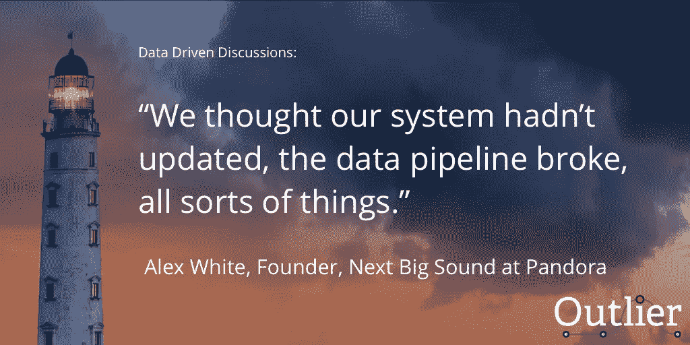

# 利用数据科学找到你喜欢的音乐

> 原文：<https://towardsdatascience.com/find-music-you-like-by-using-data-science-1920c4da12f5?source=collection_archive---------6----------------------->

## 看看 Outlier 的新播客的第一集:数据驱动的讨论！

我很高兴地宣布我们的播客“数据驱动的讨论”正式发布。在数据驱动的讨论中，我们与许多行业的领导者交谈，询问他们如何使用数据来帮助他们的企业取得成功。

在这第一集我采访了 [**亚历克斯·怀特**](https://medium.com/u/e3bf0f99ad3c?source=post_page-----1920c4da12f5--------------------------------) 。Alex 是 [**Next Big Sound**](https://medium.com/u/4563eec2640d?source=post_page-----1920c4da12f5--------------------------------) 的创始人和负责人，该数据集团位于领先的在线音乐服务: [**Pandora**](https://www.pandora.com/) 。音乐是一个竞争激烈的行业。尽管音乐行业是由艺术创造力驱动的，但它也是由数据驱动的。Alex 向我们介绍了获得可靠的音乐数据有多困难，以及数据如何成为竞争优势。

在本次讨论中，我们将回答许多关于该行业的问题，包括:

*   像 Next Big Sound 这样的服务是如何收集人们对音乐看法的数据的？ **(3:28)**
*   Alex 在评估商业智能工具时寻找什么？ **(11:49)**
*   妮琪·米娜是如何骗过 Next Big Sound 的高级算法的？ **(13:35)**

听下面这一集:

如果你喜欢这一集并想听更多，一定要给我们留下评论，并在 [**苹果播客**](https://itunes.apple.com/us/podcast/101-songs-you-may-like-how-pandora-uses-data/id1258339160?i=1000389788515&mt=2) 上订阅数据驱动讨论。