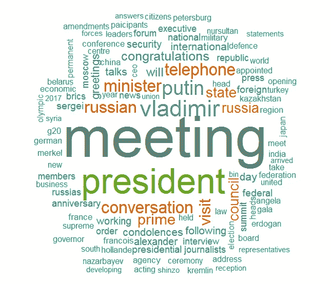
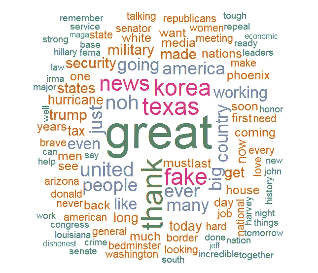
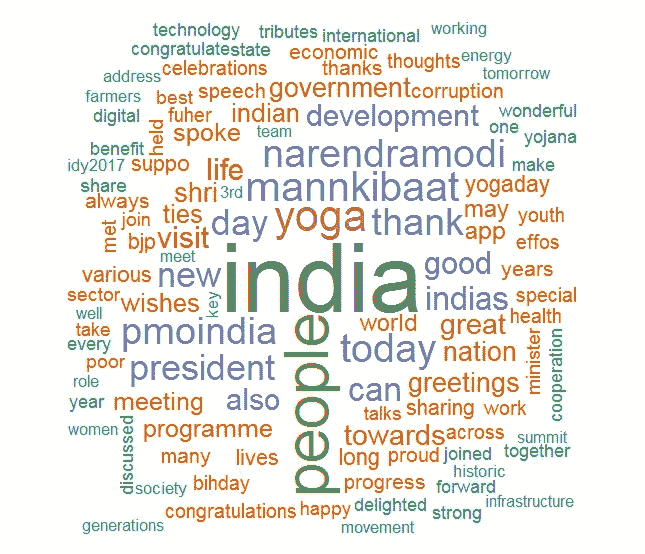

# 找出名人在推特上谈论最多的话题

> 原文：<https://towardsdatascience.com/find-out-what-celebrities-tweet-about-the-most-6f498d89266b?source=collection_archive---------7----------------------->

## 使用不到 40 行 R 代码的 WordCloud

猜猜是谁的 twitter 句柄给了这个词 cloud？这里有足够的暗示。你说得对，这是吴恩达在 Coursera 上发布的关于他新的深度学习课程的推文！看到数据运行总是很有趣；不是吗？让我们试着为三位世界领袖创建一个类似的 wordcloud，即。美国总统唐纳德·特朗普、印度总理纳伦德拉·莫迪和俄罗斯总统弗拉基米尔·普京。


> 单词云是一种数据可视化技术，其中每个单词的大小表明其在相关文本中的频率或重要性(即，单词在语料库中出现的次数越多，单词就越大)

既然您对使用 R 从 twitter 句柄创建一个 wordcloud 感兴趣，我将有把握地假设您已经拥有了这两者，一个您名下的 Twitter 帐户和安装在您机器上的 RStudio。如果没有，现在是时候了😊

你还必须有一个 Twitter 开发者账户，作为提取推文的媒介。如果你需要帮助，这里有一个[快速指南](https://medium.com/@Kritika_Jalan/quick-guide-to-extract-tweets-using-r-c5382d3e257a)。

让我们开始吧。我们将采取以下步骤来完成这项任务:

1.  使用句柄获取 Twitter 数据(2 行代码！)
2.  为视觉化做准备(真正有趣的部分)
3.  最后，创建一个单词云(单行代码！)

# 提取推文

让我们加载必要的库并与 Twitter 建立连接

```
#Getting tweets from twitter
library(twitteR)
#Twitter-R Authentication
library(ROAuth)
#Text processing
library(stringr)
#Text mining 
library(tm)
#Wordcloud creation
library(wordcloud)#Connect to twitter API using the saved credentials
load("twitter authentication.Rdata")
setup_twitter_oauth(credentials$consumerKey, credentials$consumerSecret, credentials$oauthKey, credentials$oauthSecret)
```

我们现在去收集一些数据。这里有几件事需要注意-

1.  一个人只能从关注与 API 相关联的 Twitter 账户的用户那里获得数据。或者，从公共帐户(相对于私有帐户)
2.  Twitter [API 限制](https://dev.twitter.com/rest/reference/get/statuses/user_timeline)用户可以从特定时间线获得的推文数量为 3200 条，包括 RTs，即使它被设置为 FALSE。不过，有一些工具[可以让你绕过这个限制。在这篇文章中，我们将坚持自己的极限](https://www.quora.com/Is-there-a-way-to-get-more-than-3200-tweets-from-a-Twitter-user-using-Twitters-API-or-scraping)
3.  Twitter API 还对一次可以收集多少条推文有一个速率限制。如果您试图一次收集太多，它可能会失败或返回部分结果。解决这个问题的最好方法是在 API 调用之间引入延迟，这样代码运行时您就不必在旁边了

获取你想查找的人物的 twitter 账号。确保这些是真实的 twitter 帐户，否则会出现错误。
`screenName <- c(‘realDonaldTrump’, ‘PutinRF_Eng’, ‘narendramodi’)`

使用 twitteR 收集关于这些句柄的信息。
`checkHandles <- lookupUsers(screenName)`

获取每个句柄的用户数据，并创建一个便于访问的数据框。用这个检查推特和私人账户的数量。删除私人帐户(如果有)。

```
UserData <- lapply(checkHandles, function(x) getUser(x))
UserData <- twListToDF(UserData)
table(UserData$name, UserData$statusesCount) #Check tweet count
table(UserData$name, UserData$protected) #Check Private Accounts
usernames <- subset(UserData, protected == FALSE) #Public Accounts
usernames <- as.list(usernames$screenName)
```

接下来，我们从用户时间轴中获取推文列表，将它们转换为数据帧，并在进行另一个 API 调用之前等待 5 分钟。将所有数据帧合并成一个数据帧，对推文进行预处理。请注意，我们将只能获得这些句柄的 3200 条最新推文。特朗普和莫迪发的推特远不止这些。

```
x <- userTimeline(‘realDonaldTrump’,n=3200,includeRts = FALSE)#Convert tweets list to dataframe
TrumpData <- twListToDF(x)#Wait 5 minutes 
Sys.sleep(300)x <- userTimeline(‘PutinRF_Eng’,n=3200,includeRts = FALSE)
PutinData <- twListToDF(x)
Sys.sleep(300)x <- userTimeline(‘narendramodi’,n=3200,includeRts = TRUE)
ModiData <- twListToDF(x)Trump.df <- data.frame(TrumpData)
Putin.df <- data.frame(PutinData)
Modi.df <- data.frame(ModiData)#Now create a dataframe that combines all of the collected tweets
tweets <- data.frame()
tweets <- Trump.df
tweets <- rbind(tweets,Putin.df)
tweets <- rbind(tweets,Modi.df)
```

# 预处理推文

既然我们已经将所有相关的推文放在了一个地方，那么是时候对它们进行预处理了。我这里的意思是，让我们去掉不需要的字符、符号和单词。您不希望文字云中出现图形字符、文章、符号和数字。您可以根据需要跳过这些预处理步骤。

```
#Convert tweets to ASCII to avoid reading strange characters
iconv(tweets$text, from=”UTF-8", to=”ASCII”, sub=””)#Clean text by removing graphic characters            tweets$text=str_replace_all(tweets$text,"[^[:graph:]]", " ")#Remove Junk Values and replacement words like fffd which appear because of encoding differences            
tweets$text <- gsub("[^[:alnum:]///' ]", "", tweets$text)#Convert all text to lower case            
tweets$text <- tolower(tweets$text)#Remove retweet keyword            
tweets$text <- gsub("rt", "", tweets$text)#Remove Punctuations            
tweets$text <- gsub("[[:punct:]]", "", tweets$text)#Remove links            
tweets$text <- gsub("http\\w+", "", tweets$text)#Remove tabs            
tweets$text <- gsub("[ |\t]{2,}", "", tweets$text)#Remove blankspaces at begining            
tweets$text <- gsub("^ ", "", tweets$text)#Remove blankspaces at the end            
tweets$text <- gsub(" $", "", tweets$text)#Remove usernames 
tweets$text <- gsub("@\\w+", "", tweets$text)
```

一旦我们对 tweets 进行了预处理，现在让我们为每个句柄创建一个语料库，并删除诸如“my”、“do”、“today”等停用词。

```
#After preprocessing the data, subset for tweets for each handle
Trump <- subset(tweets, screenName==“realDonaldTrump”, select= text)
Putin <- subset(tweets, screenName== “PutinRF_Eng”, select= text)
Modi <- subset(tweets, screenName== “narendramodi”, select= text)#Create corpus of individual twitter handles 
Trump <- Corpus(VectorSource(Trump))
Putin <- Corpus(VectorSource(Putin))
Modi <- Corpus(VectorSource(Modi))#Remove English Stopwords from the tweets
Trump <- tm_map(Trump, removeWords, stopwords(“en”))
Putin <- tm_map(Putin, removeWords, stopwords(“en”))
Modi <- tm_map(Modi, removeWords, stopwords(“en”))
```

# 创建 WordCloud

如果你熬过了所有这些步骤到达这里，你应该得到一个诗意的款待！(宣称即将开始令人兴奋或危险的活动)看我的..

> 现在我们已经拥有了我们需要的一切，
> 让我们满足我们的贪婪
> 把他们发的微博做成云，
> 就像当初我们同意的那样

一个函数`wordcloud()`让你定义 wordcloud 创建的参数。输入语料库、要显示的单词的最小频率、云的大小和形状、单词的颜色和顺序、显示的最大单词等。调整这些，玩一玩。

```
wordcloud(Trump,min.freq = 3, scale=c(6,0.5),colors=brewer.pal(8, “Dark2”),random.color= FALSE, random.order = FALSE, max.words = 110)wordcloud(Putin,min.freq = 4, scale=c(7,0.8),colors=brewer.pal(8, “Dark2”),random.color= FALSE, random.order = FALSE, max.words = 100)wordcloud(Modi,min.freq = 3, scale=c(6,0.5),colors=brewer.pal(8, “Dark2”),random.color= FALSE, random.order = FALSE, max.words = 110)
```

**语法及解释(** [**来源**](https://cran.r-project.org/web/packages/wordcloud/wordcloud.pdf) **):**

```
wordcloud(words, freq, min.freq, scale, max.words, random.order, random.color, rot.per,colors, ordered.colors,…)
```

1.  单词:要在云中绘制的单词
2.  freq:这些词在文本中的出现频率
3.  最小频率:频率低于最小频率的单词将不会被标绘
4.  scale:长度为 2 的向量，表示单词大小的范围
5.  max.words:要绘制的最大字数；最不常用的词语被删除
6.  random.order:随机排列单词。如果为假，它们将以递减的频率绘制
7.  random.color:从颜色中随机选择颜色。如果为假，则根据频率选择颜色
8.  rot.per:旋转 90 度的比例字
9.  颜色:颜色词从最少到最多
10.  ordered.colors:如果为 true，则颜色按顺序分配给单词

您可以根据您选择的顺序和颜色向您的单词云添加更多信息。您可以指定非随机颜色(random.color = FALSE ),这将基于频率进行颜色分配，然后使用调色板(来自 [RColorBrewer](http://www.cse.unsw.edu.au/~mike/myrlibrary.old/RColorBrewer/html/ColorBrewer.html) 包的 brewer.pal)为颜色选择一个值，该值按照您喜欢的顺序排列。

**你也可以根据他们的情绪给单词标上颜色，比如积极和消极的情绪。这可以通过在数据库中增加一个定义该属性的列来实现，然后用它来定义颜色，如下所示–**

```
wordcloud(df$words,df$freq, min.freq = 3, scale=c(6,0.5), random.color= FALSE, ordered.colors=TRUE, colors=brewer.pal(8, “Dark2”)[factor(df$sentiment)], random.order = FALSE, max.words = 110)
```

创建云之后，您可能会看到一些不相关的单词或数字，并且没有提供任何附加信息。在这种情况下，你需要再调整一下你的云。例如，当我创建这些云时，我看到‘amp’和‘will’这两个词是特朗普和莫迪的云中出现频率最高的词。我使用了下面的代码行并删除了它们。下面是我做了这些修改后得到的单词云。

```
#Remove numbers if necessary
#Putin <- tm_map(Putin, removeNumbers)#Remove specific words if needed
#Trump <- tm_map(Trump, removeWords, c(‘amp’,’will’))
#Modi <- tm_map(Modi, removeWords, c(‘amp’,’will’))
```



Russian President will make America Great again with Indian People 😝

我还创建了一个 [GitHub 库](https://github.com/Krithi07/Celebrity-Twitter-WordCloud)，所有代码都在一个地方。那个为阿米塔布·巴坎、桑德尔·皮帅、维拉特·科利和吴恩达创造了文字云

## 结束语

除了了解一个特定的 Twitter 账号发布的最多的是什么，我们还可以使用 wordclouds 做很多其他很酷的事情。一个这样的例子是对产品的情感分析。使用 hashtag 获取关于产品的所有推文，处理它们以获得有意义的单词并构建云，砰！如果最常用的词是正面的，你就知道你的产品做得很好。

希望你玩推特玩得开心。如需更多此类文章，请关注该出版物，并在下面发表评论以获取问题或建议。