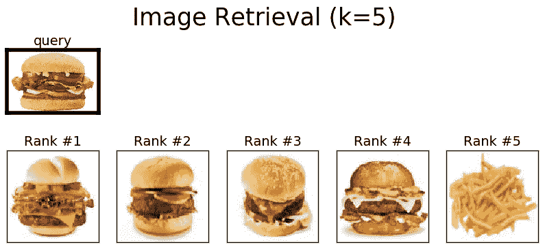
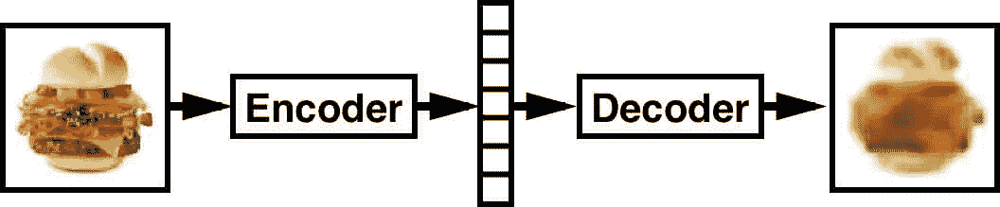
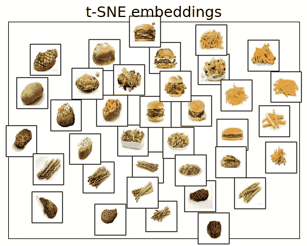
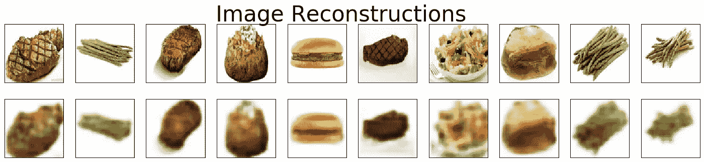

# 使用自动编码器的相似图像检索

> 原文：<https://towardsdatascience.com/find-similar-images-using-autoencoders-315f374029ea?source=collection_archive---------2----------------------->

**Fig 1: Querying a test burger image in a small training set of steakhouse food images**

在本文中，我们将解释如何使用自动编码器在未标记的图像数据集中查找相似的图像。除此之外，我们还提供了一个图像相似性推荐系统的 Python 实现，该系统在牛排餐厅的食物图像上进行训练，网址为:

> [**https://github . com/ankonzoid/artificio/tree/master/image _ retrieval**](https://github.com/ankonzoid/artificio/tree/master/image_retrieval)

更多我关于深度学习和强化学习的博客、教程、项目，请查看我的 [**中**](https://medium.com/@ankonzoid) 和我的 [**Github**](https://github.com/ankonzoid) **。**

# 问:什么是自动编码器？

自动编码器是由编码器和解码器组成的神经网络。目标是用编码器压缩您的输入数据，然后用解码器解压缩编码的数据，以便输出是您的原始输入数据的良好/完美的重建。

# 问:为什么自动编码器有用？

作为一个黑盒，自动编码器可能看起来毫无用处:如果我们已经有了数据，为什么我们还要费心去重建一个不那么完美的数据副本呢？说得好。但是 autoencoder 的真正价值在于编码器和解码器本身是独立的工具，而不是重建输入数据的联合黑盒。例如，如果我们充分降低编码维度，我们可以指导自动编码器在训练过程中学习数据的最显著特征(并忽略数据的“噪声”)，启发式方法是，自动编码器被迫减少其重建误差，限制只有有限的可用自由度，因此自动编码器将优先保留数据的最宏观细节。注意，自动编码器属于无监督学习的范畴，因为基础事实目标是数据本身。训练自动编码器通常通过反向传播来完成，输入数据和重构之间的差异是权重更新的误差在整个网络中传播的原因。

**Fig 2: A schematic of how an autoencoder works. An image of a burger is encoded and reconstructed.**

好的好的。既然我们可以训练一个自动编码器，那么我们如何将自动编码器用于实际目的呢？事实证明，编码器给出的编码表示(嵌入)是相似性检索的重要对象。大多数原始和高度非结构化的数据，例如您的面部图像，通常嵌入在非人类可解释的向量空间表示中。因此，我们可以使用一个训练有素的编码器将你的面部图像转换为更低维的嵌入，而不是在 RGB 像素空间中费力地操作，这有望成为更有意义的维度，如“图像亮度”、“头型”、“眼睛位置”、“头发颜色”等。利用这种压缩编码表示，嵌入之间的简单向量相似性度量(例如余弦相似性)将在图像之间创建更多人类可解释的相似性。

# 相似图像检索推荐码

利用我们所描述的通过训练过的编码器(从自动编码器中提取)来使用嵌入图像的方法，我们在这里提供一个简单的具体例子，说明我们如何在数据库中查询和检索相似的图像。如前所述，我们类似的图像推荐系统的代码可以在以下位置找到:

> [**https://github . com/ankonzoid/artificio/tree/master/image _ retrieval**](https://github.com/ankonzoid/artificio/tree/master/image_retrieval)

具体来说，我们使用一个小型的训练数据库，包含 5 种常见的牛排餐厅项目类别:牛排、汉堡、沙拉、薯条、芦笋。在下图中，我们展示了牛排餐厅食物嵌入的 t-SNE 可视化(图 3)，测试汉堡图像的 top k=5 图像检索(图 4)，以及一些训练牛排餐厅食物图像的一些重建图像(图 5)。所提供的算法的性能远非完美，但为任何对深度学习图像检索感兴趣的人提供了一个良好的起点。

**Fig 3: t-SNE visualizations of the training steakhouse food item images**

**Fig 4: Test burger image retrieval from the training set**

**Fig 5: Steakhouse food item image reconstructions using a convolutional autoencoder**