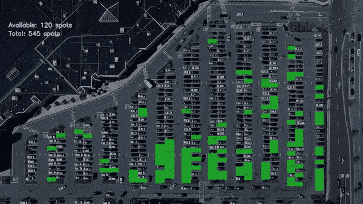
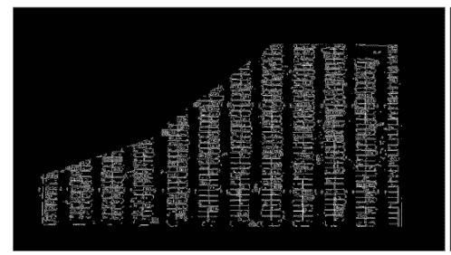
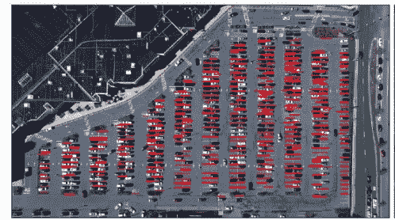
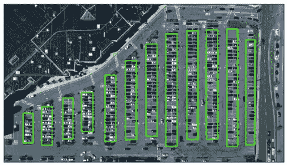
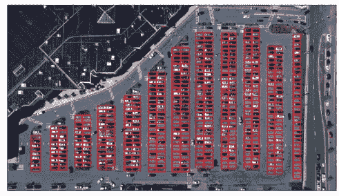
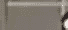
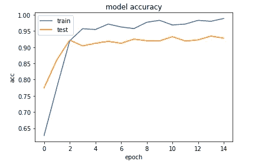
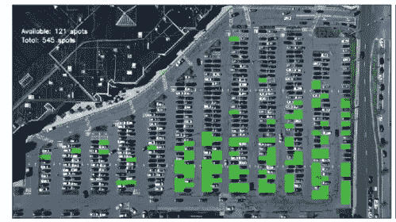

# 使用 OpenCV 和 Tensorflow 实时查找停车位置

> 原文：<https://towardsdatascience.com/find-where-to-park-in-real-time-using-opencv-and-tensorflow-4307a4c3da03?source=collection_archive---------5----------------------->

## *用数据做酷事！*

## 介绍

有多少次你开车在停车场转来转去寻找停车位。如果你的手机能告诉你最近的停车位在哪里，那该有多方便啊！

事实证明，这是一个使用深度学习和 OpenCV 相对容易解决的问题。只需要一张停车场的航拍照片。请看下面的 GIF，我的模型突出显示了洛杉矶机场停车场所有可用的停车位，并显示了可用停车位的数量。最棒的是，这一切可以实时工作！

Real time parking spot detection

你可以找到我在我的 [Github repo](https://github.com/priya-dwivedi/Deep-Learning/tree/master/parking_spots_detector) 上使用的代码。

## 步骤概述

建立停车检测模型有两个主要步骤:

1.  检测所有可用停车位的位置
2.  识别停车位是空闲的还是被占用的

由于这里的摄像机视图已经安装，我们可以使用 [OpenCV](https://docs.opencv.org/3.4.3/index.html) 对每个停车点进行一次性映射。一旦你知道每个停车点的位置，你就可以使用深度学习来预测它是否空置。

**检测所有可用停车位的位置**

我用来检测停车点的基本想法是，这里所有的停车点分隔线都是水平线，一列中的停车点大致等距。我先用 [Canny 边缘检测](https://docs.opencv.org/3.4.3/da/d22/tutorial_py_canny.html)得到一个边缘图像。我还屏蔽了没有停车位的区域。见下文:

Canny edge detection output

然后我在边缘图像上做了[霍夫线变换](https://docs.opencv.org/2.4/doc/tutorials/imgproc/imgtrans/hough_lines/hough_lines.html)，画出了它能识别的所有线。我通过只选择斜率接近于零的线来分离水平线。请参见下面的霍夫变换输出:

Line Detection using HoughLines

如您所见，hough lines 在识别停车线方面做得相当不错，但输出并不清晰——许多停车线被多次检测到，而有些却被遗漏了。那么我们如何清理这个？

然后我用观察和直觉从这里开始。使用 hough lines 返回的坐标，我对 x 观察值进行聚类，以确定主要的停车车道。聚类逻辑通过识别检测到的车道线的 x 坐标中的间隙来工作。这让我能够识别这里的 12 条停车道。见下文

Identify parking lanes by clustering x-coordinates from hough lines

如果这一切看起来很复杂，不要担心——我已经在 github 上的 [jupyter 笔记本](https://github.com/priya-dwivedi/Deep-Learning/blob/master/parking_spots_detector/identify_parking_spots.ipynb)中一步一步地记录了代码。

现在我很清楚所有的停车道在哪里，我通过假设所有的停车位都是相同的大小来识别每个单独的停车位，这是一个合理的假设。我目测了一下结果，以确保尽可能准确地捕捉到斑点之间的边界。我终于能够标出每个停车位了。见下文。

Each parking spot marked out

现在我们完成了——我们可以为每个点分配一个 ID，并将它的坐标保存在字典中。我把这本字典腌了起来，以便以后检索。这在这里是可能的，因为相机是固定的，我们不需要一次又一次地计算每个点在它视野中的位置。

**识别该点是否被标记**

现在我们有了停车地图，我认为有几种方法可以确定这个位置是否被占用:

1.  使用 OpenCV 检查一个点的像素颜色是否与一个空停车位的颜色一致。这是一个简单的方法，但容易出错。例如，照明的变化会改变一个空停车位的颜色，这将使这种逻辑在一天中难以工作。此外，如果逻辑可能会将灰色的汽车混淆为空停车位
2.  使用对象检测来识别所有汽车，然后检查汽车的位置是否与停车位重叠。我尝试了一下，发现可以实时工作的对象检测模型真的很难检测小尺寸的对象。不超过 30%的汽车被检测到
3.  使用 CNN 查看每个停车点，并预测是否被占用。这种方法最终效果最好

要建立一个 CNN，我们需要有有车和没有车的停车场的图像。我提取了每个景点的图像，并将其保存在文件夹中，然后将这些图像分组为已占用或未占用。我也在 [Github](https://github.com/priya-dwivedi/Deep-Learning/tree/master/parking_spots_detector) 上分享了这个培训文件夹。

由于在尺寸为 1280x720 的图像中有接近 550 个停车点，所以每个停车点的大小只有大约 15x60 像素。请参见以下空位置和已占用位置的示例图像:

Occupied spot

empty spot

然而，由于被占用的位置和空的位置看起来很不一样，这对 CNN 来说应该不是一个挑战性的问题

然而，我只有大约 550 两个类的图像，所以决定使用转移学习的前 10 层 VGG 和添加一个单一的 softmax 层到 VGG 模型的输出。你可以在这里找到这个迁移学习模型[的代码。模型的验证准确率达到了 **94%** 。见下文:](https://github.com/priya-dwivedi/Deep-Learning/blob/master/parking_spots_detector/CNN_model_for_occupancy.ipynb)

CNN model test and train accuracies

现在，我将停车点检测与 CNN 预测器结合起来，构建了一个停车点检测器。它惊人的准确。

Empty Spot Predictions.

我还在[笔记本](https://github.com/priya-dwivedi/Deep-Learning/blob/master/parking_spots_detector/identify_parking_spots.ipynb)中包含了在视频流中运行这个的代码。

# **结论**

我惊讶于现在链接不同的工具并使用深度学习来构建实际应用变得如此容易。我在两个下午做了这项工作。

进一步探索的几个额外想法:

*   如果停车点检测逻辑可以扩展到任何可能使用深度学习的停车地图上，那将非常好。OpenCV 的局限性在于需要针对每个用例进行调优
*   CNN 中使用的 VGG 模型是一个相当重的模型。愿意尝试重量更轻的模型

我有自己的深度学习咨询公司，喜欢研究有趣的问题。我已经帮助许多初创公司部署了基于人工智能的创新解决方案。请到 http://deeplearninganalytics.org/[来看看我们。](http://deeplearninganalytics.org/)

你也可以在[https://medium.com/@priya.dwivedi](https://medium.com/@priya.dwivedi)看到我的其他作品

如果你有一个我们可以合作的项目，请通过我的网站或 info@deeplearninganalytics.org 联系我