# 使用 Python 中的客户细分找到您的最佳客户

> 原文：<https://towardsdatascience.com/find-your-best-customers-with-customer-segmentation-in-python-61d602f9eee6?source=collection_archive---------1----------------------->


Photo credit: Pixabay

# 概观

当谈到找出谁是你最好的客户时，老 RFM 矩阵原则是最好的。RFM 代表近期、频率和货币。是一种利用过往购买行为将客户分组的客户细分技术。

**RFM 分数计算**

**最近度(R):** 自上次购买后的天数
**频率(F):** 总购买次数
**货币价值(M):** 该客户的总消费金额

步骤 1:计算每个客户的 RFM 指标。

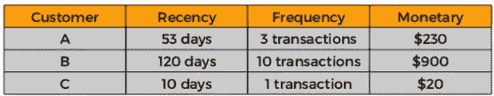

Source: Slideshare

步骤 2:将段号添加到 RFM 表中。

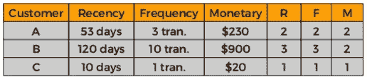

Source: Slideshare

第三步:根据最佳客户的 RFM 得分(得分 111)进行排序。

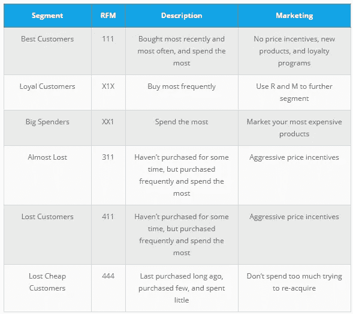

Source: Blast Analytics Marketing

由于 RFM 是基于用户活动数据，我们首先需要的是数据。

# 数据

我们将使用的数据集与我们进行[购物篮分析](https://medium.com/towards-data-science/a-gentle-introduction-on-market-basket-analysis-association-rules-fa4b986a40ce) — [在线零售数据集](http://archive.ics.uci.edu/ml/datasets/online+retail)时的数据集相同，可以从 [UCI 机器学习库](http://archive.ics.uci.edu/ml/datasets/online+retail)下载。

```
import pandas as pd
import warnings
warnings.filterwarnings('ignore')df = pd.read_excel("Online_Retail.xlsx")
df.head()
df1 = df
```

该数据集包含一家总部位于英国的注册在线零售商在 2010 年 1 月 12 日和 2011 年 9 月 12 日之间发生的所有交易。

加载数据需要几分钟，所以我保留了一份备份。

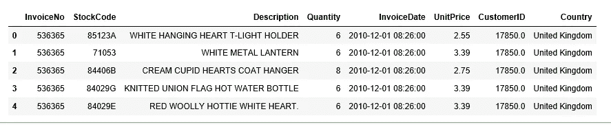

**探索数据—验证和新变量**

1.  重要列中缺少值；
2.  每个国家的客户分布情况；
3.  单价和数量应该> 0；
4.  发票日期应为< today.

```
df1.Country.nunique()
```

***38***

共有 38 个独特的国家，如下所示:

```
df1.Country.unique()
```

***数组(['英国'、'法国'、'澳大利亚'、'荷兰'、'德国'、
、'挪威'、'爱尔兰'、'瑞士'、'西班牙'、'波兰'、'葡萄牙'、
、'意大利'、'比利时'、'立陶宛'、'日本'、'冰岛'、【T28 '、'海峡群岛'、'丹麦'、'塞浦路斯'、'瑞典'、'奥地利'、【T29 '、'以色列'、'芬兰'、'巴林'、'希腊'、'香港'、'新加坡'、
、'黎巴嫩'、'阿拉伯联合酋长国'、'沙特阿拉伯'、'捷克'、
、'加拿大'、'未指明***

```
customer_country=df1[['Country','CustomerID']].drop_duplicates()customer_country.groupby(['Country'])['CustomerID'].aggregate('count').reset_index().sort_values('CustomerID', ascending=False)
```

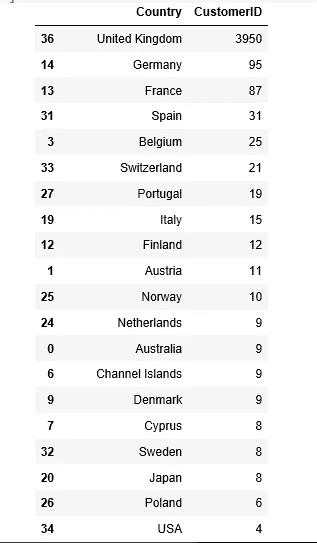

数据中 90%以上的客户来自英国。一些研究表明，客户群因地理位置而异，因此这里我将数据仅限于英国。

```
df1 = df1.loc[df1['Country'] == 'United Kingdom']
```

检查每列中是否有缺失值。

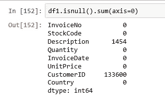

CustomerID 列中缺少 133，600 个值，因为我们的分析是基于客户的，所以我们将删除这些缺少的值。

```
df1 = df1[pd.notnull(df1['CustomerID'])]
```

检查单价和数量列中的最小值。

```
df1 = df1[pd.notnull(df1['CustomerID'])]
```

***0.0***

```
df1.Quantity.min()
```

***-80995***

删除数量列中的负值。

```
df1 = df1[(df1['Quantity']>0)]
df1.shape
df1.info()
```

***(354345，8)***

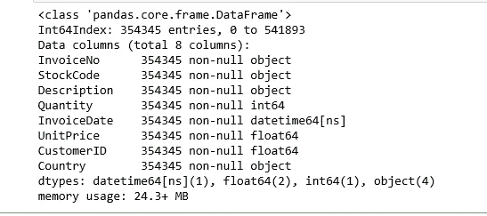

清理完数据后，我们现在处理 354，345 行和 8 列。

检查每列的唯一值。

```
def unique_counts(df1):
   for i in df1.columns:
       count = df1[i].nunique()
       print(i, ": ", count)
unique_counts(df1)
```

***发票号:16649
库存代码:3645
描述:3844
数量:294
发票日期:15615
单价:403
客户 ID : 3921
国家:1***

为总价添加一列。

```
df1['TotalPrice'] = df1['Quantity'] * df1['UnitPrice']
```

找出数据中的第一个和最后一个订单日期。

```
df1['InvoiceDate'].min()
```

***时间戳(' 2010–12–01 08:26:00))***

```
df1['InvoiceDate'].max()
```

***时间戳(' 2011–12–09 12:49:00 ')***

由于最近是针对某个时间点计算的，并且最后一个发票日期是 2011 年 12 月 9 日，因此我们将使用 2011 年 12 月 10 日来计算最近。

```
import datetime as dt
NOW = dt.datetime(2011,12,10)df1['InvoiceDate'] = pd.to_datetime(df1['InvoiceDate'])
```

# RFM 客户细分

RFM 分割就是从这里开始的。

**创建一个 RFM 表**

```
rfmTable = df1.groupby('CustomerID').agg({'InvoiceDate': lambda x: (NOW - x.max()).days, 'InvoiceNo': lambda x: len(x), 'TotalPrice': lambda x: x.sum()})rfmTable['InvoiceDate'] = rfmTable['InvoiceDate'].astype(int)
rfmTable.rename(columns={'InvoiceDate': 'recency', 
                         'InvoiceNo': 'frequency', 
                         'TotalPrice': 'monetary_value'}, inplace=True)
```

**计算每个客户的 RFM 指标**

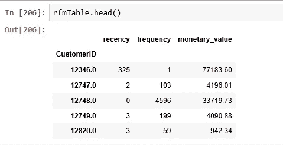

解释:

*   CustomerID 12346 的频率为 1，货币价值为 77，183.60 美元，最近时间为 325 天。
*   CustomerID 12747 的频率为 103，货币值为 4，196.01 美元，最近时间为 2 天

让我们检查一下第一个顾客的详细情况。

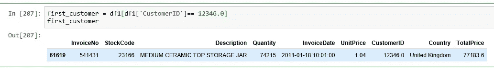

第一位顾客只购物过一次，购买了一件数量巨大的产品(74，215 件)。单价很低；也许清仓大甩卖。

**拆分指标**

将指标分割成多个部分的最简单方法是使用四分位数。

1.  这给了我们详细分析的起点。
2.  4 段易于理解和解释。

```
quantiles = rfmTable.quantile(q=[0.25,0.5,0.75])
quantiles = quantiles.to_dict()
```

**创建分段 RFM 表**

```
segmented_rfm = rfmTable
```

最低的最近，最高的频率和金额是我们最好的客户。

```
def RScore(x,p,d):
    if x <= d[p][0.25]:
        return 1
    elif x <= d[p][0.50]:
        return 2
    elif x <= d[p][0.75]: 
        return 3
    else:
        return 4

def FMScore(x,p,d):
    if x <= d[p][0.25]:
        return 4
    elif x <= d[p][0.50]:
        return 3
    elif x <= d[p][0.75]: 
        return 2
    else:
        return 1
```

**向新创建的分段 RFM 表添加分段编号**

```
segmented_rfm['r_quartile'] = segmented_rfm['recency'].apply(RScore, args=('recency',quantiles,))
segmented_rfm['f_quartile'] = segmented_rfm['frequency'].apply(FMScore, args=('frequency',quantiles,))
segmented_rfm['m_quartile'] = segmented_rfm['monetary_value'].apply(FMScore, args=('monetary_value',quantiles,))segmented_rfm.head()
```

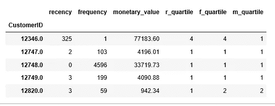

RFM 细分市场将客户群分割成一个难以想象的 3D 立方体。不过，我们可以整理一下。

**添加一个新列来合并 RFM 得分:111 是我们之前确定的最高分。**

```
segmented_rfm['RFMScore'] = segmented_rfm.r_quartile.map(str) 
                            + segmented_rfm.f_quartile.map(str) 
                            + segmented_rfm.m_quartile.map(str)
segmented_rfm.head()
```

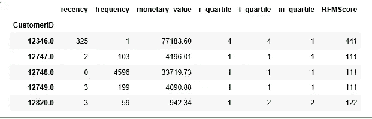

很明显，第一个客户根本不是我们的最佳客户。

**谁是我们的前 10 大最佳客户**！

```
segmented_rfm[segmented_rfm['RFMScore']=='111'].sort_values('monetary_value', ascending=False).head(10)
```


# 了解更多信息

有兴趣了解更多信息吗？

1.  [Kimberly Coffey](http://www.kimberlycoffey.com/blog/2016/8/k-means-clustering-for-customer-segmentation) 有一个[优秀的教程](http://www.kimberlycoffey.com/blog/2016/8/k-means-clustering-for-customer-segmentation)关于同一个数据集使用 r。
2.  丹尼尔·麦卡锡和爱德华·沃兹沃斯的 R 包— [买直到你死—一个演练](https://cran.r-project.org/web/packages/BTYD/vignettes/BTYD-walkthrough.pdf)。
3.  [来自 yhat 博客](http://blog.yhat.com/posts/customer-segmentation-using-python.html)的葡萄酒销售商的客户细分。

创建这个帖子的源代码可以在[这里](https://github.com/susanli2016/Machine-Learning-with-Python/blob/master/Customer_Segmentation_Online_Retail.ipynb)找到。我将很高兴收到关于上述任何反馈或问题。

参考:[爆炸分析和营销](http://www.blastam.com/blog/rfm-analysis-boosts-sales)