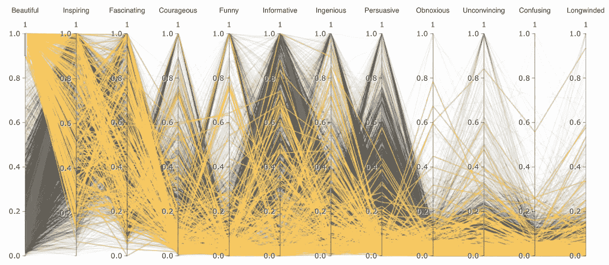
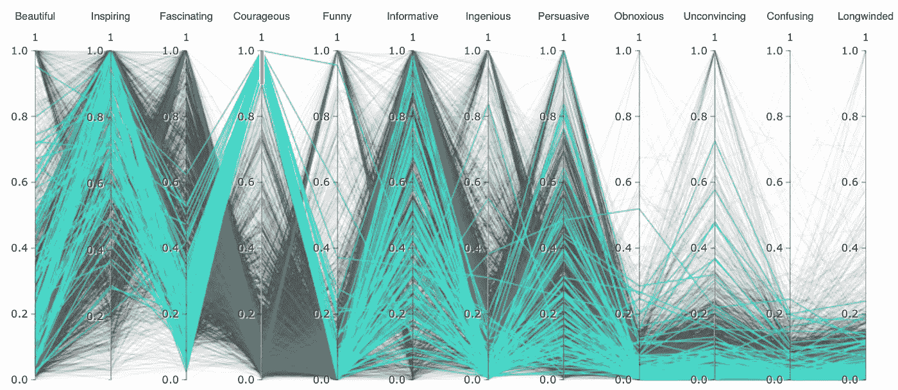
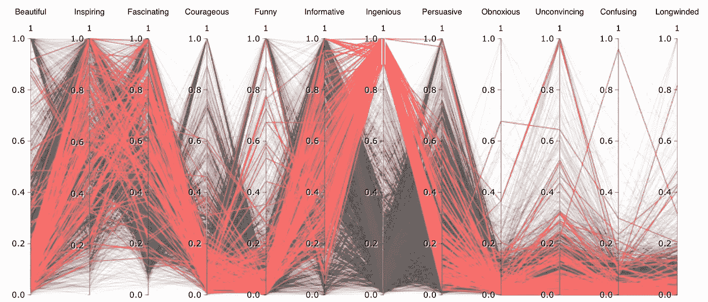
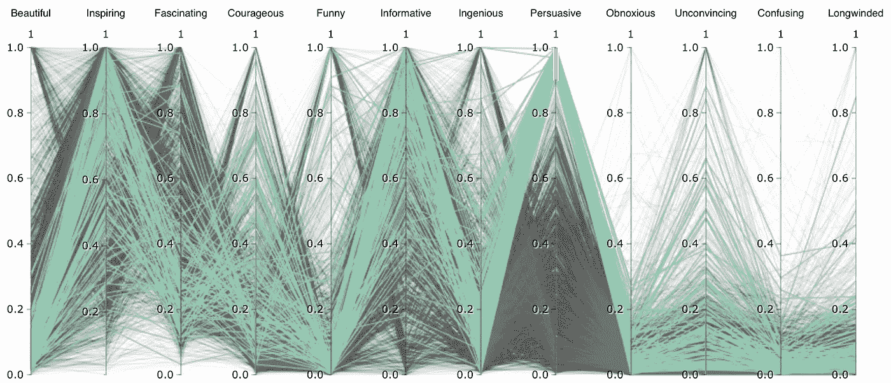
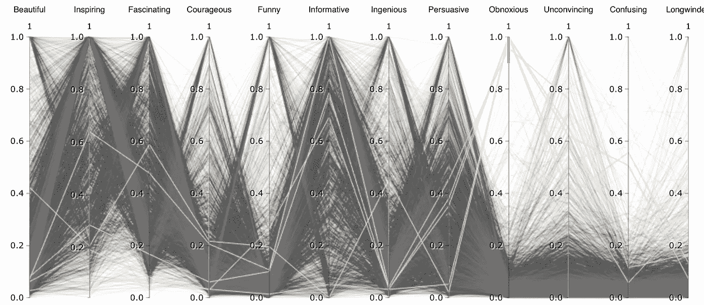

# 寻找 TED 演讲的特点

> 原文：<https://towardsdatascience.com/finding-characteristics-of-ted-talks-911879560146?source=collection_archive---------3----------------------->

今天我想了解一下 TED 演讲的特征分布——它们被用户评价为优美、巧妙还是啰嗦？

为了做到这一点，我用 TED 点击了最新的[数据集](https://www.kaggle.com/rounakbanik/ted-talks),其中包括从年初到今年迄今的所有有评级的谈话，将 json 列解析为包含 14 个正面和负面特征的数据框架，从有说服力到有创意到令人讨厌到令人瞠目结舌，然后根据谈话的最大值对这些特征进行归一化(否则观看最多的人也会因为观众基数较大而显得最冗长)，并将它们绘制在平行坐标上，以获得它们分布的概览。

[平行坐标](http://datavizproject.com/data-type/parallel-coordinates/)乍看之下可能不是最容易理解的视图，但它有一个优点，可以清晰地布局多元数据集的分布。这里每条线代表一个谈话，它们与多轴的交点代表不同的特征。

在根据最大属性对每个演讲进行标准化后，我通过关注这些属性在 0.95 到 1 范围内的人，放大到最美丽、勇敢、率真、有说服力和令人讨厌的演讲。

最美丽的谈话很少不鼓舞人心或引人入胜。

最有勇气的谈话往往鼓舞人心，但不那么引人入胜。

最巧妙的谈话往往是鼓舞人心的，引人入胜的，信息丰富的。其中有一个被评为不可信，这是一个 beatjazz 表演。

最有说服力的演讲通常也被认为是信息丰富和鼓舞人心的。

也有一些令人讨厌的，包括一个音乐家的呼吸和音乐表演(可能太前卫了)。

这是我关于数据科学和视觉故事的[# 100 日项目](https://medium.com/@yanhann10)的第 61 天。我的 [github](https://github.com/yanhann10/opendata_viz) 上的全部代码。感谢阅读。如果你喜欢，请分享。欢迎新主题的建议和反馈。