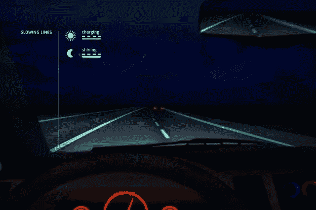
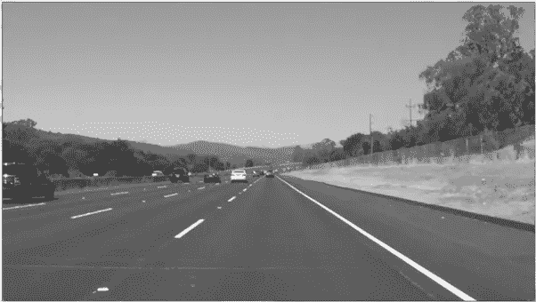
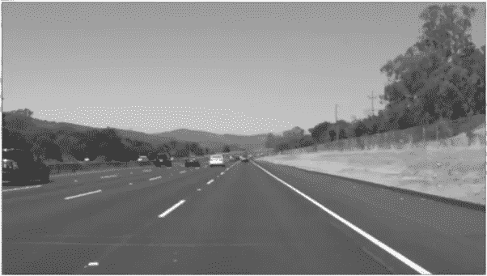
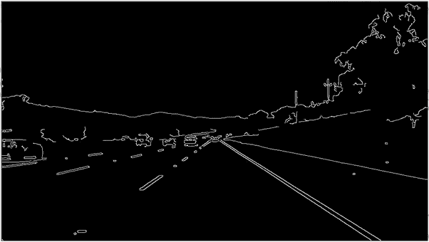
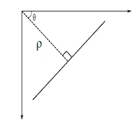
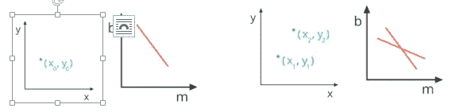
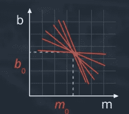
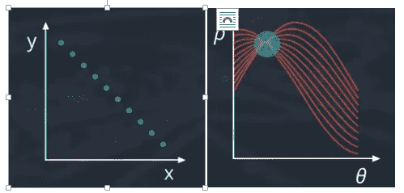
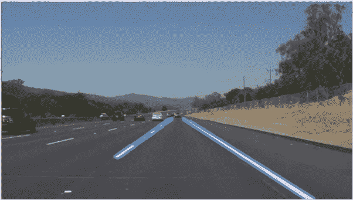

# 用 OpenCV 实时查找车道线

> 原文：<https://towardsdatascience.com/finding-driving-lane-line-live-with-opencv-f17c266f15db?source=collection_archive---------2----------------------->



你好，在这个项目中，我将尝试从仪表板摄像头视频饲料找到车道线。一旦我们检测到车道线，我们将在原始视频帧上标记它们并回放。所有这些都将使用 OpenCV 函数在线完成，没有任何延迟。

我们的方法是开发一系列功能来检测车道线。在编写这个函数时，我们将使用一个“样本”图像，一旦我们能够成功地检测到几个“样本”图像上的车道线，我们将把完整的程序合并到一个函数中，该函数可以接受实时馈送图像并返回相同的图像帧，其中车道线高亮显示。所以没有太多的延迟，让我们开始吧。


Sample Image

首先，我们输入样本图像帧。这一行将在最终代码中进行注释，其中“图像”将是由视频捕获发送的帧。

```
image = cv2.imread('test_images/whiteCarLaneSwitch.jpg')
```



Greyed Image

为了减轻我们处理器的负担(这在嵌入式系统中是非常稀缺的资源)，我们将以图像的“灰度”版本而不是原始的彩色版本来进行所有的图像处理。这有助于用更少的资源更快地执行我们的程序。以下函数将彩色图像转换为灰度图像

```
grey_image = cv2.cvtColor(image, cv2.COLOR_BGR2GRAY)
```



Image Blurring (Image Smoothing)

接下来，我们将通过模糊图像来去除噪声。图像模糊是通过将图像与低通滤波器核进行卷积来实现的。这对于消除噪音很有用。它实际上删除了图像中的高频内容(例如:噪声、边缘)。所以在这个操作中边缘有点模糊。OpenCV 提供了 4 种不同类型的模糊技术，高斯模糊是最流行的一种。

我们可以选择不同的内核大小，其中结果滤波器将简单地取内核(内核大小的行×列矩阵)区域下所有像素的平均值，并用平均值替换中心元素。同样，5 是一个相当标准的值，并且对我有效。

```
kernel_size = 5blur_gray = cv2.GaussianBlur(grey_image,(kernel_size, kernel_size),0)
```



Canny Edge Detection

Canny 边缘检测是一种流行的边缘检测算法。事实上，Canny edge function 还实现了我们在前面步骤中使用的 5x5 核高斯滤波器，但在我接触的许多文献中，它总是建议在 Canny 边缘检测之前实现自己的模糊。边缘检测背后的基本理论是，只要有边缘，边缘两侧的像素在它们的强度之间就有很大的差异(也称为梯度)。首先，在水平和垂直方向上扫描输入图像，以找到每个像素的梯度。在获得梯度大小和方向后，对图像进行全扫描，以去除可能不构成边缘的任何不想要的像素。为此，在每个像素处，检查像素是否是其邻域中的局部最大值。

low_threshold 和 high_threshold 决定检测到的边沿强度。如果梯度高于“high_threshold”，则梯度被视为边缘的一部分。但是一旦检测到边缘，即使下一个像素大于“low_threshold ”,它也会包含在边缘中。

```
low_threshold = 50high_threshold = 150edges = cv2.Canny(blur_gray, low_threshold, high_threshold)
```

参考我们的示例图像，很明显，在边缘条件下，尤其是车道线所在的位置，相邻像素之间存在巨大的对比度差异，车道线为白色，相邻道路像素为黑色。


Region of Interest

需要考虑的一点是，我们不想找到图像中的所有边缘。我们只是对找到图像中心区域周围的车道感兴趣。直观上，这是有意义的，因为图像的右上/左上部分的边缘极不可能是车道。查看样本图像，我们可以有把握地说，车道线应该在梯形区域内，图像底部的边缘较宽，图像顶部的边缘越来越窄。

以下四条线标记了我们的边缘检测图像中的感兴趣区域。首先，我们找出图像的大小，其次我们创建梯形的四个角(这一步，和许多其他步骤一样，是一个迭代过程，其中我们需要尝试不同的值来找出最佳情况)。第三，我们用上面的顶点创建梯形，最后我们做一个逐位运算，这样只有在感兴趣的区域内并且被分类为边缘的像素被标记为 1。

```
imshape = image.shapevertices = np.array([[(0,imshape[0]),(450, 320), (500, 320), (imshape[1],imshape[0])]], dtype=np.int32)cv2.fillPoly(mask, vertices, ignore_mask_color)masked_edges = cv2.bitwise_and(edges, mask)
```

接下来，我们执行霍夫线变换，以便从上述边缘检测图像中检测一条线。请记住，边也可以是圆形边，但我们在应用中感兴趣的边是车道的直线边。



Hough Line Transform

简而言之，霍夫变换法将一条直线从其传统的 y = mx + b 形式变换为ρ= x * cos(θ)+y * sin(θ)其中ρ是从原点到该直线的垂直距离，θ是该垂直线与水平轴形成的角度。



我们知道一条线(y = mx + b)在 m vs b 图中表示时只是一个点，x，y 框架中的一个点在 m vs b 框架中表示为一条线。



所以我们在图像空间中寻找直线的策略是在霍夫空间中寻找相交的直线。为此，我们将霍夫空间划分为一个网格，并将相交线定义为通过给定网格单元的所有线。在霍夫空间中许多直线相交的地方，我们宣布我们已经找到了描述图像空间中一条直线的点的集合。

我们有一个问题，垂直线在 m 对 b 的表示中有无限的斜率，这就是ρ对θ参数化的需要。



现在图像空间中的每个点对应于霍夫空间中的正弦曲线(rho vs theta)。如果我们取一整行点，它就转化成霍夫空间中的一整串正弦曲线。您可以将霍夫空间中的正弦曲线视为相当于 m vs b 空间中的一条线，它表示图像空间中的一个点。同样，霍夫空间中这些正弦曲线的交点给出了直线的表示。回到我们的代码，我们首先定义霍夫变换的参数，然后调用函数本身。

```
rho = 2 # distance resolution in pixels of the Hough gridtheta = np.pi/180 # angular resolution in radians of the Hough gridthreshold = 15     # minimum number of votes (intersections in Hough grid cell)min_line_length = 40 #minimum number of pixels making up a linemax_line_gap = 30    # maximum gap in pixels between connectable line segmentsline_image = np.copy(image)*0 # creating a blank to draw lines on
```

输出“线”是包含检测到的线段的端点的数组。

```
lines = cv2.HoughLinesP(masked_edges, rho, theta, threshold, np.array([]),min_line_length, max_line_gap)
```

迭代输出“线”并在空白图像上画线。

```
for line in lines:
        for x1,y1,x2,y2 in line:
            cv2.line(line_image,(x1,y1),(x2,y2),(255,0,0),10)
```

在原图上画线，还回来。

```
lines_edges = cv2.addWeighted(image, 0.8, line_image, 1, 0)return lines_edges
```



Lane Lines on a single frame

在样本图像上成功检测车道线之后，我们将视频作为输入，检测车道线并回放视频。请注意，这里我处理的是以前录制的视频，但这可以很容易地应用到使用相同 cv2 的现场视频。视频捕捉功能。

首先，我们使用 cv2 创建一个视频对象。视频捕获命令。当‘video _ capture’运行时，我们读取它。Read()函数将返回两个变量，其中第一个变量是布尔值，分别用 true 或 false 值指示读取操作的成功或失败，第二个对象是捕获的帧本身。因此，每当“ret”为真时，我们就获取帧，并简单地将其传递给我们刚刚在上面构建的 processImage 函数。从 processImage 接收的输出显示在捕获帧顶部的车道标记上。

```
video_capture = cv2.VideoCapture('test_videos/solidWhiteRight.mp4')while (video_capture.isOpened()):
    ret, frame = video_capture.read()
    if ret:
        output = processImage(frame)
        cv2.imshow('frame',output)
        if cv2.waitKey(1) & 0xFF == ord('q'):
            break
    else:
        break# Release everything if job is finished
video_capture.release()
cv2.destroyAllWindows()
```

仅此而已。希望这篇文章写得足够好，让你愉快地阅读，并希望学到一两件事。显然，在上述程序中可以实现更多的改进，例如，检查检测线的斜率，以检查检测线是否实际上与车道线一致，并移除异常值。等等。欢迎提出任何改进建议，也欢迎提出有助于我成长的建议。完整的代码与样本图像和视频可以找到[这里](https://github.com/PercyJaiswal/Find_Lane_Line_Live_OpenCV)

如果你喜欢这篇文章，在 Twitter 或 Claps 上关注、转发它，在我继续我的博客世界之旅时，Medium 上的赞会鼓励我写新文章。

直到下一次…干杯！！