# 找到好的学习率和一个周期的政策。

> 原文：<https://towardsdatascience.com/finding-good-learning-rate-and-the-one-cycle-policy-7159fe1db5d6?source=collection_archive---------1----------------------->

# **简介**

学习速率可能是深度学习中最重要的超参数，因为学习速率决定了要反向传播多少梯度。这反过来决定了我们向极小值移动了多少。小的学习率使模型收敛缓慢，而大的学习率使模型发散。所以，学习率需要刚刚好。

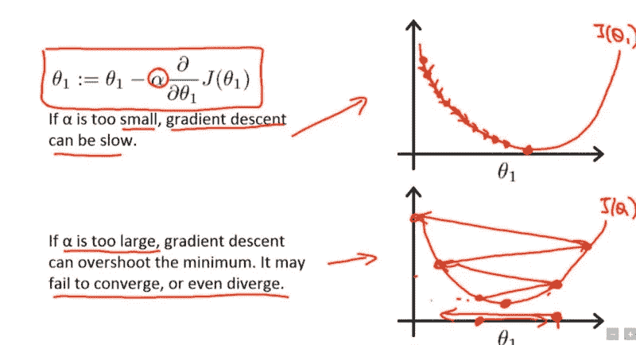

Gradient descent with small(top) and large (bottom) learning rates. Source: [Andrew Ng’s Machine Learning course](https://www.coursera.org/learn/machine-learning/home/welcome)

找到并设定正确的学习速度更多的是尝试和错误。最简单的方法是尝试不同的学习速率，选择一个损失值最小的速率，而不牺牲学习速度。(验证损失对于欠拟合/过拟合也很重要)。

本文对描述不同超参数设置方法的两篇论文进行了简要总结。这篇文章假设读者知道反向传播，梯度下降和超参数。

# 有没有更好的办法？

在经历 [**程序员实用深度学习第 1 部分**](http://course.fast.ai/) mooc 时，提到了 Leslie N. Smith 的论文 [**用于训练神经网络的循环学习率**](https://arxiv.org/pdf/1506.01186.pdf) 。

该论文提到了几个时期的范围测试运行，以找出良好的学习率，其中我们从一些低学习率开始训练，并在每个小批量之后增加学习率，直到损失值开始爆炸。

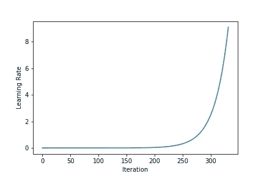

Learning Rate Increase After Every Mini-Batch

想法是从小学习率(如 1e-4、1e-3)开始，并在每次小批量后增加学习率，直到损失开始激增。一旦损失开始爆发，停止范围测试运行。绘制学习率对损失图。选择比损失最小的学习率低一个等级的学习率(如果损失很低，为 0.1，则开始的好值为 0.01)。这是损失仍在减少的值。论文建议这是模型良好学习率值。

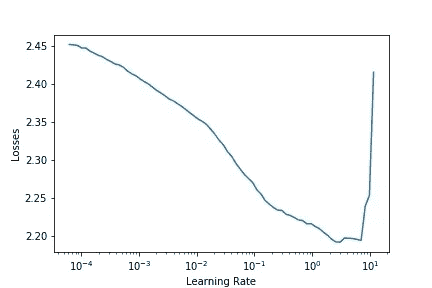

Test run on CIFAR-10 with batch size 512, resnet 56 , momentum=0.9 and weight decay=1e-4\. The learning rate ~10⁰ i.e. somewhere around 1 can be used.

这就是我们在每次小批量后更新学习率的方式:

> n =迭代次数
> max_lr =要使用的最大学习率。通常我们使用更高的值
> ,比如 10，100。请注意，在范围测试期间，我们可能达不到这个 lr 值。
> init_lr =较低的学习率。我们将从这个值开始范围测试。我们使用非常小的值，如 1e-3，1e-4。
> 设 q 为我们在每次小批量后增加学习率的系数。
> 下图显示了计算第 I 个小批量后学习率的公式。

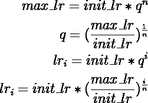

一旦我们找到最佳学习率，我们就用它来训练模型。范围测试是非常有用的工具，因为它提供了一种用少量历元运行找到良好学习率的方法。

# **循环学习率:**

该论文进一步建议在完整运行期间在下限和上限之间循环学习速率。传统上，随着学习开始随时间收敛，学习速率降低。那么循环学习率背后的动机是什么呢？

直观上，将学习速率向更高的学习速率振荡是有帮助的。因为较高的学习率可能有助于摆脱鞍点。如果鞍点是复杂的平台，较低的学习率可能无法从鞍点获得梯度。

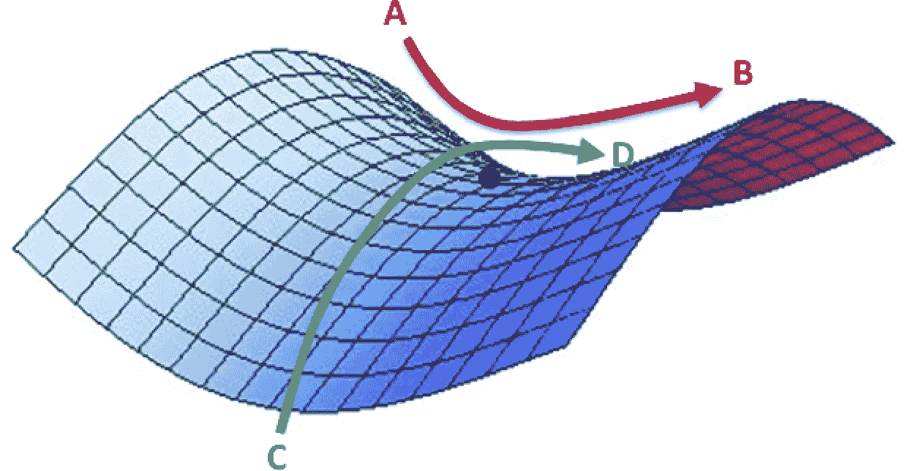

*A saddle point in the error surface (Img Credit:* [*safaribooksonline*](https://www.safaribooksonline.com/library/view/fundamentals-of-deep/9781491925607/ch04.html)*)*

周期是我们从下限学习率到上限再回到下限的迭代次数。周期在时期上可能没有边界，但是在实践中它通常有。步长是周期的一半。所以步长是我们希望学习率从一个界限到另一个界限的迭代次数。

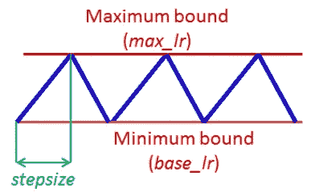

*Cyclic Learning Rate(Image:* [*https://arxiv.org/pdf/1506.01186.pdf*](https://arxiv.org/pdf/1506.01186.pdf)*)*

# 单周期政策

在论文“[神经网络超参数的训练方法:第 1 部分—学习速率、批量、动量和权重衰减](https://arxiv.org/abs/1803.09820)”中，Leslie Smith 描述了设置超参数(即学习速率、动量和权重衰减)和批量的方法。特别是，他建议应用学习率的一个周期政策。

作者建议做一个周期的学习率 2 步等长。我们使用范围测试来选择最大学习速率。我们使用较低的学习速率作为最大学习速率的 1/5 或 1/10。在步骤 1 中，我们从较低的学习率到较高的学习率，然后在步骤 2 中回到较低的学习率。我们选择这个周期长度略小于要训练的总时期数。在最后剩余的迭代中，我们将学习率消除到低于较低的学习率值(1/10 或 1/100)。

这背后的动机是，在学习过程中，当学习率较高时，学习率作为正则化方法工作，并防止网络过度拟合。这有助于网络避开陡峭的损耗区域，更好地获得平坦的最小值。

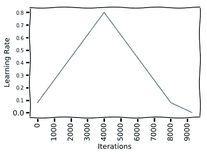

CIFAR -10: One Cycle for learning rate = 0.08–0.8 , batch size 512, weight decay = 1e-4 , resnet-56

如图所示，我们从 0.08 的学习率开始，进行 41 个时期的步骤，以达到 0.8 的学习率，然后再进行 41 个时期的步骤，回到 0.08 的学习率。然后我们再做 13 个纪元，以达到学习率下限的 1/10(0.08)。

使用 CLR 0.08–0.8、批次大小 512、momentum 0.9 和 Resnet-56，我们在 CIFAR-10 上的 95 个历元中获得了大约 91.30%的准确度。

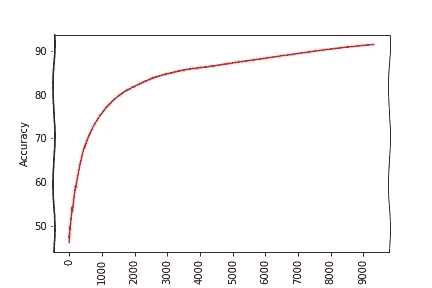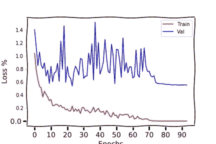

# 循环动量

动量和学习率密切相关。在 SGD 的权重更新方程中可以看出，动量对权重更新的影响与学习速率相似。

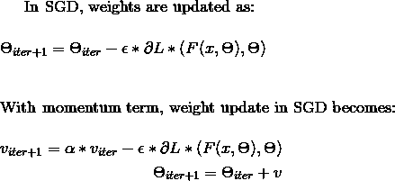

作者在他们的实验中发现，当学习速率增加时，减小动量会给出更好的结果。这支持了直觉，即在训练的那一部分，我们希望 SGD 快速进入新的方向以找到更好的最小值，因此新的梯度需要被赋予更多的权重。

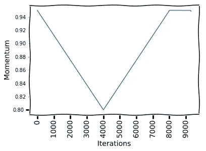

实际上，我们选择 2 个动量值。在一个循环中，我们做动量的两步循环，在第一步中，我们从上限到下限减少动量，在第二步中，我们从下限到上限增加动量。根据该论文，这种循环动量给出了相同最终结果，但这节省了用不同动量值运行多个完整循环时间和精力。

用一个周期政策和周期动量，我可以复制论文中提到的结果。其中，该模型在 9310 次迭代中实现了 91.54%的准确性，而使用一个周期，学习率为 0.08-0.8，动量为 0.95-0.80，使用 resnet-56，批量为 512，而没有 CLR，则需要大约 64k 次迭代才能实现这一准确性。(论文达到了 92.0±0.2 的准确率)。

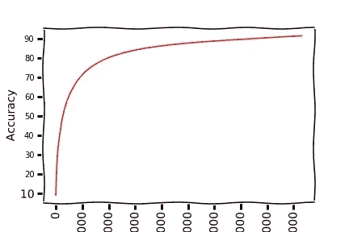

Accuracy vs Iterations

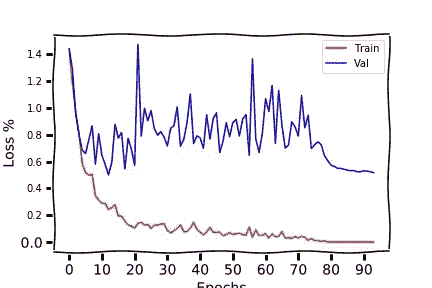

Training and Validation loss vs epochs

这允许我们以更高的学习速率训练模型。在学习率为 0.3–3 的情况下，我们可以通过训练 resnet-56 仅 50 个时期来获得 85.97%的训练准确率。

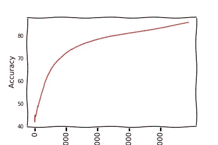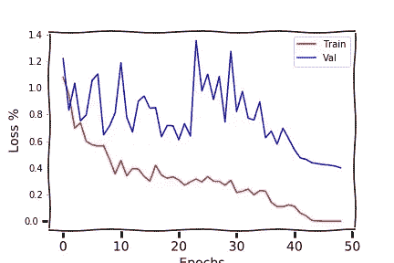

# 重量衰减值也很重要。

重量衰减也是一个重要的超参数。重量衰减也作为正则化因子。但是它与学习速度或动量有很大不同，因为作者发现最佳值应该在整个训练过程中保持不变。

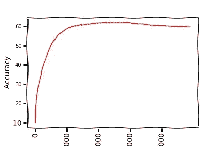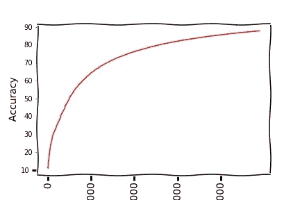

Resnet 56 Accuracy after 50 epoch on CIFAR-10 with weight decay = 1e-3(left) vs 1e-5(right)

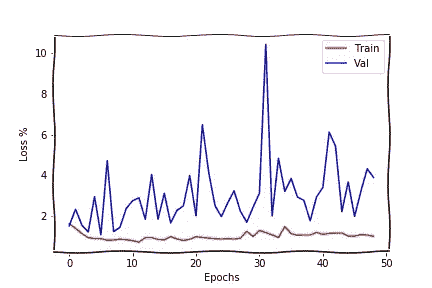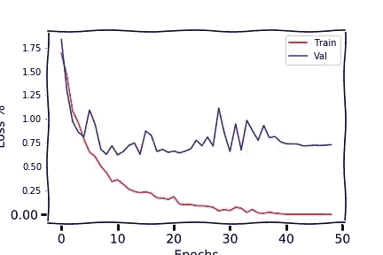

Resnet 56 training and validation losses after 50 epoch on CIFAR-10 with weight decay = 1e-3(left) vs 1e-5(right)

从上面可以看出，图 1e-3 是非常差的重量衰减值，因为在 50 个时期后，精确度勉强达到 60%，而重量衰减 1e-4 和 1e-5 的精确度分别为 85.97%和 87.78%。(CLR 范围为 0.3–3，动量范围为 0.95–0.8，批量为 512)

作者建议，用不同权重衰减值的 CLR 和循环动量进行组合运行，以同时确定学习率、动量范围和权重衰减。如果不知道什么是正确的重量衰减值，该论文建议首先使用 1e-3、1e-4、1e-5 和 0 这样的值。另一方面，如果我们知道，比如说 1e-4 是正确的值，本文建议尝试三个平分指数的值(3e-4、1e-4 和 3e-5)。

# 总批量

该论文建议将可装入存储器的最大批量值用作批量。

# 结论

范围测试方法提供了一种定义的方法，通过少量的运行迭代来找出一个好的学习率值。一个循环和循环动量似乎允许模型以更高的学习速率被训练并且收敛得更快。单周期政策提供了某种形式的规范化。因此，其他形式的监管也需要相应调整。

上面提到的实验很少能在笔记本[这里](https://github.com/nachiket273/One_Cycle_Policy)找到。

# 参考资料:

1.  [训练神经网络的循环学习率](https://arxiv.org/pdf/1506.01186.pdf)
2.  [神经网络超参数的训练方法:第 1 部分——学习速率、批量、动量和权重衰减](https://arxiv.org/abs/1803.09820)
3.  [吴恩达的 Coursera 课程](https://www.coursera.org/learn/machine-learning/home/welcome)
4.  [法斯泰图书馆](https://github.com/fastai)
5.  [程序员实用深度学习，第 1 部分](http://course.fast.ai/)
6.  [https://sgu gger . github . io/how-do-you-find-a-good-learning-rate . html](https://sgugger.github.io/how-do-you-find-a-good-learning-rate.html#how-do-you-find-a-good-learning-rate)
7.  [http://teleported.in/posts/cyclic-learning-rate/](http://teleported.in/posts/cyclic-learning-rate/)
8.  [https://sgugger.github.io/the-1cycle-policy.html](https://sgugger.github.io/the-1cycle-policy.html)

*如果你喜欢这篇文章，请一定给我一个掌声，并关注我以获取我未来文章的更新。*

*还有，随时在*[*LinkedIn*](https://www.linkedin.com/in/nachikettanksale/)*上联系我或者在*[*Twitter*](https://twitter.com/nachiket273)*上关注我。*

如果你喜欢我的作品，请考虑赞助我，它会帮助我推出更多这样的作品。