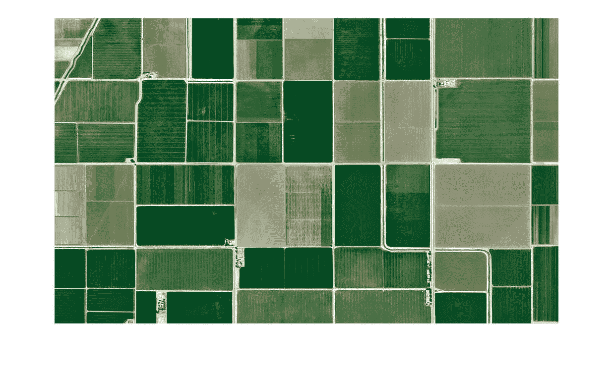
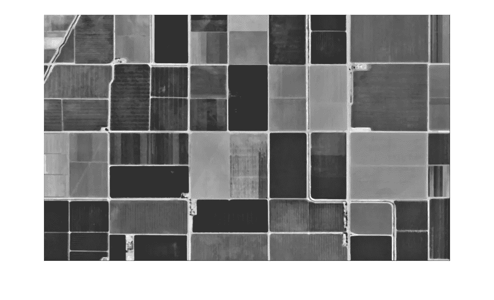
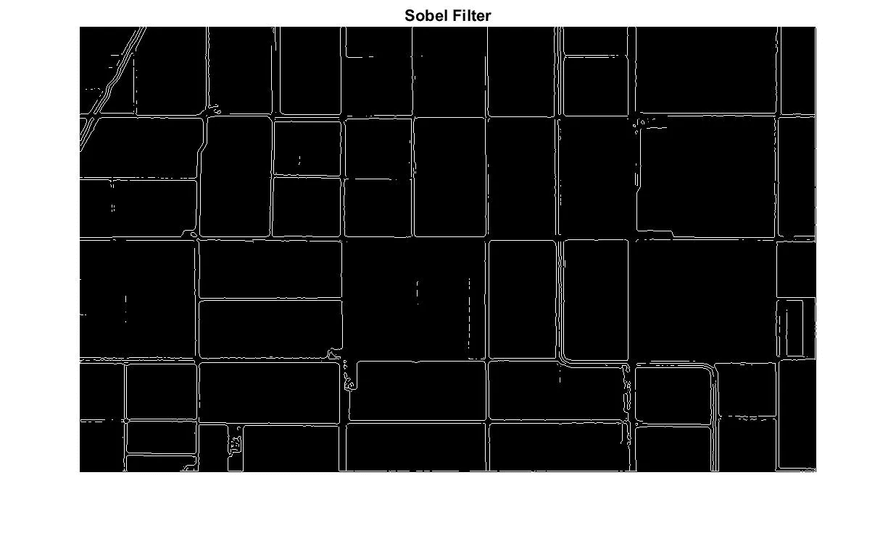
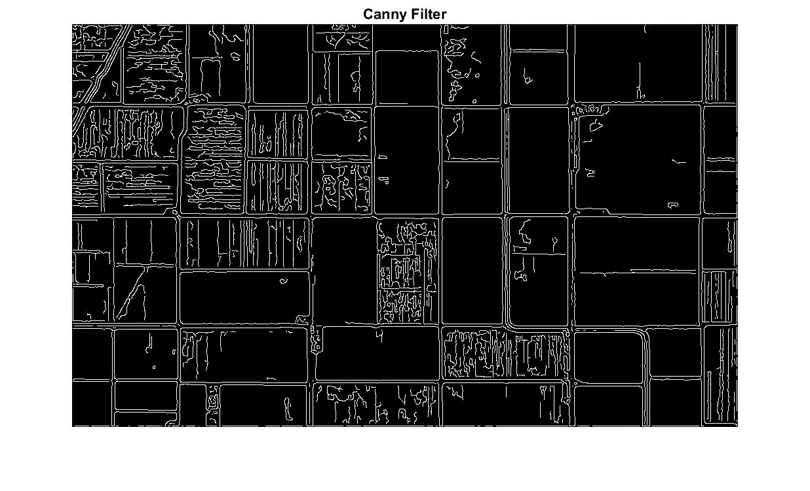
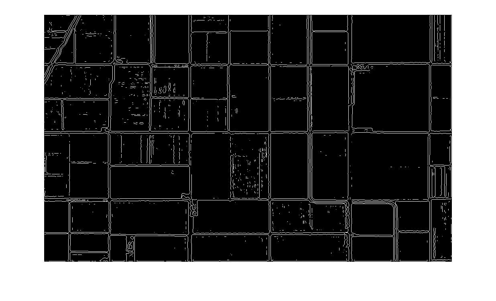
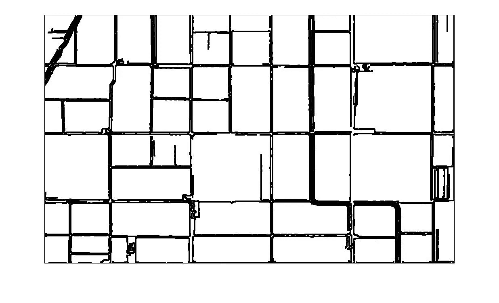
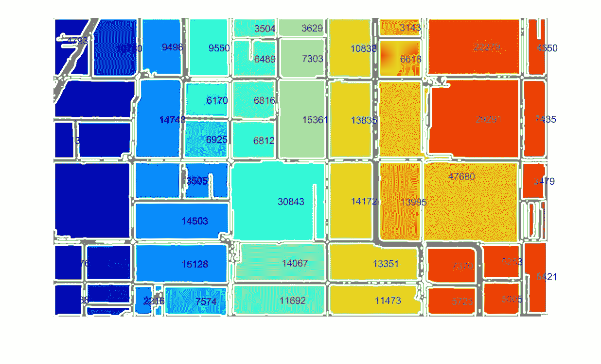
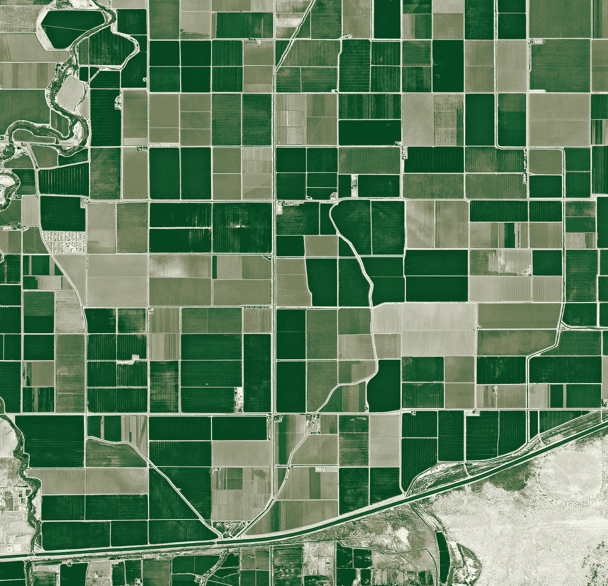

# 利用边缘检测寻找农田土地面积

> 原文：<https://towardsdatascience.com/finding-land-area-of-farm-plots-using-edge-detection-5b070cc05c5a?source=collection_archive---------14----------------------->

## 为农业目的使用现代技术

我不会特意让我的项目与农业相关。然而，我继续发现图像处理和机器人技术在农田中的应用。也许是许多农场地块的几何一致性，或者是工程和学术界推进这个乡村话题的更大愿望。

在最近的一次假日聚会上，我与一位经济学家进行了交谈，他需要获得不同农场地块大小的数据。对于美国的很多农场来说，这个数据是存在的。然而，获取这些数据通常需要付出高昂的代价。此外，许多外国和发展中国家没有现成的地块面积数据。这个数据很有意思。

幸运的是，有大量卫星图像形式的公开农场数据。把你的视野放在美国中西部的任何一个地区，你一定会发现一片片的农田。这就产生了将图像处理算法应用于农田以确定单个农场所占面积的想法。

A set of farms used to test the algorithm

我选择追求的概念包括使用导数滤波器。这是有意义的，因为它似乎与人类区分土地或形状的方式相匹配。当我们扫描一个物体时，我们使用对比和阴影来确定物体的形状、用途和身份。类似地，导数滤波器可以用于寻找对比区域。如果像素值与其周围像素值之间的差值大于阈值，则用 1 标记，否则用 0 标记。这将创建一个二进制图像，并选择原始图像的边缘。

在此之前，建议对图像应用模糊滤镜。原始图像中有大量的噪声和细节会降低算法的成功率。这可以用任何模糊过滤器来完成，并且鼓励用户实现这种算法实验。由于我主要对去除噪声和微小的细节感兴趣，同时出于对比目的保留了图的颜色，所以我使用了 4x4 中值滤波器。一个标准的高斯滤波器也可以。模糊滤波器之后是灰度图像，以便应用边缘检测。

Blurred and gray scaled farms

实验了三种边缘检测方法来寻找最佳结果。我将简要描述每一种方法及其结果，但是我鼓励好奇的读者自己研究每一种方法以获得更彻底的理解。

第一个被测试的边缘检测滤波器，也可能是最著名的，是 Sobel 滤波器。此滤镜对图像中的每个像素执行渐变检查。内置的 Matlab 函数执行水平和垂直方向的运算，并合并结果。

内置 Sobel 滤波器的 Matlab 返回最干净的结果。最终的图像几乎没有噪声。不幸的是，将过滤后的图像与原始图像进行比较，可以看到许多图之间的分隔线没有被很好地拾取。这一点在农场与相邻地块颜色差异不大的地区尤为明显。可能需要使用 Sobel 滤波器中的值来获得这些更加混合的区域。

测试的第二种方法是 [Canny 滤波器](https://en.wikipedia.org/wiki/Canny_edge_detector)。从左侧查看 Canny 滤波器的结果，可以立即看到 Canny 滤波器拾取了更多的边缘。缺点是也拾取了相当多的噪声。考虑到 Canny 算法采用通过幅度阈值函数的像素和通过稍低阈值函数的相邻像素的并集，这是预料之中的。Canny 算法比简单的 Sobel 滤波器更复杂。它还依赖于预先执行的高斯平滑。中值滤波器的使用可能会妨碍最佳结果。

The Laplacian of Gaussian filter returned the best results

测试的最后一个滤波器是高斯的[拉普拉斯](https://en.wikipedia.org/wiki/Marr%E2%80%93Hildreth_algorithm)滤波器。当比例是一个因素时，该滤波器非常适合边缘检测。无论我们使用什么过滤器，我们看到大多数突出的道路被捕获。来自小的农作物阴影或邻近道路的可能的房屋的噪声的标记依赖于滤波器。与道路相比，这些是不同比例的小细节。农场图像的这一特性使其成为高斯拉普拉斯滤波器的理想选择。从测试结果来看，呈现了一个相当理想的结果。找到噪音最少的最大数量的道路。

为了进一步去除图像中的噪声，使用 Matlabs 区域属性函数来去除总像素面积小于平均像素面积值的所有白色区域。当然，这个阈值还可以进一步实验，但是我们发现它在这个测试用例中工作得很好。

反转过滤后的图像，给出标绘土地的区域。然而，道路只有一个像素宽。这为应该分割的区域连接留下了很好的可能性。仅需要单个公共像素来形成两个应该被分割、组合的区域。排除这种可能性，在图像上执行维数为 4 的膨胀正方形。此外，一个像素的黑色边框被添加到整个图像，以识别将图像作为一个区域的地块。

Dilated Image

有了这张图片，寻找每块土地的面积就一目了然了。Matlab 的(或者 OpenCV 的)regionprop 函数可以用来求每个区域的面积。仍有一小块土地不是小块土地。有些是残留的道路或其他细节。为了减少这些面积，我只包括面积大于平均值减去一个标准差的区域。

然后每个区域被着色，其像素尺寸被印在它的点上。结果可以在下图中看到。打印的尺寸是该区域像素的实际数量。除非像素和图像尺寸之间存在已知的比例，否则这些值是没有用的。我知道卫星应用程序，如谷歌地图，往往有一个规模。我让感兴趣的开发人员来实现这个特性。

总的来说，我对结果很满意。该应用程序能够将大部分地块分成各自特定的区域。有一些例外，例如像素值为 47，680 的大橙色部分将两个区域混合在一起。这可以通过调整膨胀值来解决。另一个要考虑的因素是，道路的扩张确实侵蚀了农场的像素区域。为了得到农场更精确的价值，把侵蚀的结果加到农场的总面积上可能是有意义的；未来发展的另一个话题。

Result of our test farm

我想简单地评论一下所探索的另一种方法。代替使用边缘检测来寻找农场，超级像素可以是一种有效的方法。在与前面提到的经济学家探讨了这项任务之后，超级像素被测试并展示了同等的(如果不是更好的)结果。

Another farm example (top) and its result (bottom). Note, larger images need better thresholding strategies.

Github 脚本链接:

 [## TimChinenov/农用绘图仪

### 下面是一个 Matlab 脚本，它使用图像处理来确定图像中农场地块的数量并打印…

github.com](https://github.com/TimChinenov/FarmPlotter)