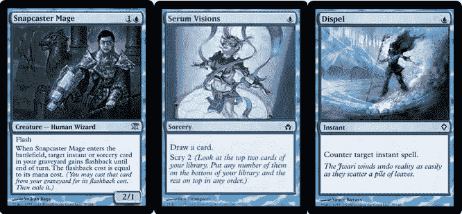
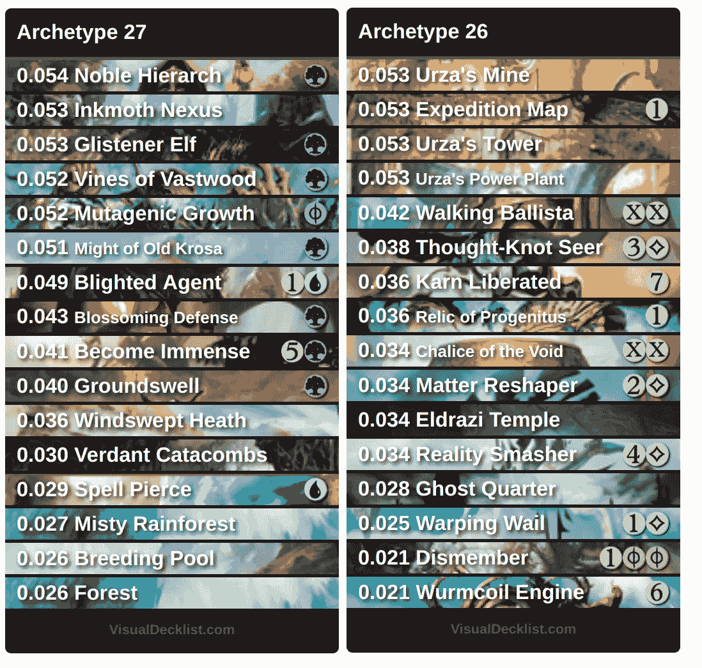
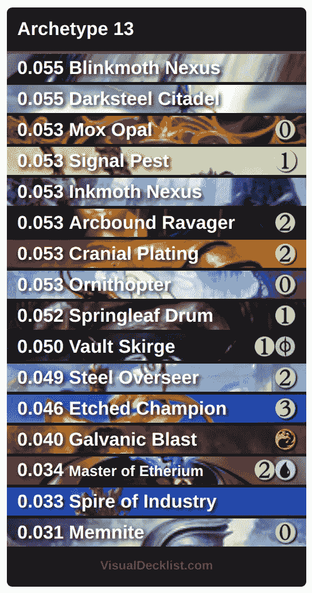
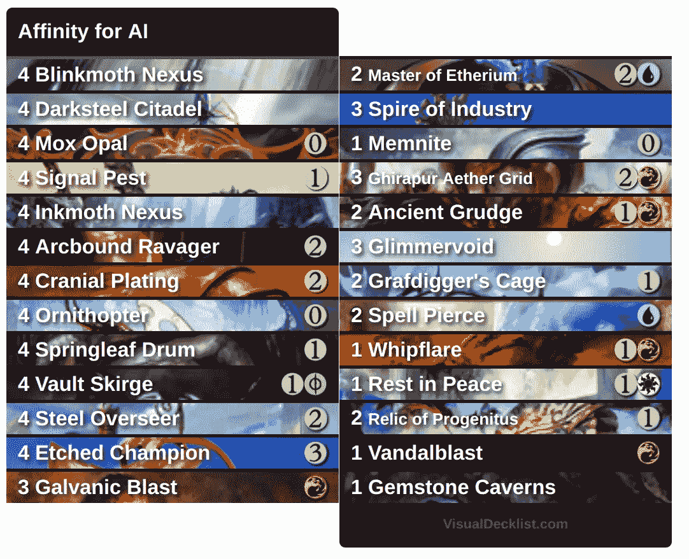

# 寻找魔法:具有潜在狄利克雷分配的聚集原型

> 原文：<https://towardsdatascience.com/finding-magic-the-gathering-archetypes-with-latent-dirichlet-allocation-729112d324a6?source=collection_archive---------2----------------------->

## 结合纸牌游戏和主题建模

*这篇文章在 reddit 上引发了一场有趣的* [*讨论*](https://www.reddit.com/r/magicTCG/comments/7fv4d5/teaching_an_artificial_intelligence_to_recognize/) *，并被《海岸奇才》的* [*精选*](https://magic.wizards.com/en/articles/archive/daily-magic-update/update-2017-11-27) *。*

我使用机器学习完成的最酷的项目之一，围绕着使用一种叫做潜在狄利克雷分配(LDA)的主题建模方法。主题建模仅仅意味着将主题分配给文档。这可能是为一个新闻故事找到一个类别，为一本书找到一个流派，或者为一副纸牌游戏找到一个原型。

我从十二岁左右就开始玩魔法:聚会。我想知道将 LDA 应用于魔术甲板工来发现原型是否有意义。结果令人惊喜！

## 甲板建筑人工智能

LDA 是一种无监督学习算法，它接受一组文档(甲板列表)和一些主题(原型)作为输入。通过*无监督的*学习，我的意思是我不会给它任何提示什么牌属于什么原型。我甚至没有试图去描述原型——我只是向它展示了一个甲板水手的集合，并询问原型的数量。

通过 LDA，我们可以发现什么样的卡片与什么样的原型相关联。也许我们要求它用三种原型来描述所有的牌组，它会返回对应于攻击、组合和控制牌组的牌列表。或者，举例来说，如果我们让它找出五个原型，它可能会简单地将卡片分成基本颜色:白色、蓝色、黑色、红色或绿色。

更有趣的是，我们还得到了一个原型中牌的概率分布。这意味着对于每一个原型，都有一对卡片和概率，其中所有的概率自然加起来就是一。继续上面的例子，我们可能会发现蓝色原型中最受欢迎的牌是快照法师，其次是血清幻象，然后是驱散等等。

Draw, go.

解析地寻找分布通常是困难的，并且包括估计难以处理的积分。来自一个叫做贝叶斯推理的学科的方法被用来从我们所知道的信息中得到分布的最佳猜测。在这种情况下，“我们所知道的”是我们的一套甲板货，这有助于我们很好地估计潜在的原型是什么样子的。

## 通过实例学习

作为统计学和机器学习的一般规则:我们拥有的数据越多，我们就能做出更好的估计。获得好的数据通常是一项困难的任务。因为我们给算法越来越多的甲板看起来像什么的例子，它将变得更好地理解一种格式，它看到更多的甲板清单。

[MTG·戴克斯](http://mtgdecks.net)的天使好心为我们提供了这篇文章的数据。我将为本文分析的数据集由最近比赛中的 500 名现代甲板水手组成。

我应该在这里强调，数据是由*原始的*卡片列表组成的。人工智能不会收到任何关于牌组名称、谁建造了它、在哪里或什么时候玩过等等的信息。只有 500 张 75 张的单子。

## 确定原型

接下来，我们决定寻找一些原型。如果我们将它设置为 1，那么我们将得到一个包含数据集中所有卡片的原型。如果我们将其设置为 500，那么我们可以预期我们的 500 副牌中的每一副都是一个原型。

要寻找的原型数量是 LDA *的一个*超参数*。这意味着它是我们在算法执行之前提供给它的一个额外的数字。机器学习的一个不幸方面是超参数优化——这是一个“尝试不同的值，直到你对结果满意”的花哨术语。*

低数量的原型，大约 1-20，大部分发现原型具有相同颜色的副牌或使用相似卡片的副牌。这些原型大多可以用“包含山脉和平原的甲板”或“包含流放之路的甲板”等来概括。值在 20-30 左右时，结果大多是好的，但被一个又一个退化原型破坏了，例如，亲和电子混合物。

将原型设置为 30 对我找到已知的原型很有效。

## 机器学到了什么

让我们来看看被发现的一些原型的前十六张卡片:

*For each archetype, the algorithm returns a list of cards and their respective probabilities. These are the probabilities that: an unknown card of a deck, of a given archetype, is a specific card. We can interpret this as indicating how many copies of a given card are usually in a deck of the given archetype. Modern players will recognize archetype 27 as* ***Infect*** *and archetype 26 as* ***Tron****.*

由于我已经有一段时间没有玩游戏了，我不得不参考 MTG 甲板上的元游戏原型来检查我的结果是否有意义。我要求找到 30 个原型，所以我收到了 30 张带有相关概率的卡片列表。原型本身是未命名的，只有一个与之相关联的整数——我必须自己找出原型的名称。看起来原型 27 和[感染](https://mtgdecks.net/Modern/infect)很匹配，原型 26 和[艾尔德拉兹创](https://mtgdecks.net/Modern/eldrazi-tron)匹配。

Which archetype is this?

我以前玩标准版，那时 Skullclamp 无处不在，Arcbound 掠夺者威胁着 meta。在注意到我的老朋友蹂躏者后，我更仔细地检查了原型 13，果然——它是[亲和力](https://mtgdecks.net/Modern/affinity)。

为了更好地理解这些数字，请注意 0.031 ≈ 2.3/ 75。这可以解释为一副 75 张的牌中平均有 2.3 张牌是“原型 13”。

但是考虑一下 Blinkmoth Nexus: 0.068 ≈ 4.1 / 75。一副牌中不能有超过四张非基本地的副本！记住，一副牌被建模为原型的*混合物*:一副牌不太可能被描述为 100%是任何给定的原型。如果人工智能看到一副亲和牌，那么它可能会说这是 97%的原型 13，给 Blinkmoth Nexus 每副牌 4 张牌的预期数量。

我们也可以将顶级卡片的值视为原型中卡片种类的度量。比较亲和力与感染，我们看到前 16 个亲和力卡有更高的概率和，表明这个原型有更多的 4-of staples。

## 创造性人工智能

关于 LDA 的另一件很酷的事情是，它是一个*生成*模型。这意味着我们可以用它来创建新的甲板。为此，我们首先选择一个原型，比如说亲和力。然后我们抽取新的卡片，一次一张。给定的卡被添加的概率由其每个原型的卡分布决定。然而，LDA 不知道魔术中的甲板构造规则，所以如果它使甲板非法，我们可能不得不重新做一个样本。

A deck with mixed main deck and sideboard generated from the multinomial distribution defined by the affinity probability vector. I sampled the cards, one at a time, sampling again if I would end up with 5 copies of a card.

该模型可以扩展到区分主甲板卡和餐边柜卡。例如，首先标记在数据集中频繁出现为餐边柜卡片的卡片。然后在主副牌的抽样过程中将这些牌的概率设置为零，对于餐具柜牌则相反。

## 进一步阅读

如果您想亲自看看如何重现本文中的结果，请参考带有代码的[我的笔记本](https://github.com/hlynurd/lda-for-magic/blob/master/lda-mtg-notebook.ipynb)。

该方法最初是由 Blei 等人在本文中提出的，但是维基百科的文章也给出了该方法的一个很好的技术概述。

我使用 python 包 [gensim](https://radimrehurek.com/gensim/models/ldamodel.html) 来生成结果，其中有很好的教程和文档。