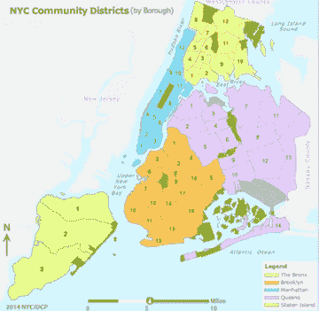
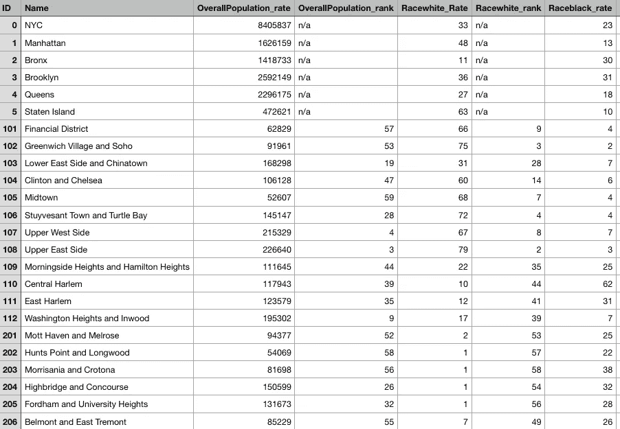
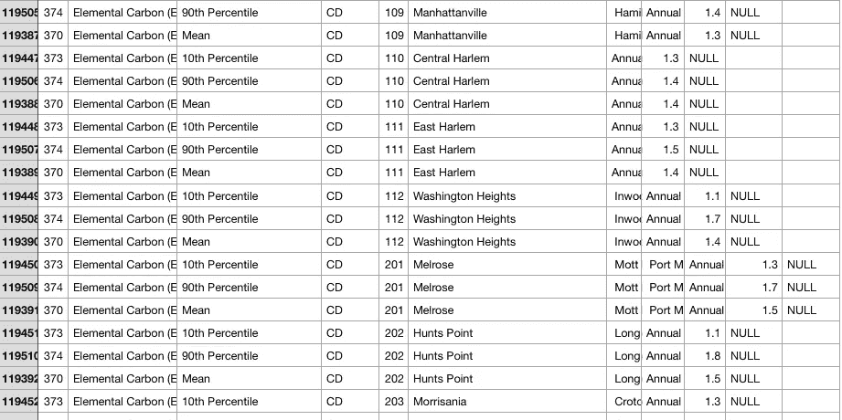
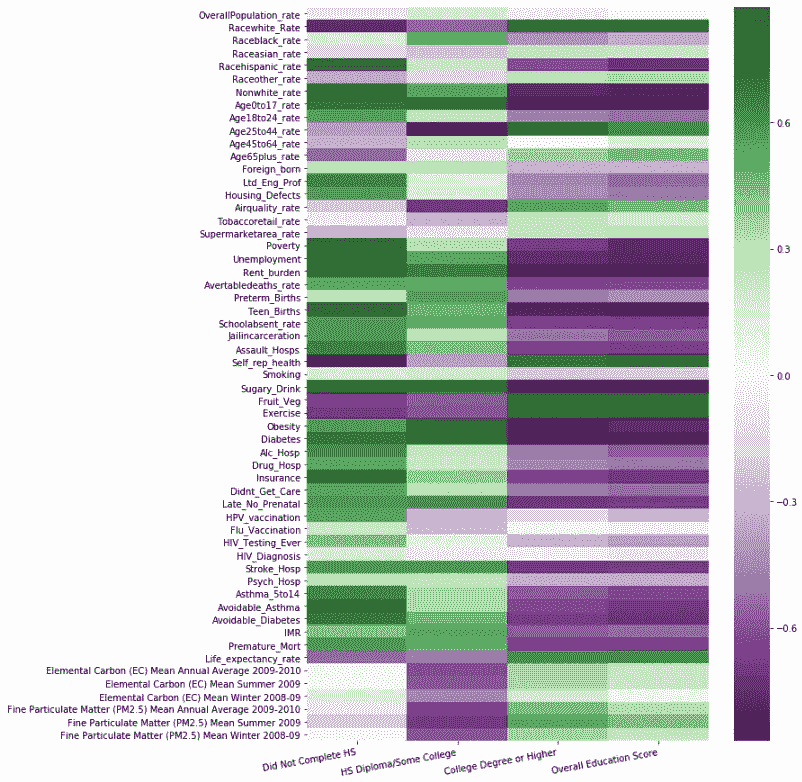
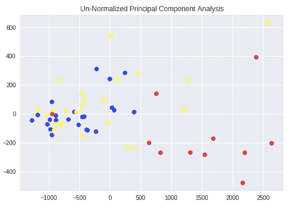
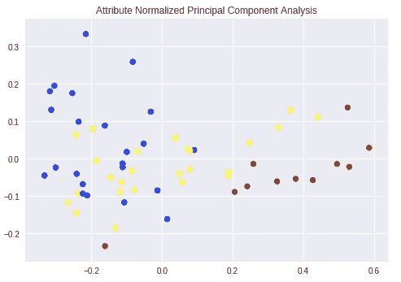

# 寻找意义:社会科学中小区域分析的数据问题

> 原文：<https://towardsdatascience.com/finding-meaning-the-data-problem-with-small-area-predictive-analysis-in-the-social-sciences-part-9fba1e2c981b?source=collection_archive---------11----------------------->

*更新:好消息！在这方面已经取得了很大进展。请阅读我对这篇文章的回应，因为我将在未来几天发表它们！* [*下面是*](/finding-meaning-the-case-for-small-area-analysis-and-progress-in-data-availability-6ac541a9f6ba) *的第一个。*

你可以在这里找到这个系列[的第 2 部分。](/finding-meaning-the-data-problem-with-small-area-predictive-analysis-in-the-social-sciences-part-f760019c9452)

## 你会在这篇文章中发现什么

*   为什么我对小区域分析感兴趣…那到底是什么？
*   所有的数据都在哪里？
*   为分析准备数据——使用 Pandas 清理和聚合 Python 中不同来源的数据
*   初步可视化

## 为什么我对小区域分析感兴趣…那到底是什么？

我曾经是纽约市一所特许学校的教师。我教普通和特殊教育学生高中数学、科学和计算机科学。根据我自己的经历和我同事的经历，我知道这个城市所有五个区的学生的故事。我知道社区健康和环境风险因素在特殊教育项目的学生比例以及学生的整体表现中占很大比重。从轶事经验来看，我发现这些学生无法控制的因素严重影响他们高中毕业以及高中毕业后继续接受教育的机会。


我也知道这种风险因素在城市的不同社区之间有很大的不同。例如，连接曼哈顿和新泽西的乔治·华盛顿大桥是每天最繁忙的桥梁之一。这座桥位于华盛顿高地附近的一个人口密集区，导致了整个城市最高的空气污染率。众所周知，空气污染会导致许多健康和发展问题，尤其是对非常年轻的人。

因此，我开始尝试使用小区域分析来发现教育程度和环境因素以及社区健康指标(如预期寿命、饮酒情况、早产率和许多其他指标)之间的统计显著联系。小区域分析将允许我分析整个城市的趋势如何变化，特别是因为“成为纽约人”的含义变化如此之大，以至于相距仅十个街区的两个家庭之间的生活可能会非常不同。小区域分析背后的想法是帮助确定不同社区的具体需求。

## 数据都在哪里？

我遇到的第一个问题是寻找数据。我最初开始从任何一个大都市地区(希望是几个)寻找数据，将我需要的数据聚集到适当大小的邻域中，并按适当大小的邻域进行分隔。最初，我希望找到按邮政编码聚合的数据。我搜遍了国家和州政府网站——没有运气。很快很明显，我所寻求的粒度的数据并不容易被公众获得，因为这是社会科学中一个相对*的新想法。*

最终，我去了我所知道的地方，并专门查看了纽约市，看看他们的政府网站或任何城市倡议是否会有我正在寻找的那种公开数据。最终，我偶然发现了纽约市社区健康调查，该调查将该市分为 59 个社区区，如下图所示。



社区健康调查(CHS)有我正在寻找的教育信息，以及我想要分析的许多公共健康和社区统计数据。然而，我仍然遗漏了许多我希望包括在内的环境风险因素，所以我继续寻找。我发现了大量的环境数据，但很少是按社区跟踪的，因此无法用于我的分析。此外，我可以使用的数据是以与来自 CHS 的数据完全不同的方式建立的。



NYC Community Health Survey Data



NYC Environmental & Health Data Portal

正如您所看到的，环境和健康数据(EH)要混乱得多，实际的相关数据值在三列中的任何一列中(在标有`NULL`的列之前)。此外，与 CHS 数据中的列标题不同，每个功能名称都使用第三列和第四列之间的组合来列出。显然，我必须找到一种方法来处理所有这些，以创建一个连贯的数据集。

## 为分析准备数据——使用 Pandas 清理和聚合 Python 中不同来源的数据

我首先必须决定我想看什么因素。在社区卫生服务数据集中，我对人口统计数据不感兴趣，对每个功能从 1 到 59 的排名不感兴趣，对组成前六列的城市和行政区范围的统计数据也不感兴趣。这是一个足够简单的练习来削减这些规格的数据集。

```
# Eliminating unwanted summary information
CD_CHS_data = raw_CHS_data.iloc[6:,:] # Eliminating data ranking each Community District on each feature by implementing a regular expression filter
CD_CHS_data.drop(list(NYC_data.filter(regex = 'rank')), axis = 1,            
                 inplace=True)
```

此外，所有的人口统计数据都集中在前面的列中，所以我使用`original_CHS_columns = raw_CHS_data.columns.values.tolist()`创建了一个列标题列表，删除前 33 列非常容易。

因此，我必须检查 CHS 数据中的`NaN`值，令我吃惊的是，有许多列都有这样的值，所以我使用下面的代码将它们聚集到一个列表中，发现除了一列(第一列)之外，所有列都只是“可靠性注释”。在以后的数据传递中，我可能会考虑这些，但是我想得到一些基线，所以我简单地删除了“可靠性注释”栏。

```
# Creating a list of the columns with NaN values
CHS_NaN_columns = []for column in original_CHS_columns:
    if CD_CHS_data.loc[:, column].isna().any():
    CHS_NaN_columns.append(column)# Deleting desired columns
CHS_columns_to_delete = CHS_NaN_columns[1:]
CHS_data_to_merge = CD_CHS_data.drop(columns=CHS_columns_to_delete)
```

唯一剩下的有`NaN`值的列是“avertable deaths _ rate ”, 59 个中只有 5 个——不到 10%,所以我决定简单地估算那些有平均值的。在进一步检查数据源和收集技术后，使用不同的方法替换这些值可能是明智的，但同样，获得基线是我当时的首要任务。此外，我知道 EH 数据将花费我更多的时间来准备与 CHS 数据合并。

如前所述，EH 数据集使用两列来描述每个测量或特征。应用一个`lambda`函数来合并这两列非常简单:

```
CD_EH_data['labels'] = CD_EH_data.apply(lambda row: ''.join([row[2], row[3]]), axis=1)
```

更困难的部分是讨论的另一个问题，即实际数据分布在数据集中的三个不同的列中。我用下面的方法着手解决这个问题。

```
# Because much of the data in many column was words (names of neighborhoods) first it is necessary to convert all the data to numeric data, "coercing" non-numeric data to be represented as NaN
for column in [8, 9, 10, 11]:
    CD_EH_data.iloc[:,column] =  
           pd.to_numeric(CD_EH_data.iloc[:,column], errors='coerce')# Following the pattern observed in the CSV file, the first numeric value starting from the right of the dataframe would be the desired value
def get_value(row):
    if not np.isnan(row[11]):
        value = row[11]
    elif not np.isnan(row[10]):
        value = row[10]
    elif not np.isnan(row[9]):
        value = row[9]
    else:
        value = row[8]
    return value

CD_EH_data['values'] = CD_EH_data.apply(lambda row: 
                                        get_value(row), axis=1)
```

最后，为了合并这两个数据集，我必须在合并之前用 EH 数据创建一个数据透视表。

```
# Create the pivot table with desired features
EH_data_to_merge = CD_EH_data.pivot_table(index='ID', 
                                          columns='labels', 
                                          values='values')# Merge the datasets
NYC_data = EH_data_to_merge.merge(CHS_data_to_merge, how='outer', 
                                  left_index=True, right_index=True)
```

## 初步可视化

热点图是直观查看数据集中不同要素之间相关性的绝佳方式。下面是使用 sci-kit 的“RobustScaler”缩放每个功能后，使用 seaborn 和 matplotlib 库创建的热图。



该数据集中有许多要素，在下一部分中，我将“放大”查看要素集的几个子集，以对结果进行一些分析。

另一种可视化数据的方法是使用主成分分析，它允许我们通过分解这些特征(使用大量复杂的数学运算)将数据尽可能多地分布在二维图形上，来可视化具有许多特征(每个特征都有自己的维度)的数据。

在这两个图表中，红点代表教育程度最高的社区区域不是高中毕业，黄点代表教育程度最高的区域是高中毕业，可能是大学毕业，蓝点代表教育程度最高的区域是大学毕业或更高。



正如您在上面看到的，标准化每个属性的数据稍微有助于将每个组聚集在一起，尽管还有许多需要改进的地方。

在我的下一篇文章中继续阅读这个项目，[第二部分！](/finding-meaning-the-data-problem-with-small-area-predictive-analysis-in-the-social-sciences-part-f760019c9452)