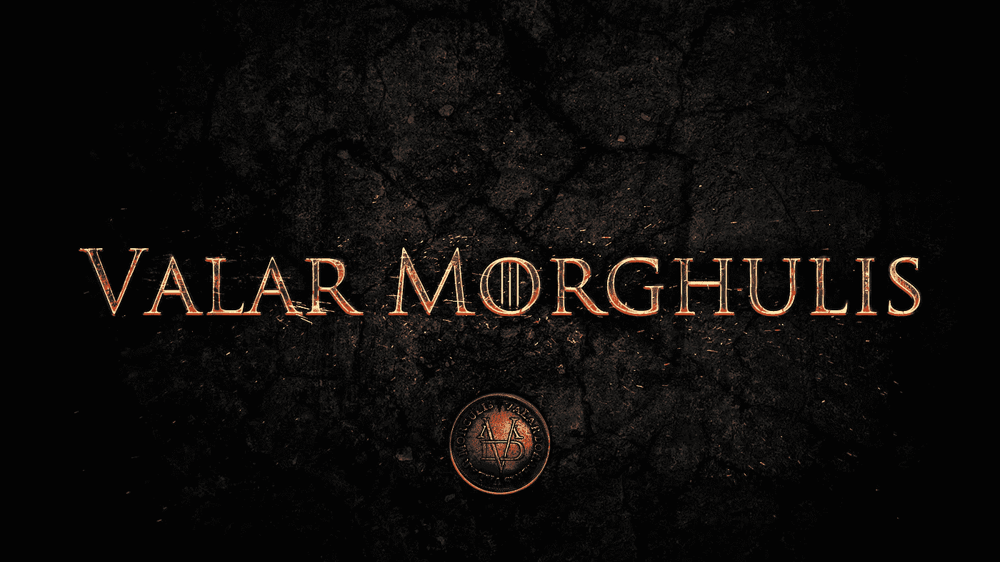
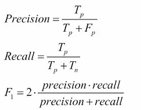
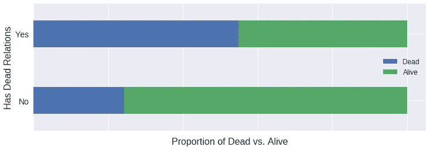
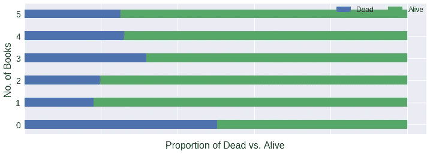
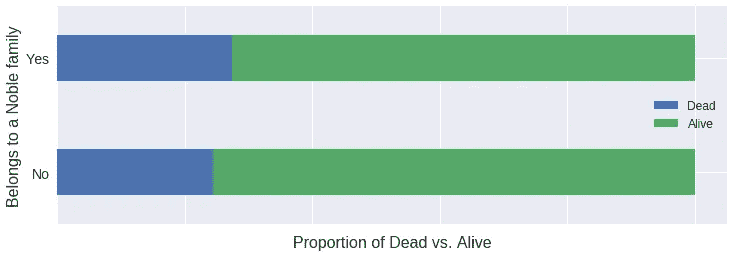
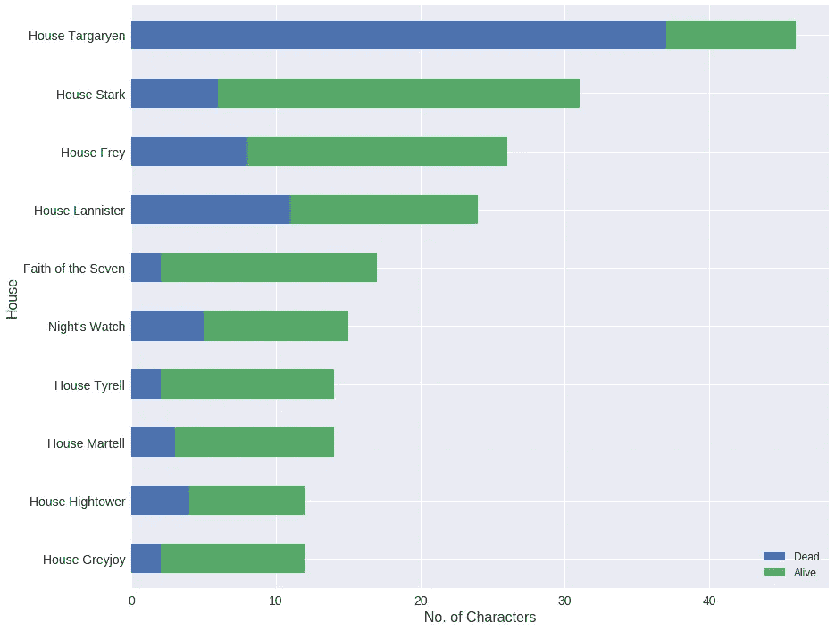
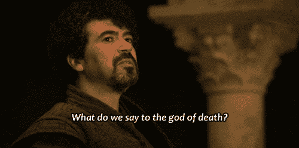
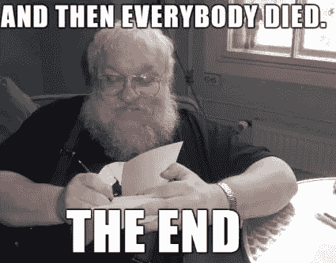

# 利用机器学习发现《权力的游戏》中的死亡模式

> 原文：<https://towardsdatascience.com/finding-patterns-of-death-in-game-of-thrones-using-machine-learning-68cf95d7f1d1?source=collection_archive---------2----------------------->



Valar Morghulis ( *所有人都必须死*)是任何 GoT 粉丝最难忘的一句话。几乎每一集都有令人震惊的死亡。大多数角色，包括杰出人物，都遭遇了暴力的结局。但是死亡是随机发生的呢，还是发生在具有相似特征的特定角色身上呢？那些死去的人和那些设法活下来的人之间有某种模式吗？

> 当你玩权力的游戏时，你要么赢，要么死。

机器学习是一种技术，它允许计算机找到隐藏的洞察力，而无需显式编程去哪里寻找。它从足够多的过去的例子中学习来预测未来。在这个项目中，我将机器学习应用于 Kaggle 上的《权力的游戏》[数据集](https://www.kaggle.com/mylesoneill/game-of-thrones),以识别影响角色死亡的特征。(数据集基于《冰与火之歌》这本书，而非该剧。)

*因为真正的粉丝看书。*

**数据集**

该数据集包括总共 27 个特征(标题、性别、文化、年龄、贵族、在每本书中的出现、死亡关系的数量、受欢迎程度等)。)大约 2000 个字符。它还描述了角色在第五本书(《与龙共舞》)结束时是生是死。

**功能选择**

在将分类特征转换成数字特征后，我总共有 685 个特征。然后，我使用带有线性支持向量分类器的 [SelectFromModel](http://scikit-learn.org/stable/modules/generated/sklearn.feature_selection.SelectFromModel.html) 来选择最佳的 32 个特征。

**交叉验证和超参数优化**

我将数据集分为训练集和测试集(80–20)。具有 10 重交叉验证的线性 SVC 在测试集上提供了 0.76 的准确度。调整内核参数将精确度提高到 0.78。优化的随机森林分类器进一步提高了 0.82 的精度。

**方法性能**

我使用 TP(真阳性，即正确预测的死亡人物)、FP(假阳性，即活着的人物预测死亡)、TN(真阴性，即正确预测的活着的人物)和 FN(假阴性，即死亡的人物预测活着)的比率来测量精确度、召回率和 f 分数。



我的模型的预测结果是:

```
+--------+-----------+--------+---------+
| Labels | Precision | Recall | F-Score |
+--------+-----------+--------+---------+
| Alive  | 93%       | 85%    | 86.5%   |
| Dead   | 47%       | 70%    | 63.5%   |
+--------+-----------+--------+---------+
```

**重要特性**

在随机森林中使用[特征重要性](http://scikit-learn.org/stable/auto_examples/ensemble/plot_forest_importances.html)度量，发现以下特征贡献最大(从贡献最大到贡献最小排序):

1.  与角色相关的死亡角色的数量
2.  《乌鸦的盛宴》中的人物形象
3.  《与龙共舞》中的人物形象
4.  角色的性别
5.  《权力的游戏》中的人物形象
6.  性格的高贵
7.  《刀剑风波》中的人物形象
8.  角色的头衔(社会地位)
9.  角色所属的房子
10.  《国王的冲突》中的人物形象
11.  角色的受欢迎程度

**探索特征与死亡的关系**



**Is there a relationship between survival and number of dead relatives?**



**Does appearing in more books relate to survival?**



**Does belonging to a noble family make you prone to death?**



**How does house relate to survival? (Only houses with more than 10 members have been considered.)**

做好准备，冬天来了！更多的死亡和情节曲折也是如此。虽然我们只能等待冬天的风来看看接下来会发生什么，但这一分析可能会帮助我们做好准备。因为黑夜是黑暗的，充满了恐惧。



我将收集更多的数据，并对上述结果进行进一步的分析，以预测未来书籍中人物的命运。你可以在 [Github](https://github.com/shubhambitsg/machine-learning/tree/master/ml-projects/game-of-thrones_ml) 上找到我的代码，并在 [Twitter](https://twitter.com/shubham_bitsg) 上与我联系，讨论一些很酷的想法。让我们的极客来展示我们对这本书和这个节目的热爱吧。

除非他杀光他们…

