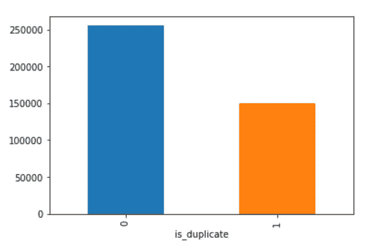
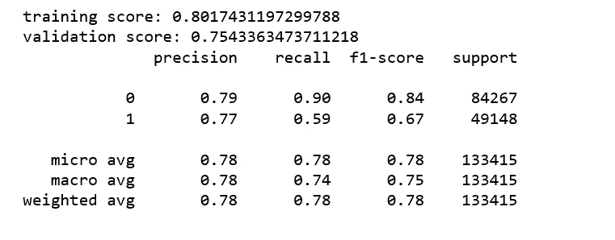
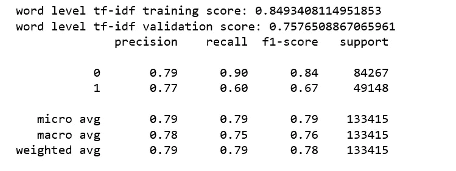
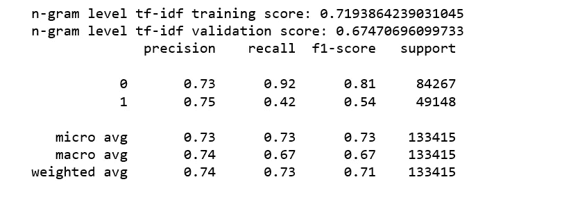
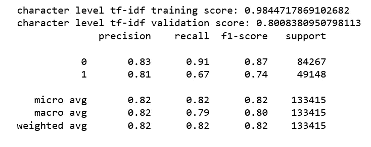

# 用 BOW，TFIDF 和 Xgboost 寻找相似的 Quora 问题

> 原文：<https://towardsdatascience.com/finding-similar-quora-questions-with-bow-tfidf-and-random-forest-c54ad88d1370?source=collection_archive---------4----------------------->


photo credit: Pixabay

## Google 长期以来在索引和信息检索中使用 TFIDF 来计算给定关键字对给定页面的重要性

Quora 是一个问答网站，它的用户社区以意见的形式提问、回答、编辑和组织问题。

2018 年 9 月，Quora 报告月度用户达到 3 亿。每个月有超过 3 亿人访问 Quora，所以很多人问重复的问题也就不足为奇了，也就是说，这些问题有着相同的意图。比如像“我怎样才能成为一个好的地质学家？”以及“我该怎么做才能成为一名伟大的地质学家？”是重复的问题，因为它们都有相同的意图，应该只回答一次。

Quora 非常努力地消除重复问题，但是 [NLP](https://en.wikipedia.org/wiki/Natural_language_processing) 是一个非常困难的问题。有这么多方法来描述同一个意思，看看上面的例子就知道了。Quora 用户提供了很大的帮助，合并了类似的问题，比如:


source: Quora

在这篇文章中，我们将开发一个机器学习和 NLP 系统来分类问题对是否重复，我们从一个带有 Xgboost 的模型 [BOW](https://en.wikipedia.org/wiki/Bag-of-words_model) 或 [TF-IDF](https://en.wikipedia.org/wiki/Tf%E2%80%93idf) 开始。

BOW 和 TF-IDF 是人们在信息检索中最常用的两种方法。一般来说，支持向量机和朴素贝叶斯更常用于分类问题，但是，因为它们的精度依赖于训练数据，所以 Xgboost 在这个特定的数据集中提供了最好的精度。XGBoost 是一个梯度增强框架，已经变得非常流行，尤其是在 [Kaggle](https://www.kaggle.com/) 社区中。因此，我决定使用这个模型作为基线模型，因为它设置简单，易于理解，并且有合理的机会提供体面的结果。我们的基线模型将允许我们快速获得性能基准。[如果我们发现它提供的性能不够充分，那么检查简单模型的问题可以帮助我们选择下一个方法](https://blog.insightdatascience.com/always-start-with-a-stupid-model-no-exceptions-3a22314b9aaa)。

# 数据预处理

[Quora 重复问题公共数据集](https://www.kaggle.com/c/quora-question-pairs/data)包含超过 40 万对 Quora 问题。在我们的实验中，我们将数据随机分为 70%的训练样本和 30%的测试样本。

```
import numpy as np
import pandas as pd
import seaborn as sns
import matplotlib.pyplot as plt
%matplotlib inlinedf = pd.read_csv('quora_train.csv')
df.dropna(axis=0, inplace=True)
df.groupby("is_duplicate")['id'].count().plot.bar()
```



Figure 1

这些职业并没有完全平衡，但这并不坏，我们不会去平衡它们。

在清理文本之前，我们预览几个问题对，以确定如何清理它们。

```
df.drop(['id', 'qid1', 'qid2'], axis=1, inplace=True)
a = 0 
for i in range(a,a+10):
    print(df.question1[i])
    print(df.question2[i])
    print()
```


Figure 2

你可能已经注意到我们在文本清理方面有很多工作要做。经过一些检查，一些尝试和来自[的想法 https://www . ka ggle . com/Currie 32/the-importance-of-cleaning-text](https://www.kaggle.com/currie32/the-importance-of-cleaning-text)，我决定对文本进行如下清理:

*   不要删除停用词，因为像“什么”、“哪个”和“如何”这样的词可能有强烈的信号。
*   不要词干。
*   去掉标点符号。
*   纠正错别字。
*   将缩写改为其原始术语。
*   删除数字之间的逗号。
*   将特殊字符转换为单词。诸如此类。

clean

清理文本后，我们再次预览这些问题对。

```
a = 0 
for i in range(a,a+10):
    print(df.question1[i])
    print(df.question2[i])
    print()
```


Figure 3

好多了！

## 特征工程

一段时间以来，我们在对单个文本进行分类方面很有经验——但是对文本之间的关系进行精确建模的能力相对较新。这里我使用 Panda 的`concat`函数将来自问题 1 和问题 2 的两个文本对象连接成一个。`scipy.sparse.hstack`用于水平堆叠稀疏矩阵(按列)。

# 词袋+ Xgboost 模型

这种后续策略(计数矢量器)被称为**单词包。**通过单词出现次数来描述文档，而完全忽略单词在文档中的相对位置信息。它对文档进行标记，计算标记的出现次数，并以稀疏矩阵的形式返回它们。

Xgboost 与以下参数一起使用，这些参数是根据验证数据中的性能选择的:

```
max_depth=50
n_estimators=80
objective='binary:logistic'
eta=0.3
```

bow_xgboost



Figure 4

# 字级 TF-IDF + Xgboost

[TF–IDF](https://en.wikipedia.org/wiki/Tf%E2%80%93idf)是两个统计量的乘积，术语频率和逆文档频率，它是当今最流行的术语加权方案之一。

我们将 tf-idf 归一化应用于出现计数的稀疏矩阵，从单词级、n-gram 级和字符级。

word_tfidf_Xgboost



Figure 5

关于特征工程的一个微妙之处是，它需要知道我们在实践中很可能不知道的特征统计。为了计算 tf-idf 表示，我们必须基于训练数据计算逆文档频率，并使用这些统计来缩放训练和测试数据。在 scikit-learn 中，在训练数据上安装特征转换器相当于收集相关的统计数据。然后，可以将安装好的变压器应用于测试数据。

# **N-gram 级 TF-IDF + Xgboost**

N_gram_tfidf_Xgboost



Figure 6

# **人物等级 TF-IDF + Xgboost**

character_tfidf_Xgboost



Figure 7

我们的最高验证分数是 0.80，对初学者来说一点也不差！

到目前为止，我们最好的 Xgboost 模型是字符级 TF-IDF+Xgboost，重复问题的召回率，即我们的模型能够检测的重复问题占重复问题总数的比例是 0.67。这对于手头的问题至关重要，我们希望检测并尽可能多地消除重复问题。

考虑到这一点，我们将开发一个 [word2vec 和 Xgboost 模型](https://medium.com/@actsusanli/finding-similar-quora-questions-with-word2vec-and-xgboost-1a19ad272c0d)，看看这个结果是否可以改进，这将是下一篇文章的[。](https://medium.com/@actsusanli/finding-similar-quora-questions-with-word2vec-and-xgboost-1a19ad272c0d)

[这篇文章的 Jupyter 笔记本](https://github.com/susanli2016/NLP-with-Python/blob/master/BOW_TFIDF_Xgboost_update.ipynb)可以在 [Github](https://github.com/susanli2016/NLP-with-Python/blob/master/BOW_TFIDF_Xgboost_update.ipynb) 上找到。周末快乐！