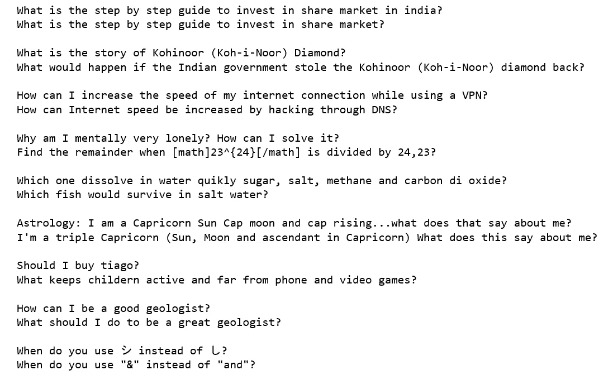
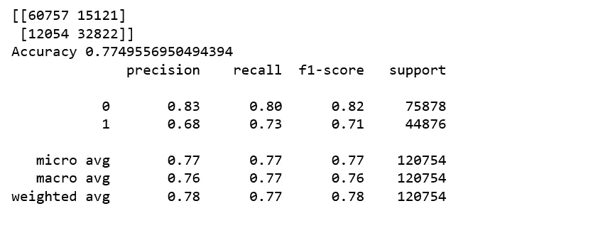

# 用 Word2Vec 和 Xgboost 寻找相似的 Quora 问题

> 原文：<https://towardsdatascience.com/finding-similar-quora-questions-with-word2vec-and-xgboost-1a19ad272c0d?source=collection_archive---------4----------------------->


photo credit: Pixabay

## 如何使用自然语言处理来识别任何文本数据集中的相似记录

上周，我们探索了使用 BOW、TFIDF 和 Xgboost 识别相似文档的不同重复数据删除技术。我们发现传统的方法如 TFIDF 可以取得一些令人印象深刻的结果。这也是[谷歌长期以来在索引和信息检索中使用 TFIDF 来计算给定关键词对给定页面的重要性的原因之一](https://www.link-assistant.com/news/tf-idf-tool.html)。

为了继续我们的学习之旅并增长我们的技能，今天，我们将探讨如何使用不同的方法解决相同的匹配和重复数据消除问题，同样，我们将把重复数据消除作为分类器的扩展来处理。我们开始吧！

# 数据

Quora 重复问题对的任务是确定一对问题是否具有相同的含义。数据包含一对问题和一个由人类专家标记的基本事实标签，标记这对问题是否重复。请注意，这些标签是主观的，这意味着并非所有人类专家都同意这一对问题是否重复。因此，这些数据应被视为有根据的，而不是 100%准确的。

```
df = pd.read_csv('quora_train.csv')
df = df.dropna(how="any").reset_index(drop=True)
a = 0 
for i in range(a,a+10):
    print(df.question1[i])
    print(df.question2[i])
    print()
```



Figure 1

# 计算单词移动者的距离

[WMD](http://proceedings.mlr.press/v37/kusnerb15.pdf) 是一种允许我们以一种有意义的方式评估两个文档之间“距离”的方法，不管它们有没有共同点。它使用单词的矢量嵌入。它将两个文本文档之间的差异度量为一个文档的嵌入单词需要“行进”以到达另一个文档的嵌入单词的最小距离。让我们看一个例子，下面的问题对被标记为重复:

```
question1 = 'What would a Trump presidency mean for current international master’s students on an F1 visa?'
question2 = 'How will a Trump presidency affect the students presently in US or planning to study in US?'question1 = question1.lower().split()
question2 = question2.lower().split()question1 = [w for w in question1 if w not in stop_words]
question2 = [w for w in question2 if w not in stop_words]
```

我们将使用 [word2vec 预训练的谷歌新闻语料库](https://drive.google.com/file/d/0B7XkCwpI5KDYNlNUTTlSS21pQmM/edit)。我们将这些加载到一个 Gensim Word2Vec 模型类中。

```
import gensimfrom gensim.models import Word2Vec

model = gensim.models.KeyedVectors.load_word2vec_format('./word2Vec_models/GoogleNews-vectors-negative300.bin.gz', binary=True)
```

让我们用 wmdistance 方法计算这两个句子的 WMD。记住，这两句话表达的是同一个意思，在原 quora 数据中被标注为重复。

```
distance = model.wmdistance(question1, question2)
print('distance = %.4f' % distance)
```

***距离= 1.8293***

这两个句子之间的计算距离相当大。这就把我们带到了规范化的大规模杀伤性武器。

# **标准化 word2vec 向量**

当使用 wmdistance 方法时，首先规范化 word2vec 向量是有益的，这样它们都具有相等的长度。

```
model.init_sims(replace=True)
distance = model.wmdistance(question1, question2)
print('normalized distance = %.4f' % distance)
```

***归一化距离= 0.7589***

正常化后，距离变小了很多。

再来一对试试，这次这两道题不重复。

```
question3 = 'Why am I mentally very lonely? How can I solve it?'
question4 = 'Find the remainder when [math]23^{24}[/math] is divided by 24,23?'question3 = question3.lower().split()
question4 = question4.lower().split()question3 = [w for w in question3 if w not in stop_words]
question4 = [w for w in question4 if w not in stop_words]distance = model.wmdistance(question3, question4)
print('distance = %.4f' % distance)
```

***距离= 1.2637***

```
model.init_sims(replace=True)
distance = model.wmdistance(question3, question4)
print('normalized distance = %.4f' % distance)
```

***归一化距离= 1.2637***

归一化后，距离保持不变。WMD 认为第二对没有第一对相似。成功了！

# 模糊的

我们已经介绍了 Python 中[模糊字符串匹配的一些基础知识，让我们快速浏览一下](/natural-language-processing-for-fuzzy-string-matching-with-python-6632b7824c49) [FuzzyWuzzy](https://chairnerd.seatgeek.com/fuzzywuzzy-fuzzy-string-matching-in-python/) 是否可以帮助我们解决问题重复数据删除问题。

```
from fuzzywuzzy import fuzzquestion1 = 'What would a Trump presidency mean for current international master’s students on an F1 visa?'
question2 = 'How will a Trump presidency affect the students presently in US or planning to study in US?'
fuzz.ratio(question1, question2)
```

***53***

```
fuzz.partial_token_set_ratio(question1, question2)
```

***100***

```
question3 = 'Why am I mentally very lonely? How can I solve it?'
question4 = 'Find the remainder when [math]23^{24}[/math] is divided by 24,23?'
fuzz.ratio(question3, question4)
```

***28***

```
fuzz.partial_token_set_ratio(question3, question4)
```

***37***

基本上，Fuzzywuzzy 不认为第二对问题是相似的。那很好。因为根据人类评价，第二对是不相似的。

# 特征工程

首先，我们创建几个函数来计算 WMD 和归一化 WMD 以及单词到向量的表示。

wmd_normWmd_sent2vec

我们将创建的新功能包括:

*   单词的长度。
*   字符的长度。
*   问题 1 和问题 2 之间常用词的长度。
*   问题 1 和问题 2 之间的长度差。
*   向量 question1 和 question2 之间的余弦距离。
*   城市街区(曼哈顿)矢量问题 1 和问题 2 之间的距离。
*   向量 question1 和 question2 之间的雅克卡距离。
*   向量问题 1 和问题 2 之间的堪培拉距离。
*   向量 question1 和 question2 之间的欧几里德距离。
*   向量 question1 和 question2 之间的闵可夫斯基距离。
*   向量问题 1 和问题 2 之间的 Bray-Curtis 距离。
*   向量问题 1 和问题 2 的偏度和峰度。
*   大规模杀伤性武器
*   标准化大规模杀伤性武器

所有的距离计算都可以通过使用`scipy.spatial.distance`函数来完成。

new_features1

# word 2 虚拟建模

我们将使用 word2vec 预训练的谷歌新闻语料库。我下载并保存到“word2Vec_models”文件夹中。然后，我们将这些加载到一个 Gensim Word2Vec 模型类中。

```
model = gensim.models.KeyedVectors.load_word2vec_format('./word2Vec_models/GoogleNews-vectors-negative300.bin.gz', binary=True)
df['wmd'] = df.apply(lambda x: wmd(x['question1'], x['question2']), axis=1)
```

# **归一化 Word2vec 建模**

```
norm_model = gensim.models.KeyedVectors.load_word2vec_format('./word2Vec_models/GoogleNews-vectors-negative300.bin.gz', binary=True)
norm_model.init_sims(replace=True)
df['norm_wmd'] = df.apply(lambda x: norm_wmd(x['question1'], x['question2']), axis=1)
```

获取问题 1 和问题 2 的向量，然后计算所有距离。

new_features2

# Xgboost

Xgboost



Figure 2

我们创建的所有新功能的 Xgboost 实现了 0.77 的测试准确性，低于字符级 TF-IDF + Xgboost 的 0.80，但是，我们能够将重复问题的召回率从 0.67 提高到 0.73，这是一个显著的改进。

Jupyter 笔记本可以在 [Github](https://github.com/susanli2016/NLP-with-Python/blob/master/Word2vec_xgboost.ipynb) 上找到。祝你一周工作顺利！

参考:

[https://www . LinkedIn . com/pulse/duplicate-quora-question-abhishek-thakur/](https://www.linkedin.com/pulse/duplicate-quora-question-abhishek-thakur/)