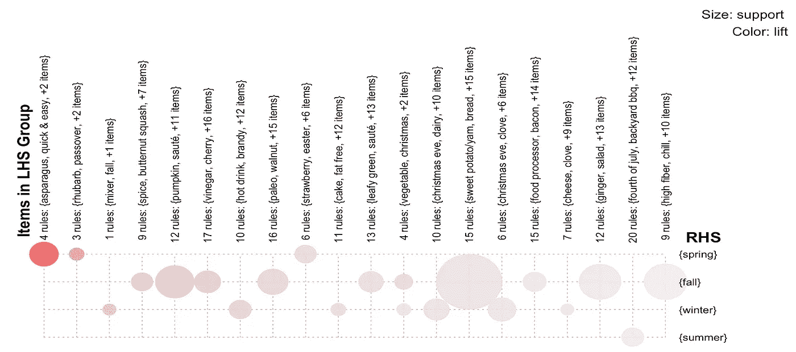
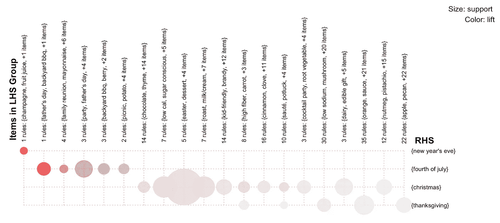
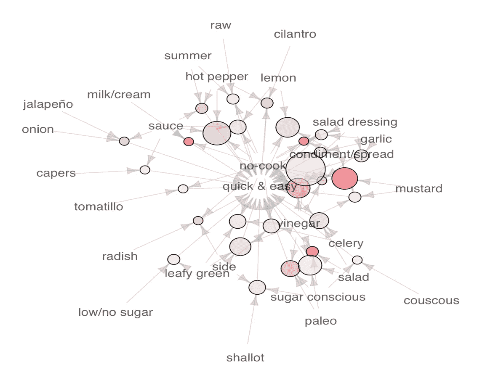
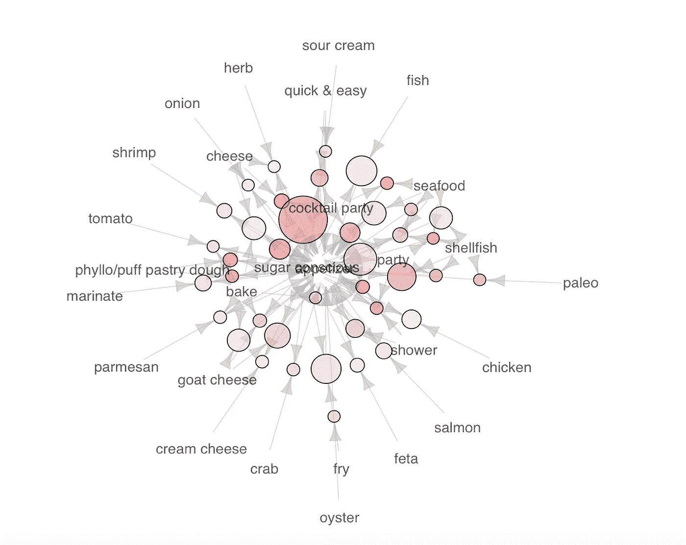
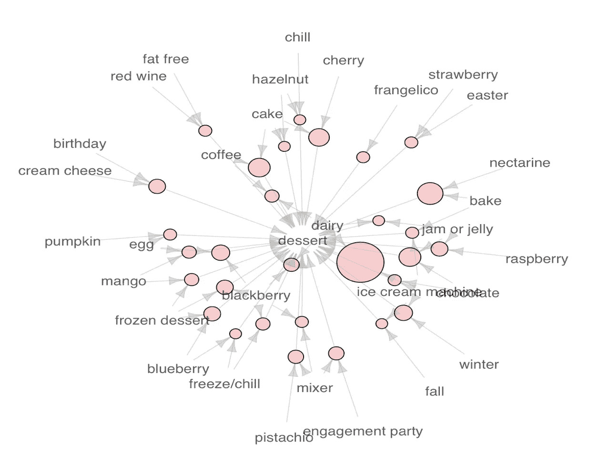
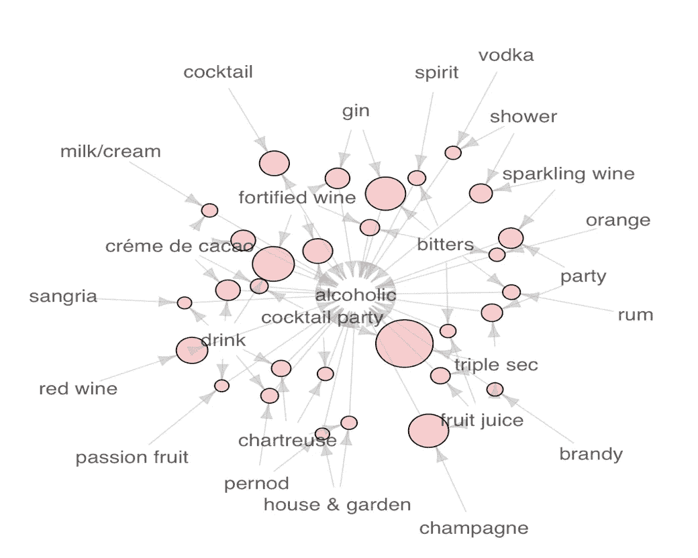

# 寻找食物的模式

> 原文：<https://towardsdatascience.com/finding-the-pattern-of-food-a462b3ce5910?source=collection_archive---------12----------------------->

继续上一篇关于食物和营养的文章，今天我想找到与不同季节、节日和主题相关的常见食材。

为了做到这一点，我对 Epicurious recipe 数据应用了关联规则，以基于 3 个度量来找到相关的项目集:它们出现得相对频繁(支持)，一个项目经常与另一个项目一起出现(置信度)，以及它们出现得比偶然更频繁(提升)。

food associated with different seasons

在矩阵视图中，关联子集被分组。我们看到季节性产品，如春天的芦笋，秋天的红薯，还有季节性饮料，如冬天的热饮。

food associated with major festivals

就节日食物而言，在一个简洁的视图中，它显示了从新年前夜的香槟、7 月 4 日的后院烧烤到圣诞节的可食用礼物等各种食物。

这方面的一个用例是，食谱网站可以将他们的季节性食谱与谷歌搜索食品趋势进行比较，以了解用户的新需求。

当放大一个节日时，人们可以观察到更多细节。

然后，我们还可以了解与某种食物相关的配料和饮食，如快餐和便餐:

A salad/couscous kinda mood

开胃菜:

some cheese, some tomato, some seafood

甜点:

all the sweet things

此外，由于双重标记的性质(一个配方同时标记一个项目及其父项目，如果有的话)，我们实际上可以使用它来分组标签，达到类似的聚类效果:

这是我关于数据科学和视觉故事的[# 100 日项目](https://medium.com/@yanhann10)的第 55 天。我的 [github](https://github.com/yanhann10/opendata_viz) 上的全部代码。感谢阅读。欢迎新主题的建议和反馈。