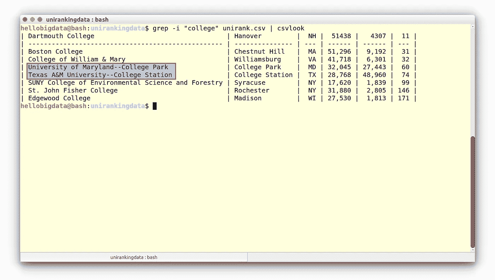

# 在命令行中查找 2017 年美国大学排名中的学院百分比(第二部分 grep 和 wc)

> 原文：<https://towardsdatascience.com/finding-the-percent-of-colleges-in-the-us-university-ranks-2017-at-the-command-line-part-ii-grep-5db6d59f76a1?source=collection_archive---------5----------------------->


Image adopted from the [unsplash.com](https://unsplash.com/search/photos/building?photo=ulhxvMjzI_4)

各位编码员好！欢迎回到我的系列课程**数据科学@ Bash Shell** 。在[上一课](https://medium.com/towards-data-science/how-to-analyze-us-university-ranks-2017-with-bash-part-i-data-preview-e39b8f2ffee9)中，我们学习了如何预览数据集( [unirank.csv](http://educative.io/udata/4Wyl0VOx0b0/unirank.csv) )。您应该从下面的网页下载数据，因为我们已经稍微简化了数据，让我们将数据保存为:`unirank.csv`

```
wget https://www.scientificprogramming.io/datasets/unirank.csv
```

**数据集预览**

现在让我们进行我们的第一个分析:要列出数据文件中包含短语**“college”**的所有行，我们需要向您介绍命令`grep`(全局正则表达式打印)。简而言之，`grep`允许您浏览文件中的所有行，但只输出那些匹配模式的行。在我们的例子中，我们希望找到数据集中包含“college”的所有行。

我们是这样做的:

```
$ grep -i "college" unirank.csv | csvlook
```

这里，grep 命令有两个命令行参数:第一个是模式，第二个是我们要在其中搜索该模式的文件。如果运行此命令，您应该会看到一些包含字符串“college”的行:



Institutes containing “colleges” in the unirank.csv data set

请注意，我们已经设置了`-i`选项，使匹配案例变得不敏感。还有，发现逻辑误将两所大学认定为学院！因为他们的名字包含字符串(“学院”)。因此，在数据分析中使用`grep`时，尤其是在做出决定之前，你需要小心谨慎！

# 找到大学的百分比

对于这一步，我们需要引入管道的概念，这是 Bash shell 中最强大的特性之一。管道用竖线符号(`|`)表示。本质上，管道允许您将一个命令的输出转发到另一个命令的输入，而不必将中间输出保存到文件中。

我们想把`grep`的输出给另一个命令，它可以告诉我们这个输出有多少行。事实证明，有一个命令可以让我们做到这一点:`wc`代表单词计数，用于计算给定输入中有多少单词，但最常用的是与`-l`选项一起使用，它将计算输入中的行数。所以让我们从计算`unirank.csv`文件中总共有多少行开始:

```
$ wc -l unirank.csv232 unirank.csv
```

现在我们来数一下学院的数量，让我们用管道把我们所学的东西集合起来:

```
$ grep -i "college" unirank.csv | wc -l8
```

grep 的输出——文件中包含“**学院**”的行——被传递给`wc -l`，它将计算文件中的行数。注意，我们没有在`wc -l`命令中指定文件名；我们不需要这么做，因为我们通过管道将数据传输到`wc -l`，所以它不需要从文件中读取数据。

所以在这个数据集中，`((8-2)/232) x 100% = 2.5%` institutes 来自美国高校。我们仔细地扣除了两个错误识别的学院。 [**下集再见**](https://medium.com/@asarefin/the-us-university-ranks-2017-at-the-command-line-part-iii-cut-sort-and-uniq-1a81dc0279c2) [⏰](https://apps.timwhitlock.info/emoji/tables/unicode#emoji-modal)！

阅读 [**上一课(第一部分)**](https://medium.com/towards-data-science/how-to-analyze-us-university-ranks-2017-with-bash-part-i-data-preview-e39b8f2ffee9) 。[🚶](https://apps.timwhitlock.info/emoji/tables/unicode#emoji-modal)

[这个项目是‘学习 Bash Shell 和 Linux 中的数据’课程的一部分。]

[](https://school.scientificprogramming.io/course/learn-practical-data-science-with-bash-shell/2?/learn-bash/) [## 使用 Bash Shell 学习实用的数据科学

### 描述 Bash 可能不是处理所有类型数据的最佳方式，但是经常会出现这样的情况

科学编程](https://school.scientificprogramming.io/course/learn-practical-data-science-with-bash-shell/2?/learn-bash/)