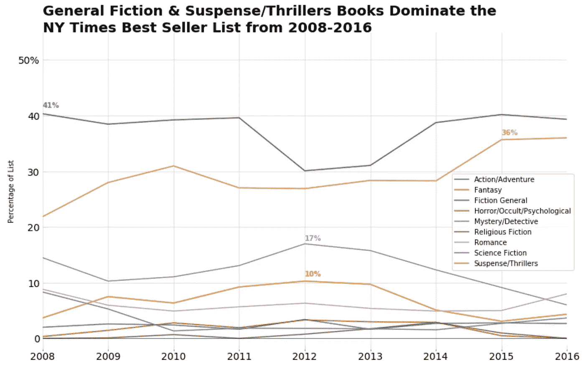
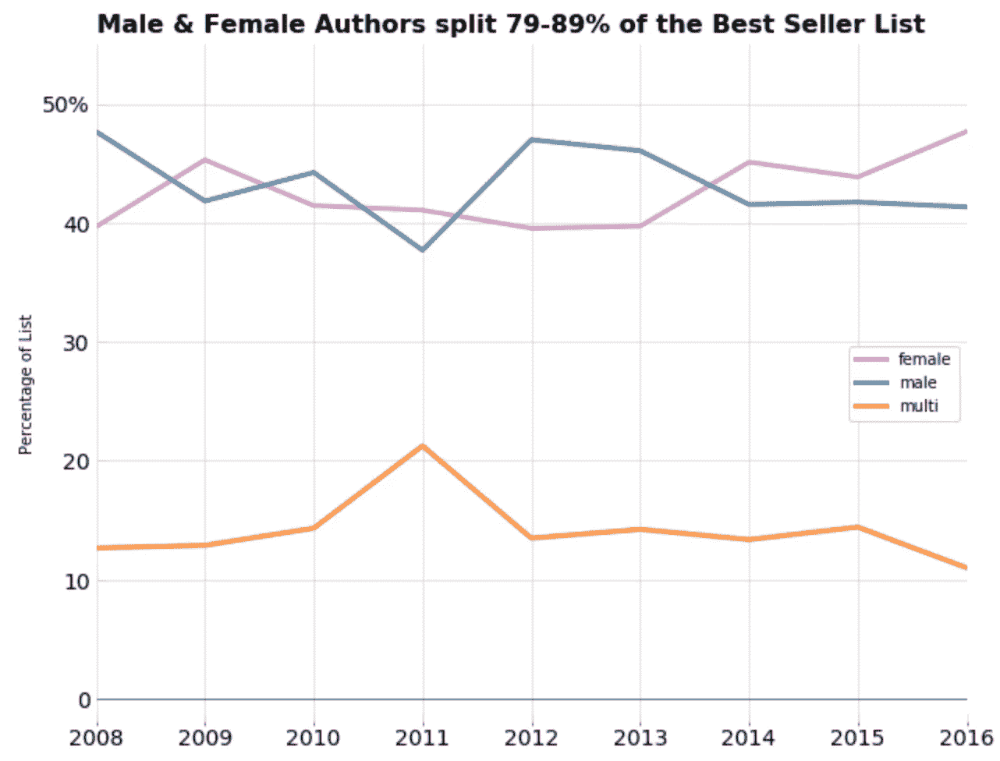
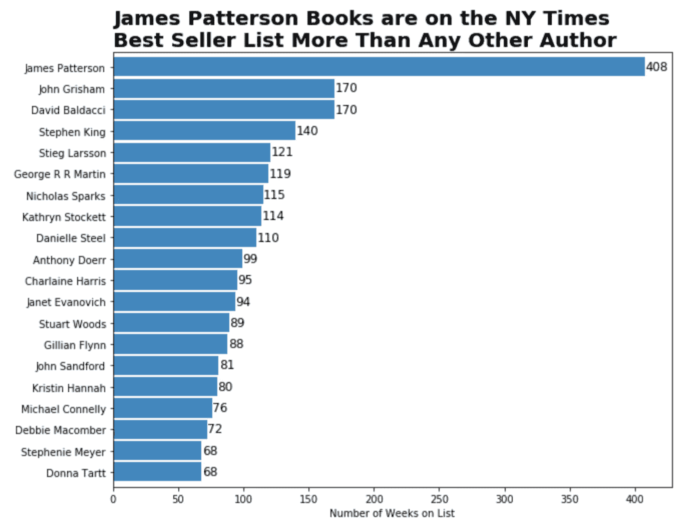
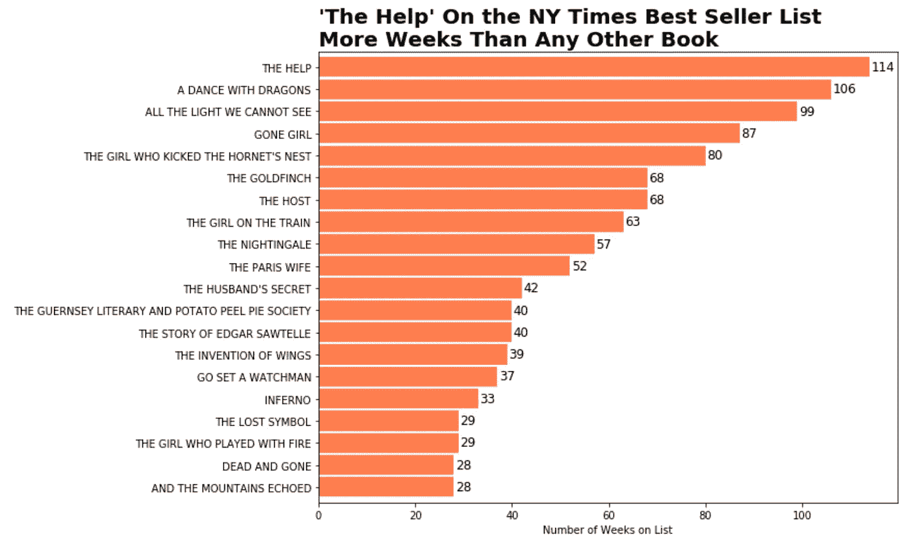
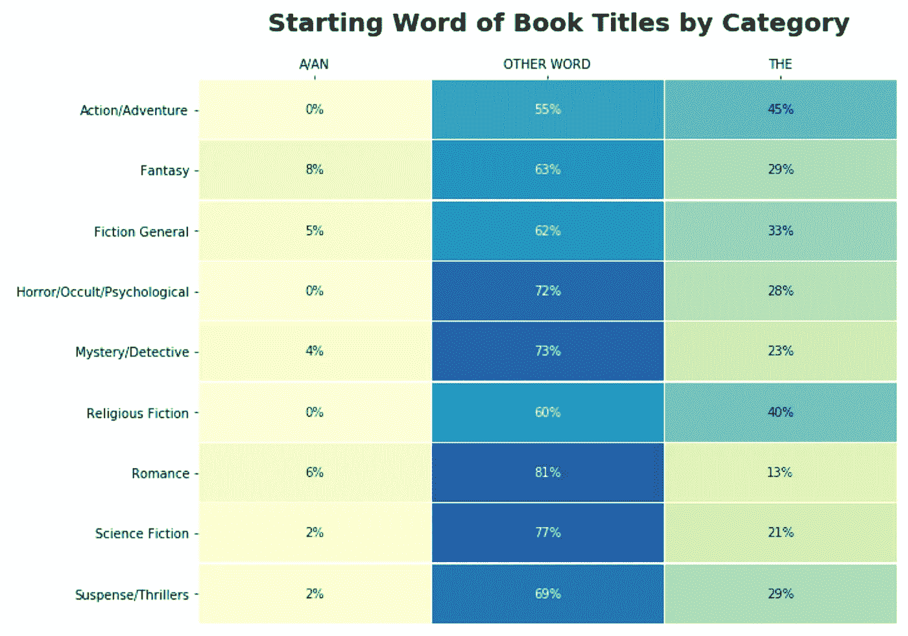
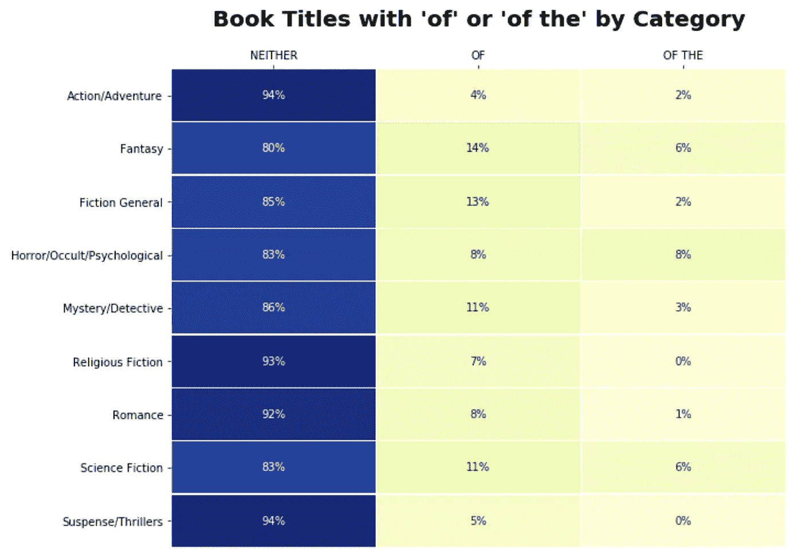

# 寻找纽约时报畅销书的趋势

> 原文：<https://towardsdatascience.com/finding-trends-in-ny-times-best-sellers-55cdd891c8aa?source=collection_archive---------20----------------------->

每个作家都梦想全职写作，但可悲的事实是，大多数作家挣的钱都不够养活自己，更不用说养家了。如果你登上了《纽约时报》畅销书排行榜，你将写作作为职业的机会将会更高，尤其是如果它在排行榜上停留了许多周，因为《纽约时报》畅销书排行榜与图书销售密切相关。那么，有什么诀窍可以让这一切发生吗？我对《纽约时报》2008 年至 2016 年的畅销书排行榜**做了一些分析，看看我是否能找到任何重要的趋势。**

# 选择类别/流派

如下图所示，悬疑/惊悚小说和普通小说在畅销书排行榜中所占的比例一直高于其他任何类别。请注意，这并不意味着这些类别的书一定更有可能成为畅销书，但是*确实*表明这些类别比其他类别卖得更好，因此这些类别的书有更大的机会成为畅销书。

一般小说是相当广泛的，但包括任何小说，不能被归类到任何其他子类。这可能意味着生活片，文学，和其他一般的小说。它也被称为主流小说。

# 性别差距？

畅销书排行榜显示，男性和女性接近分榜。合著的书肯定不那么普遍了，但仍然占据了很大的比例，尽管其中一个合著者通常已经是畅销书了。名单上的大多数书只有一个作者。

# 赢家拿走大部分产业

詹姆斯·帕特森以他的名字出现 408 次而雄踞榜首。这包括他和别人合著的书。他的第一本书出版于 1976 年，直到 1993 年，他的第八部小说才登上畅销书排行榜。他现在是纽约时报畅销书排行榜上书籍最多的吉尼斯世界纪录保持者。

约翰·格里森姆在 1989 年出版了他的第一部小说，但是是他在 1991 年出版的第二部小说让他登上了畅销书排行榜。

这些排名前 20 位的作者占据了畅销书排行榜的 29%,而在分析的 8 年时间跨度中，610 位作者占据了另外的 71%。一个作者出现在榜单上的平均时间是 13 周，中位数是 5 周。大多数作者只在名单上呆了一周。

# 什么书最受欢迎？

另一方面，这些是最常出现在清单上的书。《帮助》是凯瑟琳·斯托克特第一部也是唯一一部出版的小说，《所有我们看不见的光》是安东尼·杜尔第二部出版的小说。两者都可以归类为一般小说，以历史为题材。

一本书在榜单上停留的平均周数是 5 周，中位数是 3 周。和作者一样，大多数书只能在榜单上停留 1 周。

# 书名的趋势

假设你已经写完了你的小说，和一个出版商签了一本书，现在正为封面和书名而紧张。某些书名比其他的表现好吗？

## 起始词

清单上的大多数书都不是以“A/An”或“the”开头，但根据你写作的体裁，“The”通常是标题中的第一个词(参见动作/冒险或宗教小说)。

起始词真的有影响吗？一些出版商强调要让书名“谷歌化”。人们很容易找到你的书吗？

使用“A”或“The”可能会对图书在图书馆或实体店中按字母顺序的位置造成一些混乱，或者可能会抑制人们对标题的本能反应。(作者的假设。)

## 使用“of”

另一组要看的是使用介词" of "的书，以及有多少书的书名后面有一个" the "。如下所示，列表中的大多数书都没有使用介词，即使使用了，也不会经常使用“the”。

# 结论

如果一本书上了畅销书排行榜，它很可能是一个作者写的悬疑/惊悚或普通小说。标题可能不会以“A”或“The”开头，也不会包含“of”。

即使你的书登上了榜单，也很可能只会停留 3 到 5 周，而且在这 8 年的时间跨度中，大多数作者总共只会在榜单上停留 5 周，尽管每位作者在榜单上的平均周数被那些似乎一直生活在榜首的名人向上倾斜了。

不幸的是，用于这种分析的数据不包括一本书写得有多好，它是如何营销的，或许多其他因素，这些因素无疑对图书销售非常重要。Erica Verillo 在她的[帖子](https://writingcooperative.com/what-are-the-most-popular-literary-genres-6db5c69928cc)中说得很好

> *归根结底，最成功的作家遵循了自己的想法、灵感和灵感。*

但是，如果你有选择，选择一个喜欢惊悚片或主流小说的缪斯。