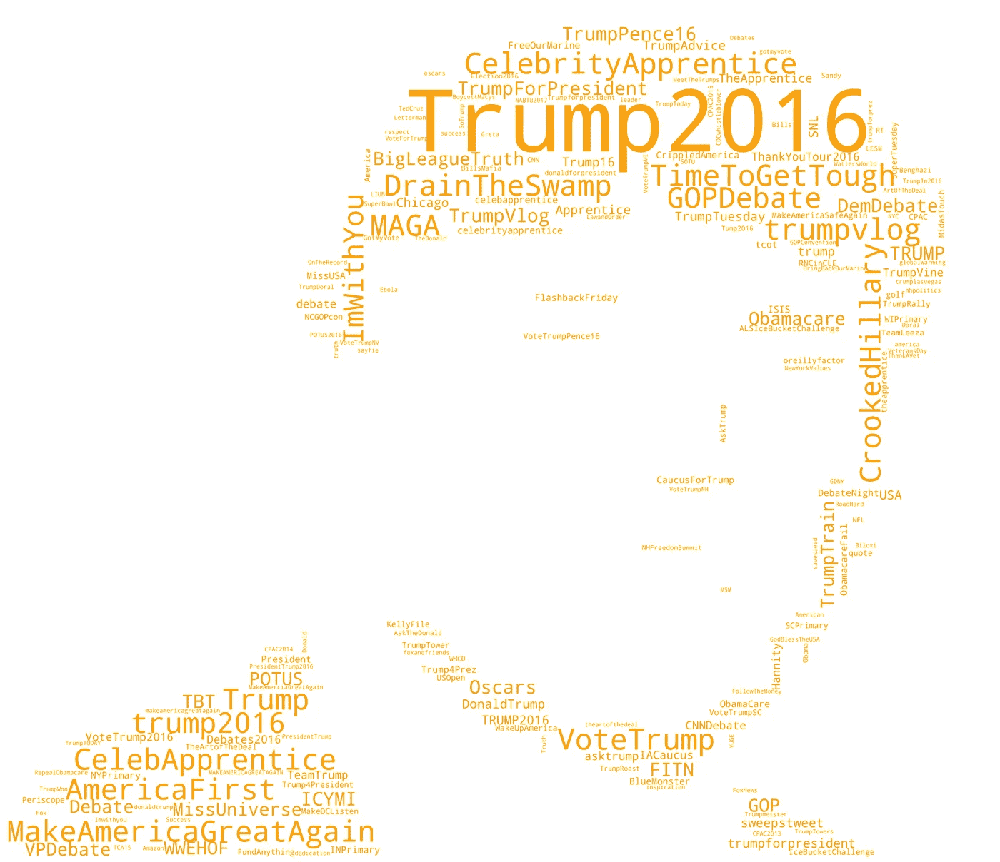
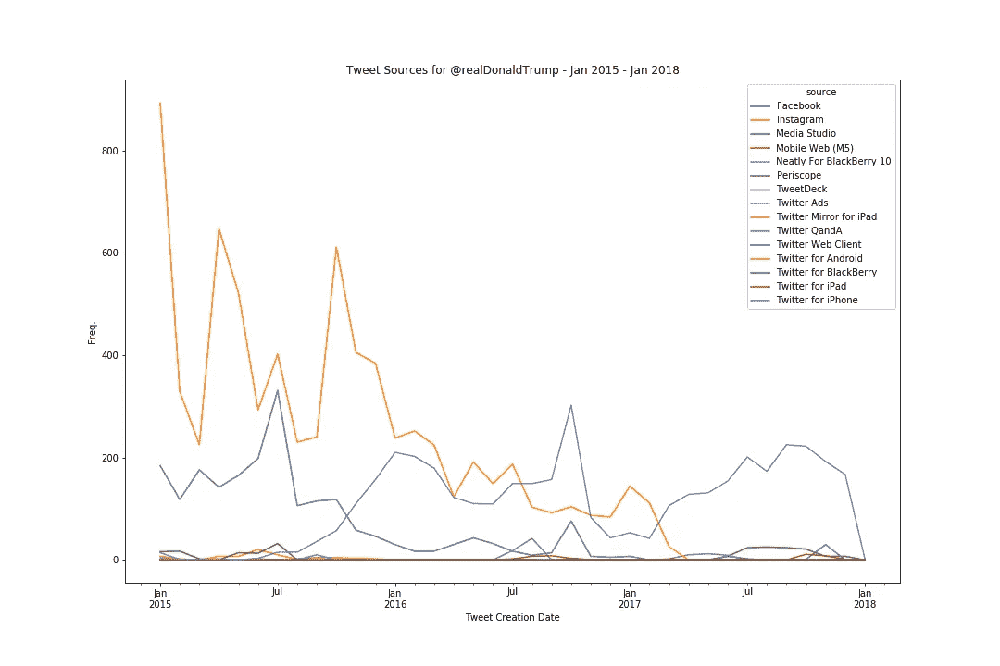
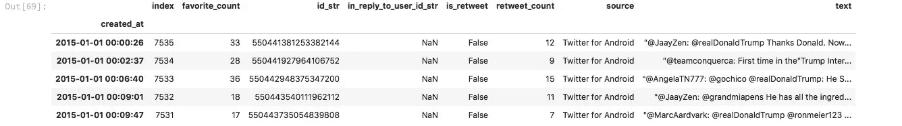
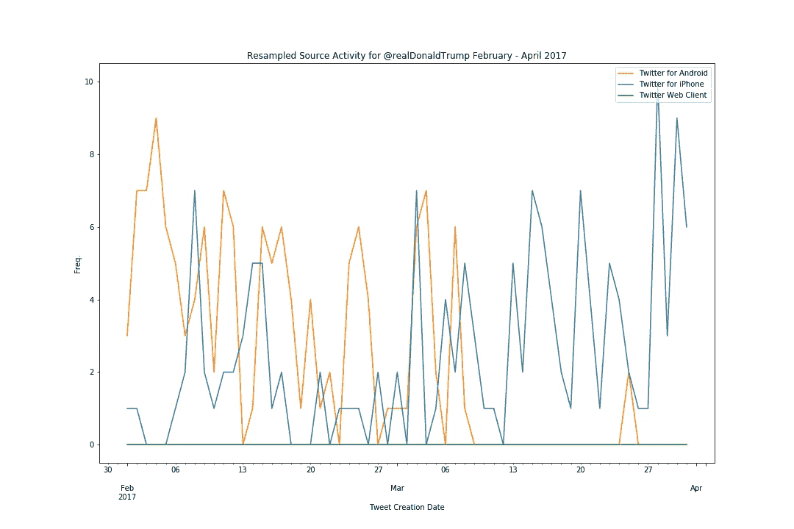
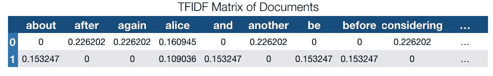
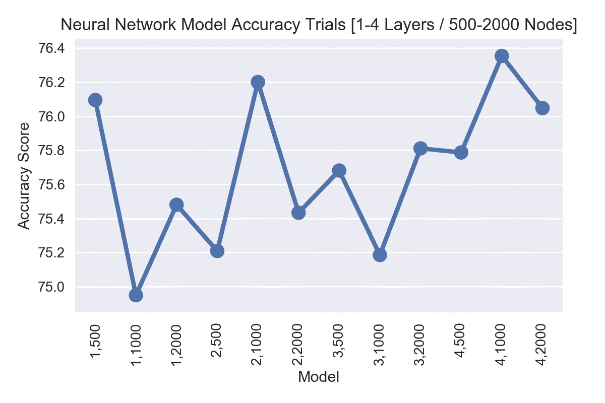
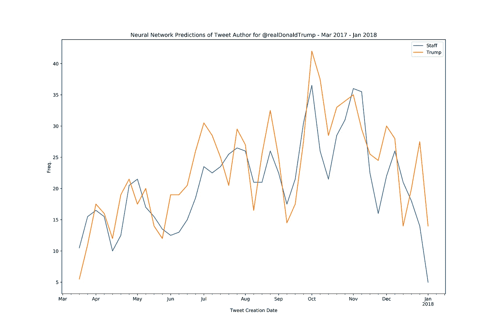
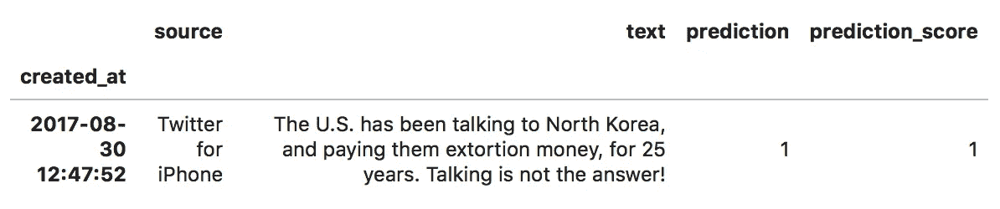

# 用神经网络寻找川普

> 原文：<https://towardsdatascience.com/finding-trump-with-neural-networks-4419468e0624?source=collection_archive---------5----------------------->

## 当总统发微博时，我们怎么知道谁是真正的键盘后面的人？有了训练有素的神经网络，我们也许能找到答案。

在 2018 年 3 月之前，唐纳德·特朗普(Donald Trump)在担任总统期间曾[使用未经授权的个人安卓手机](https://www.theguardian.com/technology/2017/mar/20/bye-bye-android-has-donald-trump-finally-upgraded-his-phone)。虽然这让他的工作人员感到焦虑，但对于记者和研究人员来说，这对于区分总统本人的话和白宫工作人员的话特别有用。有了 Twitter 的 API——Twitter 为任何想要利用其数据的人提供的网关——提供每条推文的“来源”信息，就可以合理地假设，如果“来源”是 Android，那就是纯特朗普。

然而，正如你从下面的图表中看到的，该图表按照推文频率(y 轴)绘制了推文的月份(x 轴)，在 2017 年 3 月左右，Android 的活跃度下降，iPhone 的活跃度上升。

Chart showing Tweet activity for “@realDonaldTrump@ split by source.

正如白宫社交媒体主任小丹·斯卡维诺(Dan Scavino Jr .)透露的那样，特朗普已经在 3 月中旬搬到了 iPhone。[媒体猜测](https://www.theverge.com/2017/3/29/15103504/donald-trump-iphone-using-switched-android)这一变化是出于安全考虑，个人机器人规避了白宫的机构管理。虽然对白宫工作人员来说是好事，但(不)预期的后果也意味着特朗普本人写的推文现在与他的工作人员在 POTUS 账户上写的推文混在一起。由于 Twitter 已经成为白宫沟通的一个关键组成部分，加上美国总统任期内的异常事态，能够区分总统本人和他的工作人员的推文变得相当重要。输入计算解！—一个经过训练的神经网络，可以仅通过推文文本识别特朗普创作的推文。

**在我们开始之前…**

首先，应该指出的是，这种建模纯粹是一种练习。我喜欢技术转移和学习新技能的借口。有时候，这些借口会变成我学生的完整论文和新课程，但通常它们会被卡在一个数字抽屉里。类似的练习已经使用其他机器学习技术完成了，我鼓励任何感兴趣的人去[阅读关于它的](http://didtrumptweetit.com)。

然而，对于这个特定的项目，我将看看我们是否可以训练一个神经网络，纯粹通过推文的文本来识别特朗普。神经网络是计算机模拟，其运行方式类似于我们大脑的工作方式。它们拥有高度互联的人工神经元，可以根据流经它们的数据来适应和改变自己。对于这个网络的数据，我使用了特朗普推特档案，该档案提供了从 2009 年开始的特朗普账户推特的[储存库](https://github.com/bpb27/trump_tweet_data_archive)。不幸的是，数据归档似乎已于 2018 年 1 月停止，但我们将利用我们在练习中获得的信息进行工作。对于有编程头脑的人来说，详细描述[代码的记事簿是可用的](https://github.com/Minyall/trump_tweet_classifier)，但我的目的是给非程序员的社会科学家一个这些过程如何工作的要点，以便他们可以在自己的项目中考虑它们。

**检查数据**

首先，我将 2015 年、2016 年和 2017 年的精简数据集加载到一个[数据框架](http://pandas.pydata.org/pandas-docs/version/0.15.2/index.html)中，删除所有转发，因为这些转发将包含并非来自特朗普或他的工作人员的文本。你可以加入 2018 年的数据集，但它将于 1 月中旬结束。

An example of the data after loading into the Pandas DataFrame

首先，我快速浏览了一下数据，看看账户上使用了哪些类型的资源及其活动。在整个综合数据集中，该账户的前三大来源是 Android、iPhone 和 Twitter 网络客户端，尽管最后一个似乎在特朗普宣布参加 2015 年 6 月总统大选之前最活跃。查看 Twitter 网络客户端的几个例子，并不完全清楚网络客户端上的人是唐纳德还是助手。

> ICYMI，@IvankaTrump 的 int。在@TODAYshow 上讨论@Joan_Rivers &选手在@学徒 NBC[http://t.co/Em7bgj10SM](http://t.co/Em7bgj10SM)上的竞争
> 
> “@nanaelaine7 @realDonaldTrump 只有你能让它再次伟大。你的计划是现实中唯一的计划。特朗普让美国变得伟大”
> 
> 。@megynkelly 最近说不能被川普拉拢。她各方面都那么一般，谁他妈想追求她！
> 
> 事实✔️on“红线”在叙利亚:人权委员会“我不在那里。”事实:2012 年 8 月划定的界限。人权委员会 Secy 的状态，直到 2 月 13 日。[https://t.co/4yZjH3TR5B](https://t.co/4yZjH3TR5B)

目前还不清楚这些人是应该被排除在数据之外，还是应该被归类为特朗普或工作人员。对于这个练习，我让他们作为工作人员，因为我们的主要假设是特朗普从 Android 发推文，但稍后返回并尝试其他分类会很有趣。

我们已经知道，特朗普是在 2017 年 3 月的某个时候转向 iPhone 的，因此值得深入研究并定位 Android 变暗的确切日期。利用熊猫对时间序列数据进行重新采样的奇妙能力，我将数据重塑为 2017 年 2 月至 4 月期间每天的推文计数，并按来源进行拆分。

Graph demonstrating Trump’s Android phone finally went dark on the 8th March 2018 (…kind of).

从图表中我们可以看到，一般来说，Android 手机的最后一次使用是在 2018 年 3 月 8 日。来自 Android 的两条推文在 3 月 25 日再次出现，但似乎无关紧要，因此为了简单起见，我们将忽略它们，因为从 4 月到数据集结束，不再有 Android 推文出现。

在此基础上，我将数据一分为二，iPhone 前和 iPhone 后的数据。对于 iPhone 之前的数据，我们可以假设任何 Android 推文都是特朗普，任何其他推文都是员工。对于后 iPhone 时代的数据，我们不能再做这样的假设。这意味着我们需要训练我们的神经网络模型来区分 iPhone 前数据上的特朗普和工作人员推文，然后使用该模型来预测 iPhone 后数据上的来源。轻松点。

**像数字一样的神经网络——大量的数字**

训练网络的第一步是使单词对它来说是可理解的。我们通过将来自 Python 库“Scikit Learn”的 [TFIDF 矢量器](http://scikit-learn.org/stable/modules/generated/sklearn.feature_extraction.text.TfidfVectorizer.html)与整个文本数据相匹配来实现这一点。这个阶段基本上创建了一个小模型，记录所有推文中的每个独特的词，以及它在数据中的流行程度。我们将这个模型放在手边，因为我们将需要它将我们不同的文本数据集转换成神经网络可以理解的数字模式。矢量器的工作原理是将一串文本转换成一个非常宽的电子表格，每个文档占一行，每个可能的单词占一列。计算的值可以是单词在文档中出现的次数，1 或 0 表示它是否出现过，或者在 TFIDF 的情况下，是基于单词对该文档的重要性的分数，同时考虑文档本身和数据集中的所有其他文档。下面用《爱丽丝梦游仙境》中的两段摘录和 TFIDF 单词分数的两行数组演示了这一点。

**但是它是怎么“知道”的呢？！—训练神经网络**

神经网络进行分类的方式是，通过向它们提供大量数据示例来训练它们，最重要的是，向它们提供模型应该预测的预期输出或标签。对于每个例子，模型将其预测与“正确”标签进行比较，对自身进行调整，然后再次尝试。训练继续进行，直到尽可能接近正确预测训练数据的所有实例的分类的理想情况。在我们的例子中，我们为模型提供了大量的推文，对于每条推文，我们都告诉模型它是特朗普的推文还是员工的推文，直到它的预测非常接近正确的类别。

通常，经过多次迭代训练后，神经网络模型在将其预测与预期结果进行匹配时会变得非常准确，但实际上，我们想知道它对从未见过的推文的分类预测会有多好。我们可以通过保留一定比例的训练数据来评估神经网络做出这些预测的效果，以便这些推文永远不会被训练中的模型看到。然后，我们要求模型预测推文作者，并根据我们已经分配的类别检查其预测。对于我建立的最终模型，结果是一个模型在预测它见过的训练数据中的标签方面的准确率为 97.6%，在预测它从未见过的推文中的准确率为 76.8%。然而，人们不只是建立一个模型。首先你建立 120 个模型！

**为您选择正确的神经网络…**

通常，在处理文本数据时，机器学习的改进来自对训练数据的更好管理，例如在我们的情况下，要么只关注 iPhone 和 Android 推文，要么考虑特朗普是否也要对其他平台的推文负责。我们也可能会考虑是否更好地预处理文本(清除噪音，正确识别表情符号，删除网址等)。)可能是个不错的决定。然而，也可能这些噪声元素实际上是模型的最大信息量。在我们的例子中，在清除了推文中的网址、标签和表情符号后，我发现模型的准确性下降了 20%左右，这表明正是这些特征有助于识别。

然而，构建和使用神经网络的一个关键部分是选择你的网络有多少层，每层有多少个节点。这些不一定是可以通过算法选择的东西，它们因数据而异。一个建议是在不同数量的层和节点的不同模型形状上运行试验。对于每个模型形状，您都要多次训练和评估模型，每次都使用训练数据的不同子集。对于每个模型形状，取其试验的平均分，并查看哪个模型在小块训练数据上表现最好。正如您在评估了 120 个独立构建的模型后所看到的，最好的结果是模型 010，这是一个包含 4 个隐藏层的神经网络，其中每个隐藏层包含 1000 个节点。请注意，简单地增加节点和层并不一定会提高预测能力，正确的模型“形状”通常取决于您正在处理的数据。

Making this Graph required building and training 120 different neural networks. You’d think it would look more impressive.

**大结局:找到特朗普**

在确定了要使用的最佳模型形状(1000 个节点的 4 个隐藏层)后，我们建立了一个全新的模型，并用我们所有的训练数据训练它，并转向我们迄今为止被忽视的特朗普改用 iPhone 后的推文数据集。在这种情况下，我们没有“正确”的标签，因为我们不再确定哪些推文来自特朗普的手机，哪些来自他的工作人员，因为它们都来自 iPhone 平台。我们使用原始的 TFIDF 矢量器转换文本，并将其提供给模型，要求它为我们提供预测；工作人员还是特朗普？。就活跃度而言，我们可以看到该模型在推文之间有相对均匀的划分，在某些日子工作人员的预测活跃度更高，而在其他日子特朗普的预测活跃度更高。

Trump and his staff put the work in equally. It’s a fair division of labour.

考虑到该模型在未公开数据上的准确率约为 77%,我们有必要单独检查推文，看看我们认为该模型在定性层面上的表现如何。从每个类别中随机抽取 10 个样本，为我们提供了一个很好的概览。对于特朗普撰写的那些预测的推文，我们看到了许多感叹号，许多强调的强烈措辞，一些反民主党的诽谤和许多与老狐狸和朋友的互动。工作人员发布的推文通常带有一个 URL，更多的是以详细描述的方式发言，并喜欢感谢和祝贺各种公民的努力。对于每个预测，您可以看到模型对自己的预测有多有信心，1 表示绝对有信心，0 表示没有信心。

*预测川普推特*

*预测员工推文*

对任何政治家来说，让多人通过一个被认定为一个人的账户“说话”会让公众很难搞清楚他们选出的官员到底是谁。对于那些希望让这些波兰人承担责任的人来说，这也增加了不确定性，因为他们可以振振有词地声称，他们一开始就没有写那条有问题的推文。然而，至少根据这个模型，这是 100%的特朗普，有 100%的信心。

*如果你对自己摆弄神经网络感兴趣，或者想知道我是如何建立模型的细节，这种转移的代码是* [*，可作为 Jupyter 笔记本*](https://github.com/Minyall/trump_tweet_classifier/blob/master/TrumpTweets.ipynb) *。*

*埃塞克斯大学的* [*ESRC 人权、大数据和技术项目*](https://www.hrbdt.ac.uk) *为这一转移提供了部分支持。*

这项工作得到了经济和社会研究委员会的支持[批准号 ES/ M010236/1]