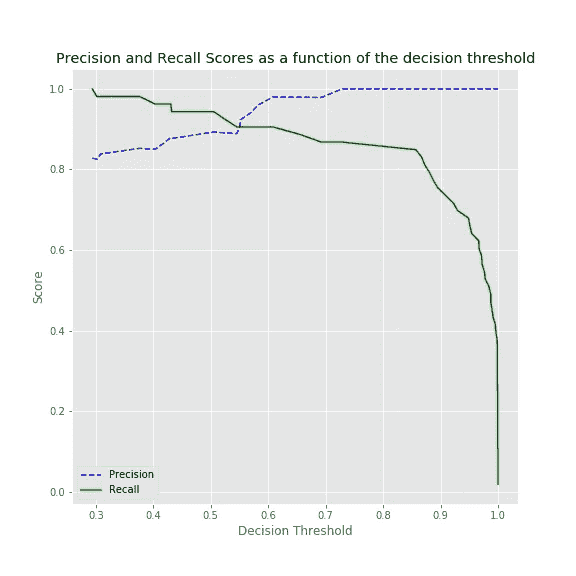
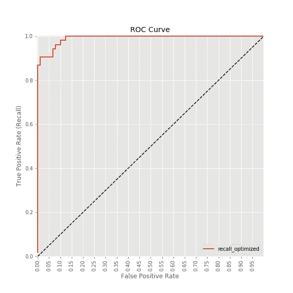

# 在 scikit-learn 中微调分类器

> 原文：<https://towardsdatascience.com/fine-tuning-a-classifier-in-scikit-learn-66e048c21e65?source=collection_archive---------0----------------------->


很容易理解，许多机器学习问题受益于作为其最佳性能度量的精确度或召回率，但实现这一概念需要详细过程的知识。我最初几次尝试为回忆(灵敏度)微调模型很困难，所以我决定分享我的经验。

这篇文章来自我的第一个 Kaggle 内核，我的目的不是构建一个健壮的分类器，而是想展示优化分类器的实用性。在下图 A 中，目标是将决策阈值向左移动。这最大限度地减少了假阴性，这在为本文选择的数据集中尤其麻烦。它包含 357 个良性和 212 个恶性乳腺活检图像的特征。假阴性样本相当于错过了恶性肿瘤的诊断。数据文件可以在[这里](https://www.kaggle.com/uciml/breast-cancer-wisconsin-data)下载。


The goal of this post is to outline how to move the decision threshold to the left in Figure A, reducing false negatives and maximizing sensitivity.

使用 scikit-learn，针对召回调整分类器可以(至少)通过两个主要步骤来实现。

1.  使用`[GridSearchCV](http://scikit-learn.org/stable/modules/generated/sklearn.model_selection.GridSearchCV.html)`通过搜索最佳超参数并保留具有最高召回分数的分类器来调整您的模型。
2.  使用精确回忆曲线和 roc 曲线调整决策阈值，这是一个更复杂的方法，我将详细介绍。

首先加载必要的库和数据。

通过统计`diagnosis`列可以找到阶级分布。b 代表良性，M 代表恶性。

```
B    357
M    212
Name: diagnosis, dtype: int64
```

转换类别标签，并将数据分成训练集和测试集。使用`stratify=True`的`train_test_split`导致训练集和测试集之间的一致类别分布:

```
# show the distribution
print('y_train class distribution')
print(y_train.value_counts(normalize=True))print('y_test class distribution')
print(y_test.value_counts(normalize=True))y_train class distribution
0    0.626761
1    0.373239
Name: diagnosis, dtype: float64
y_test class distribution
0    0.629371
1    0.370629
Name: diagnosis, dtype: float64
```

既然已经准备好了数据，就可以构建分类器了。

# 第一个策略:使用 GridSearchCV 和 scoring 参数优化灵敏度。

首先建立一个通用分类器并设置一个参数网格；随机森林有许多可调参数，这使它适合于`GridSearchCV`。`scorers`字典可以用作`GridSearchCV`中的`scoring`参数。当多个分数通过时，`GridSearchCV.cv_results_`将返回所提供的每种分数类型的评分标准。

下面的函数使用 [GridSearchCV](http://scikit-learn.org/stable/modules/generated/sklearn.model_selection.GridSearchCV.html) 根据`param_grid`中的参数组合来拟合几个分类器。来自`scorers`的分数被记录下来，最佳模型(由`refit`参数评分)将被选择并“改装”成完整的训练数据，供下游使用。这也对伸出的`X_test`进行预测，并打印混淆矩阵以显示性能。

包装器功能的要点是根据所选择的评分标准类型快速重用代码以适合最佳分类器。首先，试试`precision_score`，它可以限制误报的数量。这不太适合最大灵敏度的目标，但允许我们快速显示针对`precision_score`优化的分类器和针对`recall_score`优化的分类器之间的差异。

```
grid_search_clf = grid_search_wrapper(refit_score='precision_score')Best params for precision_score
{'max_depth': 15, 'max_features': 20, 'min_samples_split': 3, 'n_estimators': 300}

Confusion matrix of Random Forest optimized for precision_score on the test data:
     pred_neg  pred_pos
neg        85         5
pos         3        50
```

`param_grid`中每个参数组合的精度、召回率和准确度分数都存储在`cv_results_`中。这里，pandas 数据框架有助于可视化每次分类器迭代的得分和参数。这是为了表明，尽管分类器之间的准确率可能相对一致，但很明显，准确率和召回率之间存在权衡。按精度排序，最好的评分模型应该是第一条记录。这可以通过查看第一条记录的参数并将其与上面的`grid_search.best_params_`进行比较来检查。

```
results = pd.DataFrame(grid_search_clf.cv_results_)
results = results.sort_values(by='mean_test_precision_score', ascending=False)results[['mean_test_precision_score', 'mean_test_recall_score', 'mean_test_accuracy_score', 'param_max_depth', 'param_max_features', 'param_min_samples_split', 'param_n_estimators']].round(3).head()
```

该分类器针对精度进行了优化。为了比较，为了显示`GridSearchCV`如何选择最佳分类器，下面的函数调用返回一个为召回优化的分类器。网格可能与上面的网格相似，唯一的不同是召回率最高的分类器将被重新调整。这将是癌症诊断分类问题中最理想的度量，在测试集混淆矩阵上应该有更少的假阴性。

```
grid_search_clf = grid_search_wrapper(refit_score='recall_score')Best params for recall_score
{'max_depth': 5, 'max_features': 3, 'min_samples_split': 5, 'n_estimators': 100}

Confusion matrix of Random Forest optimized for recall_score on the test data:
     pred_neg  pred_pos
neg        84         6
pos         3        50
```

再次复制生成结果表的相同代码，只是这一次最好的分数将是`recall`。

```
results = pd.DataFrame(grid_search_clf.cv_results_)
results = results.sort_values(by='mean_test_precision_score', ascending=False)results[['mean_test_precision_score', 'mean_test_recall_score', 'mean_test_accuracy_score', 'param_max_depth', 'param_max_features', 'param_min_samples_split', 'param_n_estimators']].round(3).head()
```

第一种策略没有为`recall_score`产生令人印象深刻的结果，与为`precision_score`优化的分类器相比，它没有显著减少(如果有的话)假阴性的数量。理想情况下，在设计癌症诊断测试时，分类器应尽可能减少假阴性。

# 策略二:调整决策阈值，确定操作点

`precision_recall_curve`和`roc_curve`是可视化分类器中灵敏度-特异性权衡的有用工具。它们有助于告知数据科学家在何处设置模型的决策阈值，以最大化灵敏度或特异性。这被称为模型的“工作点”。

> 理解如何在 scikit-learn 中微调分类器的关键是理解方法`.predict_proba()`和`.decision_function()`。这些返回样本被预测在一个类中的原始概率。这是与调用`.predict()`方法返回的绝对类预测的一个重要区别。

为了使这种方法适用于 scikit-learn 中的所有分类器，要知道有些分类器(如 RandomForest)使用`.predict_proba()`，而有些分类器(如 SVC)使用`.decision_function()`。`RandomForestClassifier`的默认阈值是 0.5，所以以此为起点。创建一个名为`y_scores`的类概率数组。

```
y_scores = grid_search_clf.predict_proba(X_test)[:, 1]# for classifiers with decision_function, this achieves similar results
# y_scores = classifier.decision_function(X_test)
```

为分类器生成精确召回曲线:

```
p, r, thresholds = precision_recall_curve(y_test, y_scores)
```

这里的`adjusted_classes`是一个简单的函数，用于返回上面计算的`y_scores`的修改版本，只是现在将根据概率阈值`t`分配类别标签。下面的另一个函数绘制了相对于给定阈值`t`的精度和召回率。

多次重复执行该功能，每次改变`t`，调整阈值，直到出现 0 个假阴性。在这次特别的运行中，我不得不一直降到 0.29，然后将假阴性降低到 0。

```
precision_recall_threshold(p, r, thresholds, 0.30)pred_neg  pred_pos
neg        79        11
pos         1        52
```


查看精确度和召回率之间权衡的另一种方式是将它们一起绘制为决策阈值的函数。

```
# use the same p, r, thresholds that were previously calculated
plot_precision_recall_vs_threshold(p, r, thresholds)
```



最后，ROC 曲线显示，为了实现 1.0 的召回，模型的用户必须选择一个允许某些假阳性率> 0.0 的操作点。

```
fpr, tpr, auc_thresholds = roc_curve(y_test, y_scores)
print(auc(fpr, tpr)) # AUC of ROC
plot_roc_curve(fpr, tpr, 'recall_optimized')0.9914046121593292
```



感谢跟随。针对特异性和敏感性调整模型的概念应该更加清晰，并且您应该能够轻松地在您的 scikit-learn 模型中实现这些方法。我很想听到改进代码和/或分类器的建议。