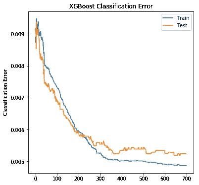
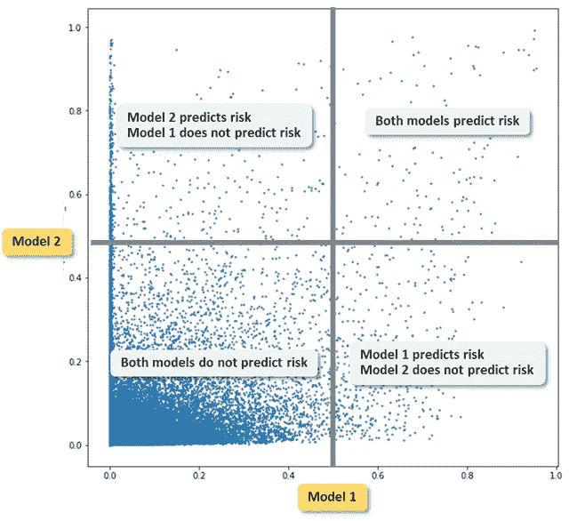

# 像老板一样在 Python 中微调 XGBoost

> 原文：<https://towardsdatascience.com/fine-tuning-xgboost-in-python-like-a-boss-b4543ed8b1e?source=collection_archive---------0----------------------->

XGBoost(或 e**X**treme**G**radient**Boost**ing)不再被引入，它在太多的数据科学竞赛中被证明是相关的，如果你刚刚开始使用它，它仍然是一个很难微调的模型。

为什么微调是关键？因为如果你有大数据集，你对 5 个不同的参数进行简单的网格搜索，每个参数有 5 个可能的值，那么你将有 5⁵= 3125 次迭代。如果一次迭代需要运行 10 分钟，那么在获得参数之前，您将有超过 21 天的等待时间(我不说 Python 崩溃，不让您知道，并且您在意识到它之前等待了太长时间)。

在这里，我想你首先正确地完成了你的特性工程工作。特别是分类特征，因为 XGBoost 不接受输入中的分类特征。

# 1.列车测试分割、评估指标和提前停车

在进行参数优化之前，先花些时间设计模型的诊断框架。

XGBoost Python api 提供了一种方法，通过增量树的数量来评估增量性能。它使用两个参数:“eval _ set”——通常是训练集和测试集——以及相关的“eval_metric”来测量这些评估集上的误差。

绘制结果的时间:

在分类误差图上:看起来我们的模型学习了很多，直到 350 次迭代，然后误差非常缓慢地减少。这反映在测试集上，当迭代次数从 350 增加时，我们不一定看到性能。有了这个，你已经可以考虑在 350 棵树后进行切割，并为将来的参数调整节省时间。

如果你不使用 scikit-learn api，而是使用纯 XGBoost Python api，那么还有[提前停止参数](https://xgboost.readthedocs.io/en/latest/python/python_intro.html#early-stopping)，它可以帮助你自动减少树的数量。

# 2.是时候微调我们的模型了

当您还没有运行任何模型时，从哪里开始呢？

1.  为关键输入填充合理的值:
    **learning _ rate**:0.01
    **n _ estimators**:100 如果你的数据量很大，1000 如果是中低的
    **max _ depth**:3
    **子样本**:0.8
    **col sample _ bytree**:1
    **gamma**
2.  运行 model.fit(eval_set，eval_metric)并诊断您的第一次运行，特别是 n_ **估计器**参数
3.  优化**最大深度**参数。它表示每棵树的深度，即每棵树中使用的不同特征的最大数量。我建议从一个低的 **max_depth** (例如 3)开始，然后递增 1，当增加它没有性能增益时停止。这将有助于简化您的模型，避免过度拟合
4.  现在玩一下学习率和避免过拟合的特性:
    **learning_rate** :通常在 0.1 到 0.01 之间。如果你关注的是性能，并且有足够的时间，在增加树的数量的同时，逐渐降低学习速度。
    **子样本**，这是每棵树用于构建该树的行数百分比。我建议不要取出太多行，因为性能会下降很多。取 0.8 到 1 之间的值。
    **colsample_bytree** :每棵树使用的列数。为了避免一些列在预测中占据过多的份额(就像在推荐系统中，当你推荐了购买最多的产品而忘记了长尾理论)，去掉一个适当比例的列。如果您有许多列(尤其是如果您进行了一次热编码)，则值为 0.3 到 0.8；如果您只有几列，则值为 0.8 到 1。
    **gamma** :通常被误解的参数，它作为一个正则化参数。要么 0，要么 1，要么 5。

你可以走了！

参数 **base_score** 什么都没给我。要么是和收敛没关系，要么是不知道怎么用。

# 3.其他备注

查看 [feature_importance 表](/interpreting-random-forest-and-other-black-box-models-like-xgboost-80f9cc4a3c38)，并确定解释超出其应有范围的变量。你的数据可能有偏差！你的模型和参数都不相关。

比较两个模型的预测，其中一个模型比另一个模型多使用一个变量。具体比较预测不同的数据(预测类不同)。

请记住，在实际项目中，如果您今天将 XGBoost 模型工业化，明天您将希望改进该模型，例如通过向模型添加新的特性或简单地添加新的数据。为了比较这两个模型，绘制属于类别 1 的概率(风险= proba > 50%)，如下所示:

你会知道你的新型号与旧型号相比如何，它们哪里相似，哪里不同。同样，绘制两个 feature_importance 表，并比较两个模型中最相关的要素。

我希望这篇文章对你有用，如果有用，考虑至少给 50 次掌声:)