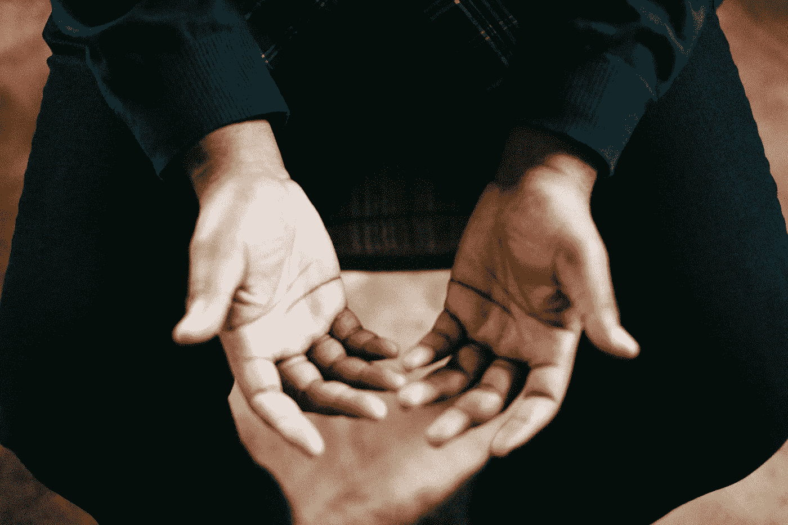
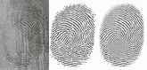
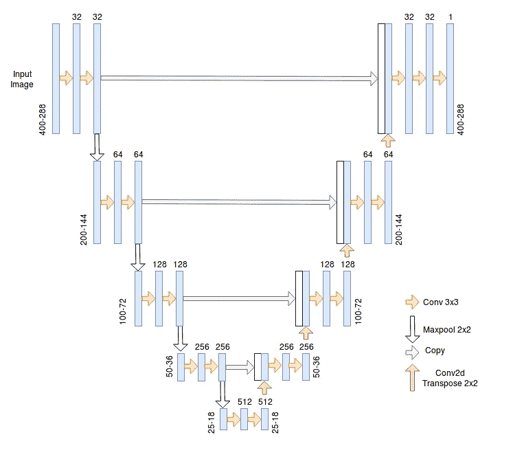
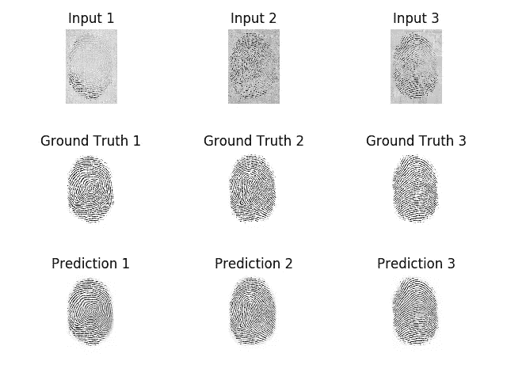
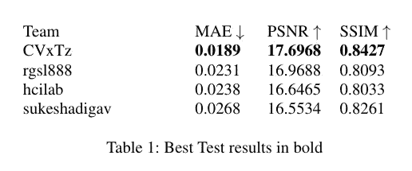

# 基于全卷积网络的指纹去噪和修复

> 原文：<https://towardsdatascience.com/fingerprint-denoising-and-inpainting-using-fully-convolutional-networks-e24714c3233?source=collection_archive---------13----------------------->

By Jeremy Yap on [https://unsplash.com/](https://unsplash.com/)

指纹是主要的身份识别手段之一，因为两个人拥有相同指纹的概率估计为 640 亿分之一。这意味着能够准确有效地处理和匹配指纹对是一项宝贵的资产。这就是这个项目的动机，在这个项目中，我们试图从噪声失真的观察中提取一个干净的指纹图像。

所有图像都包含某种形式的噪声。这种噪声可能是由于采集设备、压缩方法或应用于图像的处理造成的。这促使研究人员研究去噪和修复等方法和工具来缓解这个问题。它们被用作预处理步骤，为目标任务(可能是分类、分割、匹配……)准备图像。在我们的例子中，最终目标是提高指纹错误接受率或错误拒绝率。

深度学习，特别是深度卷积神经网络的最新进展，通过展示学习有噪图像到“干净”图像之间的映射的能力，实现了去噪和去噪，并改进了现有技术。

在这篇文章中，我们将使用一种类似于 U-Net [1]的架构，并展示它可以成功地应用于去噪和盲修复。

# 数据

[http://chalearnlap.cvc.uab.es/challenge/26/description/](http://chalearnlap.cvc.uab.es/challenge/26/description/)

我们将使用的数据集由 chalearn challenge 的组织者提供，由 84k 合成指纹图像组成，这些图像是使用 [Anguli:合成指纹生成器](http://dsl.cds.iisc.ac.in/projects/Anguli/)生成的。然后，通过添加随机变换(模糊、亮度、对比度、弹性变换、遮挡、划痕、分辨率、旋转)和背景图像，人为地降低这些图像的质量。
目的是从退化的观测数据中提取干净的指纹图像。我们使用平行数据集(噪声图像、指纹图像)作为模型训练的(输入、输出)。

# 模型

所用的架构如上图所示，与[1]中介绍的架构相似(除了我们填充输入而不是镜像边沿)。这种架构的一个重要优点是，在对像素进行预测时，它能够考虑更广泛的背景。这得益于上采样操作中使用的大量通道。
U-Net 的另一个重要特征是跳跃连接，因为它们通过减少消失梯度问题使训练更容易。

在代码中，它看起来像这样:

# 处理

输入图像的处理如下:

*   归一化:像素强度除以 255，因此它们在(0，1)范围内。
*   重新调整大小:由于最大池化，网络期望输入图像的每个维度可被 2⁴整除。
*   数据扩充:仅在训练期间执行。随机翻转(水平或垂直或两者)、随机剪切、随机平移(水平或垂直或两者)、随机缩放、随机对比度变化、随机饱和度变化、随机旋转。

# 培养

我们使用 Adam optimizer，初始学习率为 1e-4，每次验证损失稳定超过 3 个时期时，学习率降低 0.5，如果验证损失在最后 5 个时期没有改善，则停止学习。
在 1070 GTX 卡上使用 Keras 和 Tensorflow 后端完成实施。

# 结果

这种方法在所有三个指标上得到最好的结果([**【Mae】**](https://en.wikipedia.org/wiki/Mean_absolute_error)、 [**psnr**](https://en.wikipedia.org/wiki/Peak_signal-to-noise_ratio) 、 [**ssim**](https://en.wikipedia.org/wiki/Structural_similarity) )。尽管我们只在损失函数中使用了 MAE，但它似乎是其他两个指标的良好代理。
作为比较，rgsl888 使用了与我们相似的架构，但增加了扩张卷积以扩展网络的感受域。hcilab 使用分层方法，sukeshadigav 使用基于 M-Net 的卷积神经网络。

在这篇文章中，我们训练了一个深度神经网络，对指纹图像的噪声版本进行像素级预测，以消除噪声。我们展示了类似 U-Net 的架构可以在 Chalearn 竞赛的所有三个指标上取得最佳结果。

这里有代码:[https://github.com/CVxTz/fingerprint_denoising](https://github.com/CVxTz/fingerprint_denoising)

[1] Olaf Ronneberger、Philipp Fischer 和 Thomas Brox。生物医学图像分割的卷积网络。