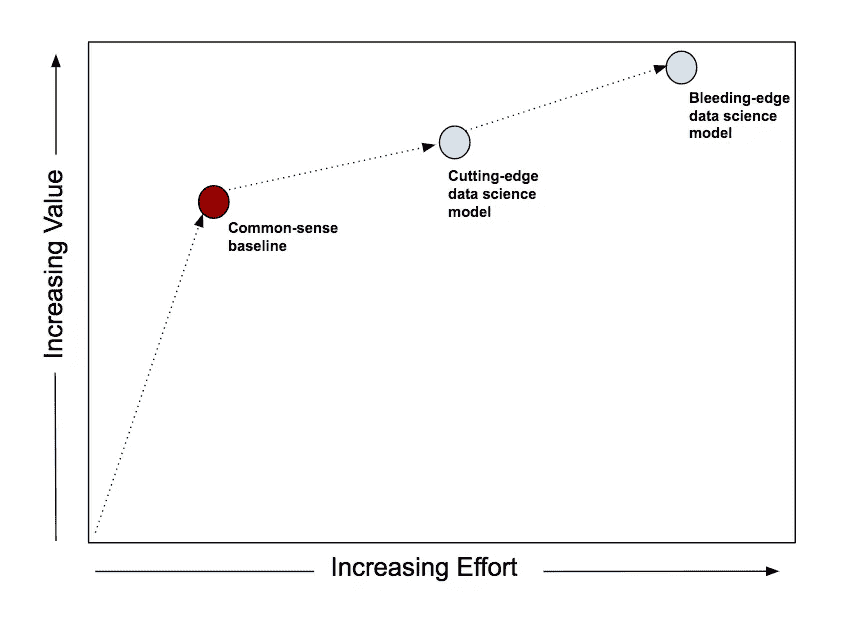
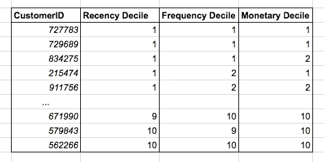
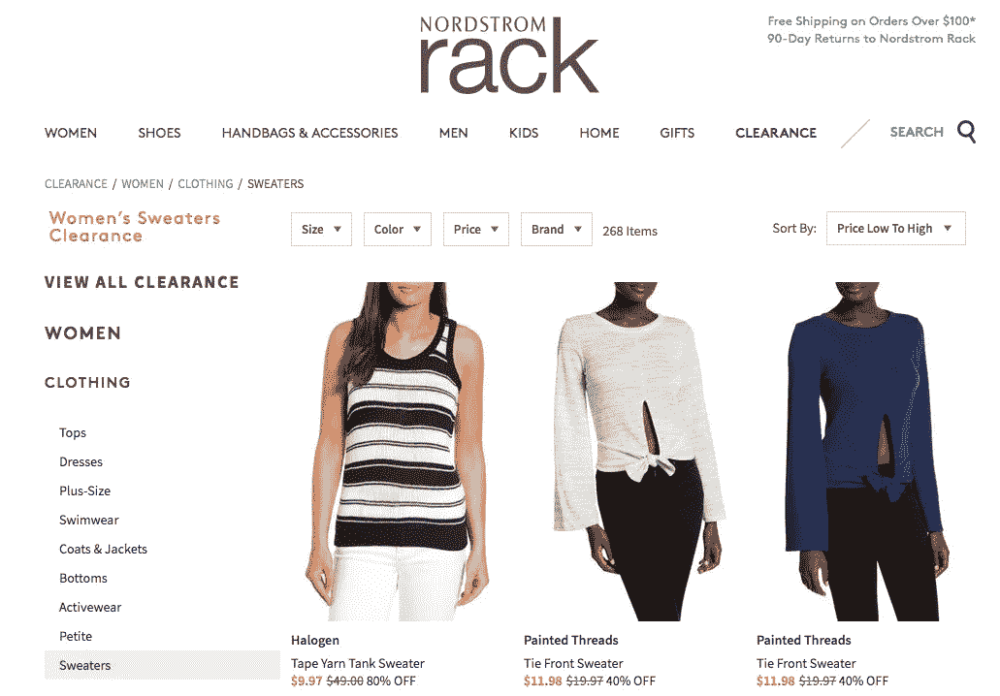
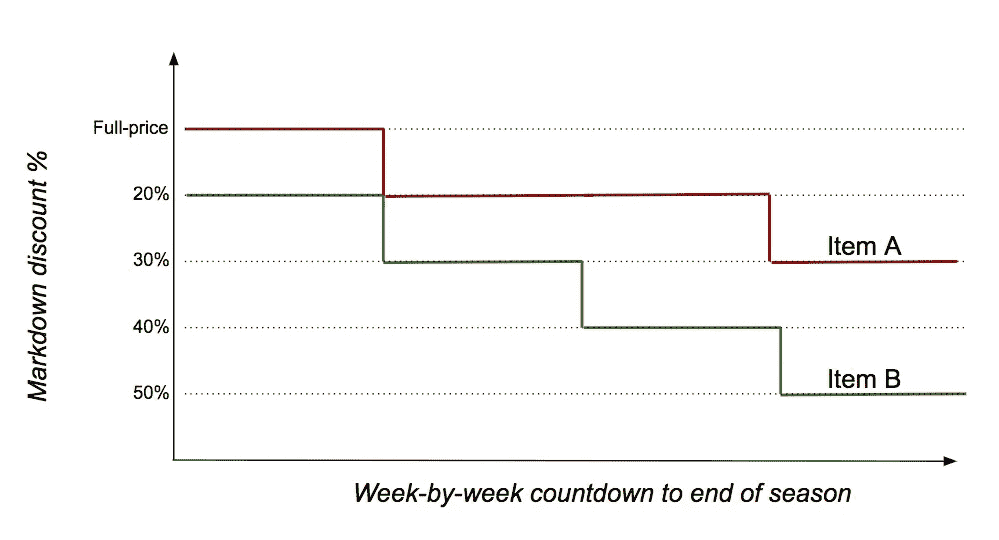

# 首先创建一个常识基线

> 原文：<https://towardsdatascience.com/first-create-a-common-sense-baseline-e66dbf8a8a47?source=collection_archive---------1----------------------->

当你着手解决一个数据科学问题时，很容易一头扎进去，开始构建模型。

不要。首先创建一个常识基线。

如果你不了解任何数据科学，常识基线就是你如何解决问题。假设你不知道监督学习，无监督学习，聚类，深度学习，随便什么。现在问问你自己，我会如何解决这个问题？

有经验的从业者经常这样做。

他们首先对数据和问题进行一些思考，对什么是好的解决方案有一些直觉，并考虑应该避免什么。他们与可能一直手动解决问题的业务最终用户交谈。

他们会告诉你，常识性的基线不仅实现简单，而且通常很难超越。即使数据科学模型超过了这些基线，它们也是以微弱的优势超过的。

我们将看三个例子，从直接营销的一个问题开始。

你在一家服装零售商工作，有一个客户数据库，其中包含了过去一年中从你这里购买过东西的每个客户的信息。你知道他们买了什么，花了多少钱，还有一些人口统计信息。

您想要发送一封邮件，宣传您最新的春季服装系列，并且您有足够的预算从数据库中向多达 100，000 名客户发送邮件。

你应该挑选哪 10 万个客户？

您可能渴望创建一个训练和测试数据集，并学习一些监督学习模型。也许是[随机森林](https://en.wikipedia.org/wiki/Random_forest)或者[梯度推进](https://en.wikipedia.org/wiki/Gradient_boosting)。甚至是[深度学习](https://en.wikipedia.org/wiki/Deep_learning)。

这些都是强大的模型，应该放在你的工具箱里。但首先，问自己这个问题:“如果这些方法都不存在，我必须靠自己的智慧生活，我将如何挑选最好的 10 万名客户？”。

常识告诉我们，你应该在数据库中挑选最忠诚的客户。毕竟，如果有人会找到感兴趣的邮件，这些客户会*。

你如何衡量忠诚度？直觉上，一个忠诚的顾客可能会买很多东西，花很多钱。这样你就可以计算出每个顾客在过去一年里花了多少钱，和你一起购物了多少次。

如果你这样做，看看数据，你会发现它很好地抓住了忠诚度。但你也会注意到，它挑选的客户在上半年是忠诚的，但在下半年似乎从地球上消失了。

您可以通过查看*顾客最近*如何与您一起购物来解决这个问题。如果消费和购物频率相似，昨天与您一起购物的客户比 11 个月前购物的客户对您更有价值。

总而言之，对于每个客户，您可以计算

*   他们在过去 12 个月里和你一起度过的时光
*   过去 12 个月的交易数量
*   自上次交易以来的周数

您可以*根据这三个指标对客户文件进行划分*，并相应地对客户列表进行排序。

挑选前 100，000 名客户。

恭喜你！你刚刚发现了古老的[近因-频率-货币(RFM)](https://en.wikipedia.org/wiki/RFM_(customer_value)) 启发式方法，一种久经考验的直销方法。

如果你想知道在十分位数列表中 R、F 或 M 哪个更重要，那么 [R 被认为是最重要的](https://www.technologyreview.com/s/427786/is-there-big-money-in-big-data/)。

RFM 方法易于创建、易于解释和易于使用。最棒的是，效果出奇的好。经验丰富的直销从业者会告诉你，即使更复杂的方法击败了 RFM，它们之间的差距也会比你想象的小得多，会让你怀疑复杂的东西是否值得努力。

接下来是产品推荐区的一个例子。

你工作的零售商有一个电子商务网站，你被要求建立一个产品推荐区，将显示在主页上。

它需要*个性化*——如果访问者以前来过你的网站，你需要利用你对他们的任何了解来推荐适合他们兴趣的产品。

关于这个主题的整本书([示例](https://www.amazon.com/Recommender-Systems-Textbook-Charu-Aggarwal/dp/3319296574/ref=sr_1_1)、[示例](https://www.amazon.com/Recommender-Systems-Introduction-Dietmar-Jannach/dp/0521493366/ref=sr_1_2))已经写好了，GitHub repos ( [示例](https://github.com/lyst/lightfm)、[示例](https://github.com/NicolasHug/Surprise))随时准备为您服务。你应该深入研究矩阵分解吗？

你也许应该在某些时候，但不是第一件事。您应该首先创建一个常识基线。

你能向访问者展示的最简单、最相关的东西是什么？

畅销产品！

当然，它们不是个性化的。但是，畅销产品之所以成为畅销产品，是因为有足够多的访问者购买它们，所以从这个意义上来说，至少有合理比例的访问者会发现它们是相关的，即使它们不是专门为它们选择的。

此外，你无论如何都需要准备好畅销商品，因为你需要*一些东西*展示给你没有数据的首次访问者。

挑选畅销书很简单。确定一个时间窗口(过去 24 小时，过去 7 天，…)，确定一个指标(收入、浏览量等)。)，决定重新计算的频率(每小时，每天，…)。)，编写查询并将其放入一些自动化中。

你可以用简单的方法调整这个基线，让它变得有点个性化。例如，如果您记得访问者在上次访问中查看的产品类别，您可以简单地从这些特定类别中(而不是从所有类别中)选择最畅销的产品，并在推荐区域中显示它们。在前一次访问中浏览了女装类别的访问者可以在当前访问中看到女装的畅销商品。

明确地说，上面描述的“调整”将涉及开发工作，因为你需要在访问中“记住”信息。但是，如果您计划构建并交付基于模型的个性化推荐，无论如何都需要这样做。

我们的最后一个例子来自零售价格优化。

作为一家服装零售商，你销售季节性商品，例如毛衣，这些商品需要在每个季度末从商店中清理出来，以便为下一季的产品腾出空间。降低这些季节性产品的价格以刺激购物者购买，这是业内的标准做法。

如果你折扣太少，你会在季末有剩余的商品，你将不得不以残值处理掉。如果你打折太多，你会卖完产品，但失去赚更多钱的机会。

在行业中，这种平衡行为被称为清仓优化或降价优化。

关于如何使用数据科学技术建模和解决这个问题，有大量的文献(例如，参见[牛津定价管理手册](https://www.amazon.com/Oxford-Handbook-Pricing-Management-Handbooks/dp/0198714815/ref=sr_1_1)中的第 25 章)。披露:是我写的)。

但是，让我们首先考虑如何创建一个常识基线。

假设您手头有 100 件毛衣，当前季节还剩 4 周。你可以一周改变一次价格，所以你有四次机会做某事。

本周该不该降价？

嗯，首先，这取决于如果你保持价格不变，你认为在接下来的 4 周内你能卖出多少台。

我们怎样才能对此有所了解呢？我们能做的最简单的事情就是看看上周卖出了多少台。

假设我们卖出了 15 台。如果接下来的 4 周与上周相似，我们将售出 60 台，到本季度结束时仍有 40 台未售出。

不太好。显然降价是理所应当的。

零售商有时使用折扣阶梯——20%折扣、30%折扣、40%折扣…——降价必须在阶梯上。最简单的做法是走到阶梯的第*级第*级，即将下周的价格打八折。

快进一周。假设你上周卖出了 20 台。您现在还剩 80 个单位，还有 3 周时间。如果在接下来的三周内保持相同的销售速度(例如每周 20 台)，您将在剩余的三周内售出 60 台，在季末还有 20 台未售出。所以，你又下了一个台阶，把折扣提高到 30%。

你明白了。每周重复，直到赛季结束。

不同的产品可能遵循不同的折扣路径，这取决于它们的销售率对折扣的反应。在下面的例子中，B 项比 a 项需要更多的折扣刺激。

这个常识基线可以用非常简单的 if-then 逻辑来实现。与上面的个性化推荐示例一样，它可以被调整(例如，不是仅使用上周的销售单位作为未来几周的“预测”，而是取最后几周的平均值)。

有了基线，您现在就可以向前迈进，尽您所能在这个问题上投入所有的数据科学火力。但是，将您所做的一切与常识基线的结果进行比较，以准确衡量努力的回报。

在许多问题领域，古老的 80-20 原则仍然有效。常识性的基线通常会让你很快达到 80%。

随着你在这个问题上投入越来越多的数据科学，你会看到更多的价值，但速度会越来越慢。现在，根据您的具体情况，您可能会决定采用复杂的方法来提取最后的价值。但是你应该对增量成本和收益有一个清晰的概念。

最终，常识基线会保护你免受由[理查德·费曼](https://en.wikipedia.org/wiki/Richard_Feynman)著名描述的危险。

> 第一个原则是你不能欺骗自己——而你是最容易被欺骗的人。

构建数据科学模型可能非常令人愉快，并且很容易让人误以为您复杂的、精心创建和调整的模型比实际情况更好(从成本/收益角度来看)。

常识基线快速传递价值，保护你免受自我伤害。让它们成为一种习惯。

*有一种不同的方式来思考这个问题——[提升建模](https://en.wikipedia.org/wiki/Uplift_modelling)——它考虑了给客户发送邮件的*增量*效果。