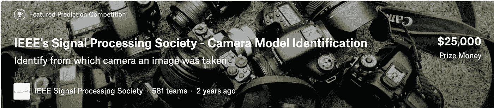
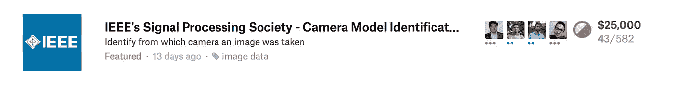
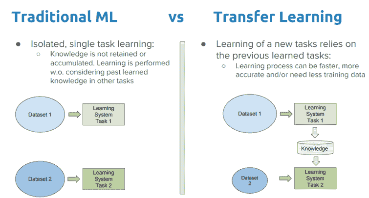
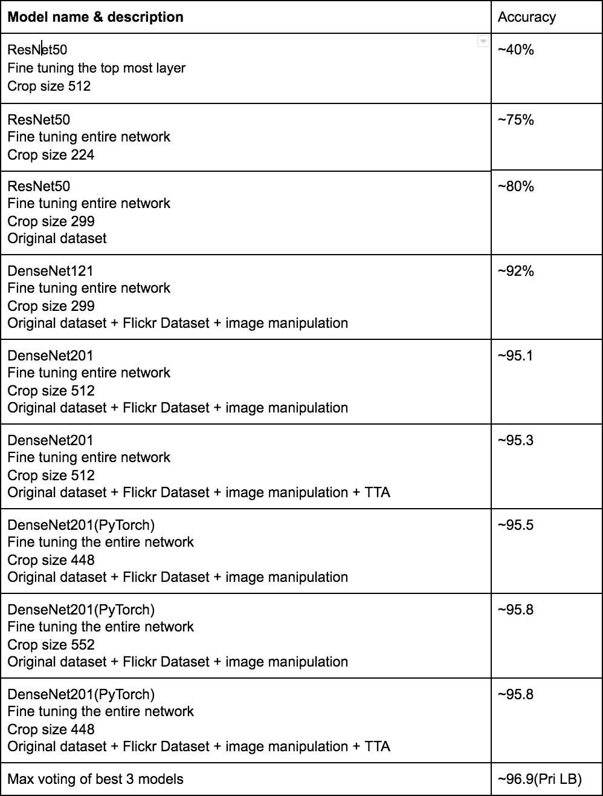
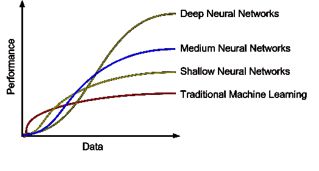

# 卡格尔的第一枚银牌

> 原文：<https://towardsdatascience.com/first-silver-medal-on-kaggle-d41819182ec9?source=collection_archive---------5----------------------->

Fig 1\. Camera Model Identification Challenge

**问题陈述:**摄像机型号识别

面临的挑战是建立一种算法，通过使用图像中固有的痕迹来识别哪种相机模型捕捉了图像。数据集中的图像来自 10 种不同的相机型号，如下所示:

*   索尼 NEX-7
*   摩托罗拉摩托 X
*   摩托罗拉 Nexus 6
*   摩托罗拉 DROID MAXX
*   LG Nexus 5x
*   苹果 iPhone 6
*   苹果 iPhone 4s
*   HTC One M7
*   三星银河 S4
*   三星 Galaxy Note 3

解决这个问题对犯罪调查有很大的影响，调查人员可以识别拍摄图像的相机，这有助于验证镜头。

# 受训模特

ImageNet 模型(如 ResNet、DenseNet 模型)经过微调，可以对前面提到的 10 种不同的摄像机进行分类。微调 ImageNet 权重和训练分类器只不过是迁移学习！！

Fig 2\. Transfer Learning

**转移学习直觉**

假设一个人正在努力学习如何骑自行车/滑板车。

**场景 1:** 他/她已经知道如何骑自行车，现在他/她正在学习骑滑板车。

场景 2: 他/她正在从头开始学习骑滑板车。

**在哪个场景中涉及的学习更多？🤔**

*显然在第二个场景中正确！*

由于这个人是从零开始学骑踏板车，他/她必须学会如何平衡踏板车，习惯不同的功能，如刹车或加速等..这需要花很多时间去学习。而一个已经知道如何骑自行车的人可以在学习骑自行车/踏板车时很容易地转移他的知识。

这同样适用于从零开始训练图像分类器，而不是使用 ImageNet 权重并用较低的学习速率微调权重来训练分类器。

以下是我们在本次比赛中使用的几个模型，并给出了相应的准确度分数。

***注:所有模型都用 ImageNet 模型权重初始化。***

Fig 3\. Accuracy for different models & settings.

**作为一个团队，我们提交了大约 63 份作品&最后 3 份作品的最高投票使我们在私人排行榜上排名第 43 位，是的，我们获得了第一枚银牌！！**

**观察结果&竞赛要点:**

*   仅仅微调顶层效果并不好。在卷积神经网络中，所学习的特征是非常特定于任务的，对于这个竞赛分类也是如此，它不是基于图像中存在的内容，而是基于图像中的图片质量、模糊度、噪声模式等.. ***因此，对用低学习率的 ImageNet 权重初始化的整个模型进行微调对于这场比赛是必要的。***
*   与传统的机器学习模型相比，深度学习模型需要大量数据**。增加更多来自 Flickr **的训练样本**，准确率提高了 4 - 5%。**

Fig 4\. Performance of DL & ML models with increasing data.

*   **数据集清洗至关重要**(移除 Flickr 数据集中主要来自 moto_x mobile 的不良训练样本)。
*   **通过增加类别权重来处理类别不平衡**(每个类别约占训练集的 10-15%，Moto X 除外，它仅占训练集的 3%)。
*   **TTA(测试时间增加)**在私人排行榜上增加了 1.1%的准确率。
*   **合奏** **作品**！！我们对我们最好的 3 个模型进行了最大投票，这是我们在比赛中的最后一次提交&我们的私人得分增加了大约 0.8%。

如果没有安德烈亚斯·托鲁比亚、伊万·罗马诺夫和格莱布分享来自 Flickr 的额外数据集的想法，获得银牌是很困难的。

如果您有任何想法、意见或问题，请在下面留下评论或在 LinkedIn 上联系我们。

**我发表的一些博客:**

*   [*为什么不把 MSE 作为 Logistic 回归的损失函数*](/why-not-mse-as-a-loss-function-for-logistic-regression-589816b5e03c)
*   [*资源开始你的数据科学之旅*](/resources-to-start-your-journey-in-data-science-bf960a8d928c)
*   [*以互动为代价减少 CNN 的碳足迹:深度方向&点方向卷积*](/reducing-the-carbon-foot-prints-of-cnns-at-the-cost-of-interactions-depthwise-pointwise-conv-5df850ea33a4)

关注我上 [***中***](https://medium.com/@rajesh_bhat) 阅读更多此类博客。

**团队成员:**

 [## Rajesh Shreedhar Bhat -数据科学家-印度沃尔玛实验室| LinkedIn

### Rajesh Shreedhar Bhat 是班加罗尔沃尔玛实验室的数据科学家。他的工作主要集中在…

www.linkedin.com](https://www.linkedin.com/in/rajeshshreedhar) 

苏拉布·赫姆卡:[https://www.linkedin.com/in/saurabhkhemka](https://www.linkedin.com/in/saurabhkhemka/)

https://www.linkedin.com/in/vignesh-s-53424847

潘卡杰·夏尔马:[https://www.linkedin.com/in/pankaj-sharma-ab1016a7](https://www.linkedin.com/in/pankaj-sharma-ab1016a7/)