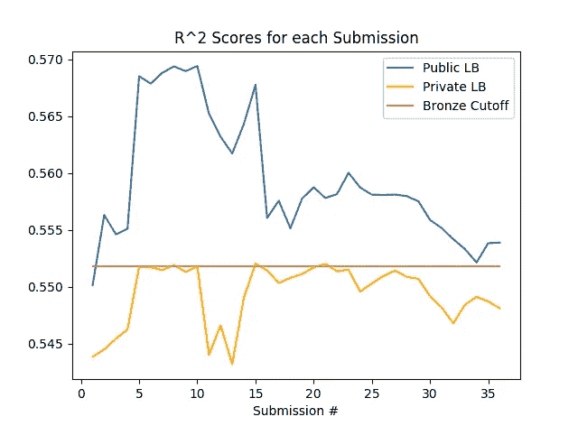

# 关于卡格尔的初步想法

> 原文：<https://towardsdatascience.com/first-thoughts-on-kaggle-326a6c4dc005?source=collection_archive---------6----------------------->

大约两周前，我报名参加了我的第一个 Kaggle 竞赛，即[梅赛德斯-奔驰绿色制造竞赛](https://www.kaggle.com/c/mercedes-benz-greener-manufacturing)。我的代码可以在[这里](https://github.com/yangalexandery/kaggle-mercedes-benz)找到，我尝试的日志可以在[这里](https://medium.com/@alex_yang/first-attempts-at-kaggle-bf6f8e778357)找到。以下是我对 Kaggle 的第一印象:

## 学习曲线

进入大赛，我唯一的机器学习知识来自麻省理工的入门课(6.036)。因此，我惊喜地发现，卡格尔竞赛对那些之前经验很少的人来说是完全可以参加的。这很大程度上是由于 Kaggle 的内核，它允许更有经验的 Kaggle 用户与其他人公开分享他们的代码。**内核甚至允许那些完全不熟悉机器学习的人在排名中具有竞争力—** 通过简单地复制代码，任何人都可以取得与 Kaggle 老手不相上下的结果。

我发现，在我尝试改进内核代码的过程中，我收到了关于机器学习中多个概念的简要介绍，其中许多概念我希望在未来写得更透彻:

*   梯度增强树
*   超参数调谐
*   降维:主成分分析，独立分量分析，tSNE，逻辑主成分分析，TSVD，GRP，SRP
*   过度拟合、K 倍交叉验证、非折叠预测
*   集合、堆叠和平均
*   Sklearn 型号:套索、ElasticNet 等。
*   基本特征选择和特征工程
*   可能性编码(赛后)

在我看来，这个比赛是一个快速“边做边学”的好方法。很难在网上找到任何其他像 Kaggle 这样有助于学习数据科学概念的资源。

## 排行榜的不可预测性

从最终排名的[大规模调整](https://www.kaggle.com/c/mercedes-benz-greener-manufacturing/leaderboard)可以看出，公共排行榜对于预测私人排行榜来说完全不可靠:几乎所有在比赛中领先的人最终都下降了数百个排名。然而，即使是交叉验证也被证明是无用的:我的最终模型，用 5 重 CV 评估，并不比我在第四天制作的严重过度拟合的 XGBoost 模型表现得更好。

Public and Private LB scores for my 36 submissions — a few past models made it over the bronze cutoff!

最后，事实证明有[可靠的方法](https://www.kaggle.com/c/mercedes-benz-greener-manufacturing/discussion/36136)来测试一个模型——尽管在大多数情况下，参赛者(包括我)对评估他们模型的表现不够彻底。

## Kaggle 的竞赛社区

对于 Kaggle 的社区，我只有积极的话要说。用户提交的关于比赛的内核和线程大大鼓励了参赛者之间的合作。在比赛期间，许多用户在公开论坛上一起工作，改进彼此的模型并讨论数据集的属性。本次比赛是参赛者共同努力的众多成果之一，通过排行榜探测，从测试数据集中发现了 32 个 y 值。

## 结论

我发现参加这次比赛非常愉快！虽然我的最终排名(~ 1400 名)有点令人失望，但比赛非常有趣，让我学到了很多东西，我计划将来在 Kaggle 上更加活跃。如果您有任何反馈，请告诉我——也许更多关于 Kaggle 的报道将很快出现。:)