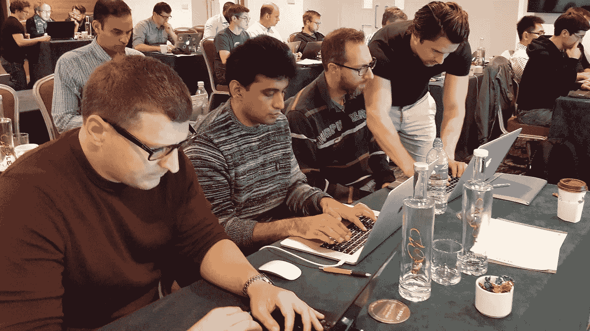

# 2017 年应用数据科学的第一个周末

> 原文：<https://towardsdatascience.com/first-weekend-at-applied-data-science-2017-23c86415c1b8?source=collection_archive---------16----------------------->

本周末，学生们学习了应用数据科学课程中教授的许多机器学习技术的基础知识。他们温习了线性代数、统计学和复杂性理论。此外，他们还学习了 Python 中的自动化测试，以及如何编写可读和可维护的测试，以获得信心并促进代码协作。

> 最大的收获是对我们在这门课中所做的所有工作背后的理论有了一个真正清晰而简明的理解。正如 Thibaut 提到的，你可以在不参加这个周末的情况下获得对这个项目 85%的理解，但是有了它，你就有了能够更深入地探索这些概念的基础知识。这样当你面临一个问题时，你就可以理解它背后的理论，并提出一个更新颖的解决方案。那是我的关键外卖。
> 
> 从我的背景(没有任何强大的数学经验)来看这些材料是非常令人生畏的，但我现在知道了我需要在接下来的两周内学习的关键技术，并积累了一些工作知识。
> 
> 为了让我理解这个理论，将我们所做的应用到现实世界的例子和工作案例中是非常有用的。在本课程之外，我正在处理一个大数据问题，但我们没有数据科学团队来探索它。因此，我将从这个周末开始思考我们在开发解决方案时忽略的一些事情，以及我们如何从不同的角度看待这个问题。

Rupert Prescot，产品经理

> 我真的很期待即将到来的回归模块和覆盖神经网络的最后一个周末。但是你需要掌握数学才能达到目的——这是我们都在努力的。

Suresh Gangaiah，计算机科学毕业生

> 一些关键要点。当谈到特征向量和特征值时，Thibaut 把它们框起来，作为描绘矩阵和得到足迹的一种方式。我喜欢承认每种技术对你有什么帮助的想法。在这种情况下，您希望了解以后需要的某些特征。他在会议中也有一个关于规范的线索，这是一个很好的方式来加强这个概念的重要性。

安东·苏斯，经济学家

**如果您希望提升您目前的技能，了解前沿的行业方法，并在数据科学领域开始职业生涯，** [**现在就申请在 2018 年加入我们。**](https://cambridgespark.com/applied-datascience)