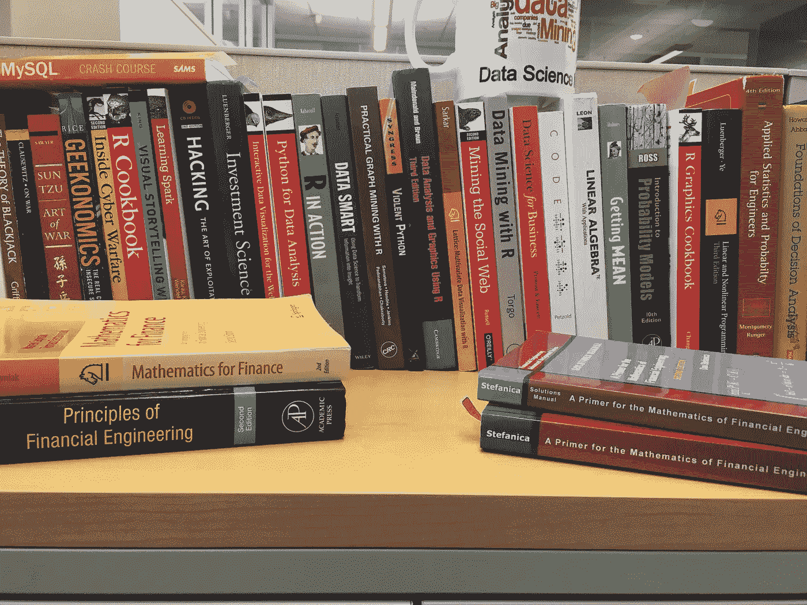
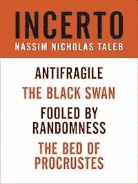
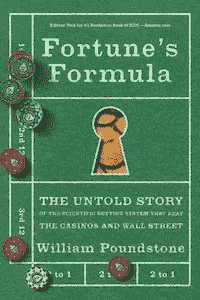
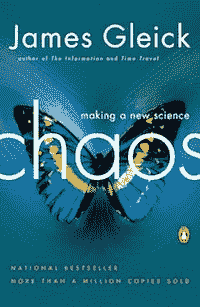
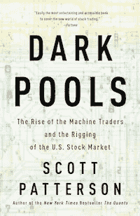
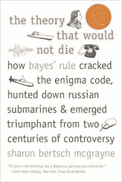

# 每个数据科学家都应该阅读的五本与数据科学无关的书

> 原文：<https://towardsdatascience.com/five-books-every-data-scientist-should-read-that-are-not-about-data-science-f7335fb1f84f?source=collection_archive---------3----------------------->

我在 2010 年为华盛顿大学(UW)的一个班级写了第一行 R 代码。当我意识到编码比电子表格强大得多时，我就着了迷。在过去的十年里，我见证了“数据科学”一词的广泛使用，也见证了大数据、商业智能、分析以及现在的人工智能等术语的兴衰。

我在 UW 大学上的课是“计算金融”，就像今天的深度学习课一样，很容易就挤满了一个相当大的演讲厅。当时，金融危机对每个人都记忆犹新。对于工程师来说，这是一个不太微妙的信息；如果你想得到一份高薪工作，那就进入金融行业，成为一名定量分析师，就像今天的数据科学一样。在商业运作中直接使用数学的概念非常有趣，不仅用于决策支持，还用于实时决策。然而，金融危机也暴露出，即便是最复杂的模型，也不足以应对现实世界的混乱局面。

许多人认为，金融危机的核心是一个获得诺贝尔奖的微分方程；布莱克-斯科尔斯期权定价模型。这个模型被用来衡量巨额投资的风险，却没有理解其内在的局限性和隐含的假设。这种技术上的盲目为灾难性的经济损失创造了条件。

今天，有抱负的数据科学家被鼓励学习一系列令人难以置信的建模技术。每一种方法，比如线性回归，都有自己的一套哲学，你通过它的使用内在地认同它(知道或不知道)。这就产生了一批准备部署模型的新员工，他们并不了解实际发生了什么。年轻的社区没有解决技术盲问题，而是参与了关于工具的代理争论(R vs. Python！).

为了帮助解决这个问题(我也深受其害)，我提供了一份简短的阅读书目，从哲学上帮助数据科学家做好准备。此外，在部署模型之前，他们会激发关于模型的技术假设的问题。这个列表并不详尽，书中的主题从有趣到激烈。金融工程的影响力很大，因为它比其他任何学科都更能培养出通用数据科学家。

1) [Incerto:](https://www.amazon.com/Incerto-4-Book-Bundle-Randomness-Antifragile-ebook/dp/B00K5190LE) 这本书是纳西姆·塔勒布的作品集，其中最著名的是《黑天鹅》，在我看来最好的是《反脆弱》。塔勒布是现代最伟大的风险、不确定性和定量建模问题的思想家。他也是一个推特巨魔，因为他叫出了那些“聪明但白痴”的 IYI 人。从背景来看，他是一名移民衍生品交易员，后来成为了数学哲学家。你要么爱他，要么恨他，因为他会在他所有的作品中不断挑战你的假设。如果他写了什么，你应该马上把它放在你的阅读清单上。

2) [《财富》公式:](https://www.amazon.com/Fortunes-Formula-Scientific-Betting-Casinos/dp/0809046377/)麻省理工学院早期诞生的一个公式(凯利标准)的故事，该公式被认为是大量金融成功的背后原因。你将了解信息论之父(克劳德·香农)以及后来在埃德·索普的《击败庄家》中出名的算牌骗局的开端。索普现在被认为是量化对冲基金的教父。最重要的是，这本书展示了如何一个好的模型不能永远被忽视，但坏的模型可以烧伤你。这个故事也是历史上第一次计算机科学和数学合作解决现实世界的问题(只是碰巧是为了赌博)。这个故事是数据科学行业创建 60 年前的一个伏笔。

3) [混沌——造就一门新科学:](https://www.amazon.com/Chaos-Making-Science-James-Gleick/dp/0143113453/)最年轻的科学的详细历史。既是混沌的历史，也是对这一主题的通俗易懂的回顾。这本书将让读者了解我们模拟现实世界的能力的局限性。由于非线性过程的性质，今天开发和部署的许多深度学习模型无法真正理解。这本书将帮助你理解这些局限性。此外，对伯努瓦·曼德尔布罗个人生活和工作的全面回顾使其成为任何数据科学家的必读之作。詹姆斯·格雷克是一位了不起的作家，他还有许多其他优秀的书籍可以添加到你的阅读清单中。

4) [暗池:](https://www.amazon.com/Dark-Pools-Machine-Traders-Rigging/dp/0307887189/)一个程序员永远改变了股市交易的故事。如今，预测模型被部署在高频交易领域，决策以纳秒级的速度做出。这本书讲述了这个隐藏但强大的生态系统的创建过程。这个故事的奇妙之处在于，它阐明了当你知道一些代码时，许多问题是如何解决的。它还表明，创造真正的价值是做真正创新的事情，而不是依赖于现有的假设。有时候你必须有点疯狂才能解决难题。

5) [不会消亡的理论:](https://www.amazon.com/Theory-That-Would-Not-Die/dp/0300188226/)贝叶斯公式和贝叶斯统计的历史以及它的竞争对手，频率主义者。统计的历史和关键技术主题的简单语言评论使这本书至关重要。您将了解历史上一些最伟大的人物，如 Pierre Laplace 和 R.A. Fischer，以及他们的哲学如何在几个世纪内塑造了世界的数据方法。

这五本书虽然不详尽，但将有助于为研究现实世界问题的数据科学家建立哲学基础。不要重蹈 10 年前宽客们的覆辙。寻求从哲学上理解技术和模型，而不仅仅是机械地理解，我们的职业将变得无价