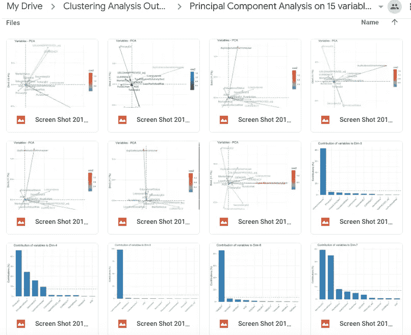
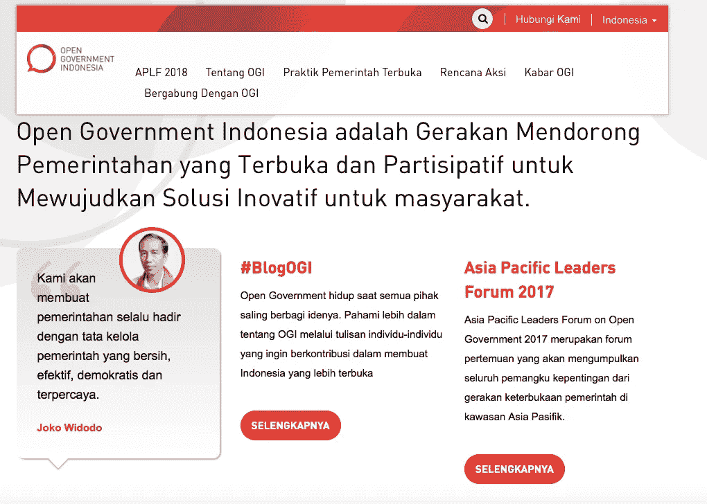
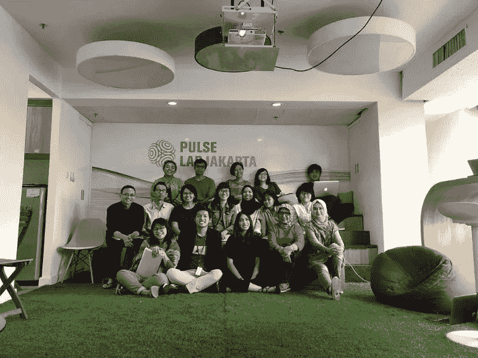

# 我在联合国数据科学实习的五个教训

> 原文：<https://towardsdatascience.com/five-lessons-from-my-data-science-internship-at-the-united-nations-58d2da17f07f?source=collection_archive---------9----------------------->

当我听说联合国开发计划署全球脉动的工作时，我认为这简直是电影里的情节。社会影响数据科学听起来是我能用数学做的最酷的事情。

我在人生的不同阶段培养了对数学、经济学和计算机科学的热情。在加州大学洛杉矶分校，我不得不整天戴着不同的帽子，在撰写数学证明、研究经济理论和编写计算机程序之间转换。直到今年夏天，我一直在分别追求这三个令人兴奋的领域。

以下是我在联合国全球脉动实验室(PLJ)工作期间，从研究、数据、经济和我自己身上学到的一些经验。

# 1.你几乎可以把每个问题都归结为一个数学问题

我不得不在一周内对数亿个数据点实现聚类算法，对机器学习一无所知。幸运的是，我是一名数学专业的学生——我的数学背景确实有助于我从头开始理解所使用的算法。

some of the 345678938241861414201280 plots I had to look at

例如，理解主成分分析(PCA)背后的线性代数在我解释 R 中漂亮的可视化以决定特征选择时是有回报的。当 PCA 的概念被描述为**“通过代数方法识别几何相似性的机制”(Jauregui，2012)** ，或者，我认为它是**映射数据指向由协方差的特征向量确定的最重要的‘方向’**(相关性？)数据集独立变量的矩阵。这些概念对我来说是有意义的，因为它们背后的数学是有意义的。

我对数学有了更多的欣赏，因为我已经将它们应用到了现实生活的项目中。这就像我上个季度的‘为什么’时刻(为什么我需要正交化特征向量？为什么会有一百万个特征值定理？等等。)都得到了回答——这些都是无价的启示。

但是现实生活中的问题不仅仅是数学问题。还有许多其他层次的活动部件需要考虑。

# 2.使(表面上的)对立面相交

我从未见过像 PLJ 这样多元化的团队。我在 quant 研究团队工作，但我经常参加社会系统团队的研讨会和讲座，内容涉及城市规划、海洋生物学和社会经济调查以及许多其他主题。

PLJ 的研究展示了公共部门数据科学研究的两个领域是如何深深交织在一起的。这场名为“机器学习评估贫困”的黑客马拉松式活动聚集了全国各地备受尊敬的研究人员，进行了为期 3 天的数据探索和分析，以了解更多关于印度尼西亚贫困的信息。看着统计学家和计算机科学家与社会科学家和政府官员在同一个研究项目上工作，并见证他们的专业知识相互借鉴，令人深思。

让看似不相关的领域的专家参与进来，对我来说是一种富有洞察力的实践。在向实验室提交我的项目时，我在社会系统项目经理的建议下定性地定义了我的分析的目标和影响。他们的建议指导我完善我的研究目标，并考虑我的发现对政策制定者的影响——一些我戴着数学家帽子也不会想到的事情。

这是我实习期间最喜欢的经历之一，甚至可能是整个领域的经历:**将不可能的点连接起来，并赋予它们一些概率**。

# 3.开放数据，开放创新，开放政府…

我们生活在一个分享就是关爱的世界。分享知识创造协同效应和市场效率。当我们将创新和数据交给合适的人时，它们最为重要。

我是通过 quant 研究团队的其他成员的工作了解到开放政府的概念的，他们为印度尼西亚开放政府工作，并在印度尼西亚城市进行数据开放的测量。我对印度尼西亚作为一个新兴经济体成为一个更加开放的经济体所取得的进步感到惊讶。像 Satu Data Indonesia、BappenasRI、Jakarta Smart City 等组织和许多其他组织都是该实验室的密切合作者，他们的工作也极大地启发了我关于机构层面“开放”的想法。

how cool is this!??

我了解到，这种开放性需要通过内部和外部各种利益相关者之间的合作和沟通对话来培养。由于分享知识(尤其是关于分享什么、如何分享、为什么我们应该分享的对话)往往被低估，因此还有许多工作要做。为了高效和多产地实施大数据工具，需要一个强大的大数据基础设施，并且理想情况下应将其视为一种公共产品。

# 4.握手和交接

也就是说，**“强大的授权实体**(解读:公共部门)**之间的握手，允许将权力移交给那些有希望、雄心、灵感和想法的人**(解读:私营部门)**，让我们的国家变得更好”。我是在阅读安尼什·乔普拉的《创新的国度》时产生这个想法的，这本书是我一直以来最喜欢的书之一。书中讨论的观点帮助我理解了技术在公共部门的潜力，以及政府作为推动技术发展的工具所扮演的角色。如上所述，拥有一个开放的政府是一种方法。**

我开始明白这句话在实验室的实际含义。虽然 UN Global Pulse 不是一家私营公司，但该组织采用了相关技术和与大多数初创公司类似的好奇心态。然而，该团队有责任倡导技术，并将其与现有的政府/社会结构相结合。PLJ 与政府密切合作，为决策建立数据驱动的平台。这项任务需要多种多样的技能，以始终如一地应对各种激励措施，并委派不同学科领域的任务，所有这些都建立在相互信任的基础上。不容易。这需要承诺和尊重，以及高水平的专业技术。这在技术上和社会上都具有挑战性。

# 5.战胜你的恐惧和不安全感(冒名顶替综合症太真实了！)

我是实验室里最年轻、经验最少、技术最差的人，最初让我感到恐惧和不安全。与此同时，我感到非常幸运和谦卑，每天都能从如此优秀和热情的同龄人那里学习，我选择拥抱这种感觉。

我转向生产力和乐观来减少我的冒名顶替综合症。我孜孜不倦地倾听、提问、超前研究并坚持不懈，直到找到合适的答案并解决问题。谷歌搜索东西，不怕问，永不放弃让我找到了正确的地方。

我个人发现，持续改进的最好习惯之一就是让自己走出舒适区。关键是在这个过程中保持坚强和集中。

这篇文章只是对我的经历的简单回顾，这些经验只是我在数据科学之旅的起点。我一直热爱数学和创造性的问题解决方法，但我知道我渴望在我的职业生涯中坚持一个目标，为社会公益和/或经济发展做出贡献。当我的个人价值观与团队的使命一致时，我每天早上去上班都会感觉很好。

参考资料:

杰夫，你好。"线性代数中的主成分分析."*Math.union.edu*，2012 年 8 月 31 日，[www.math.union.edu/~jaureguj/PCA.pdf.](http://www.math.union.edu/~jaureguj/PCA.pdf.)