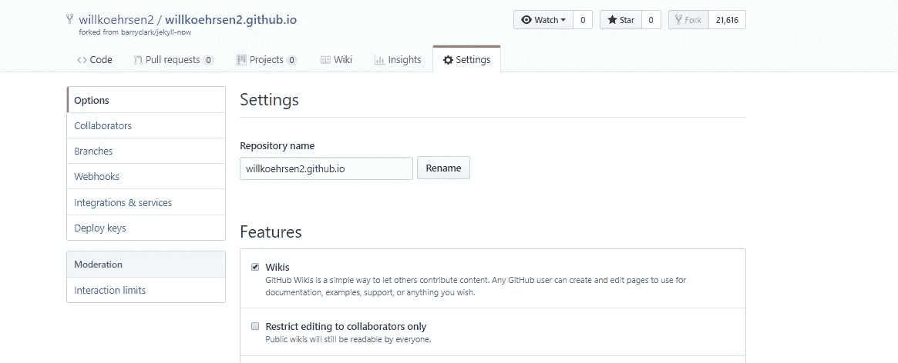
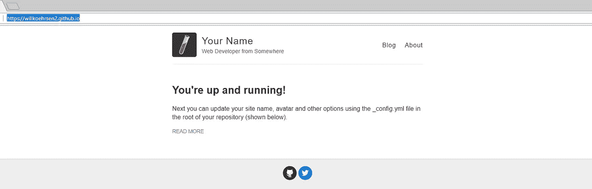
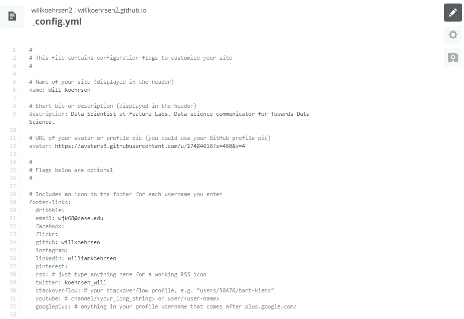
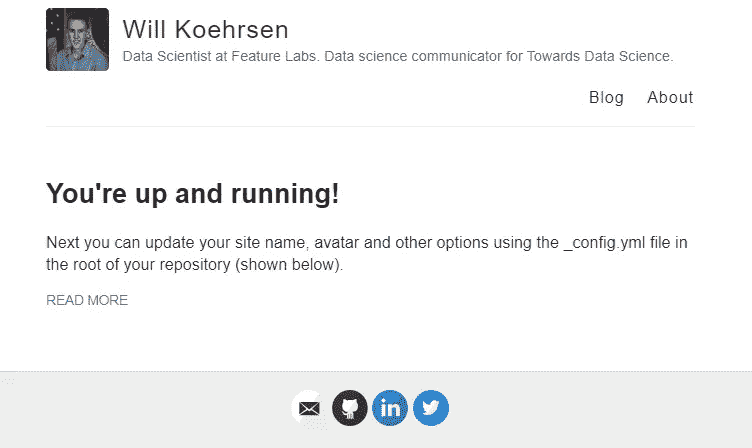
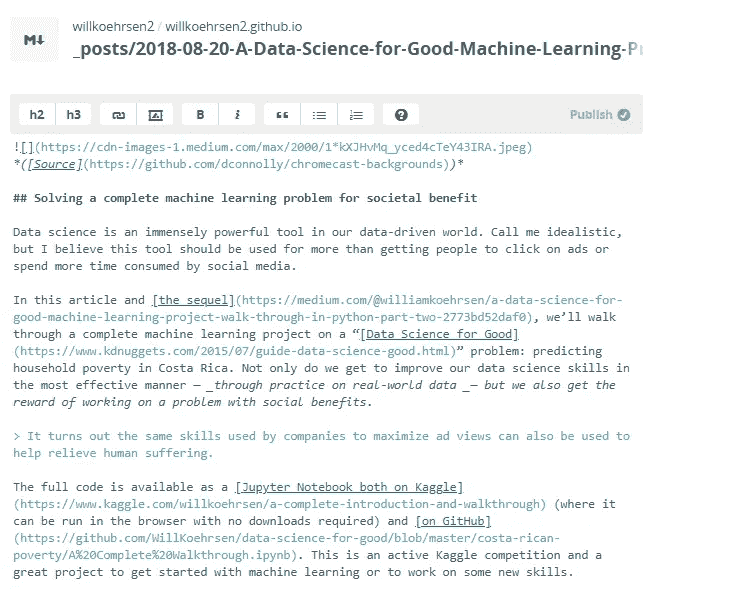

# 五分钟到你自己的网站

> 原文：<https://towardsdatascience.com/five-minutes-to-your-own-website-fd0b43cbd886?source=collection_archive---------9----------------------->

([Source](https://www.pexels.com/photo/landscape-blue-cloud-109678/))

## 如何使用 GitHub Pages 和 Jekyll 开始创建自己的完全免费的博客

建立自己的网站在几个层面上都是有益的。有机会向朋友、家人和潜在的雇主展示你的作品，有机会为制作某样东西而自豪，有机会根据自己的喜好设计(非常小的)一部分网页。

虽然 Medium 是[开始写博客](https://medium.com/p/50715f37833a?source=user_profile---------10------------------)的一个很好的选择，因为有限的功能让[专注于写作](https://medium.com/p/cc842795ed52?source=user_profile---------3------------------)，但最终，像我一样，你会希望自己的网站成为你工作的中心位置。幸运的是，我们生活在一个充满创造力的伟大时代，你可以使用免费工具在几分钟内建立一个网站。

在这篇文章中，我们将看到如何使用 Jekyll 站点生成器和 GitHub 页面来构建和发布一个简单的博客，而不需要编码。如果你想了解最终产品，你可以看看[我的(工作进展)网站](https://willk.online/)。

# Jekyll 和 GitHub 页面

Jekyll 是一个简单的静态站点生成器。这意味着它获取纯文本文件，并将其呈现为一个网站，然后可以通过 web 托管服务提供给 web。这项服务的一个选项是 GitHub Pages，免费的“通过 GitHub 托管和发布的网站”

使用 Jekyll + GitHub Pages，您网站的源文件位于 GitHub 存储库中，该存储库会自动发布到 web 上。基本上，Jekyll 将存储库中的文本文档转换成一个网站，然后该网站由 GitHub 托管。你唯一要担心的是写文章和编辑一些文本文件，让事情看起来像你想要的那样。正如[杰基尔设计理念](https://github.com/jekyll/jekyll/blob/master/README.markdown)所述:

> Jekyll 不会妨碍你，让你专注于真正重要的事情:你的内容。

你可以按照 GitHub 上的这个[指南](https://guides.github.com/features/pages/)建立一个新的空白网站。然而，如果你想尽快制作一个简单的博客，一个更好的选择是 fork(GitHub 术语，意思是复制)[Jekyll Now 资源库](https://github.com/barryclark/jekyll-now)，它已经构建了一个博客布局并准备发布。

分叉后，进入你的账户下的存储库设置，把名字改成`username.github.io`。

Fork the Jekyll Now repository and change the name to username.github.io

几分钟后，您就可以在浏览器中导航到 username.github.io，并看到您的新网站发布在网络上！它还不是真正属于你的，但是你可以通过几个步骤来修复它。

Default Jekyll Now website

通过克隆存储库并在您喜欢的文本编辑器中打开它们，您可以在本地编辑任何网站文件。然后，当你提交并推送你的更改到 GitHub 时，网站会自动更新。然而，我强烈推荐在线散文编辑器，而不是本地编辑。

## 散文编辑

[散文](http://prose.io)让你更容易看到你所有的文件，快速做出修改，并在你保存后提交和推送到 GitHub。你必须向 GitHub 认证散文，然后才能开始改进你的博客。例如，要开始个性化网站，请编辑`_config.yaml`文件:

Editing _config.yaml in Prose editor.

点击保存后，可以在线看到这些更改。

Website after making changes to config file.

# 写博客文章

Jekyll 中的所有博客帖子都是用 [Markdown](https://en.wikipedia.org/wiki/Markdown) 编写的，这是一种轻量级语言，可以转换成 HTML 或许多其他格式。它非常容易学习，在网络上无处不在，并且提供了很多机会来定制你的文章，这是你在媒体上做不到的。

你网站上的文章位于`_posts/`文件夹中，当你编辑并保存散文文件时，你可以看到它们出现在你的博客上。遵循命名惯例:`date-title.md`，你的帖子将自动出现在你的网站上，并正确命名和标注日期。

Editing Markdown document in Prose (left) and post as is appears on website (right).

如果你已经在 Medium 上发布了文章，你可以使用这个 [Chrome 扩展](https://chrome.google.com/webstore/detail/convert-medium-posts-to-m/aelnflnmpbjgipamcogpdoppjbebnjea?hl=en)或者这个[命令行工具](https://www.npmjs.com/package/markdown-to-medium)将它们转换成 Markdown。转换并不完美，但稍加编辑，你就可以将你的中型作品快速导出到你的博客中。这是我写的一篇关于从现有的媒体文章到降价的文章，解决了我发现的几个问题。

## 更进一步

你自己的网站的好处是你可以控制事物外观的每个方面，并添加任何你想要的功能。首先在存储库中挖掘文件，并查看 [Jekyll 文档](https://jekyllrb.com/docs/)。例如，要更改字体和样式，请编辑`style.scss`文件，要启用帖子评论等功能，请编辑`_config.yaml`。你甚至可以通过像 [Hover](https://www.hover.com/) 这样的网站域名注册商购买一个自定义域名，并遵循[这个指南。](https://medium.com/@hossainkhan/using-custom-domain-for-github-pages-86b303d3918a)

Jekyll 的好处是，如果你只想专注于写作，你可以保留默认设置，这样你就会有一个干净、像样的博客。如果你想做出改变，那么你想走多远就走多远。例如，我在我的关于页面的[中添加了一个动态代码编辑器，让它更有趣:](https://willk.online/about/)

Live coding editing on my about page.

# 结论

如果你因为担心时间和成本而迟迟不写博客，那么现在是时候开始了。使用 GitHub Pages 和 Jekyll，你可以在五分钟内免费拥有自己的博客！

提醒一下，这些步骤是:

1.  将 [Jekyll Now](https://github.com/barryclark/jekyll-now) 存储库转到您的 GitHub 帐户。
2.  将回购更名为`username.github.io`。您的网站现已发布。
3.  在[散文在线编辑器](http://prose.io)中对网站文件进行更改，并保存以更新网站。从改变`_config.yaml`开始，在`_posts/`添加你的降价帖子。
4.  通过阅读文档、查看其他网站或尝试，尽可能地扩展/定制网站

对于那些已经拥有中型文章的人来说，[这里有一个将它们转移到 Markdown 的指南。如果你不知道，那么这里有一些关于写数据科学项目的帮助。最后，走出去，建立一个属于你自己的网站！](https://medium.com/@williamkoehrsen/converting-medium-posts-to-markdown-for-your-blog-5d6830408467)

一如既往，我欢迎评论和反馈。可以通过 Twitter [@koehrsen_will](http://twitter.com/@koehrsen_will) 或我的个人 GitHub pages 网站 [willk.online](https://willk.online/) 找到我。