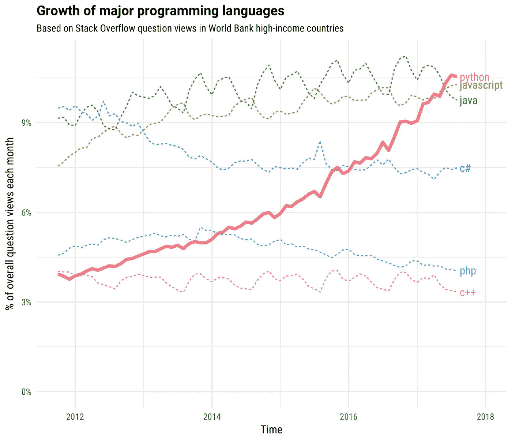
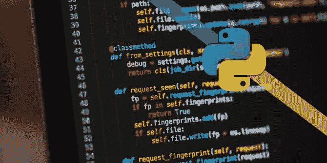

# 今天你需要知道的五个 Python 技巧

> 原文：<https://towardsdatascience.com/five-python-tricks-you-need-to-learn-today-9dbe03c790ab?source=collection_archive---------1----------------------->

无论你是高级人工智能工程师还是一年级生物学生，你都会在某个时候碰到 Python 编程语言。Python 于 1991 年首次发布，很快成为程序员和技术人员最喜欢使用的语言。根据高收入国家的堆栈溢出问题视图，Python 正迅速成为最受欢迎的语言选择。



[The Incredible Growth of Python](https://stackoverflow.blog/2017/09/06/incredible-growth-python/)- David Robinson

作为一种语法相对简单的高级解释语言，Python 对于那些没有编程经验的人来说是完美的。流行的 Python 库被很好地集成并用于不同的领域，如生物信息学( [biopython](http://biopython.org) )、数据科学([熊猫](http://pandas.pydata.org))、机器学习( [keras](https://keras.io/) / [tensorflow](https://www.tensorflow.org/) )甚至天文学( [astropy](http://www.astropy.org) )。在学习了 C 和 Java 作为我的第一门编程语言后，我能够在谷歌搜索的几周内自学 Python。尽管执行速度比 Java 和其他语言慢得多，但 Python 实际上通过良好构建的流程集成特性提高了生产率。

在我们开始之前，我强烈推荐你去看看 Dan Bader 的 [Python 技巧书](https://dbader.org/products/python-tricks-book/)。在他的书中，Dan 分享了一些非常有用的技巧和窍门，告诉我们如何用 Python 更有效地编码。如果你对 Python 一无所知，我强烈建议你开始学习 Code Academy 的 [Learn Python](https://www.codecademy.com/learn/learn-python) 互动课程。

**招数№1:强大的俏皮话**

您是否厌倦了通读一行行代码并迷失在条件语句中？Python 一行程序可能正是您正在寻找的。例如，条件语句

```
**>>> if** alpha > 7:
**>>>** beta = 999
**>>> elif** alpha == 7:
**>>>** beta = 99
**>>> else**:
**>>>** beta = 0
```

真的可以简化为:

```
**>>>** beta = 999 **if** alpha > 7 **else** 99 **if** alpha == 7 **else** 0
```

这太荒谬了！如果您对自己编写的代码多加注意，您总会发现可以简化为一行程序的地方。除了条件语句，`for`循环也可以简化。例如，在四行中加倍一个整数列表

```
**>>>** lst = [1, 3, 5]
**>>>** doubled = [] 
**>>>** **for** num **in** lst:
**>>>** doubled.append(num*2)
```

可以简化为一行:

```
**>>>** doubled = [num * 2 for num in lst]
```

当然，如果您将所有内容都链接到一行程序中，可能会有点混乱。确保不要在代码中过度使用一行程序，因为有人可能会认为大量使用一行程序是“不符合 Pythonic 规范的”。

```
**>>> import** pprint; pprint.pprint(zip(('Byte', 'KByte', 'MByte', 'GByte', 'TByte'), (1 << 10*i for i in xrange(5))))
```

**诀窍№2:快速字符串操作**

字符串操作可能很棘手(没有双关的意思)，但是 Python 隐藏了一些捷径，使您的生活变得非常容易。要反转一个字符串，我们只需添加`::-1`作为列表索引

```
**>>>** a =  "ilovepython" 
**>>> print** a[::-1] 
nohtypevoli
```

同样的技巧也适用于整数列表。在 Python 中，字符串操作非常容易。例如，如果您想使用以下预定义变量`str1`、`str2`和`lst3`输出一个句子

```
**>>>** str1 = "Totally"
**>>>** str2 = "Awesome"
**>>>** lst3 = ["Omg", "You", "Are"]
```

简单地使用`.join()`方法和算术运算符来创建想要的句子。

```
**>>> print** ' '.join(lst3)
Omg You Are
**>>> print** ' '.join(lst3)+' '+str1+' '+str2
Omg You Are Totally Awesome
```

除了字符串操作，我还推荐阅读更多关于 [regex(正则表达式)](https://docs.python.org/3/library/re.html)的内容，以便有效地搜索字符串和过滤模式。

**招数№3:嵌套列表组合**

`itertools`可能是我最喜欢的 Python 库之一。假设您的代码有十几个列表，经过一些操作后，您得到了一个深度嵌套的列表。这正是你解决这种语法混乱所需要的。

```
**>>> import** itertools
**>>>** flatten = lambda x: list(itertools.chain.from_iterable(x))
**>>>** s = [['"', 'An', 'investment'], ['in'], ['knowledge'], ['pays'], ['the', 'best'], ['interest."', '--'], ['Benjamin'], ['Franklin']]
**>>> print**(' '.join(flatten(s)))
" An investment in knowledge pays the best interest." -- Benjamin Franklin
```

从上面的例子可以看出，我们可以使用。`join()`和`itertools`。`itertools`中的`.combinations()`方法也是从输入 iterable 返回元素长度子序列的强大工具。点击[此处](https://docs.python.org/2/library/itertools.html)阅读更多关于`itertools`的信息。

**绝招№4:简单的数据结构**

回到**招数№1** ，在 Python 中使用一行程序初始化数据结构也是非常容易的。Harold Cooper 使用以下代码实现了一个单行树结构:

```
**>>> def** tree(): **return** defaultdict(tree)
```

上面显示的代码简单地定义了一个树，它是一个字典，默认值是 trees。其他一行函数，如质数生成器

```
**>>>** **reduce**( (**lambda** r,x: r-**set**(**range**(x**2,N,x)) **if** (x **in** r) **else** r), 
        **range**(2,N), **set**(**range**(2,N)))
```

可以在 Github 和堆栈溢出中找到。Python 也有强大的库，比如`Collections`，它将帮助您解决各种现实生活中的问题，而无需编写冗长的代码。

```
**>>>** **from** collections **import** Counter
**>>>** myList = [1,1,2,3,4,5,3,2,3,4,2,1,2,3]
**>>> print**(Counter(myList))
Counter({2: 4, 3: 4, 1: 3, 4: 2, 5: 1})
```

**绝招№5:打印变得容易**

最后一个技巧是我希望早点知道的。原来打印一个字符串数组作为一个逗号分隔的字符串，我们**不需要**使用`.join()`和循环。

```
**>>>** row = ["1", "bob", "developer", "python"]
**>>>** **print**(','.join(str(x) **for** x **in** row))
1,bob,developer,python
```

这个简单的一行程序就可以了:

```
**>>> print**(*row, sep=',')
1,bob,developer,python
```

另一个巧妙的打印技巧是利用`enumerate`。`enumerate`是 Python 的内置函数，非常有用。所以不用写四行代码来打印

```
**>>>** iterable = ['a','b','c']
**>>>** c = 0 
**>>>** for item in iterable: 
**>>> **    print c, item 
**>>> **    c+= 1
0 a
1 b
2 c
```

同样的事情只需要两行代码就可以完成

```
**>>>** for c, item in enumerate(iterable):
**>>> **    print c, item
```

Python 中有几十万种打印技巧，如漂亮打印`pprint`。如果你知道一个巧妙的 Python 技巧，请在下面评论！



*感谢您阅读我的文章。*