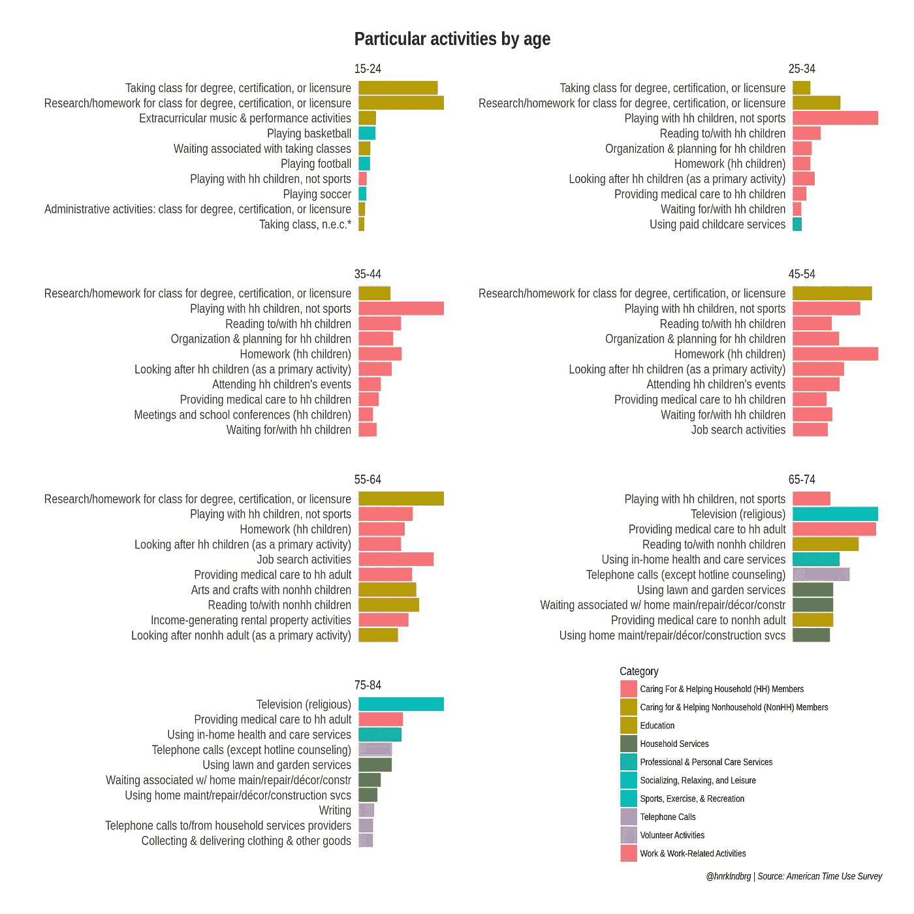
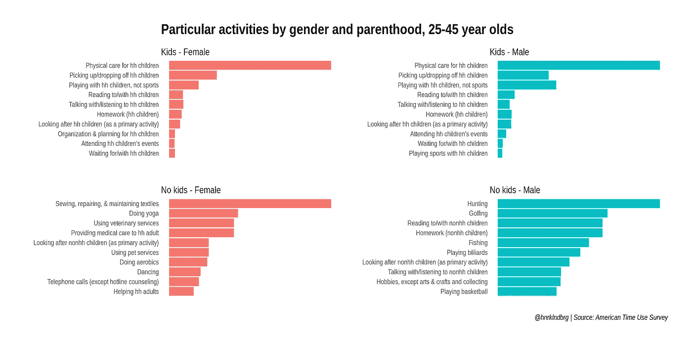
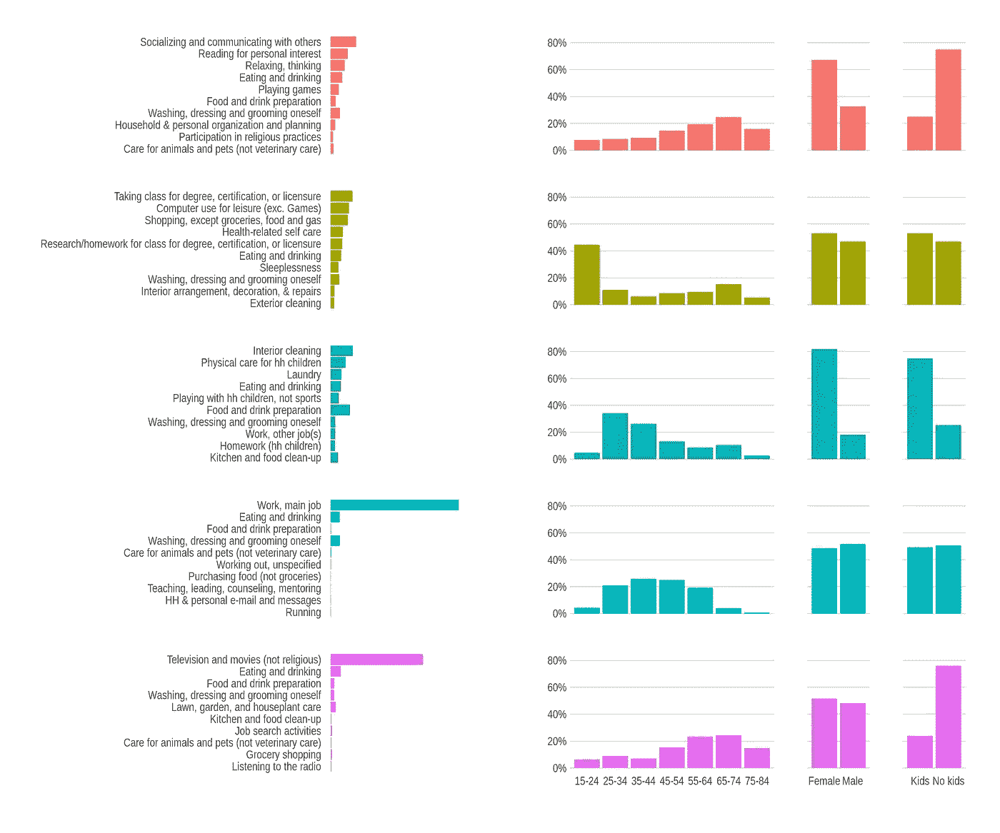

# 度过周四的五种方式

> 原文：<https://towardsdatascience.com/five-ways-to-spend-a-thursday-34432f9ee93e?source=collection_archive---------1----------------------->

令我有些惊讶的是，我的 [之前的](https://medium.freecodecamp.com/what-to-expect-when-youre-done-expecting-25fb0c00393) [对美国时间使用调查的分析](https://medium.com/@halhen/america-reads-especially-on-sunday-db02ce17f387)最终强调了我们的相似之处，而不是我们的不同之处。事实证明，我们并没有太大的不同。我认为这是有希望的。

不过，到目前为止，我主要着眼于更高层次的行为，比较了大约五个、十个或二十个不同的活动。还有更多的东西需要挖掘。在最细的层面上，ATUS 提供了 13 年来大约 170，000 天的报告和 400 项活动。其中一些活动是无处不在的(*睡觉*、*吃东西*、*看电视*、*洗碗*和*工作*)，而另一些活动则很少见(*击剑*和*观看举重/力量训练*各只出现一次，如果你正在寻找一种新的爱好让自己与众不同的话)。

偏斜、稀疏、中等维度的数据。这将描述一组推文，就像它描述手头的数据一样。为什么不把每一个活动都当成一个词，把每一个报道的日子都当成一个文档，并对其应用一些文本挖掘技术呢？

# 采矿偏见— tf-idf

tf-idf 是一种挑选表示文本的单词的算法。通过查找在一个文档中比在其他文档中出现得更频繁的单词，它给出了该文档是关于什么的想法。单词“*”在大多数文本中频繁出现，因此意义不大，而多次包含“*选举*”的文档可能与政治或时事有关。*

*应用于我们数据的 tf-idf 假设将*睡眠*视为*睡眠*:每个人都做的事情，因此在强调差异方面没有什么价值。另一方面，打篮球在青少年经常做但 70 岁老人很少做的事情中不会让我们感到惊讶。*

*大家试一试吧，挑出十大活动。*

**

*你瞧，不同年龄组之间肯定有明显的差异。对我们的年轻人来说，学校和体育运动会出现。当孩子们到来时，我们的细节围绕着他们。过了 50 岁，孙子出现了，然后房子周围就有了静物。*

*尽管如此，这些发现似乎很老套，几乎就像一幅漫画。请记住:在解释这些结果时，我们需要精确。长条的长度并不能说明我们做每件事花了多少时间。相反，它向每个年龄段的人展示了每样东西的独特性。并不是所有 75-84 岁的老人都要照顾家里的其他成年人——大概是他们的老年配偶——而是那些照顾家里成年人的人更有可能是老年人。*

*这份名单有一种怪异的人情味。从某种意义上来说，这是一份刻板印象甚至偏见的清单，它不一定列出了许多人做了什么，而是列出了那些通常做这些事的人是谁。*

# *父母对非父母*

*让我们尝试另一个维度:父母与非父母。在这里，我将简单地把那些有孩子住在家里的人称为“父母”，把那些没有孩子住在家里的人称为“非父母”。*

**

*同样，我们必须精确地解释结果。不是花时间的问题，而是独特性的问题。不言而喻，照看孩子的人就是父母。结果的后半部分更有趣一点。没有母亲的人的特别活动是瑜伽、有氧运动、跳舞和照顾宠物，而没有父亲的人则拿着枪或棍子回到他们的根源，或拿着棍子追球。*

*现在，这对于刻板印象来说怎么样？*

*但稍后会详细介绍。*

# *度过周四的五种方式*

*让我们尝试第二种文本挖掘技术:主题建模。在文本分析中，主题建模意味着基于属于一起但使桶不同的单词将文档聚集在一组桶中。然后我可以用这些单词来找出有哪些不同的主题。例如，我将 LDA 应用于 2017 年 4 月下旬的一组新闻论文。我可能会以一个包含“朝鲜”和“导弹发射”等词的主题结束，而另一个包含“特朗普”、“100 天”、“天”等词。LDA 不仅把我的东西放在桶里，还很方便地告诉我为什么。*

*不过，要应用 LDA，我首先必须决定我希望看到的桶的数量。因为我追求可读性，所以我的目标是少数几个。我只是尝试了 3 到 7 之间的值，并坚持使用 5，因为这给出了有趣且主观上不太重叠的结果。此外，我选择只将周四作为一周工作中的任意一天进行分析。*

**

*Five ways to spend a Thursday*

*LDA 把东西放在桶里，并告诉我们为什么，但要由我们来解释这些原因。我在图表中添加了一些人口统计数据，以帮助理解每个群体。这些人口统计数据没有用于分析或分类，而是在之后添加的。*

*看看 LDA 认为重要的词，我们每天做的五组事情似乎是，从上到下:*

1.  *不折不扣的老年生活*
2.  *学习(“孩子”指生活在家庭中的孩子，大概包括兄弟姐妹)*
3.  *呆在家里，家庭主妇和丈夫:ing，育儿*
4.  *正常的一天工作*
5.  *居家老人生活*

# *结论*

*我确信盒子里有更强大的工具来进行这些分析。如果没有别的，我会通过将数据视为一个简单的“活动包”来丢弃一些信息。尽管如此，结果比我预期的要好，而且多亏了 tidytext 包，完成这件事变得非常简单。*

*一路走来，我意识到文字和这个有一些重要的区别。其中最重要的可能是这样一个事实，即在文本中很少出现的事件是高信息事件，但在其他数据中却经常是异常值。比如 tf-idf 原来就是一个相当性别歧视的小刺头。*

*话又说回来，也许这里有对我们所有人有价值的一课？也许这正是当我们太关注使我们不同的东西，而太少关注使我们相同的东西时发生的事情。因为，事实证明，我们并没有什么不同。*

*github 上的完整代码[。](https://gist.github.com/halhen/5816f6aa102e4bbf02871bdc5ddda2b3)*