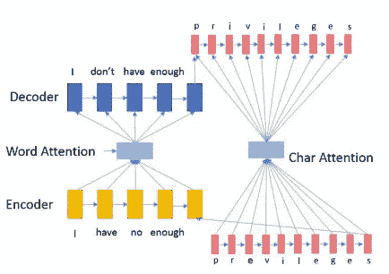

# 在 NLP 任务之前，修正你的文本思想注意

> 原文：<https://towardsdatascience.com/fix-your-text-thought-attention-before-nlp-tasks-7dc074b9744f?source=collection_archive---------17----------------------->

“two white planes flying” by [Alicia Steels](https://unsplash.com/@aliciasteels?utm_source=medium&utm_medium=referral) on [Unsplash](https://unsplash.com?utm_source=medium&utm_medium=referral)

语法纠错(GEC)是纠正文本错误的方法之一。它可以是全局误差或局部误差。纪等人提出了纠正用词和拼写的注意机制。

看完这篇帖子，你会明白:

*   嵌套注意神经混合模型设计
*   体系结构
*   拿走

# 嵌套注意神经混合模型设计

纪等人将纠错问题归结为机器翻译问题，采用序列对序列模型来解决这一问题。与使用基于短语的机器翻译不同，S2S 方法具有学习长距离，甚至全局单词依赖性的能力。

作者扩展了基于 S2S 的模型来处理极大的词汇量和捕获句子结构。S2S 模型的输入是一个单词序列，并将其转换为向量序列。然而，传统的单词嵌入无法处理词汇外(OOV)问题。传统的解决方式有:

*   用一个单一的向量来代表整个 OOV
*   如果是 OOV，跳过这个词

作者使用第三种方法，即按字符计算单词向量。例如，“爱德华”是一个 OOV，它使用“E”、“d”、“w”、“a”、“r”和“d”来计算“爱德华”的嵌入，而不是使用静态的“未知”向量。对于角色嵌入，你可以访问这个[故事](/besides-word-embedding-why-you-need-to-know-character-embedding-6096a34a3b10)来获得更多信息。

第二部分是学习处理拼写错误和屈折形式。例如，“aple”是一个拼写错误，而“apple”是预期的单词，而“invisions”后面应该是 he 而不是“invision”。

# 体系结构

该模型使用单词级和字符级嵌入来解决纠错问题。虽然它们用于不同的目的:

*   单词水平:纠正全局语法和流利性错误
*   字符级:拼写或变形形式

Architecture of Nested Attention Hybrid Model (Ji et al., 2017)

***基于单词的序列对序列模型***

首先，文本序列将被转换为向量序列。字编码器使用门控递归单元(GRU)来构建向量隐藏状态序列。GRU 也被用在解码器中，它输出基于单词注意力输入的向量序列。

***混合编码器***

字嵌入的一个限制是 OOV，混合编码器就是为了解决这个问题而设计的。当有 OOV 时，向量将由字符编码器计算，而不是查找嵌入。

***嵌套注意混合解码器***

解码器通过两个解码器输出目标字。如果字是由字编码器构建的，将使用字解码器。否则，将使用字符解码器。

# 拿走

*   需要大量的词汇，包括大量的单词和拼写错误。

# 关于我

我是湾区的数据科学家。专注于数据科学、人工智能，尤其是 NLP 和平台相关领域的最新发展。你可以通过[媒体博客](http://medium.com/@makcedward/)、 [LinkedIn](https://www.linkedin.com/in/edwardma1026) 或 [Github](https://github.com/makcedward) 联系我。

# 参考

季军，王庆，图塔诺瓦，龚 y，张 s，高 J..2017.用于语法错误纠正的嵌套式[注意力神经混合模型](http://aclweb.org/anthology/P/P17/P17-1070.pdf)

[链条中的 NANHM](https://github.com/shinochin/NANHM-for-GEC)