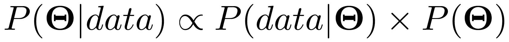
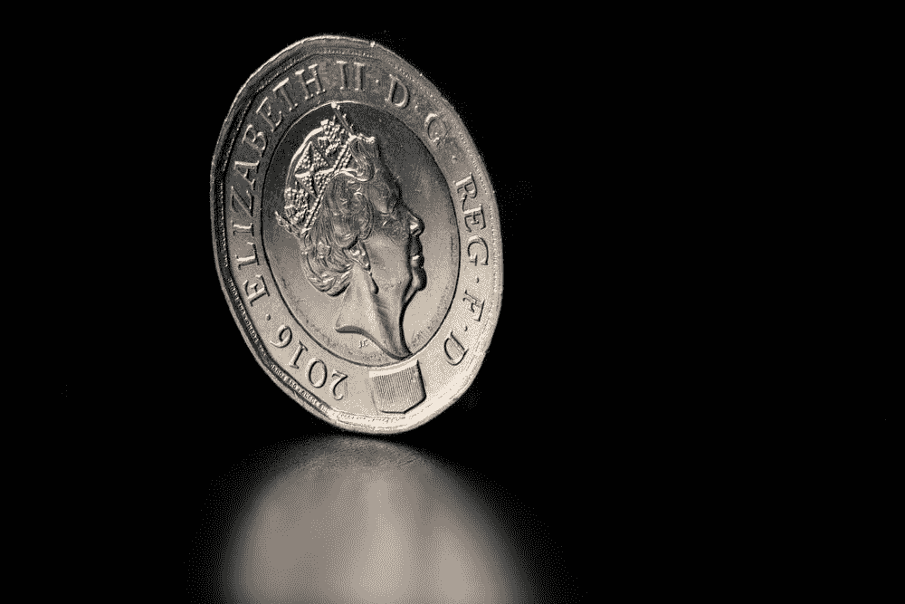

# 调情——贝叶斯统计中的一个练习

> 原文：<https://towardsdatascience.com/flirting-an-exercise-in-bayesian-statistics-61de2bf73814?source=collection_archive---------23----------------------->

求爱的仪式既多又奇怪。对一点都不好笑的事情的假笑。一缕头发。一句老套的搭讪台词。

这一切意味着什么？

答案就在贝叶斯统计中，因为调情可以被视为一种观察，然后相应地更新先前信念的练习。调情的核心是两件事:

1)试图通过观察某人在你身边时的行为/信号来判断他是否喜欢你(或者他们是否会成为一个好伴侣)。

2)向其他人发出信号，希望他们能够理解并得出你希望他们得出的结论(你对他们感兴趣，或者你会成为一个很好的合作伙伴)。

让我们借助贝叶斯定理，以一种更正式的方式来分解它。下面是:

The foundational theorem guiding this essay (Source: [Towards Data Science](https://miro.medium.com/max/3416/1*ug6WkZX2H6Dk7eliroxi9w.png))

这是什么意思？我们来分解一下。让我们看看方程中的两个变量——θ和*数据*。我们可以把θ看作一个结果。我们从 P(θ)开始，我们称之为*先验*，P(θ)的含义非常简单——它是我们认为我们的结果实际发生的概率。这里有一个真实的例子来说明。假设θ是抛硬币正面朝上的结果。假设我们的*先验*信念——我们在观察到任何数据之前开始相信的东西——是 50%。这意味着我们的*先验*信念是，掷硬币的结果是正面的概率等于 50%。P(θ)= P(抛硬币的结果=正面)= 50%。*先验*本质上可以是任何东西——它是你开始相信的任何东西。在这种情况下，我的生活经验和常识使我认为 P(θ)= 50%是合理的*先验，*我希望你同意。

现在我们已经有了初始信念 P(θ)set，让我们引入等式的下一部分 P(data |θ)。如果我们假设θ的*先验*分布为真，这就是观察到某些结果/数据的可能性。所以我们有了*先验*P(θ)= 50%。P(data |θ)是说，给定一个硬币是公平的(正面的结果是 50%)，观察到一些数据的概率是 P(data |θ)。这些数据就是我们实际看到的东西——例如，如果我们观察到 30 次抛硬币，30 次正面朝上，那么 P(data |θ)= P(30 次抛 30 次正面朝上|θ= 0.5)→**如果硬币真的是公平的，那么我们在 30 次抛中得到 30 次正面朝上的可能性有多大？**观测数据出现在*之前*的可能性有多大？很明显，如果硬币真的是公平的，30 次投掷中 30 次正面朝上的可能性是非常低的。P(数据|θ)= P(30 次投掷 30 个头|θ= 0.5)几乎为 0。

综上所述，P(θ| data)是我们观察证据后的*后验*信念。**这可以被视为根据我们在数据**中观察到的情况更新我们的*先验*信念**。**在这个例子的上下文中，这基本上意味着**我们正在更新我们的*先验*信念，即硬币是公平的，到新的*后验*信念，即硬币倾向于正面。这只是常识——我们开始认为硬币是公平的，然后我们看到它在 30 次投掷中出现了 30 次正面，然后现在我们认为硬币没有我们最初认为的公平，而是更偏向正面。显然，从我们刚刚遵循的逻辑序列中，我们看到*后验*与**先验*乘以从该先验产生的数据的可能性*成比例。数学上，**P(**θ**|数据)**α**P(**θ**)* P(数据|**θ**)。**

Fair or not? Observe data and use Bayes’ Rule to find out (Source: [Public Domain](https://unsplash.com/photos/Zvvu4zRKijE))

很好，现在我们明白了贝叶斯法则。如果你想一想，我们实际上一直在我们的思维过程中实施贝叶斯法则。如果我们认为某件事是真的，然后我们看到影响先前信念的数据，我们会以某种方式改变我们最初的信念。如果我认为鲍勃是一个吝啬的人，然后我看到他在街上给乞丐钱，我会将我最初认为他吝啬的信念修正为一个新的信念，即他并不像我曾经认为的那样吝啬——因为如果我先前认为他吝啬的信念是真的，鲍勃给乞丐钱的可能性很低，这使得后来的信念更接近于鲍勃没有以前那么吝啬。每次你因为新的证据而改变主意时，你都在使用贝叶斯法则。

那么这和调情有什么关系呢？你现在可能已经猜到了。调情是贝叶斯法则的高风险、情绪化的表现。有几种方法可以考虑这个问题。

第一:你想弄清楚你的爱人是否也喜欢你。你一开始对之前的*相对不了解，只是随意猜测他们是否喜欢你。可能你第一印象不好，你把先验设在 P(他们喜欢我)= 25%。这是一种不确定的方式，让你的品味去表达你的爱。你想先了解更多信息。*

所以你们一起出去玩的时间越多，你们约会的时间越长，你们见面的次数越多，在每一种情况下，你们都在收集数据。也许他们紧紧地拥抱你——如果他们有 25%的机会喜欢你，这种情况发生的概率相当低——也许你一开始低估了自己，现在你将 25%的*先验*更新为 27%的*后验*。也许你碰了它们，它们本能地厌恶地退缩了→更新之前的*并减少到 5%。我们继续前进。*

**

*This guy will update his prior belief on whether the woman likes him after he sees how she reacts to this touch (Source: [Public Domain](https://unsplash.com/photos/CT7IWRM7G5k))*

*你正在收集所有这些数据，观察它们的每一个动作，并把它们代入贝叶斯法则，希望你能向上更新你的*先验*。也许有一天你觉得你已经收集了足够多的数据，并说是的，他们喜欢你的概率其实真的很高——是时候表白了！或者有一天你得出结论，他们喜欢你的可能性非常低，现在你知道你应该放弃，继续前进。*

*不管怎样，每次约会，你都在无意识地使用贝叶斯推理。**对方也是**。他们以完全相同的方式评价你和你的行为。你想引导他们走向正确的方向，帮助他们准确地更新他们的*先验*——所以你轻拂你的头发，触摸他们的前臂，等等。或者，如果你不感兴趣，你会冷淡他们，取消约会，等等。让他们更接近你希望他们得出的结论。*

*第二:同样的贝叶斯计算可以用于调情的另一个目的——评估潜在伴侣的质量或表明自己的质量。当你看到他们给服务生的小费很高时，你会修改之前的*来反映这些数据——你的信念会更新，认为他们比你最初认为的更好。反之亦然，如果你的约会对象因为服务生晚了两分钟才把菜端上来而对他大喊大叫。**

*有了这些知识，我们现在可以看到调情的关键。它们如下:*

*1)你需要收集数据。这是获得更多信息的唯一途径。所以去和你喜欢的人互动吧！*

*2)你的成功取决于你估算/计算 P(data |θ)项的能力有多强——你需要弄清楚，如果有人喜欢你，他们会如何行动，以及你的观察与这种预期有多大差异。*

*a.为了帮助计算，请你的朋友分析一下情况。当我们向朋友寻求建议时，我们所做的只是细化我们对 P(data |θ)的计算！*

*3)相应地更新后验。希望数据显示他们比你想象的更喜欢你！*

*希望这是有帮助的——带上贝叶斯法则，祝你的浪漫事业好运。*