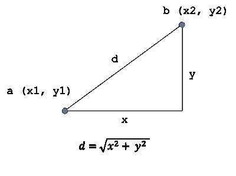
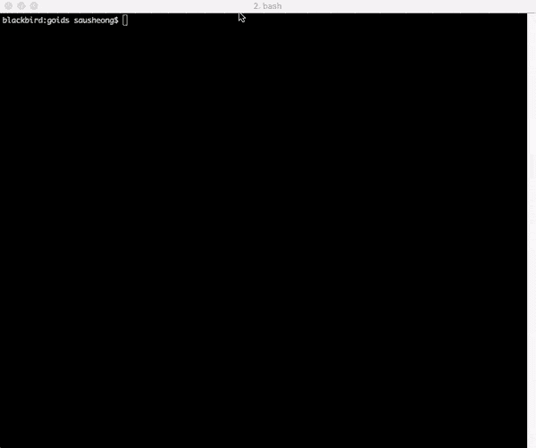

# 蜂拥而至

> 原文：<https://towardsdatascience.com/flocking-with-go-2dcf6fcab144?source=collection_archive---------6----------------------->

## 如何使用 Go 在你的终端上创建一个群集模拟

我写植绒模拟已经很久了。我用 Java 尝试过，但我仍有记录的最早版本是用 JRuby 和 Swing 开发的，名为 [Utopia](https://youtu.be/x44s8TTWm5E) 。我用[鞋](http://shoesrb.com/)写了一个，那是我的 [*用 R 和 Ruby*](http://shop.oreilly.com/product/0636920022626.do) 探索日常事物书中的那个。过了一段时间，(总体来说，我对鞋子不太满意)，我用 2D 的一个 Ruby 和 C++游戏开发库 [Gosu](https://github.com/gosu/gosu) 重新写了一遍。这个版本可以在[这里](https://github.com/sausheong/utopia)找到。

[群集](https://en.wikipedia.org/wiki/Flocking_(behavior))模拟基本上是一个模拟鸟类群集行为的软件程序。这种群集行为与昆虫的群集行为或鱼类的群集行为非常相似。这被认为是一种紧急行为——一种源于个体遵循简单规则的行为，不涉及任何中央协调。这种行为，尤其是在椋鸟或成群梭鱼的低语中看到的，可能是一种令人惊叹的现象。


Photo by [James Wainscoat](https://unsplash.com/@tumbao1949?utm_source=unsplash&utm_medium=referral&utm_content=creditCopyText) on [Unsplash](https://unsplash.com/s/photos/flock?utm_source=unsplash&utm_medium=referral&utm_content=creditCopyText)

# Boids

群集最早是由程序员 Craig Reynolds 用软件模拟的，他开发了一个名为 [*boids*](http://www.red3d.com/cwr/boids/) 的软件程序，并于 1987 年在 ACM SIGGRAPH conference 上发表了一篇关于该主题的论文。从那以后，在模拟群集方面有了很多进步，但是基本思想仍然很简单。

Boids 本身使用三个基本规则来描述单个 boid 如何移动:

*   *分离*——避免拥挤附近的其他蜂群
*   *对齐*——向附近队友的平均方向移动
*   *凝聚力*——向附近队友的平均位置移动


这些规则得到了扩展，在某些情况下，添加了更多的规则，但基本思想是，个人遵循一些简单规则的局部反应可能会导致复杂的、意想不到的行为。

# 在围棋中做

虽然我已经认真地用 Go 编程几年了(它现在是我的主要编程语言)，但我一直没有找到用 Go 编写群集模拟的好方法。最大的问题是，Go 主要是一种后端编程语言，并没有真正的 GUI 工具包。虽然有一些尝试，包括绑定到 GTK 和 QT，但没有一个符合我的要求。如果你正在寻找一个桌面应用程序，你可能会更好地使用 [Electron](https://github.com/electron/electron) 并在 Go 中构建一个 web 应用程序来支持它。

也就是说，直到我在我的帖子[](/a-gentle-introduction-to-genetic-algorithms-c5bc15827e2d)*中摆弄遗传算法。在那篇文章中，我试图向终端显示一个图像，在我的例子中，是优秀的 [iTerm2](https://www.iterm2.com/) 。这就是我在 iTerm2 上偶然发现这个允许我在屏幕上显示图像的黑客的地方。*

*当然，如果我可以显示一个图像，我就可以显示多个图像。如果我可以显示多幅图像，我也可以将它们一幅接一幅地重叠显示。如果我能足够快地展示它们…*

*How to make a flip book (credits: Andymation [https://www.youtube.com/watch?v=Un-BdBSOGKY](https://www.youtube.com/watch?v=Un-BdBSOGKY))*

# *黄金*

*当然，我称它们为黄金。一个`Goid`是一个简单的结构，带有位置、速度和颜色的信息。*

```
*type Goid struct {
	X     int // position
	Y     int
	Vx    int // velocity
	Vy    int
	R     int // radius
	Color color.Color
}*
```

*位置和颜色很容易理解。这里的速度不仅仅是金子移动的速度，也是它移动的方向。在这种情况下，`Vx`和`Vy`是高尔夫球在下一个循环中将要离开的距离，也是它将要去的方向。从数学上来说，`X`和`Y`是*标量*位置(它告诉你在 2D 平面上离原点有多远)，而`Vx`和`Vy`是 [*矢量*](http://mathinsight.org/vector_introduction) 。*

*创建 goids 相对简单。每个 goid 必须在窗口内，并且它的起始速度小于它的大小。*

```
*func createRandomGoid() (g Goid) {
	g = Goid{
		X:     rand.Intn(windowWidth),
		Y:     rand.Intn(windowHeight),
		Vx:    rand.Intn(goidSize),
		Vy:    rand.Intn(goidSize),
		R:     goidSize,
		Color: goidColor,
	}
	return
}*
```

*大部分工作都在`move`函数中。*

```
*// move the goids with the 3 classic boid rules
func move(goids []*Goid) {
	for _, goid := range goids {
		neighbours := goid.nearestNeighbours(goids)
		separate(goid, neighbours)		
		align(goid, neighbours)
        cohere(goid, neighbours) stayInWindow(goid)
	}
}*
```

*自 30 年前以来，群集模拟已经有了相当大的进步，但是对于这个简单的模拟，我使用了 boids 的 3 个经典规则。这三条规则都要求 goid 知道谁是它的邻居，所以首先弄清楚这一点是有意义的。*

```
*// find the nearest neighbours
func (g *Goid) nearestNeighbours(goids []*Goid) (neighbours []Goid) {
	neighbours = make([]Goid, len(goids))
	for _, goid := range goids {
		neighbours = append(neighbours, *goid)
	}
	sort.SliceStable(neighbours, func(i, j int) bool {
		return g.distance(neighbours[i]) < g.distance(neighbours[j])
	})
	return
}// distance between 2 goids
func (g *Goid) distance(n Goid) float64 {
	x := g.X - n.X
	y := g.Y - n.Y
	return math.Sqrt(float64(x*x + y*y))}*
```

*首先，我们克隆整个 goid 群体，然后我们使用`sort.SliceStable`按照与所讨论的 goid 的距离对克隆的数组进行排序。找到距离只是一个使用毕达哥拉斯定理的问题。*

**

*这给了我们一个相邻高尔夫球的列表，按距离排序。让我们看看第一条规则。*

# *分离规则*

*这就是*个人空间*法则。比方说，你和许多其他通勤者在一列火车上，它停在一个有许多人上车的车站。当他们进来的时候，他们会填满空间，会有一些人最终离你太近。你会怎么做？你会离开他们一点，但不会离其他人太近，最终会和其他人保持一个舒适的距离。这是规则。*

```
*// steer to avoid crowding local goids
func separate(g *Goid, neighbours []Goid) {
	x, y := 0, 0
	for _, n := range neighbours[0:numNeighbours] {
		if g.distance(n) < separationFactor {
			x += g.X - n.X
			y += g.Y - n.Y
		}
	}
	g.Vx = x
	g.Vy = y
	g.X += x
	g.Y += y
}*
```

*我们只对有限数量的相邻 goids 感兴趣，这由参数`numNeighbours`指定。相邻的高尔夫球场也必须在参数`separationFactor`内(不是所有相邻的高尔夫球场都足够近，不会让人不舒服)。一旦这些金球进入那个空间，我们就远离它们。然后我们把速度更新到那个距离，然后用那个速度移动高尔夫球。*

# *对齐规则*

*这就是*同辈压力*法则。同辈压力是同辈人对人们施加的直接影响，使他们改变行为以符合群体的要求。你可能对同辈压力很熟悉——当你看到你的邻居拥有闪亮的新 4K 电视或 iPhone X 时，你可能也会想给自己买一台。在我们的生活中，还有很多其他不需要进一步解释的同伴压力的例子，而这正是对齐规则。*

```
*// steer towards the average heading of local goids
func align(g *Goid, neighbours []Goid) {
	x, y := 0, 0
	for _, n := range neighbours[0:numNeighbours] {
		x += n.Vx
		y += n.Vy
	}
	dx, dy := x/numNeighbours, y/numNeighbours
	g.Vx += dx
	g.Vy += dy
	g.X += dx
	g.Y += dy
}*
```

*和以前一样，我们只对由`numNeighbours`指定的有限数量的相邻 goids 感兴趣。然而，这条规则并不影响高尔夫球的位置，而是改变高尔夫球的速度，我们将所有相邻高尔夫球的速度相加，然后除以相邻高尔夫球的数量。最终值会修改速度，而不是完全替换它，同时新值会修改 goid 的位置。*

# *内聚规则*

*这就是*方阵*法则。希腊方阵是一个矩形的、紧密排列的步兵编队，作为一个整体行进和战斗。这是古代战争中最有效和持久的军事编队之一。它的效力在于密不透风的盾牌和长矛组成的紧密队形，缓慢地向前推进，突破敌人的行列。罗马人后来采取了同样的想法，创建了三线罗马军团，用于征服已知世界。*

```
*// steer to move toward the average position of local goids
func cohere(g *Goid, neighbours []Goid) {
	x, y := 0, 0
	for _, n := range neighbours[0:numNeighbours] {
		x += n.X
		y += n.Y
	}
	dx, dy := ((x/numNeighbours)-g.X)/coherenceFactor, ((y/numNeighbours)-g.Y)/coherenceFactor
	g.Vx += dx
	g.Vy += dy
	g.X += dx
	g.Y += dy
}*
```

*和其他规则一样，我们只对邻近的金子感兴趣。我们取所有这些邻居的平均位置(将所有邻居的位置相加，然后除以邻居的数量)，并从中减去 goid 的位置。然后将这个值除以一个`coherenceFactor`,这个值决定了 goids 希望与其邻居保持一致的程度。如果`coherenceFactor`太高，高尔夫球将不会移动，如果太低，高尔夫球将会彼此贴得太近，形成紧密结合的高尔夫球簇。*

# *呆在视野之内*

*现在我们有了规则，我们可以运行模拟，但由于我们的视图仅限于参数`windowWidth`和`windowHeight`，一旦黄金离开屏幕，我们就再也看不到它了。也就是说过一段时间，就只是一个空屏幕了。为了防止这种情况发生，如果一个黄金离开了屏幕，我们会神奇地把它转移到窗口的另一边。*

```
*// if goid goes out of the window frame it comes back on the other side
func stayInWindow(goid *Goid) {
	if goid.X < 0 {
		goid.X = windowWidth + goid.X
	} else if goid.X > windowWidth {
		goid.X = windowWidth - goid.X
	}
	if goid.Y < 0 {
		goid.Y = windowHeight + goid.Y
	} else if goid.Y > windowHeight {
		goid.Y = windowHeight - goid.Y
	}
}*
```

# *显示框架*

*拼图的最后一块是画出金子本身。*

```
*// draw the goids
func draw(goids []*Goid) *image.RGBA {
	dest := image.NewRGBA(image.Rect(0, 0, windowWidth, windowHeight))
	gc := draw2dimg.NewGraphicContext(dest)
	for _, goid := range goids {
		gc.SetFillColor(goid.Color)
		gc.MoveTo(float64(goid.X), float64(goid.Y))
		gc.ArcTo(float64(goid.X), float64(goid.Y), float64(goid.R), float64(goid.R), 0, -math.Pi*2)
		gc.LineTo(float64(goid.X-goid.Vx), float64(goid.Y-goid.Vy))
		gc.Close()
		gc.Fill()
	}
	return dest
}*
```

*每一帧都是宽`windowWidth`高`windowHeight`的图像。在这个框架中，我们将每个 goid 绘制为一个圆，然后我们绘制一条线来表示 goid 的尾巴。这条线与高尔夫球前进的方向相反，所以我们从高尔夫球的速度中减去它的位置。*

# *显示模拟*

*我们现在已经有了所有需要的函数，所以让我们把它们放在`main`函数中。*

```
*func main() {
	clearScreen()
	hideCursor() goids := make([]*Goid, 0)
	for i := 0; i < populationSize; i++ {
		g := createRandomGoid()
		goids = append(goids, &g)
	} for i := 0; i < loops; i++ {
		move(goids)
		frame := draw(goids)
		printImage(frame.SubImage(frame.Rect))
		fmt.Printf("\nLoop: %d", i) }
	showCursor()
}*
```

*还有几个你以前没见过的功能。什么是`clearScreen`、`hideCursor`、`showCursor`、`printImage`？这些是实际显示模拟的函数。*

*再来看`clearScreen`、`hideCursor`和`showCursor`。*

```
*func hideCursor() {
	fmt.Print("\x1b[?25l")
}func showCursor() {
	fmt.Print("\x1b[?25h\n")
}func clearScreen() {
	fmt.Print("\x1b[2J")
}*
```

*那么我们用了哪些奇怪的转义序列呢？这些是 [ANSI 转义序列](https://en.wikipedia.org/wiki/ANSI_escape_code)，用于控制文本终端上的各种选项。它们大多是过去的遗留物，但仍在 iTerm2 等终端仿真器中广泛实现。所有序列都以`ESC` (27 或十六进制 0x1B)开头，后面是提供控制选项的第二个字节。特别是，`ESC`后跟`[`表示下一个字节是控制序列引入器(CSI)，它是一组有用的序列。例如，`?25h`显示光标，`?25l`隐藏光标。您可能已经猜到了，`2J`清除整个屏幕并将光标移到屏幕的左上角。*

*让我们看看如何将图像打印到屏幕上。*

```
*// this only works for iTerm!
func printImage(img image.Image) {
	var buf bytes.Buffer
	png.Encode(&buf, img)
	imgBase64Str := base64.StdEncoding.EncodeToString(buf.Bytes())
	fmt.Printf("\x1b[2;0H\x1b]1337;File=inline=1:%s\a", imgBase64Str)
}*
```

*这是一个有趣的黑客行为，只在 [iTerm2](https://www.iterm2.com/documentation-images.html) 中发现(据我所知)。这允许您获取二进制图像的 base64 表示，并在终端上内联打印出来。在行首的转义序列`2;0H`是一个 CSI，它将光标移动到第 2 行第 0 列，在那里我们要打印图像。*

# *最终模拟*

*这是我运行它时的样子。*

**

# *密码*

*这里找到的所有代码都可以在[http://github.com/sausheong/goids](http://github.com/sausheong/goids)找到。*

# *我为什么要这么做？*

*群集模拟已经被做得死去活来，但是我喜欢写它。看到这些小家伙不是作为个体，而是作为一个有自己思想的群体四处活动，有一种禅意。在学习了群集和编写群集模拟之后，我开始做更多的模拟，将来我可能会写更多。*