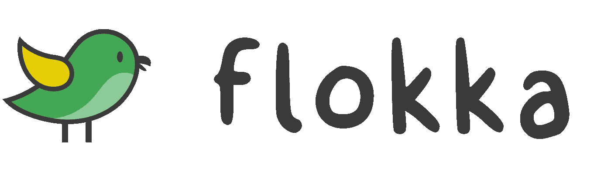
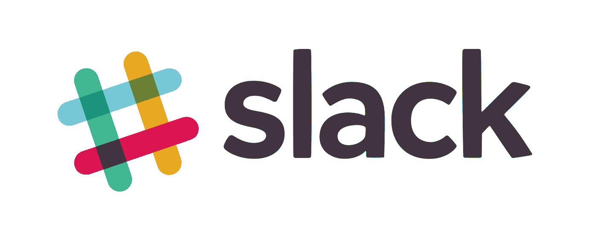
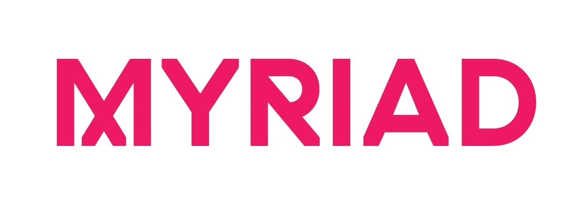
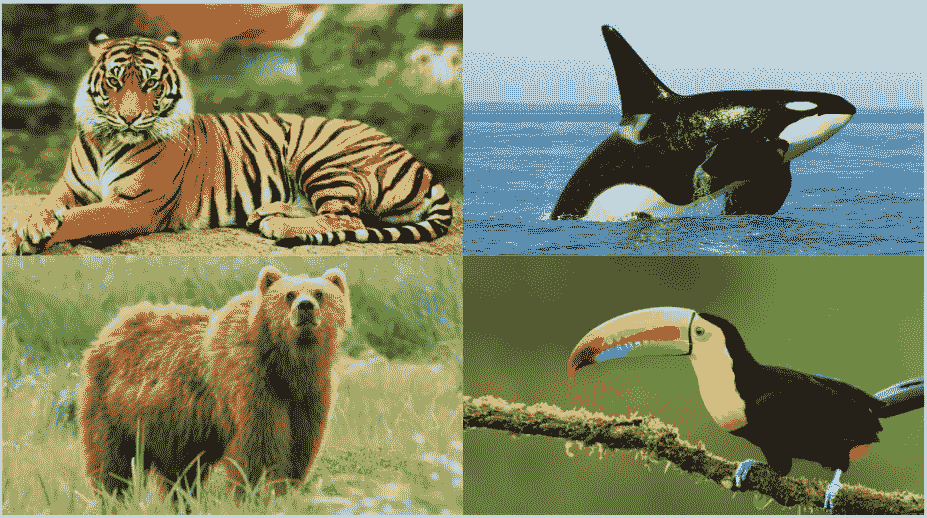
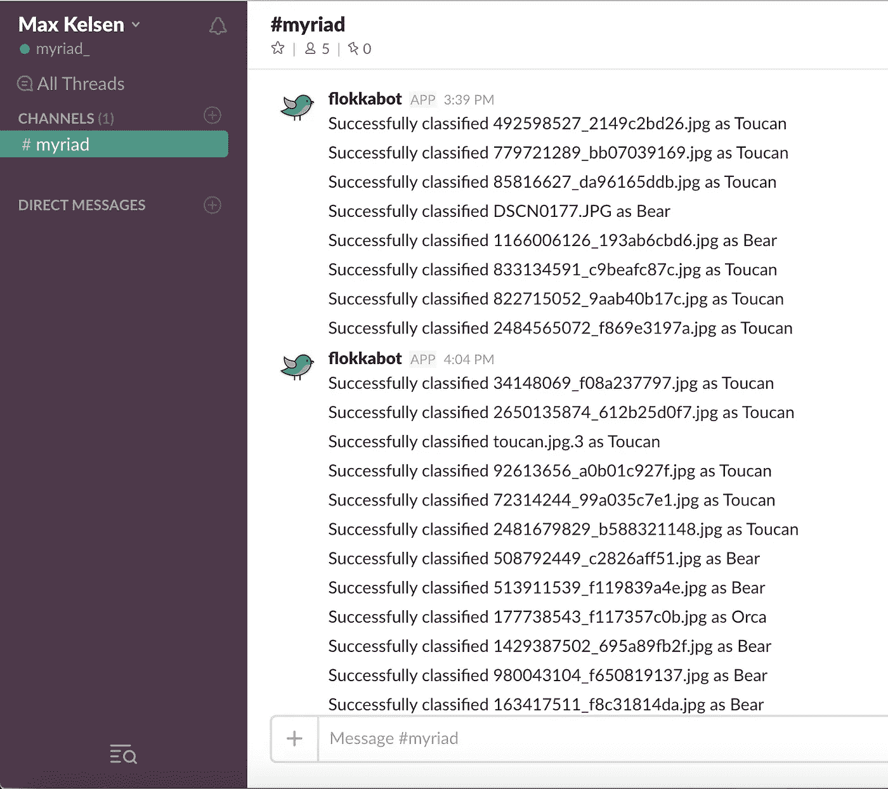
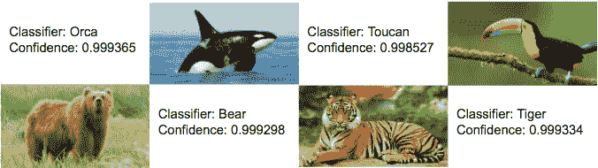
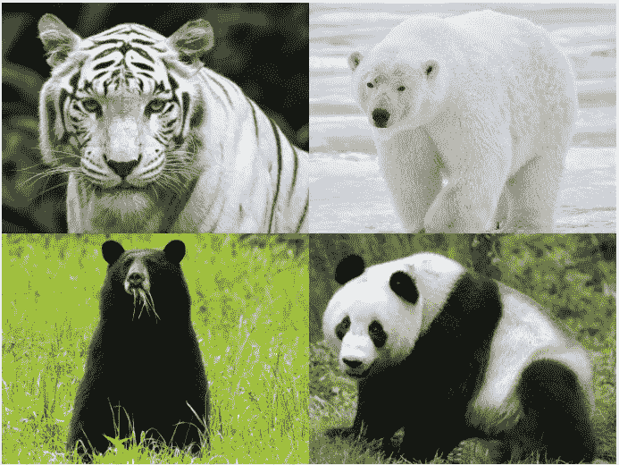
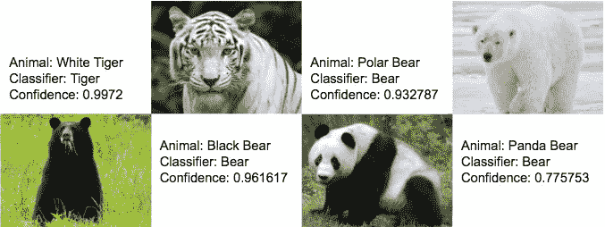

# 弗洛卡:监督学习，变得简单

> 原文：<https://towardsdatascience.com/flokka-supervised-learning-made-easy-2ac5df426dea?source=collection_archive---------7----------------------->

## 机器学习模型的众包训练

图像识别是一个极其复杂的过程。这一过程中最困难的部分之一是获取数据并将其准确分类。在徒劳地寻找一种更实用的分类方法来节省时间和资源之后，我们开发了自己的解决方案。进来吧，弗洛卡，一个机器人。

Flokka 在今年的 [Myriad Festival](http://www.myriad.live/) 上进行了尝试和测试，旨在众包一个简单图像识别模型的分类和训练。使用 Flokka slackbot，用户能够快速地将无序文件夹或列表中的文件排序为有序的文件结构——非常适合训练机器学习模型。

slackbot 是 Slack 平台独有的一种程序，它允许用户通过 Slack 聊天室与程序的界面进行交互。这可以通过自然语言来完成，例如“请为我获取最近 24 小时的最新头条”，或者通过命令来完成:“/获取新闻 10”。这有助于那些不知道如何使用某些程序/编程接口的用户轻松地使用它们。

我们选择开发 Flokka 作为 Slackbot，是因为 Slack 在 Max Kelsen 团队中扮演着不可或缺的角色。Slack 的多平台特性让我们可以随时随地轻松的对图像进行分类；在其他项目的短暂休息期间，甚至是在喝我们早晨的咖啡时。在办公室中，这种可访问性有助于简化图像分类过程，消除了数小时手动分类的需要。

**弗洛卡是如何建成的？** Flokka 是使用 SlackClient Python API(特别是 Events API)创建斜杠命令和处理交互消息而构建的。

使用/classify [number]命令，slackbot 从 training 文件夹中取出[number]张图像，并在指定的 Slack 通道中显示它们。显示后，用户可以使用每个图像下方的按钮输入选择适当的分类。然后，图像被分类到适当的文件结构中，以备在机器学习模型中使用。Flokka 为人们省去了将图像拖到桌面文件夹中的繁琐任务，并创建了一个更具吸引力和乐趣的整体过程。即使随着 slackbot 的发展，类别和图像变得更加复杂，一点一点分类的能力应该会提高执行任务的个人的准确性。

在接下来的几周里，我将会写一篇关于 Flokka 的更具技术性的文章。

测试模型
Myriad 是一个为期三天的技术和创新节，于 3 月 29 日至 31 日在布里斯班发电站举行。该活动鼓励企业家、投资者、企业主和技术爱好者之间的合作和交流。此外，Myriad 为我们提供了展示 Flokka 的机会，并让志同道合的人了解和测试 slackbot。我们邀请与会者帮助我们给未分类的四种珍奇动物贴上标签；一只熊，一只虎鲸，一只老虎和一只巨嘴鸟。这种标记的结果然后将被用作训练集来构建图像分类模型。

每只动物的图片都是从 http://www.image-net.org/的[和 T4 的](http://www.image-net.org/)[中挑选出来的，放在亚马逊 s3 的一个训练文件夹中。该文件夹中的图片用于分类过程的众包。与会者被邀请参观 Max Kelsen 展台，并一次对多达 20 幅图像进行分类。](http://www.image-net.org/)

在两次会议的过程中，2000 张图片被分为:712 只熊，790 只巨嘴鸟，154 只老虎和 286 只虎鲸。此外，58 张图片包含不相关的动物。

一旦图像被分类，我们就用它们来训练一个图像识别模型，以检测每种动物的新照片并对其进行分类。这个模型是通过重新训练一个张量流模型
创建的(有关教程，请参见[此处](https://www.tensorflow.org/tutorials/image_retraining) ) *。*

然后，我们在模型中运行盲集(每个类别 50 张图片),该模型的结果显示在下图中:

该模型将 200 幅盲图像分为四类，每类图像的平均置信区间超过 99.8%。这一统计反映了程序比手工方法更有效、更准确地执行任务的能力。我们承认，这种准确性可能是由于图像类别在颜色、纹理、形状和模式方面有很大的差异，供模型辨别。认识到这一点，我们试图进一步测试该模型，并通过该模型运行该类别的亚种图像，包括黑熊、熊猫、北极熊和白虎。

这些图像的结果如下所示:

这项研究的结果进一步鼓励了这样一种观点，即对于识别来说，图案和形状被认为是比颜色更重要的因素。得出这一结论是因为白虎、北极熊和黑熊的图像颜色不同，但具有与其相应类别“原始”相似的图案和形状，并且在模型的图像识别中保持了高准确率。然而，该模型被发现在识别熊猫图像方面稍欠准确，熊猫图像在形状上具有最大的差异。

**最终结果** Flokka 创造了一个图像分类过程，与以前的手动图像分类技术相比，它对用户来说既更快又更容易使用。虽然我们注意到人们似乎很喜欢 Flokka 的游戏特色，但我们也认识到，这可能是因为本研究中使用的生动而奇特的样本图像的性质而被放大了。与十个或更多类别的系统相比，由于四个类别系统的简单性，该过程也变得更容易，这可能会降低 Flokka 的生产率。

考虑到与会者能够快速分类也很重要，因为图像之间的视觉差异很大。较小的差异将带来更大的困难，个人可能难以以相同的速度和准确度对图像进行分类。尽管如此，Flokka 通过松散平台的可访问性和组织的便利性仍然会在该过程中产生整体效率增益。对于 Max Kelsen 来说，这是一个激动人心的时刻，因为我们不断开发 Flokka 等方法来改进我们的平台、技术和整体生产力。

*Max Kelsen 团队目前正致力于改进和开发可用于任何工作场所和图像识别模型的 Flokka。敬请关注即将推出的 Flokka 开源版本，并通过*[*Flokka . io*](http://flokka.io)*订阅 Flokka 时事通讯，了解该项目的最新详情。*