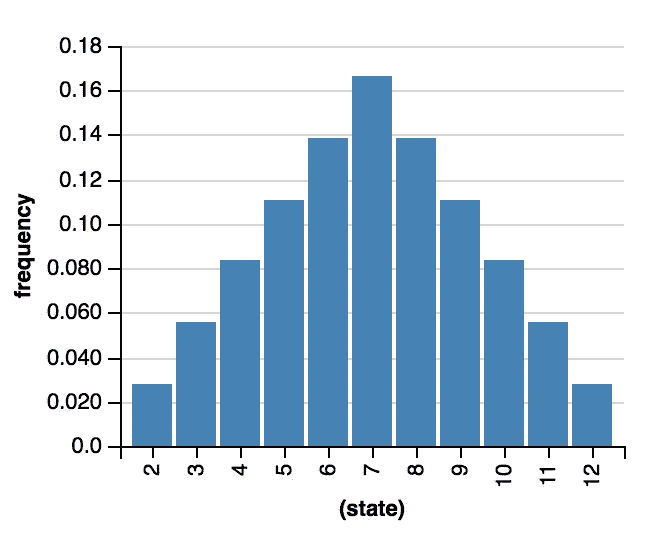
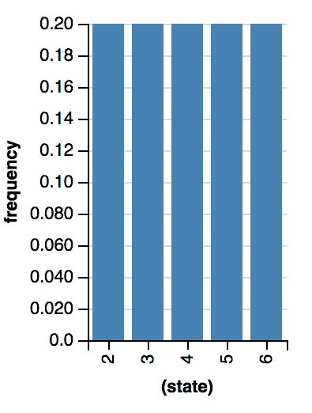
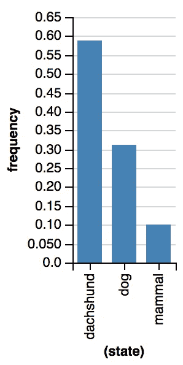
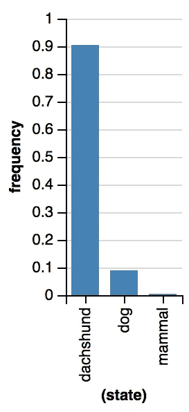
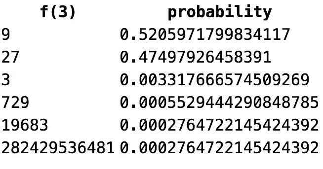
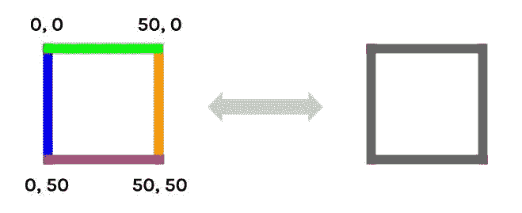
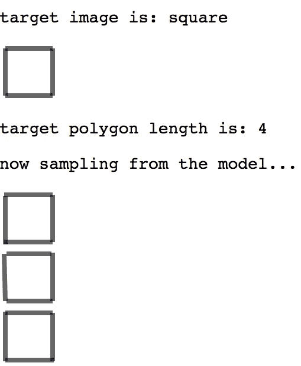

# 流动的概念和创造的可能性

> 原文：<https://towardsdatascience.com/fluid-concepts-and-creative-probabilities-785d3c81610a?source=collection_archive---------13----------------------->

## 通过概率规划的概念学习。

## 回到未来:人工智能大炒作时代的概念

> “然后,‘人工智能’这个词就滑下了斜坡，最终变成了毫无意义的流行语和空洞的炒作。(……)幸运的是，一个新术语“认知科学”正在流行，我开始喜欢用这种方式来描述我的研究兴趣，因为它明确强调了对人类思维/大脑中实际发生的事情的忠诚。”—道格拉斯·霍夫施塔特(2000 年之前，只是为了说明一下)

我猜想有人带着下面的难题来找你:给定整数序列`0, 1, 2, …`，猜下一项。这似乎并不难，是吗？`3`将是我们显而易见的答案，因为我们会假设“生成器函数”可能像`f(x) = x`一样简单:

```
f(0) = 0
f(1) = 1
f(2) = 2
f(3) = ??? -> 3
...
```

事实证明，这是**而不是**生成*这个*序列的函数。序列继续如下:

```
f(0) = 0
f(1) = 1
f(2) = 2
f(3) = 720!
f(4) = ???
...
```

那么，`f(4)`是什么？

我们不会破坏这个惊喜(见解决方案的最后部分)，但使用这个漂亮的难题来讨论一个更普遍的问题:给定由算术运算(加、减、乘等)构建的整数和函数的宇宙。)，假设可能性的数目是无限的，如何学习一个数列的“生成函数”？

> 我们专门研究人类语言的形式模型——如果你认为求解整数序列是愚蠢的，你可以把英语语法想象成你现在正在阅读的内容的“生成器函数”,以及计算机对文本进行类似人类的推理是多么困难。关于语言，现在说够了，让我们回到整数！]

序列游戏是在探索*概率编程* ( *PP* )时偶然想到的，这是[经常解释的](https://en.wikipedia.org/wiki/Probabilistic_programming_language)试图将通用编程与概率建模统一起来。我们对 PP 的兴趣在于明确推理*结构*的能力，以及在没有大量数据的情况下很好地处理不确定性*的能力:祝“机器学习你的方法”好运；*

```
f(1) = 1
f(2) = 4
f(3) = ???
```

序列游戏是令人惊奇的[流动概念和创造性类比](https://www.amazon.com/Fluid-Concepts-Creative-Analogies-Fundamental/dp/0465024750)的一部分(有趣的事实:[这是亚马逊上销售的第一本书](https://en.wikipedia.org/wiki/Douglas_Hofstadter#cite_note-50)！)，一本由人工智能先驱、畅销书作家和认知科学家道格拉斯·霍夫施塔特(Douglas Hofstadter)于 1995 年出版的书( *DH* )。在他无与伦比的写作能力中，问题是这样引入的:

> 这一序列的数学起源表明，确实会有模式或顺序，但由于数学本身充满了极其多样的模式，这个领域仍然是敞开的。尽管如此，我们对简单和优雅有着固有的偏见，不管我们能否定义这些概念。那么，假设我们预期我们可能会找到一个简单而优雅的规则，那么接下来会发生什么呢？

在*这篇*简短的帖子中，我们将重新发现序列游戏，并用一些简单的 PP 程序讨论概念学习。一方面，这将是理解 PP 的一个很好的练习，因为我们将看到如何以令人满意和有原则的方式对待*固有的偏见*；另一方面，我们将使用 PP 来深入了解人工智能的最新进展。

*免责声明:这篇文章既不是关于 PP 的教程，也不是学术著作(如果有的话，因为它带有明显的偏见)，也不是生产就绪模型的集合* — *虽然包含了可运行的代码示例，但我们今天的兴趣几乎完全在于用标准 ML 工具难以实现的建模类型，而用 PP 来代替是自然的。作为奖励，我们将讨论关于概念学习的认知上合理的想法，这些想法超越了*[](https://www.quantamagazine.org/to-build-truly-intelligent-machines-teach-them-cause-and-effect-20180515/)**。**

## *向前看，向后看:概率建模 101*

> *"在纽约，百万分之一的几率一天发生八次."—佩恩·吉列特*

*在我们作为人工智能从业者和创业公司创始人的生活中，我们多次发现，概率编程中的许多想法仍然远远不是数据科学社区的主流。被这个轶事证据所说服，我们决定包括对 PP 的概述，以及它对有趣的推理问题的特殊之处，比如你在向机器教授语言时遇到的问题(熟悉 PP/WebPPL 的读者可以快速跳过接下来的两节)。*

> *我们将大量使用 [WebPPL 示例](https://github.com/probmods/webppl/tree/master/examples)并充分利用在浏览器中运行代码的可能性:所有示例都可以从这个[简单的 HTML 页面](http://www.jacopotagliabue.it/webppl_tutorial.html)中完全运行。*

*让我们从一个简单的例子开始(当然是用骰子)。如果我们有两个公平的骰子，当你扔的时候得到 8 的概率是多少？这个 WebPPL 程序(记住:你可以在这里运行它)以一个漂亮的直方图显示结果的分布(如果有些东西不清楚，不要惊慌:很快就会很明显了):*

**

*Frequency distribution for our dice model.*

*PP 最酷的地方在于做*逆*推论是多么容易:假设我们*观察到*和是 8，那么一个骰子是 2 的几率是多少？*

**

*Frequency distribution for our dice model, conditioned upon observation.*

*正如读者可能怀疑的那样，如果总数是 8，那么骰子#1 有 20%的机会是 2(给懒惰读者的小测验:为什么上面的直方图中没有 1？).*

*虽然这可能看起来像一个明显简单的例子，但理解“模型的力量”真的很重要，即生成我们感兴趣的数据的过程的简化版本。模型是世界复杂性的一个非常紧凑的表示:在一个单一的模型中，你实际上可以从原因推理到结果(当你计划时，向前)，从结果推理到原因(当你进行有根据的猜测时，向后)。模型也是我们认知能力的核心:通过拥有一个"[七巧板](https://en.wikipedia.org/wiki/Tangram)模型"，孩子们知道如何用零散的碎片建造一只鸭子(向前)，并且根据鸭子的形状，他们可以猜测哪些碎片是用来建造它的(向后)。*

**

*A Tangram duck — humans can easily reason from pieces to figures and from figures to pieces.*

*对于许多人来说，基于模型的推理是智能的关键，其适用性远远超出了七巧板(如直观物理学和视觉学习)；*

> *生成模型描述了一个过程，通常是生成可观察数据的过程，表示关于世界因果结构的知识。这些生成过程是一个领域的简化“工作模型”(…)；通过询问心智模型，可以回答许多不同的问题。*

*对于今天比理解人类智力更温和的目的来说，理解 PP 如何帮助是非常重要的。正如我们所看到的，这些模型通常被称为“*生成型*模型”:不用太在意[的技术细节](https://ai.stanford.edu/~ang/papers/nips01-discriminativegenerative.pdf)，对我们来说重要的是以下两个考虑因素:*

*   *生成模型讲述了一个关于数据点如何生成的故事:它们有一个可以检查的结构，并且它们通常包含人类可以理解、质疑、辩论的因果假设；*
*   *生成模型可以用来*生成我们目标数据的新实例*，这是一个并非所有机器学习模型都具备的特性。例如，如果我们训练生成模型来分类体育与金融中的新闻文章，我们可以使用它们*来创建关于这些主题的新文章*。*

*当人们已经手工编写生成模型*很久了*的时候，概率建模的黄金时代才刚刚开始。PP 的兴起为实践者解决了两个主要问题:首先，PP 带来了编程语言的表达能力:通过使用熟悉的工具，数据科学家现在可以表达任意复杂的模型，而不是一些分布；其次，PP 将推理的负担推给了编译器(和相关工具):研究人员专注于建模，因为计算机将解决所需的推理挑战。*

## *用 Javascript 表达生成模型:WebPPL 101*

> *"我的编程语言的极限意味着我的世界的极限."——(几乎)路德维希·维特斯坦根*

*既然我们已经有了一些关于为什么生成模型如此酷的共同背景，我们可以回到如何在 WebPPL 这样的语言中实现它们的问题。如果您还记得我们的第一个例子，模型被指定为一个简单的函数，包装在*推断*方法中:*

```
*model() {
    var die1 = randomInteger(6) + 1;
    var die2 = randomInteger(6) + 1; return die1 + die2;
}*
```

*当[运行](http://www.jacopotagliabue.it/webppl_tutorial.html#anchor_rolling_forward)时会发生什么？由于`enumerate`是指定的[推理方法](https://webppl.readthedocs.io/en/master/inference/)，程序将对模型中随机变量的所有可能值运行一次函数(即每个骰子从 1 到 6 的随机整数),并收集分布结果(通过方便的`viz`实用程序可视化)。由于模型是*可生成的，*应该可以从中采样并创建新值(即模拟骰子滚动):`sample`函数正是这样做的，通过将以下语句添加到单元块中可以看到(它将打印从模型中采样的 5 个整数的数组):*

```
*print(repeat(5, function() { sample(roll); }));*
```

*第二个例子介绍了 PP 的一个关键思想:*条件作用*。该模型与之前的模型相同，但增加了一个新命令:*

```
*condition(die1 + die2 == 8)*
```

*它运行时会发生什么？`condition`告诉程序*忽略不满足所需条件的*运行:这就是为什么没有 1 出现在分布中——如果一个骰子是 1，则不存在总和是 8 的情况(因为 1+6=7)。*

*条件反射之所以重要，至少有三个原因:它让你从观察到原因进行推理；它有助于以有原则的方式陈述可能限制要考虑的程序运行空间的信息；最后，它可以用来模拟当代人工智能中一个非常重要的概念，*学习，*通过 18 世纪的一个被称为[贝叶斯定理](https://en.wikipedia.org/wiki/Bayes%27_theorem)的想法:给定一些数据，你对一个假设*H*D 的信心应该与 a)你首先对 *H* 的信任程度有关，以及 b)你对 *H* 能够解释 *D* 的程度有关。*

*我们用一个稍微有趣的例子来结束我们对 WebPPL 的简短介绍。考虑一个年轻的领域语言学家——让我们称他为[威拉德](https://en.wikipedia.org/wiki/Willard_Van_Orman_Quine)——在一个世界非常小的异国他乡(也叫本体论):*

**

*A toy universe with a tree-based ontology and 7 objects.*

*这个奇异的世界有七个物体(用整数 1-7 命名)组织成树状结构，概念是关于*三个层次的共性*(例如一切都是*哺乳动物*，*腊肠犬*是一种*狗*，#3 是一种*腊肠犬*)。当#2 出现时，威拉德听到说本族语的人说**basso to**(1000 奖励点给期望本族语的人说 [**gavagai**](https://en.wikipedia.org/wiki/Indeterminacy_of_translation) )的读者。**巴索托**是什么意思:*腊肠犬*、*狗*还是*哺乳动物*？更一般地说:*

> *给定一个未知的单词 W 和一组用 W 表示的物体，威拉德**如何学习**W 的适当的一般性水平？*

*不出所料，概率规划非常适合对此问题建模，如下图所示:*

*奇迹就发生在这里。我们可以区分三个主要部分:*

*   *首先，*从假设空间*取样:威拉德对什么可以用 W 来命名有一些先验的想法(在分布`ontologicalTree`中总结)；特别是，威拉德认为像狗和猫这样的“自然物种”比非常普通的哺乳动物更引人注目；*
*   *二、*似然函数*:威拉德知道在给定观测值(一组对象)的情况下，如何对假设进行优先排序；公式中重要的是认识到 1)较低级别的概念(*检索器*)将比较高级别的概念(*哺乳动物*)赋予数据更大的可能性；2)随着一致事件数量的增加(`observedData.length`)，更低级别的概念更有可能以指数方式*；**
*   **第三，*实际观察数据*，因为`mapData`负责将 Willard 观察到的数据提供给评分函数。**

**[ **小技术说明**:这个例子的最初想法来自于[徐和 Tenenbaum](http://web.mit.edu/cocosci/Papers/XT-PsychRev-InPress.pdf) 的工作——请参阅他们的论文，了解更多关于该模型背后的心理事实的背景以及关于先验和可能性的深入讨论。]**

**那么，回到我们观察到的单词**的第二个例子，威拉德在想什么？运行代码会得到以下分布:****

****

**Distribution over target concepts after one observation.**

**这似乎是一个合理的猜测，不是吗？威拉德更喜欢腊肠狗，但他仍然保持开放的心态；当然，与数据不符的假设(如*寻回犬*，其延伸不包括#2)根本不予考虑。当威拉德观察#2 + #3 *和*听到**低音吉他**时，这个场景变得非常有趣:**

****

**Distribution over target concepts after two observations.**

**发生了什么事？如果威拉德只是排除与数据不一致的假设，看到两只腊肠狗而不是一只*不会增加有意义的信息*:简单地说，威拉德不会学到任何新东西。相反，我们的概率模型允许捕捉威拉德的学习:在看到两只腊肠狗后，他更加确信 **bassotto** 是指*腊肠狗*，同时他几乎准备排除*哺乳动物*作为一种合理的解释(即使从纯粹的逻辑角度来看，与数据完全一致)。我们留给读者一个练习，以确保所有代码都是清楚的:[尝试改变先验、可能性和观察](http://www.jacopotagliabue.it/webppl_tutorial.html#gavagai)以更好地理解幕后发生的事情！**

**如果你想在继续之前再玩一会儿，可以在 [probmods](https://probmods.org/chapters/conditioning.html) 上找到一些关于向前和向后推理相互作用的有效例子。虽然该领域在数据科学社区中仍然相对小众，但事情正在快速发展:我们上周发现了这个出色的 [WIP](http://mbmlbook.com/toc.html?twitter=@bigdata) ，主要参与者[正在进入 PP](https://www.theregister.co.uk/2018/10/05/imicrosoft_nfernet/) 。为了非懒惰读者的方便，我们在最后包含了一堆额外的书籍/链接。**

**现在让我们回到我们的序列游戏！**

## **“寻找序列的来源”**

> **"不要让一个人猜太久——他肯定会在别的地方找到答案的。"—梅·韦斯特**

**既然我们对 PP 背后的哲学有了更好的理解，我们可以试着将我们的序列游戏建模为一个在*假设空间*中的学习问题，假设空间*是无限的*。给定序列:**

```
**f(1) = 1
f(2) = 4
f(3) = ???**
```

**我们将尝试学习序列*发生器* *功能* **调理**(对！)对我们拥有的数据(`f(1)`和`f(2)`)，然后将该函数应用于序列中的下一项(即 3)。即使我们只限于初等算术函数，也有许多函数符合我们的观察结果，例如:**

```
**x * x
x ^ x
x ^ 2
x ^ (0 + x)
x * (x / 1)
0 + (x ^ x)
...**
```

**换句话说，这是一个与我们之前的例子非常不同的场景:没有一个有限的假设集可以列出来，并以某种方式从最合理到最不合理进行评分。这个问题是 DH 在写的时候想到的:**

> **由于数学本身充满了极其多样的模式，这个领域仍然是开放的。**

**既然我们不能列出我们的假设，我们需要把注意力转向能够产生无限假设的过程:幸运的是，我们的语言和语法知识来拯救我们。考虑这样定义的简单语言:**

```
**1\. A, B, C ... Z are valid expressions
2\. If *X* is a valid expression, -*X* is also a valid expression
3\. If *X* and *Y* are valid expressions, *X&Y* is also a valid expression
4\. If *X* and *Y* are valid expressions, *X^Y* is also a valid expression**
```

**根据语法可以生成多少个有效表达式？回答的关键是要认识到指令 2–4 以表达式为输入*并产生*新的表达式，这样任何一条指令的输出都可以成为另一条指令的输入(或者同一条！):**

```
**A -> -A -> -A&B -> -A&B&A -> --A&B&A -> ...**
```

**因此，即使像上面这样简单的语言也能够产生无数的表达式。**

**有了这种直觉，我们能通过一个语法来定义生成函数的空间吗？我们当然可以！我们只需要构建一个算术表达式的小语法，它可能会生成`x * x`、`x ^ x`、`x ^ 2`等。**和它们之上的先验**(记住空间是无限的，所以我们需要一种“生成”的方式来分配所有可能函数之上的先验)。这是第一次尝试(要点包含语法，而完整的可运行代码可以在[这里](http://www.jacopotagliabue.it/webppl_tutorial.html#sequence_basic)找到):**

**代码应该非常容易理解(原始代码来自优秀的 [Goodman & Tenenbaum](https://probmods.org/exercises/lot-learning.html) ):以 50%的概率，通过挑选一个整数(`1–9`)或一个变量(`x`)组成一个表达式，否则将两个表达式合并成一个新的表达式(它将递归地随机挑选一个整数，以此类推)。我们将只强调模型上的“隐式”先验，这是关于*简单性*的先验:在其他条件相同的情况下，更简单的函数(现在定义为*语法上更短的*)应该是首选的。由于产生`x * x`比`x * (x / 1)`需要更少的概率选择，尽管在外延上是等价的(如`x = x/1`)，前者被认为是一个更加可信的假设。显然，这在形式上等同于在一个模型中实施 DH 所说的:**

> **倾向于简单和优雅的固有偏见**

**如果我们在序列上运行模型:**

```
**f(1) = 1 
f(2) = 4**
```

**`f(3)`的首选建议是 9:**

****

**Guessing the third integer for the sequence 1, 4, …**

**正如古德曼&特南鲍姆所说，“许多人发现分配给`27`的高概率(……)是不直观的”。这表明，作为人类序列发现的认知模型，我们的先验可以使用一点修改:`x times x`似乎比`x raised to the power of x`更“自然”的想法(对非懒惰读者的练习:修改代码以反映这种偏差，并再次运行预测)。**

**这个模型能解决什么样的序列？下面是一些可以通过改变`condition`语句来[测试](http://www.jacopotagliabue.it/webppl_tutorial.html#sequence_basic)的例子:**

```
**1, 4, 9 -> ??? x * x
0, 3, 8 -> ??? (x * x) - 1
1, 3, 5 -> ??? x + (x - 1)**
```

**[非懒惰读者的练习:有时学习生成器函数最简单的方法是采用高阶序列，即认识到`1, 4, 9, 16, 25, ...`产生一个`3, 5, 7, ...`的子序列作为数对之间的差；然后，您可以使用第二个序列(奇数)对原始序列进行预测。鼓励读者将现有的模型扩展到二阶序列:在这种情况下先验是什么样的？]**

**我们可能想做的最后一件事就是兜一圈:在[流体概念和创造性类比](https://www.amazon.com/Fluid-Concepts-Creative-Analogies-Fundamental/dp/0465024750)中,“PP 方法”与原始想法有多接近？DH 在整本书中的一个要点是概念表征是人工智能的**问题..如果你从人类指定的概念(像“[符号化的人工智能](https://en.wikipedia.org/wiki/Symbolic_artificial_intelligence)”)开始，你在乞求那些概念最初是如何被学习的问题；另一方面，完全自下而上的表示(那时，今天的深度学习系统在计算机视觉等任务中可以做的事情的非常早期的版本)适用于低级别的感知任务，但缺乏与人类概念相关的大多数通用性。因此, *Fluid Concepts* 中介绍的架构是自上而下和自下而上过程的混合，其中较低级别的概念被随机组合以构建较高级别的概念，这反过来使得一些其他低级别的概念更有可能被用于解决给定的任务。****

> **与我们的 PP 模型相比，最显著的相似之处是 1)假设空间的概率性探索(由基本概念构成),以及 2)组合原则的应用，以重用低级概念来构建高级概念。**

**我们强烈邀请读者从书中获得未经过滤的体验，因为我们不会用我们的概述来公正地对待它。也就是说，我们想在结束前再探索一个“流体任务”:让我们开始(数字)绘图板吧！**

## **通过“视觉”语法学习空间概念**

> **“画字母‘A’的方法有成千上万种，但我们一眼就能认出其中的任何一种。对于任何心理范畴(……)，尽管差异巨大，我们还是能立即识别出成千上万个例子。”道格拉斯·霍夫施塔特**

**[流体概念和创造性类比](https://www.amazon.com/Fluid-Concepts-Creative-Analogies-Fundamental/dp/0465024750)的最后一部分致力于*文字精神*，这个项目的目标是“设计和实现一个计算机程序，它本身可以设计出成熟的字体”。**

**在 DH 特有的利用玩具问题启发重要认知现象的方法论中， *Letter Spirit* 是一项类人机器创造力的实验，产生了一些非常有趣的字体设计:**

****

**Examples of Letter Spirit fonts as printed in [Fluid Concepts and Creative Analogies](https://www.amazon.com/Fluid-Concepts-Creative-Analogies-Fundamental/dp/0465024750).**

**众所周知，视觉概念既非常灵活(例如，我们可以用无数种方式画出一个*一个*)，又非常独特(例如，人类可以立即识别出一些图画是同一主题的变体)。因此，毫不奇怪，教机器如何理解视觉概念从根本上被视为对字母概念本质的“T2”探索:**

> **要认识某个事物——也就是说，要将一个项目与恰当的柏拉图式抽象相匹配——必须有空间来伸缩柏拉图式抽象和事物本身的精神表征，让它们相遇。什么样的扭曲是合理的？内部边界的重新调整、连接强度的重新评估和部件的重新排列是识别过程的核心。**

**正如我们在*这篇*文章中多次看到的，概率方法强调了理解一个概念 *C* 和*生成 *C* 的新实例*实际上是密切相关的活动。在不试图重现文字精神的全部复杂性的情况下，我们能在 PP 范式中讨论一些有趣的视觉学习案例吗？我们将从 WebPPL [计算机视觉演示](http://dippl.org/examples/vision.html)的一个变体开始:如果我们用 *n* 条线画一个(数字)多边形(三角形、正方形、五边形)，一个概率程序能首先找出它是如何制作的吗？**

**

*Examples of target polygons for our visual challenge.*

*基本成分现在应该很简单了。首先，[我们定义了一个多边形的生成模型](http://www.jacopotagliabue.it/webppl_tutorial.html#draw_basic)——如果你愿意，可以称之为“视觉语法”；一个可能的生成配方如下:*

*   **线条*是我们的原始元素；基于四个整数[x1，y1，x2，y2]绘制线条；*
*   *首先从分布[3，4，5]中取样，以选择要绘制的线的数量；可能的话，将取样偏向*更简单的*模型，即尽可能少的画线；*
*   *如果 *N* 是要画的线数，则挑选 *N* 个四元组整数得到 *N 条线*，并画在画布上。*

*为了熟悉我们的可视化生成模型，你可以尝试在一个单独的代码块中创建一些行(见[小要点](https://gist.github.com/jacopotagliabue/a9c6e7f15b7147ff72e9abe68c57be18)让你开始)。在运行时，我们然后使用 PP 的能力来进行反向推理:*给定一个具有某某特征的绘图，可能是什么指令创建了它？**

**

*Forward and backward inference: from lines to polygons and back.*

*为了实现这一点，我们使用 WebPPL `factor`表达式根据我们的多边形(使用上面的方法生成)与我们试图解码的目标图像的接近程度来衡量迭代。一旦我们生成了我们的分布，我们就可以通过反复采样来检查程序对视觉概念的了解，比如说，*正方形*:*

```
*map(drawSamples, repeat(6, function() {sample(m);}));*
```

*并显示结果:*

**

*Sampling instances of the concept “square” as learned by the probabilistic program: pretty cool!*

*还不错！换句话说，我们可以使用这个模型来*生成*我们所学的视觉概念的无限实例:非常简洁，不是吗？像往常一样，鼓励不懒惰的读者扩展和改进现有的代码样本(去*可能*以前没有模型去过的地方！).*

*作为最后一个练习，受我们最喜欢的[公司之一](https://www.crunchbase.com/organization/gamalon-inc)的启发，我们在上面的视觉语法中添加了一些想法，并完成了我们自己的“仅在我的笔记本电脑上运行”原型，以展示 PP 的强大功能:*不需要大数据*进行训练，*不需要黑盒*优化，*不需要昂贵的 GPU*s——一切都在标准的网络浏览器中几秒钟内完成。[欣赏视频](https://youtu.be/BiH0TVpO5yk)！*

*Learning complex visual concepts re-using simpler ones.*

## *结束语的随机分发*

> *“我们(……)希望我们在本书中描述的工作可以在遥远的未来有助于引导比我们更深入地捕捉真正的流体心理的架构，艾伦·图灵在他首次提出他当之无愧的著名测试时就清楚地预见了这一点。”道格拉斯·霍夫施塔特*

*我们(终于！)在我们的*绝技*的最后，透过“流动的人类概念”的镜头来看概率编程。然而，我们几乎没有触及表面，因为当试图在一个雄心勃勃但非常未知的领域，即机器学习的概念和类似人类的推理(即使在小领域)中概述有趣的想法和有前途的技术工具时，这是不可避免的。*

*在没有穷尽上述线索的前提下，以下是我们迄今为止在概念驱动的人工智能方面的一些离别想法和更多哲学思考:*

*   *与深度神经网络中当前的人工智能大趋势相比，更明确地讨论 PP 在热点问题上的立场可能是好的。在我们看来，概率编程有望成为一种原则性的方法，用更少的数据进行学习，并以更人性化的方式行事，即既*更接近*我们对人类认知的了解，更重要的是*更容易*理解:虽然最近在深度学习模型中的[可解释性问题上做了很多工作，但可以肯定地说，PP 模型在这方面有优势。深度学习已经获得了令人难以置信的普及，它承诺消除图像分类等任务中繁琐的特征工程，即通过自动学习有用的表示；虽然这通常是正确的，但在许多真实世界的案例中，人类专家确实知道很多关于手头推理的相关信息，而 PP 有一种直接的方式将这些数据包含到正式模型中:在一个还没有准备好(也没有准备好)为你提供完全自动化的科幻生活的世界中，能够用一种共享语言与你的企业软件应用程序进行协作是一件大事正如我们已经看到的，概率建模是一种非常自然的方式来弥合人类可理解的想法和机器学习的知识之间的差距。](https://christophm.github.io/interpretable-ml-book/)*
*   *有一些非常有趣的尝试将 PP 应用于计算语义学和语用学的主题。在 Tooso，我们正在研究知识图的 PP 模型，即利用隐式本体结构对自然语言查询进行快速可靠的推理。然而，天空是极限，因为 PP 承诺结合迄今为止难以调和的两个语言理解原则:首先，语言是*合成的*，因为复杂的表达(某种程度上)是由简单的表达组成的；第二，沟通是*嘈杂的*，以至于僵化的推论(例如纯粹的演绎)在几乎所有真实世界的用例中都将失败。真正的 - *而不是*-有空闲时间的懒惰读者(学术界的朋友，有人吗？):[反事实陈述](https://plato.stanford.edu/entries/logic-conditionals/index.html#LogOntCon)要求我们根据没有发生的事实进行推理(“如果第一个骰子是 6，那么总和就不会是 5”)—有没有某种 PP(玩具)交流模型可以公正地解释这一点(贝叶斯建模和反事实之间的联系在相关文献[中经常出现](https://www.amazon.com/Book-Why-Science-Cause-Effect/dp/046509760X)，但我们不知道反事实语义的具体应用，我们也没有太多地搜索)？*
*   *我们在帖子中多次提到古德曼、特南鲍姆和 T21，如果没有他们的网络书籍《认知的概率模型》。如果你喜欢玩概念学习，你一定要看看 [*理性规则*例子](https://probmods.org/chapters/lot-learning.html)；如果你发现*文字精神*的视觉挑战特别有趣，那么你应该*而不是*惊讶于 Tenenbaum 等人的[最近的工作从 PP 的角度解决了一个非常相似的问题:概率程序归纳是我们近年来看到的最令人兴奋的范例之一——最好的范例肯定(嗯，*很可能*即将到来。](https://web.mit.edu/cocosci/Papers/Science-2015-Lake-1332-8.pdf)*
*   *我们在博文中多次提到道格拉斯·霍夫斯塔德(Douglas Hofstadter ),如果没有他的书《T2:流动的概念和创造性的类比》( T3 ),这肯定是不可能的。作为最后的怀旧笔记，请允许我们陈述我们是多么想念 DH！他是[大多数时候](https://www.theatlantic.com/technology/archive/2018/01/the-shallowness-of-google-translate/551570/)不出现在主流媒体上，不怎么参与[推特争斗](https://twitter.com/tdietterich/status/948811917593780225?lang=en) ( *O tempora！哦，莫尔！* ) 《当代人工智能》中引用不多。遗憾的是，霍夫施塔特的想法仍然发人深省，并能为整个领域提供急需的原创视角，以更好地理解智力。*
*   *腊肠犬的例子( **bassotto** 是意大利语[中](https://translate.google.com/#auto/en/bassotto)腊肠犬的单词)是我自己的爱的回忆， [Omero](https://drive.google.com/file/d/1s4awHXqtfCcgIcpjy5cD0b-l7ubw6lY8/view?usp=sharing) 。*

*如果你熬过了这篇令人难以置信的长博文(包括怪异的引用、书呆子论文和笨拙的代码样本)，你值得我们最深切的感谢。*

*我们*确实*希望，不管你之前的信念是什么，观察这篇文章中的数据能说服你更密切地关注我们在 [Tooso](https://tooso.ai/) 正在构建的东西。*

## *再见，太空牛仔*

**

*如果你有请求、问题、反馈或者疯狂的想法，请将你的人工智能故事分享给[jacopo . taglia bue @ tooso . ai](mailto:jacopo.tagliabue@tooso.ai)。*

*别忘了在 [Linkedin](https://www.linkedin.com/company/tooso) 、 [Twitter](https://twitter.com/tooso_ai) 和 [Instagram](https://www.instagram.com/tooso_ai/) 上获取来自 [Tooso](http://tooso.ai/) 的最新消息。*

## *感谢*

*特别感谢[安德里亚·波洛尼奥利](https://medium.com/u/2e4d67ebbcd6?source=post_page-----785d3c81610a--------------------------------)讲述了[勇敢而令人敬畏的](https://www.youtube.com/watch?v=1qB600w6eFc)故事，感谢整个 Tooso 团队对本文之前的草稿提出了有益的评论；我们也感谢 [*人工智能的未来*](https://www.meetup.com/it-IT/The-Future-of-AI-in-IT/events/255678923/) 见面会的组织者让我们在那里分享这些想法。*

*剩下的所有错误都是我的，而且只是我的。*

## *关于 PP 的进一步阅读*

*我们的*概率编程*介绍很烂，尤其是在“编程”部分，因为我们只能介绍最少的 WebPPL 来说明我们的观点。从这里去哪里？不幸的是，对于脚本语言中的 PP(是的，我*指的是 Python)来说，还没有太多完整的、从零开始的“计算机科学”介绍:**

*   *[这个曼宁本](https://www.amazon.com/Practical-Probabilistic-Programming-Avi-Pfeffer/dp/1617292338)用的是费加罗(Scala)；*
*   *[Pyro](https://github.com/uber/pyro) 最近已经开源了，但是社区仍然很小(这意味着:没有从 StackOverflow 复制+粘贴):[将](https://github.com/uber/pyro/tree/dev/examples/rsa) WebPPL 模型移植到 Pyro 是一个很好的(尽管有时令人沮丧)入门方式；*
*   *这本“给黑客”的小书很有趣，非常实用，但没有涉及更抽象的人工智能应用(例如概念学习)；*
*   *另一方面，[认知的概率模型](https://probmods.org/)作为对 PP 的基于科学的介绍绝对是*奇妙的*，但它是基于 Javascript 的(*免责声明*:我们基本上喜欢一切[Goodman](https://cocolab.stanford.edu/ndg.html)&[tenen Baum](https://web.mit.edu/cocosci/josh.html)做的事情，所以我们也可能有点偏颇)。*

*最后，我们的建议是迷失在漂亮的例子和大量的研究论文中[这里](https://probmods.org/)，这里[这里](https://agentmodels.org/chapters/2-webppl.html)和[这里](http://www.problang.org/) ( [这个回购](http://forestdb.org/)很*神奇，*但是大多数模型都不在 WebPPL 中:如果你喜欢自然语言语义，就从[这个](http://forestdb.org/models/blm.html)开始吧)。这个领域发展很快:如果你认为我们忘记了什么，请让我们知道。*

## *720 的解决方案！难题*

*给定序列:*

```
*f(0) = 0
f(1) = 1
f(2) = 2
f(3) = 720!
...*
```

*发电机功能是什么？这是解决方案:*

```
*0 -> 0 (0!)
1 -> 1!
2 -> 2!!
3 -> 3!!! (as 3! = 6 and [6! = 720](https://www.wolframalpha.com/input/?i=6!))
4 -> 4!!!!
...*
```

*即对于每一个 *x* ，*x-乘以阶乘 x* (参见[流体概念与创造性类比](https://www.amazon.com/Fluid-Concepts-Creative-Analogies-Fundamental/dp/0465024750)，第 46 页)。*