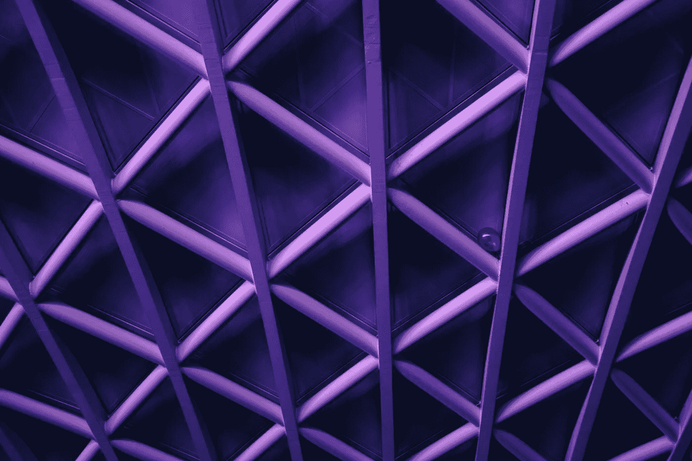

# #0025:伦敦笔记。AI8

> 原文：<https://towardsdatascience.com/fms-0025-notes-from-london-ai8-fb423fe88914?source=collection_archive---------5----------------------->

我去了伦敦。艾 8 上周四晚上。它是在 Twitter 的[伦敦办公室](https://www.google.co.uk/search?q=twitter+london+office+photos&source=lnms&tbm=isch&sa=X&ved=0ahUKEwi-p9ykwabUAhXHCcAKHeEtCG4Q_AUIDCgD&biw=1280&bih=1283)举行的，说得轻描淡写一点，这里相当豪华。

当晚有来自四家企业的推介和演讲，它们在人工智能和机器学习方面做着有趣的事情:

*   **不可能的**:一家总部位于伦敦的初创公司，创造了一种分布式、实时、持续模拟的技术。
*   **桌面遗传学**:带你经历基因组编辑实验的每一个方面，从设计到数据指导你，让你充分认识到 CRISPR 技术的效用。
*   **夏洛克 ML** :数据科学的操作系统。
*   **Vortexa** :使用人工智能分析和解释大规模数据。它从数百个来源吸收了数十亿个数据点，以显示全球石油的过去、现在和未来流动。

# 不大可能的

[不大可能](https://improbable.io/)专注于使用云基础设施的大规模模拟，以“实现规模和复杂性前所未有的虚拟世界”。他们刚刚从软银获得了一大笔现金注入，软银也对硬件进行了大量投资。

在我职业生涯的早期，我在飞行模拟器上做了一些工作，构建大规模离散事件模拟的挑战是非常真实的，演示展示了一些令人印象深刻的技术。这项技术在大型多人在线游戏中有明显的使用案例，但是其用途远远超出了游戏。

与人工智能/人工智能社区的相关性有点模糊。但是，如果你考虑一下 [OpenAI](https://www.openai.com/) 对[宇宙](https://universe.openai.com/)所做的事情，然后将空间技术应用于同类问题，似乎会有很大的潜力。

这些人在未来绝对值得关注。

# 桌面遗传学

[桌面遗传学](https://www.deskgen.com/landing/)是一个人工智能驱动的基因编辑平台。我对编辑基因一无所知，但是看起来它将会改变基因研究的游戏规则。

如果你给“[ai@desktopgenetics.com](mailto:ai@desktopgenetics.com)”发一封电子邮件，你会得到一个回复，里面有一堆关于 CRISPR 和相关技术的有趣链接，而不是试图解释这些人在做什么。

# 夏洛克 ML

SherlockML 试图成为“数据科学的操作系统”。要理解这意味着什么，想想 Excel 为会计师和分析师做了什么，或者 Photoshop 为设计师做了什么，然后你就可以理解 SherlockML 试图为数据科学家做的事情了。

随着数据科学、人工智能和机器学习等学科的不断成熟，将会有很多这样的平台。

# 旋涡

[Vortexa](http://www.vortexa.com/) 使用人工智能来分析和解释大规模数据。它从数百个来源吸收了数十亿个数据点，以显示全球石油的过去、现在和未来流动。他们使用卫星图像和人工智能/人工智能技术的组合来创建全球能源供需视图。

这是“*任何可以预测的事情，都将成为*”大规模数据科学带来的必然性的一个例子。这里的天才洞察力是使用高分辨率卫星图像结合机器学习模型来预测世界各地的石油运动。

问候，
M@