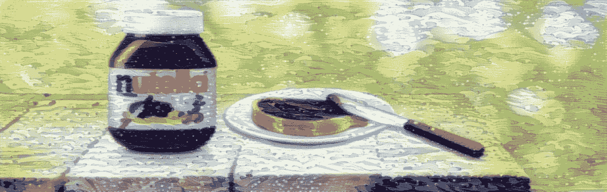
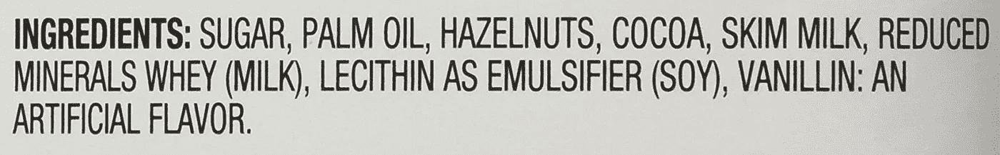
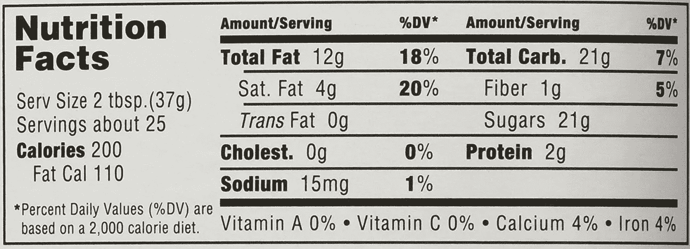
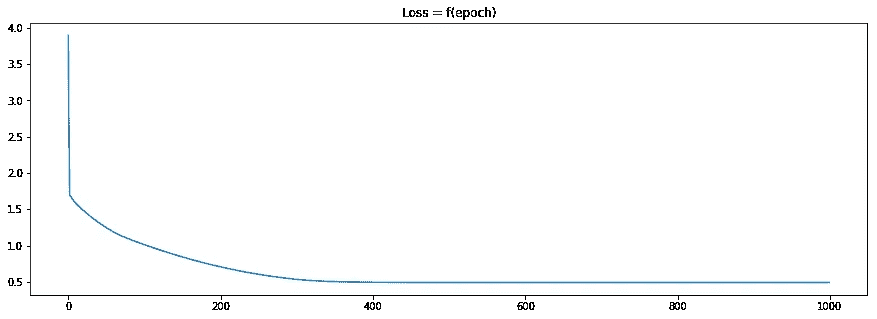
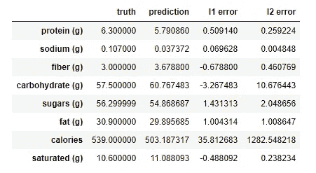
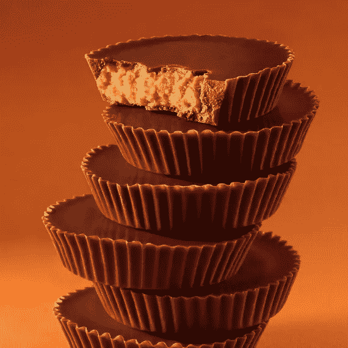
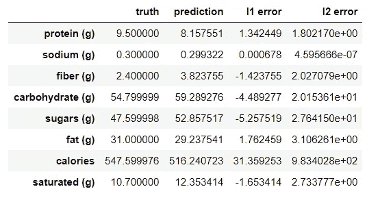

# 通过梯度下降进行食品成分逆向工程

> 原文：<https://towardsdatascience.com/food-ingredient-reverse-engineering-through-gradient-descent-2a8d3880dd81?source=collection_archive---------7----------------------->

DeepNutella — [Neural Style Transfer](http://arxiv.org/abs/1508.06576) (base image: [nutella.com](https://www.nutella.com))

> 带着另一个奇怪的想法回来，这总是另一个学习新东西的借口。这个故事是关于我做的一个快速实验，猜测包装食品中每种成分的不同含量。基于成分列表和营养事实标签，我将任务公式化为线性回归问题，其中成分百分比是参数。为了执行优化(梯度下降)，我使用了官方的 hipster 深度学习库，又名 [PyTorch](http://pytorch.org/) 。代码[可以在这里找到](https://github.com/jctestud/food-reverse-engineering)。

我喜欢烹饪。我并不总是有时间做饭，但当我有时间时，我会尝试使用非常科学的方法。例如，我喜欢简化和揭开老祖母食谱的神秘面纱。在这个过程中，我可能不得不处理食物数据，尤其是营养数据(也就是碳水化合物、蛋白质、脂肪、盐等的含量)。).

在这个实验中，我试图通过使用大多数包装食品上要求的[营养成分标签](https://en.wikipedia.org/wiki/Nutrition_facts_label)来找到食谱中(缺失的)成分百分比。我的直觉是，这些数据足以找到真正的配方。

*注:显然还有一些其他的方法可以找到食材，但是在这个* [*炼金*](http://www.inference.vc/my-thoughts-on-alchemy/) *的时代，为什么不针对问题扔点渐变下降呢？*

就拿我们钟爱的棕榈油涂抹酱 Nutella 来说吧。
以下是配料:

# 砝码

在我的线性回归模型中，参数(重量)是不同成分的克数:

*   w1 是 100 克果仁糖的含量，
*   w2 是 100 克果仁中棕榈油的含量，
*   诸如此类…

在某些情况下，某些百分比是已知的。欧洲 Nutella 就是这种情况，我们知道其健康成分(榛子、可可等)的含量。).在这种情况下，重量是固定的，不可训练。

# 输入和输出

现在营养事实标签:

每个营养成分成为一个训练观察/例子(x，y)。

让我们以“总脂肪”组件为例，它给了我们一个(x，y)元组。

x 是包含每种成分中脂肪百分比的行向量:

*   x1 是糖中脂肪的百分比(0%)
*   x2 棕榈油中脂肪的百分比(100%)
*   …

这些很简单。但对于某些成分，猜测其成分变得越来越难(卵磷脂有人知道吗？).在这个实验中，我使用了美国农业部国家营养数据库，其中包含了大多数基本成分的信息。

> 注意:这个数据库并不是万能的，营养成分会有很大的不同(榛子有不同的种类，你可以选择是否烘焙它们，可可可以是生的或脱脂的……)

在我的非常深的 1 层神经网络的另一边，y 是一个标量，包含最终产品中的脂肪量。这些信息很容易在营养事实表中找到:
每份 Nutella 含有 12g 脂肪，或者，在一个更文明的营养标签系统中:31%(谢谢法国)

由于这种标记非常冗长，我们可以得到大约十个(x，y)样本。

# 培养

当然，在模型中，线性单位没有偏差。在食物成分中找不到暗物质，所有的东西都被计算在数量的加权和中。

在 PyTorch 中声明所有这些相对容易(这是我的第一次)，这个库非常自然和直接，我想我现在理解炒作了。现在，我们应该只是减少原始 L2 损失吗？不，我们必须在模型上设置很多约束，使它收敛到一个看似合理的局部最小值，而不是一个我必须放入负量可可的奇怪配方。

## 特定域约束

*   质量不能是负的(不是开玩笑)
*   一些权重是固定的(当百分比已知时)
*   质量的总和必须等于 100 克
*   最重要的是，重量要按降序排列(与包装上食品成分按降序排列的方式相同)

这些约束中的一些是在更新权重时强制实施的，一些是通过损失函数中的炼金术士技巧实施的。[恐怕这些都不是什么好东西](https://github.com/jctestud/food-reverse-engineering/blob/master/food_ingredient_reverse-engineering_pytorch.ipynb)。

我使用整个数据集(批量梯度下降)来计算每一步的损失函数。结果如下:

**配料:**糖(50.8%)、棕榈油(19.7%)、榛子(13.0%)、可可(7.4%)、脱脂奶粉(6.6%)、乳化剂(1%*)

*(*)充分披露:乳化剂保持在 1%以下(它只是一种添加剂)*

我承认结果并不令人印象深刻。但是我想把它看完，通常，旅程比目的地更重要:)希望你喜欢它！

source: [hersheys.com](https://www.hersheys.com)

## 奖金:里斯的花生酱杯

我还试图找到里斯著名的花生酱杯子的原料。

这是一项更艰巨的任务:10 种不同的成分，但没有一种是已知的。

此外，还有两种“复合”配料，每种都有自己的配料表:牛奶巧克力涂层和花生酱夹心。

Here, a clear example of ingredients getting stuck between their left and right neighbors

**配料:**牛奶巧克力(62%)【糖(20.3 克)、可可脂(16.0 克)、可可液块(6.3 克)、脱脂牛奶(6.3 克)、乳脂(6.3 克)、乳糖(6.3 克)、乳化剂(0.3 克)】花生馅(38%)【花生(18.7 克)、葡萄糖(18.7 克)、盐(0.7 克)】

*这个故事到此结束。如果你喜欢，可以关注我的* [*中*](https://medium.com/@jctestud) *或* [*推特*](https://twitter.com/jctestud) *获取最新消息。如果你喜欢唐纳德·特朗普，你可能会喜欢阅读* [*这篇文章*](https://medium.com/jctestud/yet-another-text-generation-project-5cfb59b26255) *。如果你更喜欢《权力的游戏》，* [*去那里*](https://medium.com/jctestud/game-of-thrones-word-embeddings-does-r-l-j-part-1-8ca70a8f1fad) *。*

另外，如果你觉得有什么不对，或者有什么问题，欢迎在下面评论。