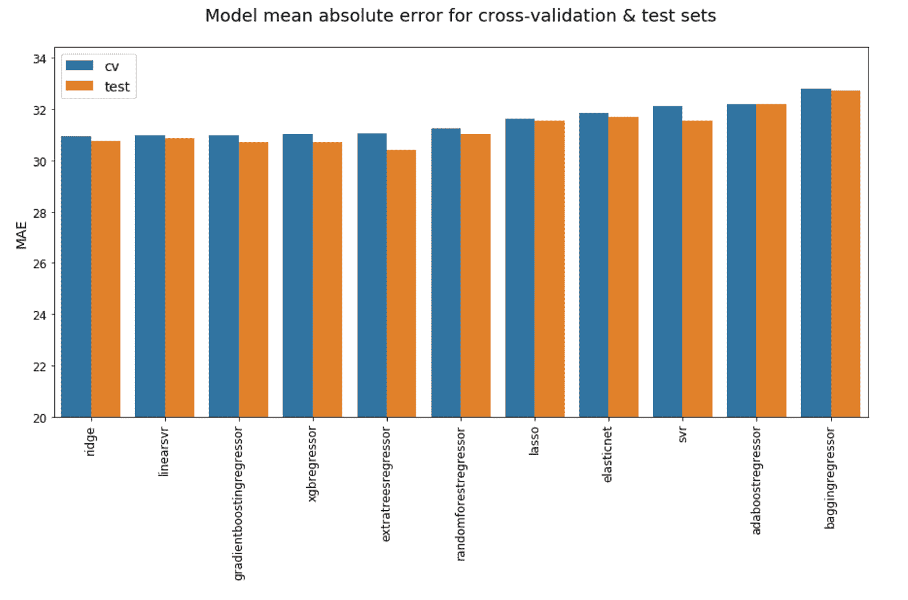
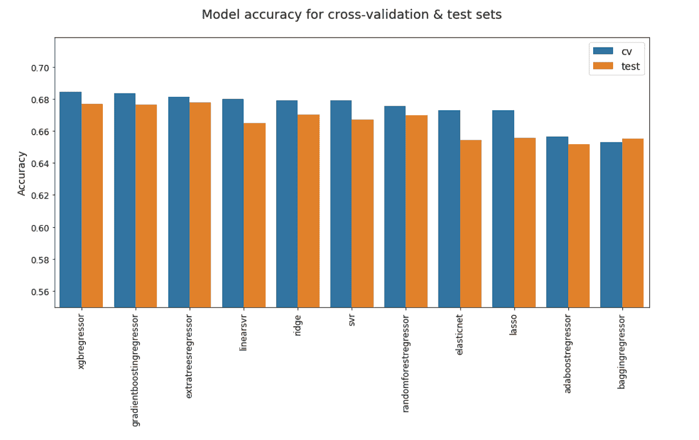
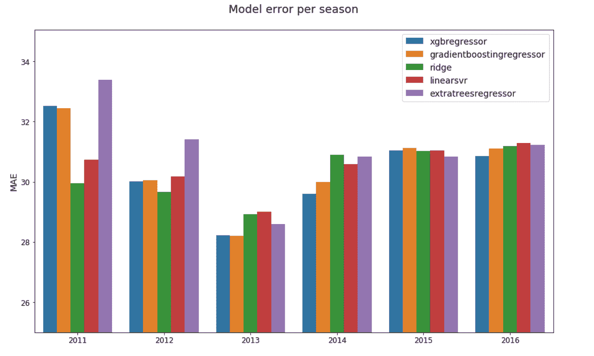
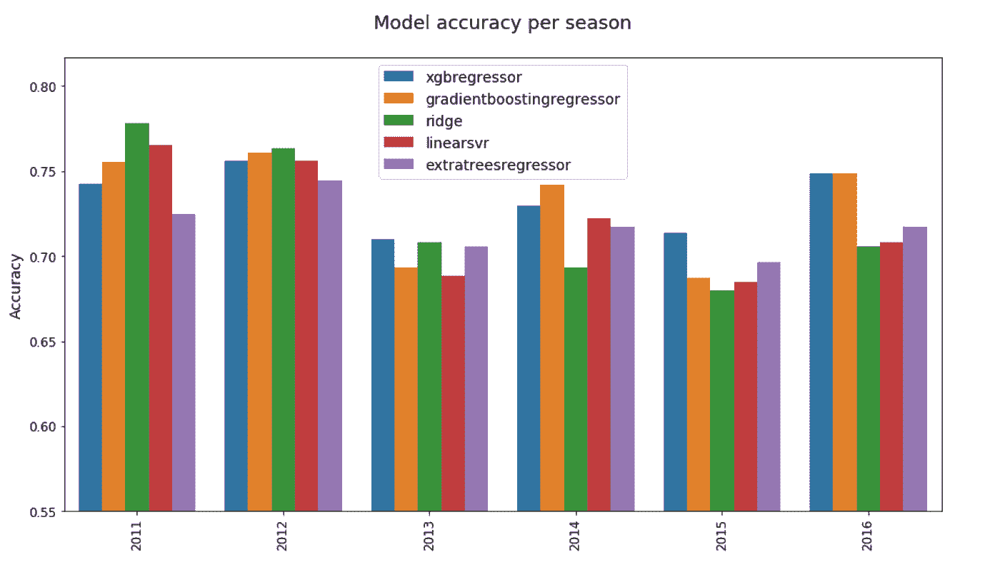

# 使用机器学习的足球提示:添加玩家数据

> 原文：<https://towardsdatascience.com/footy-tipping-with-machine-learning-adding-player-data-9ccdab56a4c5?source=collection_archive---------21----------------------->

## 我是如何停止担忧，学会获取、汇总和重塑 AFL 球员数据的。

Photo by [Scott Webb](https://unsplash.com/@scottwebb?utm_source=medium&utm_medium=referral) on [Unsplash](https://unsplash.com?utm_source=medium&utm_medium=referral)

我试图开发一个关于小费的数据模型，这是系列文章的第四部分。你可以在这里阅读第三部**。本帖使用的 Jupyter 笔记本可以在* *这里找到* [*。*](https://github.com/cfranklin11/tipresias/tree/master/notebooks)*

*当我开始这个项目时，我的主要目标之一是将玩家数据整合到我的足球小费模型中。我上个赛季的模特 Footy Tipper 将投注和团队比赛数据整合到一个整体中，但我不太明白如何以增强性能的方式包含基于球员的功能。我尝试按字母顺序对球员名单进行排序，将球员姓名视为分类变量，然后在我的神经网络中添加嵌入层，但这只是增加了噪声，实际上稍微降低了准确性。由于 AFL 赛季很快就要来临，我没有太多的时间进行实验，所以我暂时放弃了使用球员名单的想法，发誓要带着更多的人、马和钢铁回来。随着 Tipresias 的出现，我带着一些新武器向路障发起了另一次攻击。*

# *菲茨罗伊不错，但我是个皮托尼斯塔*

*在最近的 AFL 赛季，我开始关注强大的 AFL 统计社区，在我的美国沙文主义中，我认为这个社区并不存在。什么？在一个人口仅占美国 7.6%的国家，一个地区性职业体育联盟足以支撑一大批痴迷于数据的粉丝，他们能够撰写足够多的博客帖子和推文，来告知我对足球统计数据的新兴趣？就当我卑微吧。我在推特上关注了几个账号，读了一些关于统计数据的帖子，然后开始将我的模特的表现与那些在网上参赛的名人进行比较。*

*除了教会我足球的优点，我的研究还收获了这个小宝贝:[菲茨罗伊](https://github.com/jimmyday12/fitzRoy)。fitzRoy 是一个 R 包，它避开了流行的 AFL 统计网站，清理了数据，并在 good china 上提供了数据框架。它甚至有像样的文档！我对以最小的努力获得大量数据的前景感到非常兴奋，因为使用开源包比维护自己的网站抓取器容易得多，尤其是当面对导航 [AFL 表](http://afltables.com)的 borgesian 噩梦时。唯一的问题是，我所有的工作都是用 Python 完成的，而 fitzRoy 是严格针对 R 的，我每隔几年就要学习它的基础知识，但由于缺乏实践，很快就忘记了。我在 R 中有一个很棒的数据源；我在 Python 中有一个数据消耗的机器学习模型；我怎么才能让这两个人见面呢？*

*幸运的是，什么都有一个工具，甚至是让你的工具更好工作的工具。稍微搜索了一下，我就找到了 Python 包 [rpy2](https://rpy2.readthedocs.io/en/version_2.8.x/) ，它的全部目的是让您在 Python 上下文中运行 R，无论这意味着将 R 包作为 Python 模块导入，直接在`.py`文件中运行您自己的 R 代码，还是将 R 数据帧转换成 pandas。不幸的是，这给我的项目依赖性增加了额外的复杂性:我不仅使用了更多的包，而且我现在需要在我的开发环境中有两种完整的语言可用。解决这个问题的最好的工具肯定是 Docker(对于代码，它是一路向下的工具)，特别是如果您计划在不同的机器上运行这样的代码或者与其他人合作。这不是 Docker 教程(如果你感兴趣，你可以在 GitHub 上查看 Docker 对 [Tipresias](https://github.com/cfranklin11/tipresias) 的设置)，但基本思想是它创建了一个隔离的虚拟环境(即“容器”)，你可以在其中运行你的代码。这意味着您可以安装所有依赖项的精确版本，而不用担心与计算机上的其他库冲突。此外，合作者只需输入几个命令，就可以轻松地创建一个已经安装了所有东西的开发环境。*

# *我没想到福蒂做了这么多坏事*

*121 年来，很多人在 VFL 和 AFL 打了很多比赛:619，751 场(加上比芒格更容易输掉的几轮循环赛中的 100 场左右)，给或拿。该数据集的规模带来了新的挑战，超出了更长的处理时间。首先，当我清理和转换数据时，我的 Jupyter 笔记本电脑一直在崩溃，这导致我花了整整一个周末来解决如何批量处理数据的问题，结果才意识到我所需要的只是增加 Docker 的内存限制。*

*至于弄清楚如何让球员数据成为对比赛预测有用的形状，本着总是从 MVP(在这种情况下是“最小可行产品”)开始的精神，我决定采用一种简单的方法:计算每个球员统计数据的滚动平均值(例如，踢球、得分、进球)，然后将参加给定比赛的给定球队的所有球员的平均统计数据相加。这类似于使用一个球队在比赛中的统计数据的滚动平均值，但增加了一个细微的差别，只包括实际比赛的球员最近的表现。因此，如果一个球队的最佳球员没有参加他们的下一场比赛，总的统计数据将反映该队预期表现的下降。*

# *在董事会上得到一个模型*

*现在，我已经将我的球员数据聚合并组织到团队比赛行中，就像我的其他模型的数据集一样，我可以开始查看各种机器学习模型的相对性能。与基于其他数据集的模型一样，我发现包括一支球队的统计数据和他们对手的统计数据可以提高模型的性能，最低的交叉验证平均绝对误差(MAE)在没有对手统计数据的情况下为 31.79，在有对手统计数据的情况下为 30.95。以下是使用球队及其对手的聚合球员数据的各种模型的 MAEs。*

**

*与博彩数据一样，尽管这次不那么明显，但线性模型的表现优于花哨的集合。然而，前五名都非常接近，如果不是按升序排列，很难选出最好的。下面的准确度分数进一步证明了这些模型的性能有多接近。*

**

*当考虑模型的准确性时，LinearSVR 和 Ridge 仍然是最高的，但它们现在落后于 MAE 分数排名第三至第五的集合模型。值得庆幸的是，至少相同的模型在 MAE 和准确性方面都排在前五位，这限制了我在逐年细分的性能中需要比较的数量。*

**

*Ridge 和 XGBoost 似乎有最好的年度 MAEs，每个都有两年内的最低值，但与 CV/test 分数一样，没有明显的赢家，因为 2015 年和 2016 年的误差分数非常接近，XGBoost 和 Ridge 在任何给定的年份都没有持续排名前二。*

**

*不管我用多少种不同的方法分割数据，我总是得到混杂的结果。在这一点上有点直觉，但 XGBoost 往往是跨不同度量和数据段的较好模型之一。这不是一个明显的赢家(Ridge 和 GradientBoost 的性能大致相当)，但我过去使用 XGBoost 取得了不错的结果，这足以让它占据优势。*

# *玩家评级模型*

*受到 HPN 的 PAV 的启发，但我对足球不够了解，无法应用必要的严谨性来创建我自己的球员评级系统，我想知道我是否能找到一种算法来为我创建一个。我没有像上面那样汇总玩家的比赛统计数据，而是将它们和一些汇总的对手统计数据一起输入一个回归变量，试图估计每个玩家对最终得分的贡献。这是一种简单的方法，但我只是想看看它是否有潜力作为一种使用球员数据来预测比赛结果的手段。*

*我通过几个线性算法(当我试图使用 scikit-learn 集合时，waaaay 花了太长时间来训练)来处理未聚合的球员数据，以根据每个球员的游戏内统计数据来估计每场比赛的最终得分差距。然后，我采用了表现最佳的模型，并使用其预测创建了一个球员评级特征，我将该特征按每场比赛的球队进行汇总(即每场比赛有两行，每个参赛队一行)，以用于最终模型。这种堆叠整体的最终表现并不太糟糕，但表现最好的模型仍然比基于聚合球员统计数据的简单模型多几个点的 MAE 和低几个百分点的准确性，即使相对表现更接近，在原始球员数据上训练模型所花费的时间也是令人痛苦的。说真的，我的笔记本偶尔会在计算交叉验证分数的过程中挂起，这就像西西弗斯的巨石滚回冥河深处一样。有可能使用类似这样的东西向主玩家数据模型添加一个特性，但是我想我会通过添加 PAV 来获得更好的性能，所以这个想法对于未来的实验来说优先级很低。*

# *3D 玩家数据*

*鉴于球员数据给我的初始团队比赛数据结构增加了一个额外的部分，我想知道，除了汇总统计数据，我是否可以将球员分成他们自己的维度，将维度为[`team-match`x`aggregated feature`的矩阵转换为[`team-match`x`player`x`feature`]的矩阵。获得正确的数据形状需要比我希望的更多的工作，但是我能够在 Footy Tipper 中重用递归神经网络(RNN)的一些代码来完成它。对我来说，最大的挑战是总是以正确的排序顺序获取数据，并计算出正确的维度，以便 numpy 的`reshape`按照我想要的方式工作。一旦我超越了二维，我的大脑开始崩溃，但我最终还是到达了那里。*

*与玩家评级模型一样，这只是一个实验，所以我实现了一个尽可能简单的版本，选择了一维卷积层和常见的池层。由于对 RNNs 有了更多的经验，我对 CNN 模型在数据上训练的速度感到惊喜，但即使在退出或正则化参数的情况下，过度拟合也是一个主要问题。训练集的误差随着每个时期持续下降，而验证误差将在两个或三个时期达到峰值，然后继续上升。这导致了与玩家评级模型相似的性能，即，在最好的情况下，MAE 在 30-32 的范围内，准确性在 64-66%的范围内，这两个指标都明显比基于聚合玩家数据训练的线性模型差。将这一点添加到集合中或以某种方式扩展数据以减少过度拟合是有一定潜力的，但就目前而言，与玩家评级模型一样，这种实验的优先级低于其他改进，如特征工程和在完整数据集上实现 RNN。*

# *我们今天学到了什么？*

*我感觉这一系列博文的叠句就是“保持简单，笨蛋”。尽管我不后悔花时间去试验更复杂的方法，但基本的线性模型一直表现得和花哨的集合模型一样好，甚至更好。即使万能的 XGBoost 是最好的模型，当使用正确的随机种子时，总有至少两个线性模型稍微差一点，有时可能更好。已经看到了从几个不同的模型类型创建集合的可测量的收益，然而，我认为稍微更细微的教训是在移动到构建整个城堡之前从简单的构建块开始。重要的是要有一个好的基础来比较未来变化的影响。*