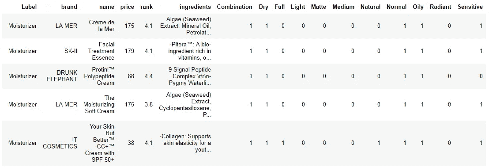
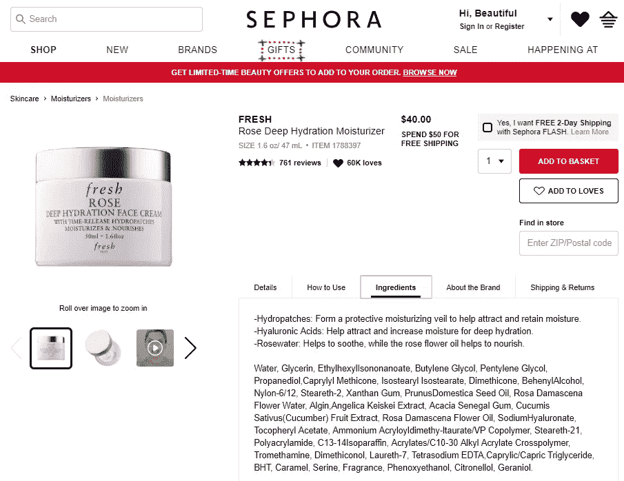
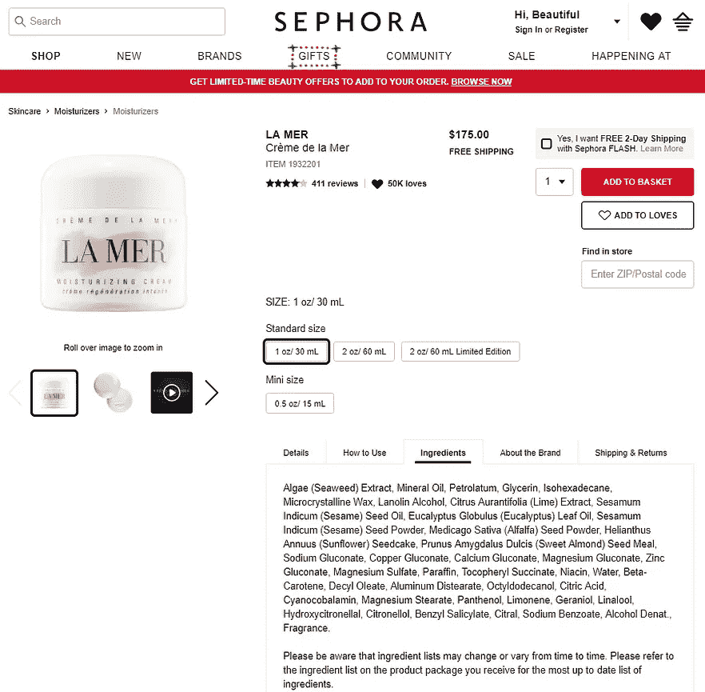
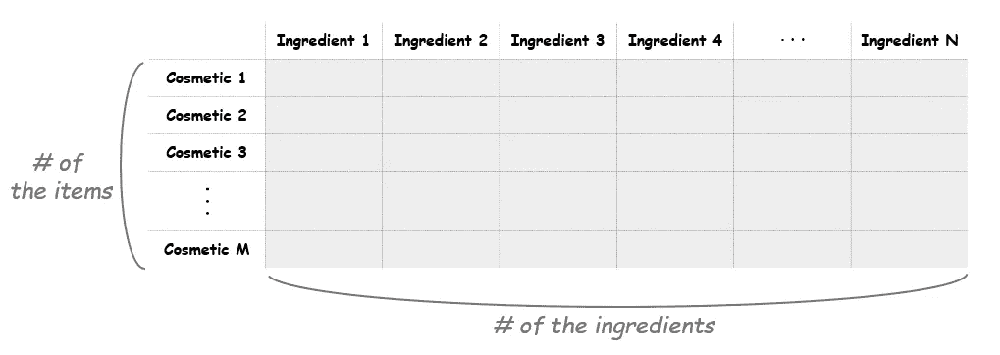
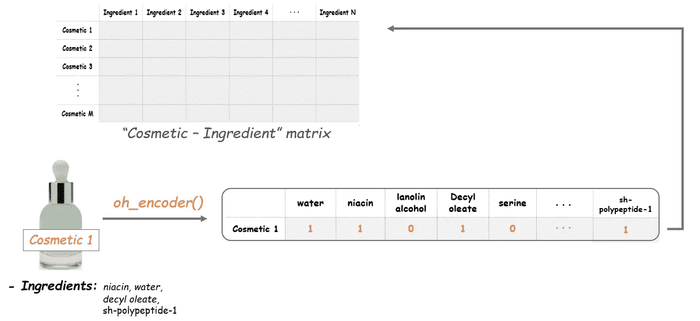
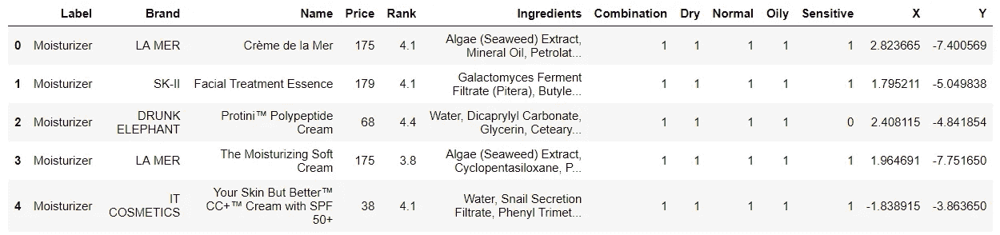
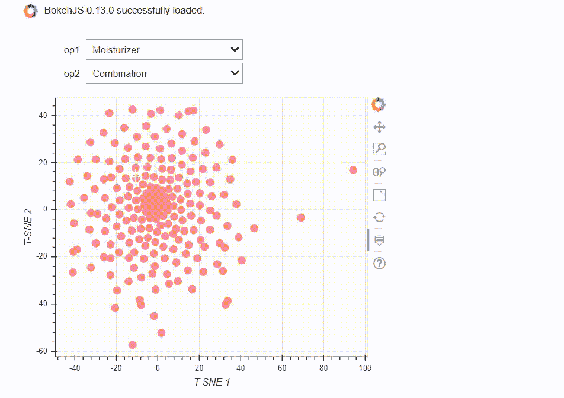
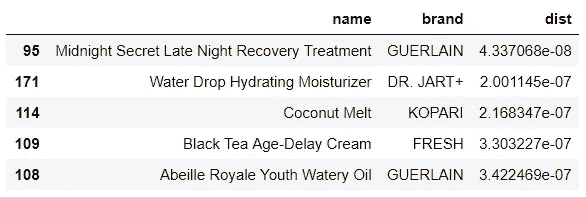

# 为了你的皮肤美丽:用散景映射化妆品

> 原文：<https://towardsdatascience.com/for-your-skin-beauty-mapping-cosmetic-items-with-bokeh-af7523ca68e5?source=collection_archive---------6----------------------->

## 根据化妆品的化学成分给出建议


每当我想尝试一种新的化妆品时，都很难选择。实际上不仅仅是困难。这有时很可怕，因为我从未尝试过的新东西最终给我带来了皮肤问题。我们知道我们需要的信息在每个产品的背面，但是除非你是一个化学家，否则很难解释那些成分表。因此，我不再担心我的新选择，而是决定自己建立一个简单的化妆品推荐。

第一步，我从丝芙兰网站搜集信息。为了专注于护肤项目，我只选择了六个不同的类别——润肤霜、面部护理、洁面乳、面膜、眼部护理和防晒。数据集总共有 1472 个项目。它也有关于品牌、价格、等级、皮肤类型和每件物品的化学成分的信息。我将跳过网页抓取这一步，但完整的代码和数据集可以在我的 [**Github**](https://github.com/jjone36/Cosmetic) 上找到。

# 按成分推荐

本文假设您已经对推荐系统有了基本的了解。如果你不熟悉推荐系统或余弦相似度，我推荐你阅读艾玛·马尔迪的 [**这篇**](/how-to-build-from-scratch-a-content-based-movie-recommender-with-natural-language-processing-25ad400eb243) 文章，它能给你这方面的直觉。在构建推荐引擎的各种方法中，基于内容的推荐被应用于本项目。选择的原因主要有两个。

首先，根据我过去用过的物品来预测一个新产品有多合适是不合适的。那是因为训练集(过去的产品)比测试集小很多。想象一下，与世界上存在的化妆品数量相比，一个人尝试了多少产品。

其次，关于皮肤病的美容建议是一个复杂的问题。可能有些人对化妆品有着非常相似的品味。而且有了用户-用户协同过滤，我们就可以根据这个邻近群体的排名值来推荐新产品。然而，一个人的皮肤类型和特征是一个比仅仅推荐你今晚的电影更敏感和棘手的问题。要得到推荐中的可靠性和稳定性，我们需要关注每种产品的真实含量，或者产品的成分，并基于它们得到相似度。

# 进入之前的一些预处理步骤。

现在让我们从检查数据集开始。抓取后的几个预处理步骤已经完成，我们将从这里开始。无重复项 1472 项，17 列。



下一步是清除`Ingredients`列中的文本数据。数据是从 Sephora 页面上刮下来的。正如你在下面看到的，有两个部分——一些特定成分的描述，所有成分的列表，以及附加信息。



这里只需要食材部分(左边第二段或者右边第一段)。由于行被`'\r\n\r\n'`分隔，我们将使用此模式分割文本。

```
*# Split the ingredients with '\r\n\r\n'*
a = [t.split('\r\n\r\n') for t in cosm['Ingredients']]
```

结果将是列表中的列表。换句话说，分开的部分被放在一个列表中，每个条目的列表被收集在一个列表中。那么我们如何只提取成分的一部分呢？我的策略是使用几种模式来检测不需要的部分。

```
*# Take onle the part with the real ingredients* 
pattern = ['\r\n', '-\w+: ', 'Please', 'No Info', 
           'This product','Visit']**for** i **in** range(len(cosm)):
    num = len(a[i])
    **for** j **in** range(num):
        **if** all(x not in a[i][j] for x in patern):
           cosm['Ingredients'][i] = a[i][j]
```

遍历每一项，我们可以只取一个不包含模式词的项，放入`Ingredients`列的相应行。现在我们准备开始标记化了。

# 将 NLP 概念应用于化学品

我们的数据中有六类产品(*保湿霜、洁面乳、面膜、眼霜、*和*防晒*)，还有五种不同的皮肤类型(*混合性、干性、中性、油性*和*敏感性*)。我们正在制作的地图是带有可选选项的绘图，以便用户可以获得更详细的结果。会有两种选择。一种用于化妆品类别，如保湿剂和清洁剂。另一类针对干性和油性等皮肤类型的用户。为了清楚起见，让我们先关注一个选项，即针对*干性肤质的 ***保湿剂*** ，然后将相同的过程应用于其他选项。*

```
**# Making the two options* 
option_1 = cosm.Label.unique().toarray()
option_2 = ['Combination', 'Dry', 'Normal', 'Oily', 'Sensitive']*# Filter the data by the given options*
df = cosm[cosm['Label'] == 'Moisturizer'][cosm['Dry'] == 1]
df = df.reset_index()*
```

*过滤后的数据有 190 项。为了达到我们比较每个产品成分的最终目标，我们首先需要做一些预处理工作，并记录每个产品成分列表中的实际单词。第一步是标记`Ingredients`列中的成分列表。将它们拆分成记号后，我们将制作一个二进制单词包。然后我们将创建一个带有标记`ingredient_idx`的字典，如下所示。*

```
**# Tokenization*
ingredient_idx = {}
corpus = []
idx = 0 

**for** i **in** range(len(df)):    
    ingredients = df['Ingredients'][i]
    ingredients_lower = ingredients.lower()
    tokens = ingredients_lower.split(', ')
    corpus.append(tokens)
    **for** ingredient **in** tokens:
        **if** ingredient **not** **in** ingredient_idx:
            ingredient_idx[ingredient] = idx
            idx += 1*
```

*一个一个的经过，我们先把所有的字母放低，把文字拆分。将所有标记化的单词放入语料库。然后准备另一个循环。这个是用来把单词放进我们事先编好的字典里的。它首先检查重复，如果一个单词还没有找到，就用索引把它放进字典。指数的值会一个一个增加。*

*下一步是制作一个文档术语矩阵(DTM)。在这里，每个化妆品对应一个文档，每个化学成分对应一个术语。这意味着我们可以把矩阵想象成一个*“化妆品成分”*矩阵。矩阵的大小应该如下图所示。*

**

*为了创建这个矩阵，我们将首先创建一个用零填充的空矩阵。矩阵的长度是数据中化妆品的总数。矩阵的宽度是成分的总数。初始化这个空矩阵后，我们将在下面的任务中填充它。*

```
**# Get the number of items and tokens* 
M = len(df)                 # The number of the items
N = len(ingredient_idx)     # The number of the ingredients

*# Initialize a matrix of zeros*
A = np.zeros((M, N))*
```

*在填充矩阵之前，让我们创建一个函数来计算每一行的令牌数(例如，一个成分列表)。我们的最终目标是用 1 或 0 填充矩阵:如果一种成分在化妆品中，值就是 1。如果不是，则保持为 0。这个函数的名字`oh_encoder`，接下来将变得清晰。*

```
**# Define the oh_encoder function*
**def** oh_encoder(tokens):
    x = np.zeros(N)    
    **for** ingredient **in** tokens:
        *# Get the index for each ingredient*
        idx = ingredient_idx[ingredient]
        *# Put 1 at the corresponding indices*
        x[idx] = 1
    **return** x*
```

*现在我们将把`oh_encoder()`函数应用到`corpus`中的记号上，并在这个矩阵的每一行设置值。所以结果会告诉我们每样东西是由什么成分组成的。例如，如果一个化妆品项目包含*水、烟酸、癸酸酯*和*sh-多肽-1* ，该项目的结果将如下。*

**

*这就是我们所说的一次性编码。通过对物品中的每种成分进行编码，*化妆品成分*矩阵将用二进制值填充。*

```
**# Make a document-term matrix*
i = 0
**for** tokens **in** corpus:
    A[i, :] = oh_encoder(tokens)
    i += 1*
```

# *用 t-SNE 降维*

*现有矩阵的维数是(190，2215)，这意味着我们的数据中有 2215 个特征。为了形象化，我们应该把它缩小成二维。我们将使用 t-SNE 来降低数据的维度。*

*[**【T-分布式随机邻居嵌入(t-SNE)**](https://en.wikipedia.org/wiki/T-distributed_stochastic_neighbor_embedding) 是一种非线性降维技术，非常适合于在二维或三维的低维空间中嵌入用于可视化的高维数据。具体来说，这种技术可以降低数据的维度，同时保持实例之间的相似性。这使我们能够在坐标平面上绘图，这可以说是矢量化。我们数据中的所有这些装饰项目都将被矢量化为二维坐标，点之间的距离将表明项目之间的相似性。*

```
**# Dimension reduction with t-SNE*
model = TSNE(n_components = 2, learning_rate = 200)
tsne_features = model.fit_transform(A)
 *# Make X, Y columns* 
df['X'] = tsne_features[:, 0]
df['Y'] = tsne_features[:, 1]*
```

*我将结果值与价格、品牌名称和排名等其他列相结合。因此生成的数据帧如下所示。*

**

# *用散景映射装饰项目*

*我们现在准备开始创建我们的情节。有了 t-SNE 值，我们可以在坐标平面上绘制所有的项目。这里最酷的部分是，它还会向我们显示每个项目的名称、品牌、价格和排名。让我们使用散景制作一个散点图，并添加一个悬停工具来显示这些信息。请注意，我们还不会显示该图，因为我们将对其进行更多的添加。*

```
**# Make a source and a scatter plot* 
source = ColumnDataSource(**df_all**)
plot = figure(x_axis_label = 'T-SNE 1',
              y_axis_label = 'T-SNE 2', 
              width = 500, height = 400)
plot.circle(x = 'X', y = 'Y', source = source, 
            size = 10, color = '#FF7373', alpha = .8)plot.background_fill_color = "beige"
plot.background_fill_alpha = 0.2*# Add hover tool*
hover = HoverTool(tooltips = [
        ('Item', '@name'),
        ('brand', '@brand'),
        ('Price', '$ @price'),
        ('Rank', '@rank')])
plot.add_tools(hover)*
```

*这里的数据`df_all`是所有可能的选择组合的数据。到目前为止，我们已经完成了相同的过程。我只是将所有可能的选项合并到一个数据框中。因此，当我们创建一个回调函数并给它一个可选选项时，它将获取给定条件下的数据并更新绘图。*

```
**# Define the callback*
**def** update(op1 = option_1[0], op2 = option_2[0])**:**
    a_b = op1 + '_' + op2
    new_data = {
        'X' : df[df['Label'] == a_b]['X'],
        'Y' : df[df['Label'] == a_b]['Y'],
        'name' : df[df['Label'] == a_b]['name'],
        'brand' : df[df['Label'] == a_b]['brand'],
        'price' : df[df['Label'] == a_b]['price'],
        'rank' : df[df['Label'] == a_b]['rank'],
    }
    source.data = new_data
    push_notebook()*# interact the plot with callback* 
interact(update, op1 = option_1, op2 = option_2)
show(plot, notebook_handle = True)*
```

*终于，表演时间到了！让我们看看我们制作的地图是什么样子的。🙌🙌*

**

*图上的每个点对应于化妆品项目。那这些轴在这里是什么意思？根据原始数据，SNE 霸王龙图的坐标轴不容易解释。如上所述，t-SNE 是一种在低维空间绘制高维数据的可视化技术。因此，定量解释 t-SNE 图是不可取的。*

*相反，我们从这张地图上能得到的是点与点之间的距离(哪些项目距离近，哪些项目距离远)。两个项目之间的距离越近，它们的组成就越相似。因此，这使我们能够在没有任何化学背景的情况下比较这些项目。*

# *比较具有余弦相似性的项目*

*最后，让我们比较每个点之间的相似性。 [**余弦相似度**](https://en.wikipedia.org/wiki/Cosine_similarity) 是衡量两个非零向量之间相似度的一种方式。我们用余弦值代替两者之间的距离是什么原因？使用距离也是可以的，但是如果我们将向量之间的角度加入到距离概念中，这个值将代表比长度更多的信息。它甚至可以包含带有符号的方向数据。所以取余弦相似度基本上能提供更多信息。*

```
*df_2 = df[df.Label == 'Moisturizer_Dry'].reset_index()
df_2['dist'] = 0.0*
```

*比如有个产品叫[泥炭奇迹复活霜](https://www.sephora.com/product/peat-miracle-revital-cream-P412440)。让我们比较一下它和其他干性皮肤保湿产品的性能。*

```
**# Find the product named Peat Miracle Revital*
myItem = df_2[df_2.name.str.contains('Peat Miracle Revital')]*# getting the array for myItem*
X = myItem.SVD1.values
Y = myItem.SVD2.values
Point_1 = np.array([X, Y]).reshape(1, -1)*# cosine similarities with other items*
for i in range(len(df_2)):
    P2 = np.array([df_2['SVD1'][i], df_2['SVD2'][i]]).reshape(-1, 1)
    df_2.dist[i] = (P1 * P2).sum() / (np.sqrt(np.sum(P1))*np.sqrt(np.sum(P2)))*
```

*如果我们将结果按升序排序，我们可以看到前 5 个最接近的化妆品，如下所示。*

```
**# sorting by the similarity*
df_2 = df_2.sort_values('dist')
df_2[['name', 'dist']].head(5)*
```

**

*这是与`myItem`性质相似的前 5 名化妆品。也许我下次应该买娇兰。有了这份清单，我们可以为新产品做推荐。如果我们按降序排列，那么这个列表可以被用作*‘对你来说最差的选择’*。*

# *结论*

*基于产品属性的推荐可以应用于任何领域。它也可以应用于一本书或葡萄酒推荐。我们可以根据产品特点制作各种地图。在坐标平面上可视化产品有助于我们以直观的方式理解项目之间的关系。*

*通过这种分析，我们可以进一步实现更精细的服务。它可以显示商品的图片和评论，或者提供订购页面的直接链接。我们也可以画一个不同的图，它的轴代表化学属性。例如，如果我们添加一些专业的化学知识，我们可以设置水合作用或毒性的坐标轴。在这种情况下，它将能够看到每个项目的毒性有多大。这些类型的应用将提供更高水平的产品分析。*

# *资源*

*   *准备好学习更多关于推荐系统的知识了吗？解释四种不同推荐算法的最佳文章作者[James Le](https://medium.com/u/52aa38cb8e25?source=post_page-----af7523ca68e5--------------------------------):[https://medium . com/@ James _ aka _ Yale/the-4-recommendation-engines-that-can-predict-your-movie-tastes-bbec 857 b 8223](https://medium.com/@james_aka_yale/the-4-recommendation-engines-that-can-predict-your-movie-tastes-bbec857b8223)*
*   *准备好用散景构建您的精彩情节了吗？Datacamp 上的这个课程将是最好的起点:[https://www . data camp . com/courses/interactive-data-visualization-with-bokeh](https://www.datacamp.com/courses/interactive-data-visualization-with-bokeh)*

*感谢您的阅读，希望您对这篇文章感兴趣。如果有需要改正的地方，请分享你的见解！如果您想鼓励一位有抱负的数据科学家，请点击👏 👏 👏！我总是乐于交谈，所以请随时在 [LinkedIn](https://www.linkedin.com/in/jiwon-jeong/) 上留下评论或联系我。我会带着另一个令人兴奋的项目回来。在那之前，机器学习快乐！*