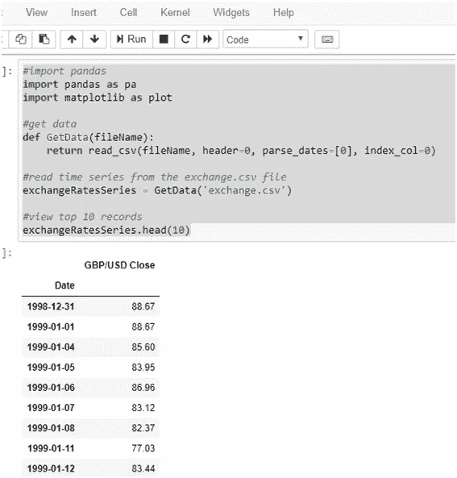
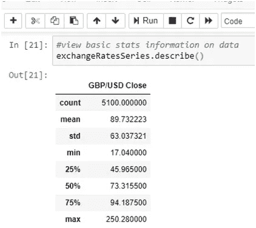
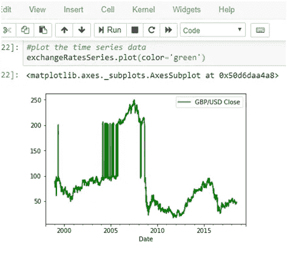
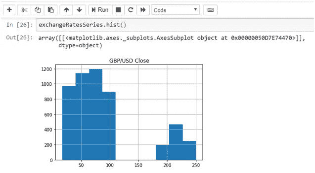
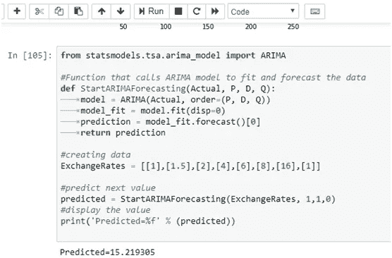
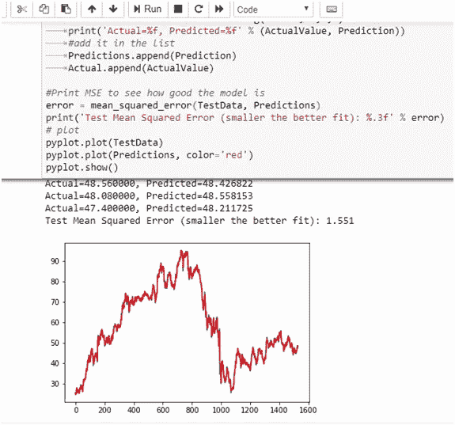

# 在 Python 中使用 ARIMA 预测汇率

> 原文：<https://towardsdatascience.com/forecasting-exchange-rates-using-arima-in-python-f032f313fc56?source=collection_archive---------4----------------------->

## ARIMA 如何预测汇率时间序列数据

几乎所有部门都使用时间序列数据来预测未来的时间点。预测未来可以帮助分析师和管理层做出更好的决策，以实现回报最大化和风险最小化。我将在本文中演示我们如何预测汇率。如果你是金融新手，想了解什么是汇率，那么请阅读我的文章“[学习金融的最佳途径？了解市场数据](https://medium.com/fintechexplained/understand-market-data-to-understand-finance-d13e8ceb3fe4?source=collection_detail----4689c8214177-----5---------------------)”。它提供了市场数据的基本概述。汇率取决于一系列因素，如供求关系、政府政策、国家增长率等。想了解更多关于影响汇率的经济指标的信息，请看看我的文章“[评估和比较国家需要知道的一切](https://medium.com/fintechexplained/everything-you-need-to-know-to-assess-and-compare-countries-42dc4a9d48b9?source=collection_detail----4689c8214177-----0---------------------)”。

# 预测汇率

最近，引入了许多技术进步，可以快速、高效和准确地预测未来时间点。其中之一是在 Python 中引入统计和机器学习(ML)模型。在我的文章“ [python 从头开始](https://medium.com/fintechexplained/from-python-installation-to-arima-exchange-rates-forecasting-9467ba03ee0c?source=collection_detail----4689c8214177-----7---------------------)”中，我提供了 Python 基础知识的概述。

在本文中，我将使用 ARIMA 模型来预测汇率。

在我的博客“[我如何预测时间序列？](https://medium.com/fintechexplained/forecasting-time-series-explained-5cc773b232b6)”和“[理解自回归移动平均模型— ARIMA](https://medium.com/fintechexplained/understanding-auto-regressive-model-arima-4bd463b7a1bb?source=collection_detail----4689c8214177-----1---------------------) ”，我概述了时间序列的概念和 ARIMA 的工作方式。在这篇博客中，我将结合 Jupyter notebook 使用 python 编程语言来解释如何在 Python 中使用 ARIMA 来预测汇率。

请阅读 fintech 解释 d [isclaimer](https://medium.com/p/87dba77241c7?source=your_stories_page---------------------------) 。

# 使用 Pandas 加载汇率数据

Pandas 是最流行的 Python 库之一。它建立在 Numpy python 库的基础上，提供了一系列功能，包括:

对象创建、数据分析和数据加载。它有内置的统计功能，可以合并/加入/联合多个集合。它还可以帮助我们分组、旋转和绘制数据。此外，Pandas 是一个非常有效的库，可以从 csv、HDF5 和 excel 加载数据。最后，可以对数据应用一系列样式和格式。

我们将利用熊猫来:

1.从 csv(逗号分隔)文件中加载时间序列汇率

2.查看前 10 条记录

3.查看数据的基本统计信息

## 从 csv 文件加载时间序列汇率

我准备了一份文件，其中包括自 1998 年 12 月 31 日以来英镑/美元的每日收盘汇率。文件存储在[这里](https://gist.github.com/fintechexplained/ad3962208b165af008e3a03322b4e463)。该文件包含两列数据:数据和英镑/美元收盘

确保文件保存在与 python 笔记本相同的位置。

键入以下行以加载文件并查看前 10 条记录:

> 要导入一个库，做:将<library name="">导入为 <alias class="it">></alias></library>

*注意:GetData(fileName)是一个接受文件名作为参数的方法。*

按 Alt + Enter 查看数据的基本统计信息

下图通过调用 GetData(fileName)方法显示了 csv 文件的前 10 条记录:

## 让我们找出有用的统计数据，并绘制出汇率图

键入:exchangeRatesSeries.describe()以查看如下所示的统计信息:

describe()显示了许多有用的指标，包括:

**count** —记录数， **mean** —期望值， **std** —告诉我们平均值周围数据的离差的标准偏差， **min** —集合中的最小值， **max** —集合中的最大值以及一个百分比范围。百分位数可以帮助我们理解数据的概率分布。

## 绘制加载的数据

可以添加 Html 样式来改变 Python 的感觉和外观。我将绘图颜色设置为绿色:

*#绘制时间序列数据*

*exchange rates series . plot(color = ' green ')*

*注意，传递 color='green '会创建一个绿色线图。*

键入:exchangeRatesSeries.hist()以显示 historgram。

直方图可以帮助我们理解数据的分布，反过来帮助我们预测变量:

matplotlib 可以帮助我们绘制数据。我们也可以通过编写以下代码来导入 matplotlib:

*从 matplotlib 导入 pyplot*

然后写出时间序列:

*py plot . plot(exchange rate series)*

# 带 StatsModels 套装的 ARIMA

StatsModels 是一个功能强大的 python 库，包含丰富的统计模型。StatsModels 库包含许多可用于预测和预测数据的模型。这个库也包含许多诊断工具。我们将使用 StatsModels 软件包中的 ARIMA 模型来预测汇率。

# ARIMA 简介

ARIMA 模型有 3 个参数:

P —模型的自回归特征

d——差分顺序

Q —模型的移动平均特征

导入 statsmodels 后，使用 tsa.arima_model 并给它一个别名 arima:

***从 statsmodels.tsa.arima_model 导入 ARIMA***

有关参数的详细信息，请访问:[http://www . stats models . org/dev/generated/stats models . TSA . ARIMA _ model。ARIMA.html](http://www.statsmodels.org/dev/generated/statsmodels.tsa.arima_model.ARIMA.html)

ARIMA 参数可以改变，以获得不同的预测行为。我已经定义了一个用户定义的方法，它接受三个参数的训练集和值。该函数首先创建 ARIMA 模型。然后对模型执行 fit()和 forecast()。Forecast()返回预测值。

将这几行复制并粘贴到您的笔记本上:

ARIMA(……)创造了 ARIMA 模式。Fits()通过卡尔曼滤波器以最大似然法拟合 ARIMA(p，d，q)模型，Forecast()返回基于拟合的 ARIMA 模型的估计值。

我们可以认为 Fit()是一个生成误差最小的最佳拟合曲线的过程。关于这个话题的更多内容，请见我的博客:[我的预测模型——回归分析有多好？](https://medium.com/fintechexplained/part-3-regression-analysis-bcfe15a12866)

> p，q，d 参数可以调整以获得更好的结果。

这是一个我们如何传递时间序列数据并使用 **ARIMA** 根据实际观察数据预测值的示例:

通过运行该脚本，我们可以看到预测值:

> 我们传入随机值作为训练集。然后 ARIMA 模型进行拟合，预测下一个值为 15.219305

我们还可以将外生变量、日期、时间序列的频率等传递给 ARIMA 模型。

# 最后，让我们使用 Python 中的 ARIMA 来预测汇率

既然我们已经了解了如何使用 python **Pandas** 来加载 csv 数据，以及如何使用 **StatsModels** 来预测价值，那么让我们结合本博客中获得的所有知识来预测我们的样本汇率。

复制并粘贴这段代码。它是我们在这个博客中学到的所有概念的结合。

按 Alt+Enter。Python 将开始用实际数据循环调用 ARIMA 模型。70%的数据用于训练模型，其余 30%用于测试准确性。每次产生新的预测值。

实际值和预测值将打印在笔记本上。

最后，实际值与预测值将绘制在图表上

## 查看均方误差

我还导入了一个额外的库 **sklearn** ，我将在未来的博客中使用它。

复制粘贴这一行:

“从 sklearn.metrics 导入 mean_squared_error”导入库。

最后打印均方差:

均方误差计算实际数据和预测数据之间差异的平均值，并告诉您您的模型有多好。更多信息可以在我的博客里找到: [**我的预测模型—回归分析**](https://medium.com/fintechexplained/part-3-regression-analysis-bcfe15a12866) 有多好

通过运行下面的代码，我们可以查看实际值、预测值以及折线图和总均方误差:

如您所见，我们打印了实际值和预测值。此外，我们用红色绘制了 MSE 为 1.551 的预测值。

完整的笔记本，请访问[这里](https://gist.github.com/fintechexplained/b057892f38a6f834f3bb3327b1c16ff7)。

# 进一步的改进

预测汇率可以通过以下方式改进:

*   不断更新模型参数
*   通过输入影响汇率及其相关性的其他因素
*   模型参数也可以通过机器学习和优化技术来更新。
*   最后，可以强调因素及其相关性，以确保预测的汇率考虑到极端情况。

# 最终注释

本文演示了如何使用 python 通过 ARIMA 模型预测汇率。金融市场可以向任何方向移动，这使得准确预测汇率变得非常困难，如果不是不可能的话。话虽如此，通过 ARIMA 预测汇率的唯一目的是帮助我们做出精心计算的决定，以实现回报最大化和风险最小化。预测汇率取决于 ARIMA 模型的假设，该模型基于自回归、综合和移动平均概念。

ARIMA 是一个简单而强大的模型。它假设历史价值决定现在的行为。它还假设数据不包含异常，是稳定的，并且模型参数以及误差项是恒定的。

尽管 ARIMA 没有将市场数据中的压力、经济和政治条件或所有风险因素的相关性作为预测汇率的输入，但上面展示的简单示例可用于预测正常情况下稳定货币的运动，在正常情况下，过去的行为决定了现在和价值。

如果您有任何反馈，请告诉我。