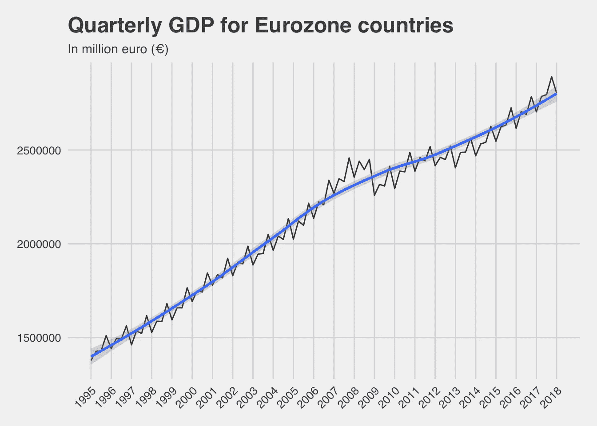
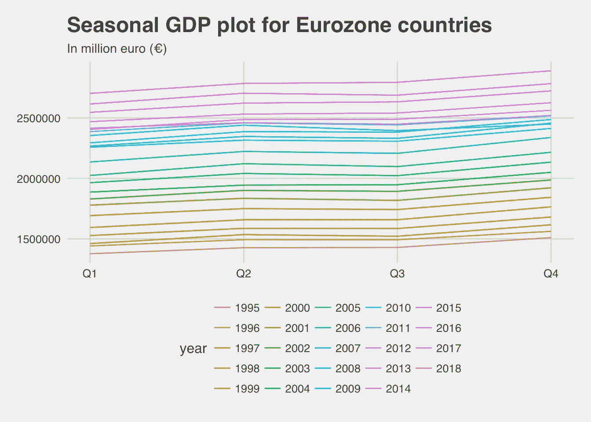
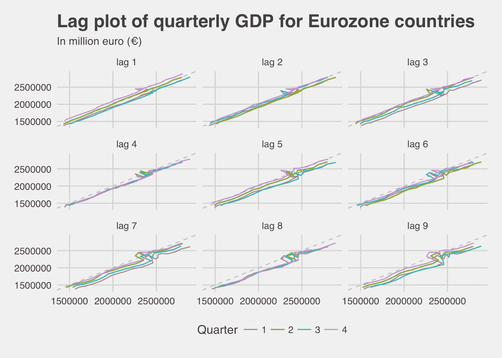
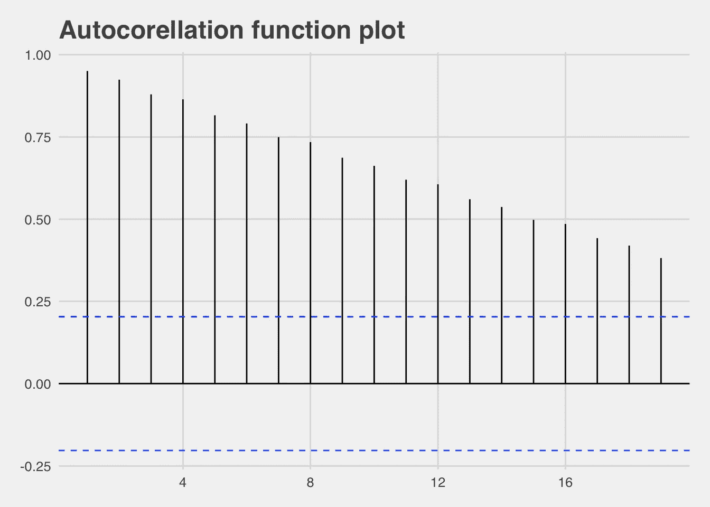
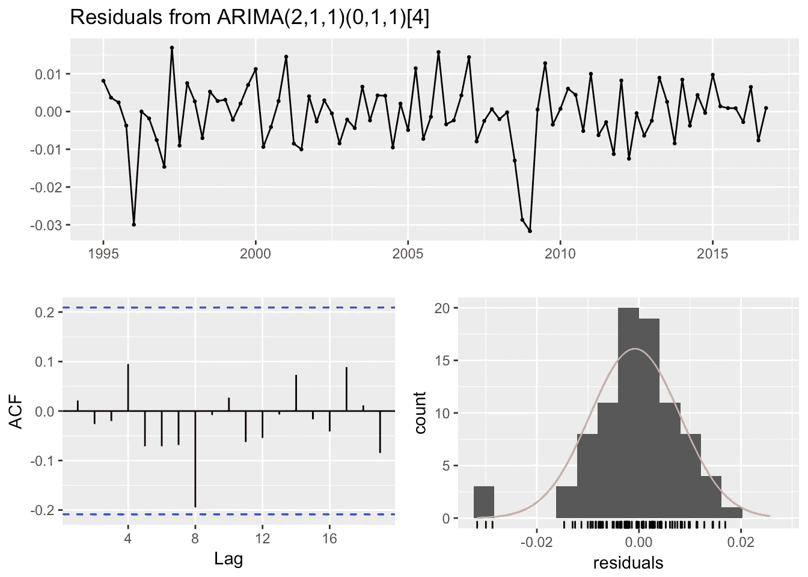
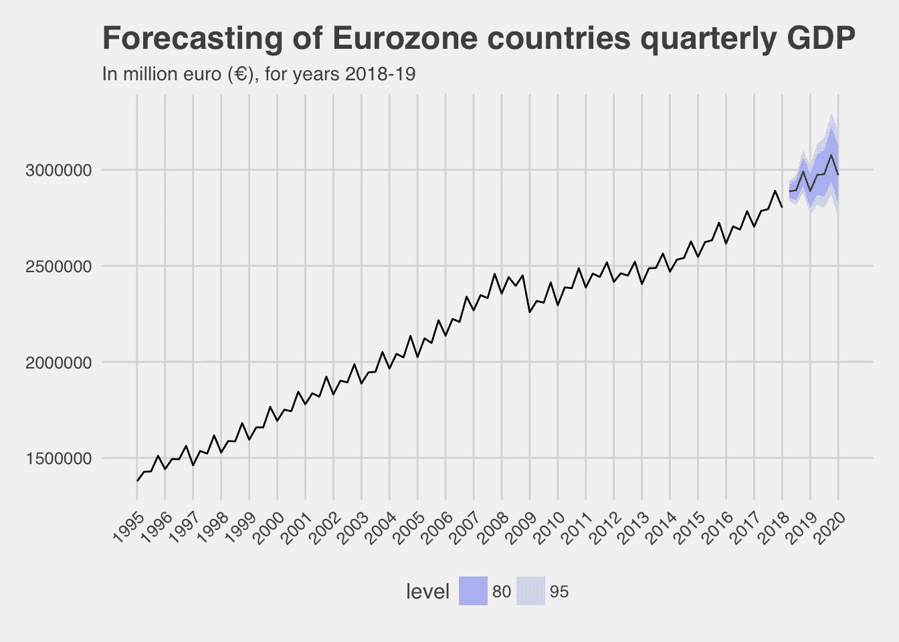

# 预测欧元区的 GDP

> 原文：<https://towardsdatascience.com/forecasting-gdp-in-the-eurozone-54778f79912e?source=collection_archive---------6----------------------->


## 使用欧盟统计局数据和 ARIMA 模型预测欧元区季度 GDP(国内生产总值)

这一分析使用了欧盟统计局的公共数据集来预测所有欧元区国家未来的季度 GDP 总量。欧盟统计局是位于卢森堡的欧盟统计局。它的任务是为欧洲提供高质量的统计数据。欧盟统计局提供了一系列重要而有趣的数据，政府、企业、教育部门、记者和公众可以在工作和日常生活中使用这些数据。特别是，使用了欧元区(欧盟 19 国)季度 GDP(国内生产总值)数据集。欧元区由 19 个国家组成:奥地利、比利时、塞浦路斯、爱沙尼亚、芬兰、法国、德国、希腊、爱尔兰、意大利、拉脱维亚、立陶宛、卢森堡、马耳他、荷兰、葡萄牙、斯洛伐克、斯洛文尼亚和西班牙。

国内生产总值(GDP)是在一段时间(季度或年度)内生产的所有最终商品和服务的市场价值的货币度量。它通常用于确定一个国家或地区的经济表现。

用于获取数据集的[欧盟统计局软件包](https://cran.r-project.org/web/packages/eurostat/index.html)和用于 ARIMA 建模的[预测软件包](https://cran.r-project.org/web/packages/forecast/index.html)。

关于 ETL 步骤的更多细节可以在实际代码中找到，在文章结尾的链接中。

# 探索性分析

在探索性分析期间，我们试图发现时间序列中的模式，例如:
- **趋势**时间序列中涉及长期增减的模式
- **季节性**由于日历(如季度、月份、工作日)
- **周期性**存在一种模式，其中数据呈现非固定周期(持续时间通常至少为两年)的上升和下降

下面是 1995 年以来欧元区国家季度 GDP 的时间序列图。



上面的时间序列图中有一些输出:
-我们可以说总体趋势是积极的
-趋势中没有明显的增加/减少的可变性
-看起来有一些季节性，但需要进一步调查
-没有周期性
-在 2008-2009 年左右，GDP 增长出现了明显的中断

下面用一个季节性图来研究季节性。季节图类似于时间图，只是数据是根据观察数据的单个“季节”绘制的。



这增强了我们对时间序列中季节性的信心。似乎每年的第四季度总是最高的，而第一季度是最低的。第二次和第三次差不多。

滞后图将帮助我们了解时间序列中是否存在自相关。查看时间序列数据的另一种方法是将每个观察值与之前某个时间发生的另一个观察值进行对比。例如，您可以根据 yt1 绘制 yt。这被称为滞后图，因为你是根据时间序列本身的滞后来绘制的。基本上，它是时间序列和时间序列滞后值之间的散点图。



滞后 4 (1 年)有很强的季节性，因为所有季度线图遵循几乎相同的路径。

下面是自相关函数图。与滞后图相关的相关性形成了所谓的自相关函数(ACF)。超出置信区间(蓝线)的香料表明具有特定滞后的自相关具有统计显著性(不同于零)



看起来在所有滞后上都有显著的自相关，这表明了时间序列中的趋势和/或季节性。

我们还可以使用 Ljung-Box 检验来检验时间序列是否是白噪声。白噪声是一个纯粹随机的时间序列。下面是第四阶段的测试。

```
##  Box-Ljung test
## 
## data:  gdp_ts
## X-squared = 319.62, df = 4, p-value < 2.2e-16
```

Ljung-Box 检验 p 值很小< 0.01, so there is strong evidence that the time series is not white noise and has seasonality and/or trend.

# Modelling

ARIMA (Auto-regressive integrated moving average) models provide one of the main approaches to time series forecasting. It is the most widely-used approach to time series forecasting, and aim to describe the autocorrelations in the data.

The final fitted model was produced by the auto.arima() function of the forecast library. It rapidly estimates a series of model and return the best, according to either AIC, AICc or BIC value. After fitting the ARIMA model, it is essential to check that the residuals are well-behaved (i.e., no outlines or patterns) and resemble white noise. Below there are some residual plots for the fitted ARIMA model.



```
##  Ljung-Box test
## 
## data:  Residuals from ARIMA(2,1,1)(0,1,1)[4]
## Q* = 6.1916, df = 4, p-value = 0.1853
## 
## Model df: 4\.   Total lags used: 8
```

We can say that the model is fairly good, since the residuals are closely normally distributed, have no real pattern and autocorrelations are not significant.
最终模型是一个**季节性 ARIMA(2，1，1)(0，1，1)【4】**。季节性差异和第一次差异都被使用，由模型每个部分的中间槽表示。此外，选择了一个滞后误差和一个季节性滞后误差，由模型每个部分的最后一个槽表示。使用了两个自回归项，由模型中的第一个槽表示。没有使用季节性自回归术语。

最后，对预测模型的准确性进行了检验。下面是对模型准确性的测试，使用 2017 年所有四个季度和 2018 年第一季度作为测试集。

```
##                     ME     RMSE     MAE         MPE      MAPE      MASE
## Training set -1763.393 18524.64 13332.4 -0.08197817 0.6440916 0.1939318
## Test set     47152.498 49475.29 47152.5  1.68398118 1.6839812 0.6858757
##                    ACF1 Theil's U
## Training set 0.06526246        NA
## Test set     0.09563655 0.6768184
```

测试集的 MAPE(平均绝对百分比误差)为 1.68，因此我们可以得出模型的预测精度在 **98.3 %** 左右。

下面是欧元区国家 2018-19 年季度 GDP 预测的时间序列图。



*   看起来国内生产总值将在未来几年保持增长。特别是对未来几个季度的预测是:

```
 Quarter       Forecast   Lo 80   Hi 80   Lo 95   Hi 95
 2018 Q2        2887406 2853687 2921524 2835996 2939748
 2018 Q3        2892970 2841213 2945670 2814191 2973955
 2018 Q4        2990005 2917818 3063978 2880312 3103876
 2019 Q1        2888631 2805996 2973700 2763213 3019742
 2019 Q2        2973066 2870171 3079650 2817151 3137610
 2019 Q3        2976688 2859234 3098966 2798945 3165717
 2019 Q4        3076720 2939974 3219827 2870063 3298258
```

*   到 2019 年底，国内生产总值很有可能在今年的一个或多个季度突破三万亿€的关口

使用其他预测方法开发的模型更多，如**指数平滑**(具有趋势和季节性 Holt-Winters 的指数平滑方法)& **指数三次平滑**，但 ARIMA 模型表现更好。

[全 R 码](https://github.com/mantoniou/Blog/blob/master/content/post/2018-08-forecasting-arima-gdp-eurozone.Rmd)