# 预测可变差旅费用的准确率达到 95%

> 原文：<https://towardsdatascience.com/forecasting-variable-travel-expenses-with-95-accuracy-5aa615203db5?source=collection_archive---------17----------------------->

## 首席财务官的自动机器学习

**更新**:我开了一家科技[公司](http://www.legislate.tech)。你可以在这里找到更多

组织每年在差旅费上花费数百万美元，其中很大一部分是可变的，很难估计。除了在预订时已知的机票和住宿之外，餐饮和杂费等额外费用是未知的，可能对总费用有很大影响。

在本文中，我们将在几分钟内建立一个模型，该模型可以根据员工的职位、目的、目的地、住宿和机票计算出可变费用，对公布的数据有 95%的准确性，并且无需编写任何代码。数据准备和模型构建将由 AuDaS 处理，AuDaS 是由 [Mind Foundry](http://mind foundry.ai) 构建的自动化数据科学团队。

# 数据准备

费用数据是从[安大略省养老金委员会](https://www.opb.ca/about-opb/governance)下载的，包含其员工自 2010 年以来的费用报销。目标是使用截至 2017 年的数据来预测 2018 年的总支出。

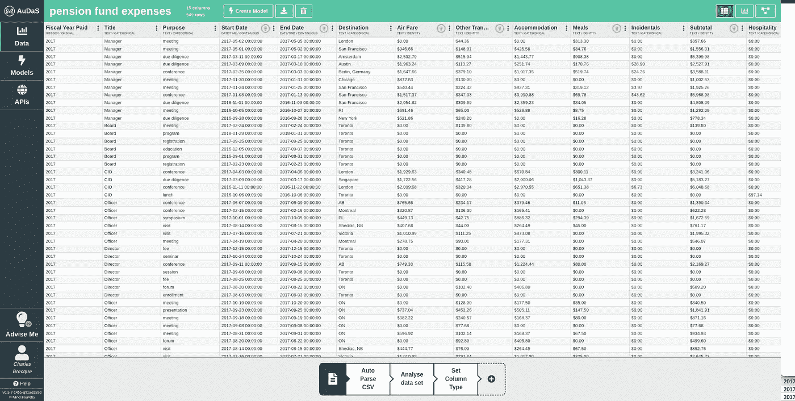

Uploading the data into AuDaS

## 特征工程

数据集包含每次旅行的开始和结束日期，因此我们将要求 AuDaS 计算持续时间，因为这可能会对总花费产生很大影响。

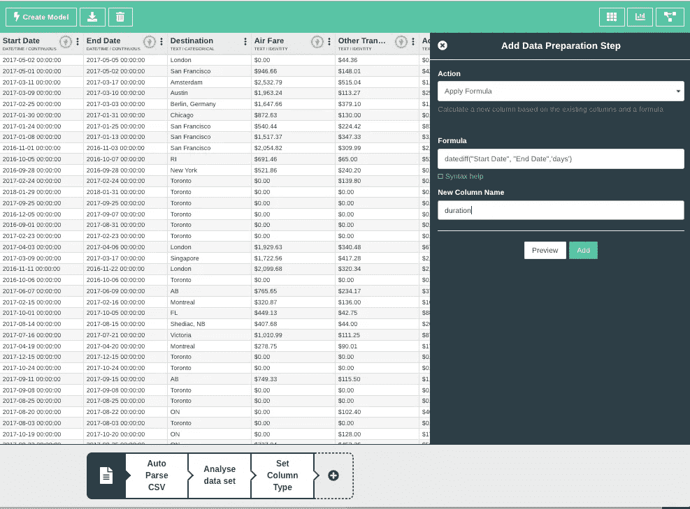

然后，我们将使用 RegEx 转换删除数据中的$符号，以便进行格式化。

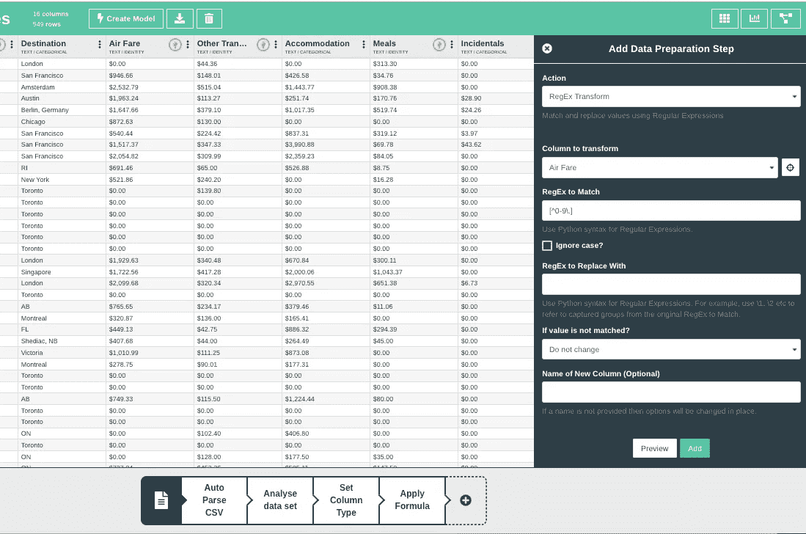

然后，我们将删除包含可变费用的列，以避免数据泄露，因为它们已经包含在我们希望预测的总支出中。这样做之后，AuDaS 检测到有一些丢失的值，并建议用户如何纠正它。

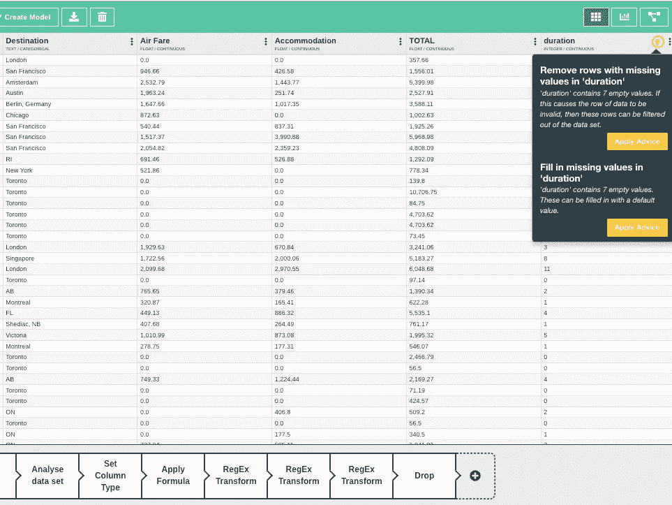

在整个过程中，AuDaS 在工作流程中增加了一些步骤，作为审计跟踪。您可以返回到数据集的先前版本，也可以导出工作流。在我们的例子中，我们将把这个工作流导出到包含 2018 年养老基金支出的测试集中。这将自动重现数据准备步骤，并允许我们在对其进行训练后，轻松地在其上部署我们的模型。

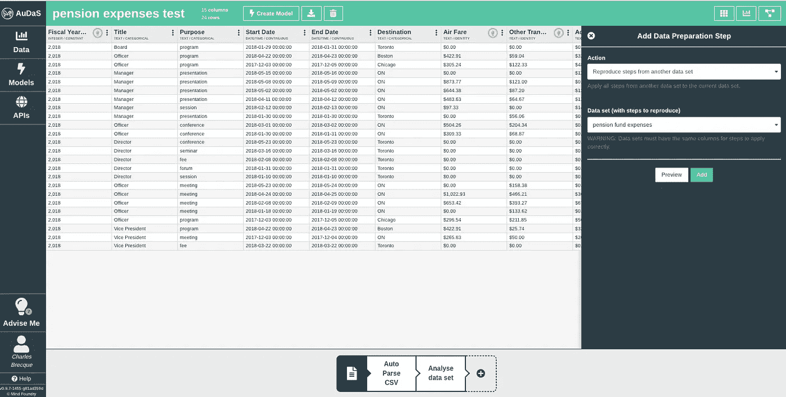

# 数据探索

现在我们已经清理了数据，我们可以访问直方图视图来提取初始的洞察力。我们也可以改变比例来查看稀疏分布的值。

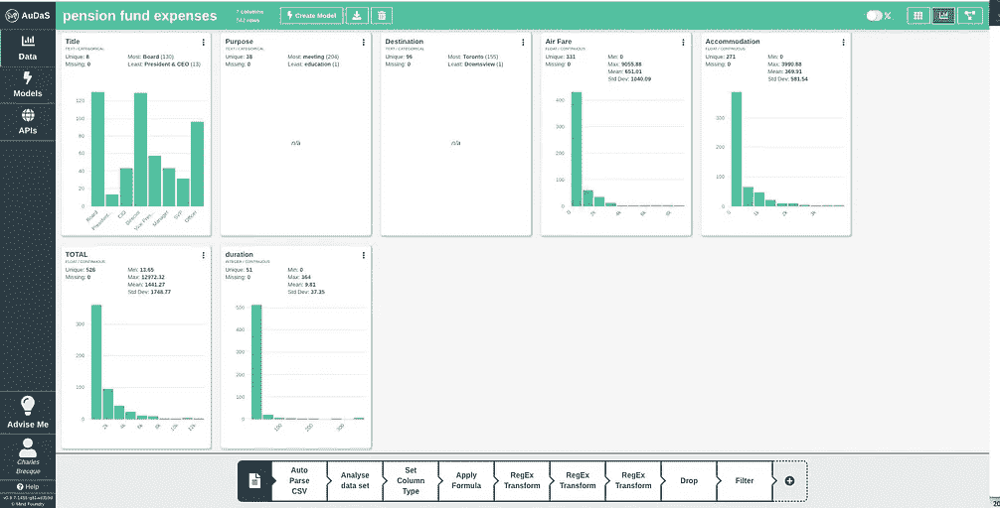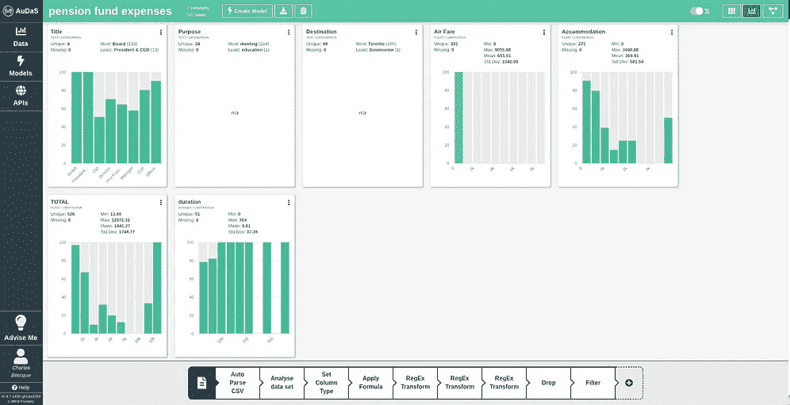

我们的直接收获是，最常见的目的地是多伦多，董事会成员出差最多。似乎没有一个关键的模式，这就是为什么我们要使用机器学习来揭示更复杂的关系。

# 自动化建模

我们将要求 AuDaS 建立一个回归模型来预测总支出。

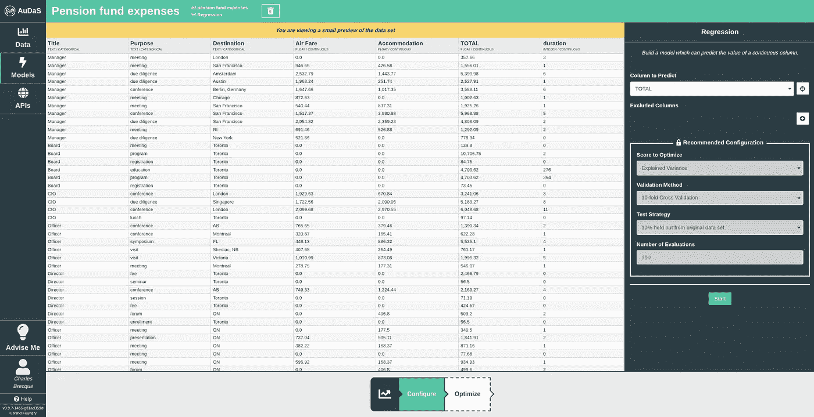

AuDaS 自动保留训练集的 10%用于最终验证。它还使用 10 重交叉验证来训练模型，以避免过度拟合。这保证了由 AuDaS 训练的模型在生产中表现良好。一旦我们满意了，我们现在就可以按开始按钮开始训练了。

训练是使用 Mind Foundry 的专有贝叶斯优化器 OPTaaS 实现的，opta as 允许 AuDaS 有效地在可能的回归管道的大搜索空间中导航。

AuDaS 提供了所选管道、模型和参数值以及性能统计的完全透明性。AuDaS 还为找到的最佳模型提供了特征相关性。

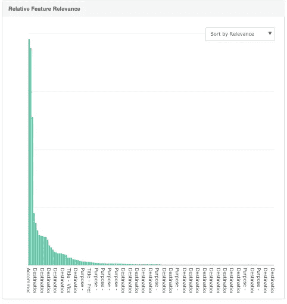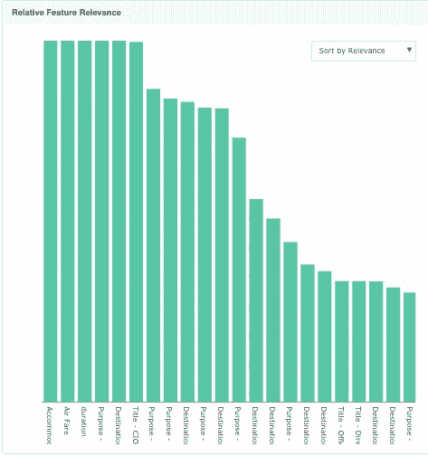

在这种情况下，住宿和机票费用以及目的地和目的地城市伦敦是可变费用的最强预测因素。首席信息官的头衔似乎也是总支出的一个很好的指标。既然我们对模型的准确性感到满意，我们就可以查看它的模型健康状况了。在我们的情况下，它是好的，我们可以放心地将其应用于测试数据集。

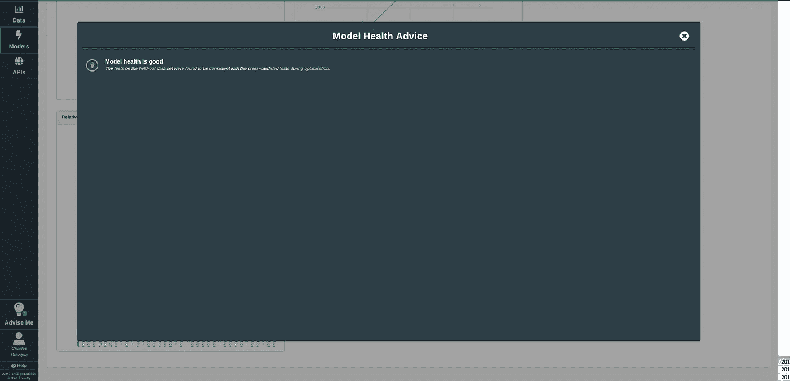

在测试数据集上运行训练好的模型之后，我们得到了每个条目的预测。AuDaS 会自动忽略模型训练中未使用的列。这意味着我们可以很容易地将实际总支出与预测支出进行比较。为此，我们可以导出数据并在 excel 中访问它。

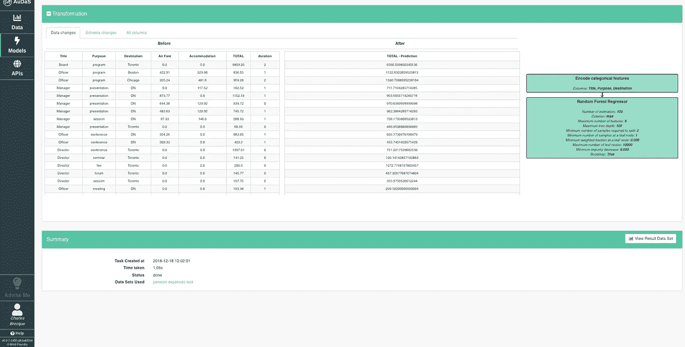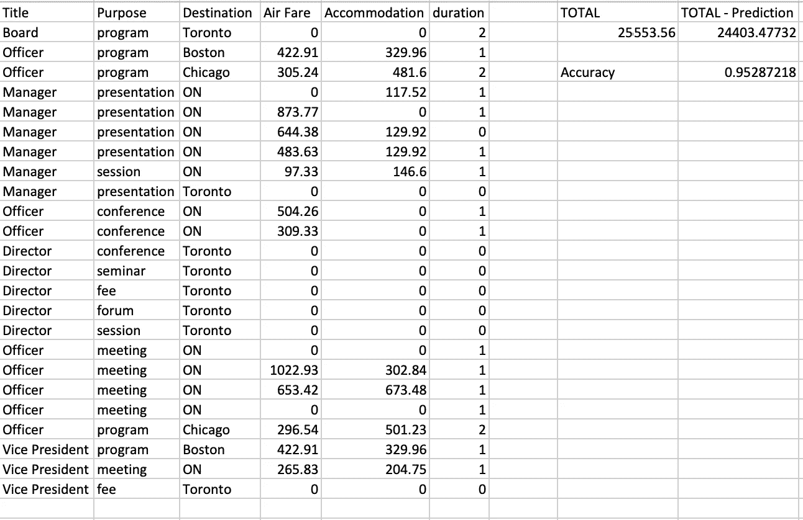

在计算了每一列的总数后，我们可以看到 AuDaS 达到了 95%的准确率。

# 为什么这很重要

能够在一定程度上准确预测总支出对首席财务官来说是非常有价值的。在大公司，每季度的差旅支出可能达到 1 亿美元，甚至更多。可能会有相当大差异，分析人员通常会使用电子表格，根据不同部门的累积输入来估计预算需求。部门经理做了大量工作来积累有关未完成项目和过去支出的信息，增加了一些应急余量。同样的方法不仅适用于差旅费，也适用于许多成本预测情况。通过机器学习，业务线经理和财务可以在几分钟内做出更加准确的预测。最重要的是，这些模型可以实时运行，并在情况变化时提供高级警告。这避免了在关键的季度最后几周臭名昭著的旅行和成本禁运，因为预算已经达到。

# 了解更多信息

如果你想知道澳洲是否能解决你的问题，请填写这张简短的[表格](https://mindfoundryai.typeform.com/to/KuidSX)。如果你对 **OPTaaS** 感兴趣，你可以使用这个更短的[表格](https://mindfoundryai.typeform.com/to/jVPCue)获得一周免费试用**的资格！**

以下是这一过程的完整视频:

你可以在下面阅读更多 AuDaS 案例研究教程:

 [## 信用卡聚类

### 营销人员面临的首要挑战是了解他们的销售对象。当你知道你的买家…

towardsdatascience.com](/credit-card-clustering-6a92657ac99)  [## 利用自动化机器学习优化您的电子邮件营销策略

### 对于全球超过 1 万亿美元的企业来说，优化销售营销支出是一个价值 10 亿美元的问题…

towardsdatascience.com](/optimize-your-email-marketing-strategy-with-automated-machine-learning-e1bfb8cc171b)  [## 利用 AuDaS 在几分钟内解决 Kaggle Telco 客户流失挑战

### AuDaS 是由 Mind Foundry 开发的自动化数据科学家，旨在允许任何人，无论是否有…

towardsdatascience.com](/solving-the-kaggle-telco-customer-churn-challenge-in-minutes-with-audas-2273fed19961) 

## 团队和资源

Mind Foundry 是牛津大学的一个分支机构，由斯蒂芬·罗伯茨(Stephen Roberts)和迈克尔·奥斯本(Michael Osborne)教授创建，他们在数据分析领域已经工作了 35 年。Mind Foundry 团队由 30 多名世界级的机器学习研究人员和精英软件工程师组成，其中许多人曾是牛津大学的博士后。此外，Mind Foundry 通过其分拆地位，拥有超过 30 名牛津大学机器学习博士的特权。Mind Foundry 是牛津大学的投资组合公司，其投资者包括[牛津科学创新](https://www.oxfordsciencesinnovation.com)、[牛津技术与创新基金、](http://www.oxfordtechnology.com)、[牛津大学创新基金](https://innovation.ox.ac.uk/award-details/university-oxford-isis-fund-uoif/)和 [Parkwalk Advisors](http://parkwalkadvisors.com) 。