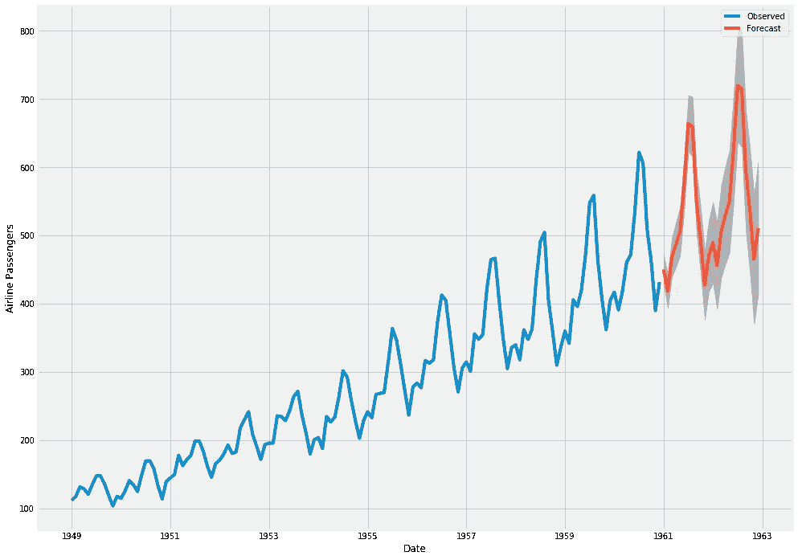
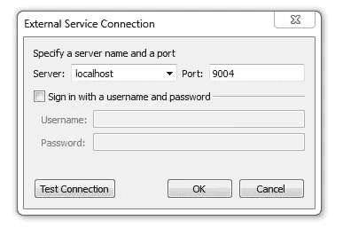
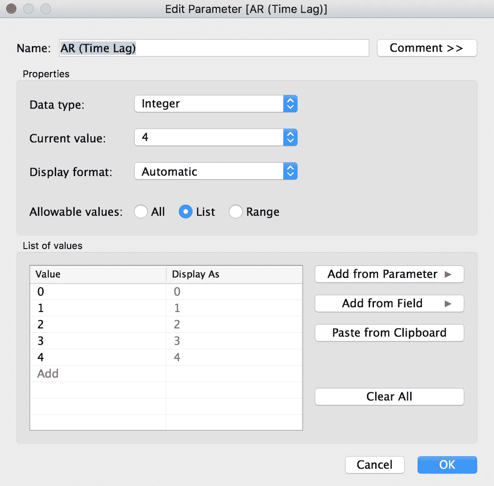
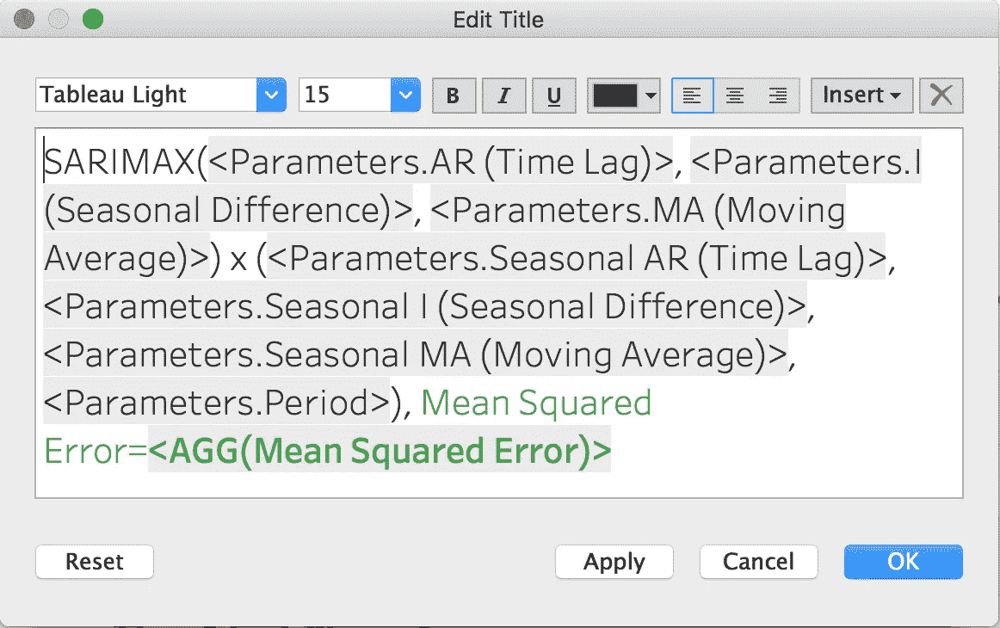
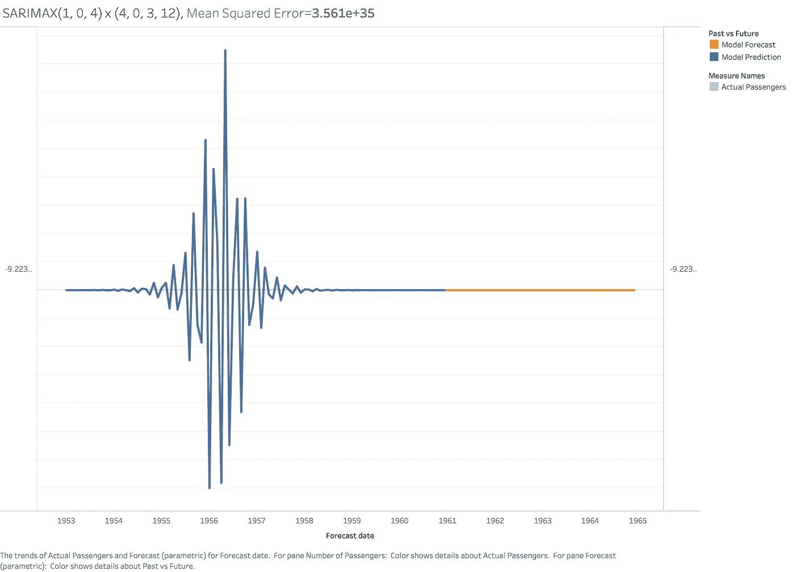

# 使用 Python 和 Tableau 进行预测

> 原文：<https://towardsdatascience.com/forecasting-with-python-and-tableau-dd37a218a1e5?source=collection_archive---------1----------------------->


我写了一本关于脸书先知的书，已经由 Packt 出版社出版了！这本书在[亚马逊](https://amzn.to/373oIcf)上有售。

这本书涵盖了使用 Prophet 的每个细节，从安装到模型评估和调整。十几个数据集已经可用，并用于演示 Prophet 功能，从简单到高级，代码完全可用。如果你喜欢这篇中帖，请考虑在这里订购:【https://amzn.to/373oIcf】T4！在超过 250 页的篇幅中，它涵盖的内容远远超过了媒体所能教授的内容！

非常感谢你支持我的书！

我是 Greg Rafferty，湾区的数据科学家。你可以在我的 [github](https://github.com/raffg/air-passengers-arima) 上查看这个项目的代码。如有任何问题，请随时联系我！

在这篇文章中，我将展示如何在 Tableau 中使用 Python 代码来构建一个实现时间序列预测的交互式仪表板。如果你只是想先玩一下仪表盘，探索一下 SARIMAX 算法，请在这里下载完整的 python 实现的仪表盘[，或者在](https://github.com/raffg/air-passengers-arima/blob/master/sarimax.twbx) [Tableau Public](https://public.tableau.com/profile/greg4084#!/vizhome/sarimaxmodel/SARIMAXdashboard) 上下载这个稍微有点笨的版本(Tableau Public 明智但令人失望地不允许上传外部脚本，所以我不得不用硬编码的数据集来伪造 Python 脚本)。

# 因为当你想不出一个好名字的时候，试试一个旅行箱



去年，Tableau 发布了 10.2 版本，其中包括与 Python 的集成。不过，如何使用它并不是非常简单，所以当一个客户要求一个时间序列预测仪表板时，我想我会弄清楚的。 [ARIMA](https://en.wikipedia.org/wiki/Autoregressive_integrated_moving_average) 模型没有内置到 Tableau 中(Tableau 的[预测](https://onlinehelp.tableau.com/current/pro/desktop/en-us/forecast_create.html)模块使用[指数平滑](https://en.wikipedia.org/wiki/Exponential_smoothing)，在这种特殊情况下，我确实需要使用 ARIMA 算法的更高预测能力，所以[tabby](https://github.com/tableau/TabPy)似乎是我唯一的选择。

我不会详细介绍如何安装 TabPy(提示:`pip install tabpy-server`)，也不会详细介绍如何安装 Python(我想，如果你想在 Tableau 中运行 Python 代码，你可能已经知道如何使用 Python 了。如果没有，[从这里开始](https://www.python.org/about/gettingstarted/)。)

一旦安装了 TabPy 发行版，您将需要导航到包含在 */site-packages* 中的源代码，然后进入 tabpy-server 目录(在我的例子中，是在默认位置安装了 Anaconda 3 的 MacOS 上，`/anaconda3/lib/python3.7/site-packages/tabpy_server`)。从那里运行`sh startup.sh`或`python tabpy.py`来启动服务器。您需要指示 Tableau 不断地嗅探端口 9004，这是 Tableau 和 Python 的通信方式。为了做到这一点，在 Tableau 内部，

1.  转到帮助→设置和性能→管理外部服务连接…
2.  输入服务器(如果在同一台计算机上运行 TabPy，则为 localhost)和端口(默认为 9004)。



And you’re off to the races!

如果到目前为止你有任何困难，试试这个教程。

# ARIMA:如果你的公文包听起来笨重，那就用首字母缩略词

ARIMA 代表一个独立的整体平均值。在本教程中，我使用了它的更高级的兄弟，SARIMAX(**S**easonal**A**uto-**R**egressive**I**integrated**M**oving**A**average with e**X**ogen 回归变量)。好吧，那是什么？

先从[回归](https://en.wikipedia.org/wiki/Regression_analysis)说起。你知道那是什么，对吧？基本上，给定一组点，它会计算出最能解释图案的直线。

接下来是 ARMA 模型(自回归移动平均)。自回归部分意味着它是一个基于以前的值预测未来值的回归模型。这类似于说明天会很暖和，因为前三天都很暖和。(附注:这就是时间序列模型比标准回归复杂得多的原因。数据点不是相互独立的！).均线部分其实根本不是均线(别问我为什么，我也不知道)。这仅仅意味着回归误差可以建模为误差的线性组合。

如果 ARMA 模型不太符合你的数据，你可以试试 ARIMA。额外的 I 代表集成。这个术语解释了先前值之间的差异。直觉上，这意味着明天很可能和今天一样的温度，因为过去一周没有太大变化。

最后，我们转到萨里马克斯。S 代表季节性-它有助于对重复模式进行建模。这些季节性模式本身并不一定每年都会发生；例如，如果我们在一个繁忙的城市地区模拟地铁交通，模式将每周重复一次。而 X 代表外源性的(抱歉。这个不是我想出来的)。这个术语允许将外部变量添加到模型中，比如天气预报(尽管我在本教程中的模型没有添加任何外部变量)。

一个 [SARIMAX](https://www.statsmodels.org/dev/generated/statsmodels.tsa.statespace.sarimax.SARIMAX.html) 模型采用 SARIMAX(p，D，q) x (P，D，Q)m 的形式，其中 P 是 AR 项，D 是 I 项，Q 是 MA 项。大写的 P、D 和 Q 是相同的术语，但与季节成分有关。小写的 m 是模式重复之前的季节周期数(因此，如果您正在处理月度数据，就像在本教程中一样，m 将是 12)。在实现时，这些参数都是整数，数字越小越好(即不太复杂)。对于我的模型，我选择的最适合模型的参数是 SARIMAX(2，1，2) x (0，2，2)12。

我进行了网格搜索以得出这些术语。我试图最小化的错误是[赤池信息标准](https://en.wikipedia.org/wiki/Akaike_information_criterion) (AIC)。AIC 是一种衡量模型与数据拟合程度的方法，同时降低了复杂性。在 Tableau 仪表板中，我报告均方误差，因为这更直观。

这样一来，让我们看看如何在 Tableau 中实现它！

# 航空乘客数据

如果你想跟进，你可以在我的 github 上下载[打包的 Tableau 工作簿](https://github.com/raffg/air-passengers-arima/blob/master/sarimax.twbx)。我使用的是航空乘客数据集([https://www.kaggle.com/rakannimer/air-passengers](https://www.kaggle.com/rakannimer/air-passengers))，其中包含了 1949 年至 1961 年间航空乘客数量的月度数据。让我们来看看发生了什么:

# （舞台上由人扮的）静态画面

我希望我的仪表板是完全交互式的，这样我可以更改所有的 p、d 和 q，同时观察它们对模型的影响。因此，首先(这里的“第一”，我指的是“第二，在您连接到上面链接的航空乘客数据集之后”)，让我们为这些变量创建参数。



你需要创建 8 个参数: *AR(时滞)*、 *I(季节性)*、 *MA(移动平均线)*、*月预测*、*期*、*季节性 AR(时滞)*、*季节性 I(季节性)*、*季节性 MA(移动平均线)*。确保所有的数据类型都是整数，否则 Python 稍后会抛出一些错误(并且 TabPy 非常无益地拒绝为您提供错误行号)。对于*月预测*和*期间*，我使用了一个允许值范围，从 1 到 48(对于*月预测*)和 1 到 24(对于*期间*)。接下来我们需要创建一个名为*预测日期*的计算字段，这样 Tableau 将扩展 x 轴以包含预测值。在计算字段中，输入:

```
DATE(DATETRUNC('month', DATEADD('month', [Months Forecast], [Month])))
```

我们还将创建一个*乘客数量*计算字段，以确保我们的 SARIMAX 数据与实际数据相符:

```
LOOKUP(SUM([#Passengers]), [Months Forecast])
```

最后，还有一个名为*过去与未来*的计算字段，我们稍后将使用它将预测格式化为不同的颜色:

```
IF LAST() < [Months Forecast]
THEN 'Model Forecast'
ELSE 'Model Prediction'
END
```

# 计算机编程语言

好了，终于！在蟒蛇身上。让我们创建我们的第一个脚本。创建一个计算字段并将其命名为*预测*。在字段中，粘贴以下代码:

我们还将创建一个名为均方误差的计算字段，这样我们就可以在图表上有一个漂亮的动态标题:

现在，将*预测日期*拖到列架上，将*乘客数量*和*预测*拖到列架上。使其成为双轴图表，并使轴同步。将*过去与未来*放在*预测*卡的色标上，就大功告成了！那很容易，不是吗？(不，实际上不是。令人尴尬的是，我花了很长时间才弄明白如何让这些脚本工作，而且 Tableau 极其*无益的*不显示错误发生在哪里的习惯使得故障排除成为一项令人沮丧的工作。为了增加一点趣味，将这些参数添加到侧栏中，这样您就可以交互地更改它们。哦！我差点忘了那个时髦的标题。右键单击标题→编辑标题… →并键入以下代码:



下面是最终的仪表板应该是什么样子。如果你想让它看起来和我的一样，你会有一些格式化任务要处理，或者你可以下载我的仪表板[在这里](https://github.com/raffg/air-passengers-arima/blob/master/sarimax.twbx)并完成它。Tableau Public 不允许上传任何外部脚本，很遗憾，这意味着我不能分享如下所示的确切版本。相反，我只是运行了数百个 SARIMAX 参数的排列，并将每个预测保存到一个 csv 文件中，这个版本虽然没有那么漂亮，也没有那么酷，但可以直接在 Tableau Public [这里](https://public.tableau.com/profile/greg4084#!/vizhome/sarimaxmodel/SARIMAXdashboard)上玩。


如你所见，模型相当不错！这就是 SARIMAX 的强大之处:它准确地模拟了随着时间推移的总体增长趋势，全年季节的起伏，甚至是随着时间的推移数据的增长方差(波峰高点和波谷低点之间的距离增加)。你需要小心选择你的参数，如果你不小心，一些有趣的事情会发生。例如，我表现最差的模型是这样的(看看这个误差幅度！):

